# ChatGPT Analysis Bundle (improved)

**Root:** `C:\Users\domes\OneDrive\Desktop\dart_vision_mvp`  

**Legend:** <span style="background:#1565c0;color:white;padding:2px 6px;border-radius:6px;font-size:0.85em;">REACH_ENTRY</span> = direct entry; <span style="background:#2e7d32;color:white;padding:2px 6px;border-radius:6px;font-size:0.85em;">USED</span> = reachable from entries; <span style="background:#6d4c41;color:white;padding:2px 6px;border-radius:6px;font-size:0.85em;">UNUSED</span> = not reached; <span style="background:#f9a825;color:white;padding:2px 6px;border-radius:6px;font-size:0.85em;">DUPLICATE</span> = duplicate per selected mode.

**Entries:** main:DartVisionApp.run, main:main

## Call Graph (approx., reachable subset)

```mermaid
flowchart LR
classDef entry fill:#1565c0,stroke:#0d47a1,color:#fff;
classDef used fill:#2e7d32,stroke:#1b5e20,color:#fff;
classDef unused fill:#6d4c41,stroke:#3e2723,color:#fff;
  main_DartVisionApp__apply_effective_H_if_dirty["main:DartVisionApp._apply_effective_H_if_dirty"]:::used
  main_DartVisionApp_cleanup["main:DartVisionApp.cleanup"]:::used
  main_DartVisionApp_build_roi_adjust_matrix["main:DartVisionApp.build_roi_adjust_matrix"]:::used
  src_calibration_aruco_quad_calibrator_ArucoQuadCalibrator["src.calibration.aruco_quad_calibrator:ArucoQuadCalibrator"]:::used
  src_capture_threaded_camera_CameraConfig["src.capture.threaded_camera:CameraConfig"]:::used
  src_analytics_polar_heatmap_PolarHeatmap["src.analytics.polar_heatmap:PolarHeatmap"]:::used
  main_DartVisionApp__draw_traffic_light["main:DartVisionApp._draw_traffic_light"]:::used
  main_DartVisionApp__calibration_ui["main:DartVisionApp._calibration_ui"]:::used
  main_DartVisionApp_run["main:DartVisionApp.run"]:::entry
  src_board_overlays_draw_sector_labels["src.board.overlays:draw_sector_labels"]:::used
  main_DartVisionApp__recalibrate_and_apply["main:DartVisionApp._recalibrate_and_apply"]:::used
  src_capture_threaded_camera_ThreadedCamera["src.capture.threaded_camera:ThreadedCamera"]:::used
  src_vision_dart_impact_detector_FieldMapperConfig["src.vision.dart_impact_detector:FieldMapperConfig"]:::used
  main_DartVisionApp_setup["main:DartVisionApp.setup"]:::used
  src_board_board_mapping_BoardMapper["src.board.board_mapping:BoardMapper"]:::used
  main_DartVisionApp__apply_loaded_calibration["main:DartVisionApp._apply_loaded_calibration"]:::used
  src_calibration_calib_io__deep_to_serializable["src.calibration.calib_io:_deep_to_serializable"]:::used
  src_board_overlays_draw_ring_circles["src.board.overlays:draw_ring_circles"]:::used
  src_calibration_roi_processor_ROIProcessor["src.calibration.roi_processor:ROIProcessor"]:::used
  src_calibration_calib_io_save_calibration_yaml["src.calibration.calib_io:save_calibration_yaml"]:::used
  main_DartVisionApp__overlay_center_radius["main:DartVisionApp._overlay_center_radius"]:::used
  src_overlay_heatmap_HeatmapAccumulator["src.overlay.heatmap:HeatmapAccumulator"]:::used
  main_DartVisionApp_st_b["main:DartVisionApp.st_b"]:::used
  src_vision_dart_impact_detector_DartDetectorConfig["src.vision.dart_impact_detector:DartDetectorConfig"]:::used
  main_DartVisionApp_process_frame["main:DartVisionApp.process_frame"]:::used
  src_vision_dart_impact_detector_apply_detector_preset["src.vision.dart_impact_detector:apply_detector_preset"]:::used
  src_vision_dart_impact_detector_FieldMapper["src.vision.dart_impact_detector:FieldMapper"]:::used
  src_calibration_unified_calibrator_UnifiedCalibrator__homogr["src.calibration.unified_calibrator:UnifiedCalibrator._homography_and_metrics"]:::used
  src_vision_dart_impact_detector_DartImpactDetector["src.vision.dart_impact_detector:DartImpactDetector"]:::used
  src_capture_threaded_camera_ThreadedCamera__set["src.capture.threaded_camera:ThreadedCamera._set"]:::used
  main_DartVisionApp__hough_refine_center["main:DartVisionApp._hough_refine_center"]:::used
  main_DartVisionApp_st_f["main:DartVisionApp.st_f"]:::used
  main_DartVisionApp_create_visualization["main:DartVisionApp.create_visualization"]:::used
  main_DartVisionApp["main:DartVisionApp"]:::used
  src_capture_threaded_camera_ThreadedCamera_start["src.capture.threaded_camera:ThreadedCamera.start"]:::used
  src_capture_threaded_camera_ThreadedCamera__init_capture["src.capture.threaded_camera:ThreadedCamera._init_capture"]:::used
  src_vision_motion_detector_MotionDetector["src.vision.motion_detector:MotionDetector"]:::used
  patches_tools_patch_manager_run["patches.tools.patch_manager:run"]:::used
  src_board_board_mapping_Calibration["src.board.board_mapping:Calibration"]:::used
  main_DartVisionApp_st_e["main:DartVisionApp.st_e"]:::used
  src_capture_threaded_camera_ThreadedCamera_stop["src.capture.threaded_camera:ThreadedCamera.stop"]:::used
  src_capture_threaded_camera_ThreadedCamera_read["src.capture.threaded_camera:ThreadedCamera.read"]:::used
  src_calibration_roi_processor_ROIConfig["src.calibration.roi_processor:ROIConfig"]:::used
  main_main["main:main"]:::entry
  src_board_config_models_BoardConfig["src.board.config_models:BoardConfig"]:::used
  main_DartVisionApp__sync_mapper["main:DartVisionApp._sync_mapper"]:::used
  src_capture_fps_counter_FPSCounter["src.capture.fps_counter:FPSCounter"]:::used
  src_capture_threaded_camera_ThreadedCamera_get_stats["src.capture.threaded_camera:ThreadedCamera.get_stats"]:::used
  main_DartVisionApp__effective_H["main:DartVisionApp._effective_H"]:::used
  src_vision_motion_detector_MotionConfig["src.vision.motion_detector:MotionConfig"]:::used
  main_DartVisionApp__hud_color["main:DartVisionApp._hud_color"]:::used
  main_DartVisionApp__apply_loaded_yaml["main:DartVisionApp._apply_loaded_yaml"]:::used
  src_calibration_calib_io_load_calibration_yaml["src.calibration.calib_io:load_calibration_yaml"]:::used
  main_DartVisionApp__points_from_mapping["main:DartVisionApp._points_from_mapping"]:::used
  main_DartVisionApp__hud_compute["main:DartVisionApp._hud_compute"]:::used
  src_capture_threaded_camera_ThreadedCamera__get_camera_info["src.capture.threaded_camera:ThreadedCamera._get_camera_info"]:::used
  main_DartVisionApp__draw_help_overlay["main:DartVisionApp._draw_help_overlay"]:::used
  src_capture_threaded_camera_ThreadedCamera__apply_camera_pro["src.capture.threaded_camera:ThreadedCamera._apply_camera_properties"]:::used
  main_DartVisionApp__draw_traffic_light --> main_DartVisionApp_st_b
  main_DartVisionApp__draw_traffic_light --> main_DartVisionApp_st_e
  main_DartVisionApp__draw_traffic_light --> main_DartVisionApp_st_f
  main_DartVisionApp__effective_H --> main_DartVisionApp_build_roi_adjust_matrix
  main_DartVisionApp__apply_effective_H_if_dirty --> main_DartVisionApp__effective_H
  main_DartVisionApp_setup --> src_vision_dart_impact_detector_DartImpactDetector
  main_DartVisionApp_setup --> src_capture_threaded_camera_CameraConfig
  main_DartVisionApp_setup --> src_analytics_polar_heatmap_PolarHeatmap
  main_DartVisionApp_setup --> main_DartVisionApp__calibration_ui
  main_DartVisionApp_setup --> src_vision_motion_detector_MotionDetector
  main_DartVisionApp_setup --> src_capture_threaded_camera_ThreadedCamera
  main_DartVisionApp_setup --> src_board_board_mapping_Calibration
  main_DartVisionApp_setup --> src_vision_dart_impact_detector_FieldMapperConfig
  main_DartVisionApp_setup --> src_board_board_mapping_BoardMapper
  main_DartVisionApp_setup --> main_DartVisionApp__apply_loaded_calibration
  main_DartVisionApp_setup --> src_calibration_roi_processor_ROIConfig
  main_DartVisionApp_setup --> src_calibration_roi_processor_ROIProcessor
  main_DartVisionApp_setup --> src_board_config_models_BoardConfig
  main_DartVisionApp_setup --> src_capture_fps_counter_FPSCounter
  main_DartVisionApp_setup --> src_vision_motion_detector_MotionConfig
  main_DartVisionApp_setup --> main_DartVisionApp__apply_loaded_yaml
  main_DartVisionApp_setup --> src_calibration_calib_io_load_calibration_yaml
  main_DartVisionApp_setup --> src_overlay_heatmap_HeatmapAccumulator
  main_DartVisionApp_setup --> src_vision_dart_impact_detector_DartDetectorConfig
  main_DartVisionApp_setup --> src_vision_dart_impact_detector_apply_detector_preset
  main_DartVisionApp_setup --> src_vision_dart_impact_detector_FieldMapper
  main_DartVisionApp__calibration_ui --> src_capture_threaded_camera_ThreadedCamera_stop
  main_DartVisionApp__calibration_ui --> src_capture_threaded_camera_ThreadedCamera_read
  main_DartVisionApp__calibration_ui --> src_calibration_aruco_quad_calibrator_ArucoQuadCalibrator
  main_DartVisionApp__calibration_ui --> src_capture_threaded_camera_CameraConfig
  main_DartVisionApp__calibration_ui --> src_capture_threaded_camera_ThreadedCamera_start
  main_DartVisionApp__calibration_ui --> src_calibration_calib_io_save_calibration_yaml
  main_DartVisionApp__calibration_ui --> src_calibration_unified_calibrator_UnifiedCalibrator__homogr
  main_DartVisionApp__calibration_ui --> main_DartVisionApp__hud_color
  main_DartVisionApp__calibration_ui --> src_capture_threaded_camera_ThreadedCamera
  main_DartVisionApp__calibration_ui --> main_DartVisionApp__hud_compute
  main_DartVisionApp__calibration_ui --> main_DartVisionApp__draw_traffic_light
  main_DartVisionApp__apply_loaded_calibration --> main_DartVisionApp__apply_loaded_yaml
  main_DartVisionApp_process_frame --> main_DartVisionApp__apply_effective_H_if_dirty
  main_DartVisionApp_process_frame --> main_DartVisionApp__hough_refine_center
  main_DartVisionApp_process_frame --> main_DartVisionApp__points_from_mapping
  main_DartVisionApp_create_visualization --> src_board_overlays_draw_ring_circles
  main_DartVisionApp_create_visualization --> src_board_overlays_draw_sector_labels
  main_DartVisionApp_create_visualization --> main_DartVisionApp__hough_refine_center
  main_DartVisionApp_create_visualization --> main_DartVisionApp__hud_compute
  main_DartVisionApp_create_visualization --> main_DartVisionApp__draw_help_overlay
  main_DartVisionApp_create_visualization --> main_DartVisionApp__overlay_center_radius
  main_DartVisionApp_create_visualization --> main_DartVisionApp__hud_color
  main_DartVisionApp_create_visualization --> main_DartVisionApp__draw_traffic_light
  main_DartVisionApp_run --> main_DartVisionApp__hough_refine_center
  main_DartVisionApp_run --> main_DartVisionApp_cleanup
  main_DartVisionApp_run --> main_DartVisionApp_create_visualization
  main_DartVisionApp_run --> src_calibration_calib_io_save_calibration_yaml
  main_DartVisionApp_run --> src_calibration_calib_io_load_calibration_yaml
  main_DartVisionApp_run --> main_DartVisionApp_process_frame
  main_DartVisionApp_run --> main_DartVisionApp__recalibrate_and_apply
  main_DartVisionApp_run --> main_DartVisionApp__sync_mapper
  main_DartVisionApp_run --> src_vision_dart_impact_detector_apply_detector_preset
  main_DartVisionApp_run --> main_DartVisionApp_setup
  main_DartVisionApp__recalibrate_and_apply --> src_calibration_calib_io_load_calibration_yaml
  main_DartVisionApp__recalibrate_and_apply --> main_DartVisionApp__calibration_ui
  main_DartVisionApp__recalibrate_and_apply --> src_capture_threaded_camera_ThreadedCamera
  main_DartVisionApp__recalibrate_and_apply --> src_board_config_models_BoardConfig
  main_DartVisionApp__recalibrate_and_apply --> src_board_board_mapping_Calibration
  main_DartVisionApp__recalibrate_and_apply --> src_capture_threaded_camera_CameraConfig
  main_DartVisionApp__recalibrate_and_apply --> src_board_board_mapping_BoardMapper
  main_main --> main_DartVisionApp_run
  main_main --> main_DartVisionApp
  main_main --> patches_tools_patch_manager_run
  src_calibration_calib_io__deep_to_serializable --> src_calibration_calib_io__deep_to_serializable
  src_calibration_calib_io_save_calibration_yaml --> src_calibration_calib_io__deep_to_serializable
  src_capture_threaded_camera_ThreadedCamera__init_capture --> src_capture_threaded_camera_ThreadedCamera__get_camera_info
  src_capture_threaded_camera_ThreadedCamera__init_capture --> src_capture_threaded_camera_ThreadedCamera__apply_camera_pro
  src_capture_threaded_camera_ThreadedCamera__apply_camera_pro --> src_capture_threaded_camera_ThreadedCamera__set
  src_capture_threaded_camera_ThreadedCamera_start --> src_capture_threaded_camera_ThreadedCamera__init_capture
  src_capture_threaded_camera_ThreadedCamera_stop --> src_capture_threaded_camera_ThreadedCamera_get_stats
```



## Files & Definitions

### `main.py`

**Definitions:**

- <span style="background:#2e7d32;color:white;padding:2px 6px;border-radius:6px;font-size:0.85em;">USED</span> `class` **main:DartVisionApp**  (L122–1535) calls: —
- <span style="background:#6d4c41;color:white;padding:2px 6px;border-radius:6px;font-size:0.85em;">UNUSED</span> `function` **main:setup_logging**  (L51–79) calls: —
- <span style="background:#1565c0;color:white;padding:2px 6px;border-radius:6px;font-size:0.85em;">REACH_ENTRY</span> `function` **main:main**  (L1539–1577) calls: main:DartVisionApp, main:DartVisionApp.run, patches.tools.patch_manager:run
- <span style="background:#6d4c41;color:white;padding:2px 6px;border-radius:6px;font-size:0.85em;">UNUSED</span> `method` **main:DartVisionApp.__init__**  (L123–193) calls: src.analytics.stats_accumulator:StatsAccumulator, src.calibration.unified_calibrator:UnifiedCalibrator, src.game.game:DemoGame, src.utils.performance_profiler:PerformanceProfiler
- <span style="background:#2e7d32;color:white;padding:2px 6px;border-radius:6px;font-size:0.85em;">USED</span> `method` **main:DartVisionApp._hough_refine_center**  (L196–272) calls: —
- <span style="background:#6d4c41;color:white;padding:2px 6px;border-radius:6px;font-size:0.85em;">UNUSED</span> `method` **main:DartVisionApp.score**  (L233–237) calls: —
- <span style="background:#2e7d32;color:white;padding:2px 6px;border-radius:6px;font-size:0.85em;">USED</span> `method` **main:DartVisionApp._hud_compute**  (L274–287) calls: —
- <span style="background:#2e7d32;color:white;padding:2px 6px;border-radius:6px;font-size:0.85em;">USED</span> `method` **main:DartVisionApp._hud_color**  (L289–296) calls: —
- <span style="background:#6d4c41;color:white;padding:2px 6px;border-radius:6px;font-size:0.85em;">UNUSED</span> `method` **main:DartVisionApp._hud_draw**  (L298–302) calls: —
- <span style="background:#2e7d32;color:white;padding:2px 6px;border-radius:6px;font-size:0.85em;">USED</span> `method` **main:DartVisionApp._overlay_center_radius**  (L304–309) calls: —
- <span style="background:#2e7d32;color:white;padding:2px 6px;border-radius:6px;font-size:0.85em;">USED</span> `method` **main:DartVisionApp._points_from_mapping**  (L311–327) calls: —
- <span style="background:#2e7d32;color:white;padding:2px 6px;border-radius:6px;font-size:0.85em;">USED</span> `method` **main:DartVisionApp._draw_traffic_light**  (L329–352) calls: main:DartVisionApp.st_b, main:DartVisionApp.st_e, main:DartVisionApp.st_f
- <span style="background:#2e7d32;color:white;padding:2px 6px;border-radius:6px;font-size:0.85em;">USED</span> `method` **main:DartVisionApp.st_b**  (L330–330) calls: —
- <span style="background:#2e7d32;color:white;padding:2px 6px;border-radius:6px;font-size:0.85em;">USED</span> `method` **main:DartVisionApp.st_f**  (L332–332) calls: —
- <span style="background:#2e7d32;color:white;padding:2px 6px;border-radius:6px;font-size:0.85em;">USED</span> `method` **main:DartVisionApp.st_e**  (L334–334) calls: —
- <span style="background:#2e7d32;color:white;padding:2px 6px;border-radius:6px;font-size:0.85em;">USED</span> `method` **main:DartVisionApp._sync_mapper**  (L354–359) calls: —
- <span style="background:#2e7d32;color:white;padding:2px 6px;border-radius:6px;font-size:0.85em;">USED</span> `method` **main:DartVisionApp.build_roi_adjust_matrix**  (L361–402) calls: —
- <span style="background:#2e7d32;color:white;padding:2px 6px;border-radius:6px;font-size:0.85em;">USED</span> `method` **main:DartVisionApp._effective_H**  (L404–408) calls: main:DartVisionApp.build_roi_adjust_matrix
- <span style="background:#2e7d32;color:white;padding:2px 6px;border-radius:6px;font-size:0.85em;">USED</span> `method` **main:DartVisionApp._apply_effective_H_if_dirty**  (L410–418) calls: main:DartVisionApp._effective_H
- <span style="background:#2e7d32;color:white;padding:2px 6px;border-radius:6px;font-size:0.85em;">USED</span> `method` **main:DartVisionApp._draw_help_overlay**  (L420–466) calls: —
- <span style="background:#2e7d32;color:white;padding:2px 6px;border-radius:6px;font-size:0.85em;">USED</span> `method` **main:DartVisionApp.setup**  (L471–593) calls: main:DartVisionApp._apply_loaded_calibration, main:DartVisionApp._apply_loaded_yaml, main:DartVisionApp._calibration_ui, src.analytics.polar_heatmap:PolarHeatmap, src.board.board_mapping:BoardMapper, src.board.board_mapping:Calibration, src.board.config_models:BoardConfig, src.calibration.calib_io:load_calibration_yaml, src.calibration.roi_processor:ROIConfig, src.calibration.roi_processor:ROIProcessor, src.capture.fps_counter:FPSCounter, src.capture.threaded_camera:CameraConfig, src.capture.threaded_camera:ThreadedCamera, src.overlay.heatmap:HeatmapAccumulator, src.vision.dart_impact_detector:DartDetectorConfig, src.vision.dart_impact_detector:DartImpactDetector, src.vision.dart_impact_detector:FieldMapper, src.vision.dart_impact_detector:FieldMapperConfig, src.vision.dart_impact_detector:apply_detector_preset, src.vision.motion_detector:MotionConfig, src.vision.motion_detector:MotionDetector
- <span style="background:#2e7d32;color:white;padding:2px 6px;border-radius:6px;font-size:0.85em;">USED</span> `method` **main:DartVisionApp._calibration_ui**  (L596–870) calls: main:DartVisionApp._draw_traffic_light, main:DartVisionApp._hud_color, main:DartVisionApp._hud_compute, src.calibration.aruco_quad_calibrator:ArucoQuadCalibrator, src.calibration.calib_io:save_calibration_yaml, src.calibration.unified_calibrator:UnifiedCalibrator._homography_and_metrics, src.capture.threaded_camera:CameraConfig, src.capture.threaded_camera:ThreadedCamera, src.capture.threaded_camera:ThreadedCamera.read, src.capture.threaded_camera:ThreadedCamera.start, src.capture.threaded_camera:ThreadedCamera.stop
- <span style="background:#6d4c41;color:white;padding:2px 6px;border-radius:6px;font-size:0.85em;">UNUSED</span> `method` **main:DartVisionApp._metrics_for_hud**  (L656–662) calls: —
- <span style="background:#6d4c41;color:white;padding:2px 6px;border-radius:6px;font-size:0.85em;">UNUSED</span> `method` **main:DartVisionApp.on_mouse**  (L664–668) calls: —
- <span style="background:#2e7d32;color:white;padding:2px 6px;border-radius:6px;font-size:0.85em;">USED</span> `method` **main:DartVisionApp._apply_loaded_yaml**  (L872–959) calls: —
- <span style="background:#2e7d32;color:white;padding:2px 6px;border-radius:6px;font-size:0.85em;">USED</span> `method` **main:DartVisionApp._apply_loaded_calibration**  (L961–1000) calls: main:DartVisionApp._apply_loaded_yaml
- <span style="background:#2e7d32;color:white;padding:2px 6px;border-radius:6px;font-size:0.85em;">USED</span> `method` **main:DartVisionApp.process_frame**  (L1004–1050) calls: main:DartVisionApp._apply_effective_H_if_dirty, main:DartVisionApp._hough_refine_center, main:DartVisionApp._points_from_mapping
- <span style="background:#2e7d32;color:white;padding:2px 6px;border-radius:6px;font-size:0.85em;">USED</span> `method` **main:DartVisionApp.create_visualization**  (L1052–1218) calls: main:DartVisionApp._draw_help_overlay, main:DartVisionApp._draw_traffic_light, main:DartVisionApp._hough_refine_center, main:DartVisionApp._hud_color, main:DartVisionApp._hud_compute, main:DartVisionApp._overlay_center_radius, src.board.overlays:draw_ring_circles, src.board.overlays:draw_sector_labels
- <span style="background:#1565c0;color:white;padding:2px 6px;border-radius:6px;font-size:0.85em;">REACH_ENTRY</span> `method` **main:DartVisionApp.run**  (L1221–1432) calls: main:DartVisionApp._hough_refine_center, main:DartVisionApp._recalibrate_and_apply, main:DartVisionApp._sync_mapper, main:DartVisionApp.cleanup, main:DartVisionApp.create_visualization, main:DartVisionApp.process_frame, main:DartVisionApp.setup, src.calibration.calib_io:load_calibration_yaml, src.calibration.calib_io:save_calibration_yaml, src.vision.dart_impact_detector:apply_detector_preset
- <span style="background:#2e7d32;color:white;padding:2px 6px;border-radius:6px;font-size:0.85em;">USED</span> `method` **main:DartVisionApp._recalibrate_and_apply**  (L1434–1510) calls: main:DartVisionApp._calibration_ui, src.board.board_mapping:BoardMapper, src.board.board_mapping:Calibration, src.board.config_models:BoardConfig, src.calibration.calib_io:load_calibration_yaml, src.capture.threaded_camera:CameraConfig, src.capture.threaded_camera:ThreadedCamera
- <span style="background:#2e7d32;color:white;padding:2px 6px;border-radius:6px;font-size:0.85em;">USED</span> `method` **main:DartVisionApp.cleanup**  (L1513–1535) calls: —

<details><summary>Show file content</summary>


```python
"""
Dart Vision MVP — Main (UnifiedCalibrator only)
CPU-optimized darts detection with unified ChArUco/AruCo/manual calibration.

Usage examples:
  python main.py --webcam 0
  python main.py --video test_videos/dart_throw_1.mp4
  python main.py --calibrate --webcam 0
"""

import cv2
import argparse
import logging
import sys
import time
import json
import yaml
import os
import numpy as np
from pathlib import Path
from typing import Optional, Tuple, List
from collections import deque
from src.game.game import DemoGame, GameMode
from src.vision.dart_impact_detector import apply_detector_preset
from src.pipeline.frame_result import FrameResult


# Board mapping/overlays/config
from src.board import BoardConfig, BoardMapper, Calibration, draw_ring_circles, draw_sector_labels
from src.overlay.heatmap import HeatmapAccumulator
from src.analytics.polar_heatmap import PolarHeatmap
from src.analytics.stats_accumulator import StatsAccumulator


# --- Project modules (kept) ---
from src.capture import ThreadedCamera, CameraConfig, FPSCounter
from src.calibration.roi_processor import ROIProcessor, ROIConfig
from src.calibration.unified_calibrator import UnifiedCalibrator, CalibrationMethod
from src.vision import (
    MotionDetector, MotionConfig,
    DartImpactDetector, DartDetectorConfig,
    FieldMapper, FieldMapperConfig
)
from src.utils.performance_profiler import PerformanceProfiler
from src.calibration.aruco_quad_calibrator import ArucoQuadCalibrator
from src.calibration.calib_io import save_calibration_yaml
from src.calibration.calib_io import load_calibration_yaml


# ---------- Logging ----------
def setup_logging(debug: bool = True):
    """Configure dual logging to console + file."""
    log_level = logging.DEBUG if debug else logging.INFO

    # Formatter (kurz für Konsole, lang für File)
    fmt_console = logging.Formatter("%(levelname)s - %(message)s")
    fmt_file = logging.Formatter(
        "%(asctime)s - %(name)s - %(levelname)s - %(message)s",
        datefmt="%H:%M:%S",
    )

    # FileHandler (alles in Log-Datei)
    fh = logging.FileHandler("dart_vision.log", encoding="utf-8")
    fh.setLevel(log_level)
    fh.setFormatter(fmt_file)

    # StreamHandler (direkt in Konsole)
    ch = logging.StreamHandler(sys.stdout)
    ch.setLevel(log_level)
    ch.setFormatter(fmt_console)

    root = logging.getLogger()
    root.setLevel(log_level)
    root.handlers.clear()
    root.addHandler(fh)
    root.addHandler(ch)

    # Optional: Bestätigung ausgeben
    root.info(f"Logger initialized at level {logging.getLevelName(log_level)}")


# Aufruf direkt danach:
setup_logging(debug=True)
logger = logging.getLogger("main")


# ---------- Small helpers ----------
# Overlay-Modi
OVERLAY_MIN   = 0  # nur Treffer & Game-HUD (präsentationstauglich)
OVERLAY_RINGS = 1  # Ringe + ROI-Kreis
OVERLAY_FULL  = 2  # Voll: Ringe + Sektoren + technische HUDs
OVERLAY_ALIGN = 3   # NEU: Ausrichtmodus

# Extended key codes (work with cv2.waitKeyEx on Windows)
VK_LEFT  = 0x250000
VK_UP    = 0x260000
VK_RIGHT = 0x270000
VK_DOWN  = 0x280000

# Legacy OpenCV codes (falls Backend diese liefert)
OCV_LEFT  = 2424832
OCV_UP    = 2490368
OCV_RIGHT = 2555904
OCV_DOWN  = 2621440

# ROI-Feintuning (Shift+Pfeile bewegen, +/- skalieren, ,/. rotieren, 0 reset)
ROI_SIZE = (400, 400)
ROI_CENTER = (ROI_SIZE[0] // 2, ROI_SIZE[1] // 2)
STEP_T = 1.0   # px
STEP_S = 1.005 # ~0.5%
STEP_R = 0.25  # Grad
ARUCO_DICT_MAP = {
    "4X4_50":  cv2.aruco.DICT_4X4_50,
    "4X4_100": cv2.aruco.DICT_4X4_100,
    "5X5_50":  cv2.aruco.DICT_5X5_50,
    "6X6_250": cv2.aruco.DICT_6X6_250,
}
CALIB_YAML = Path("config/calibration_unified.yaml")


# ---------- Main App ----------
class DartVisionApp:
    def __init__(self, args):
        self.args = args
        self.logger = logger  # <— benutze den globalen logger auch als Instanz-Logger

        # Components
        self.camera: Optional[ThreadedCamera] = None
        self.roi: Optional[ROIProcessor] = None
        self.motion: Optional[MotionDetector] = None
        self.dart: Optional[DartImpactDetector] = None
        self.mapper: Optional[FieldMapper] = None
        self.fps: Optional[FPSCounter] = None
        self.profiler = PerformanceProfiler()

        # Calibration state
        self.cal = UnifiedCalibrator(squares_x=5, squares_y=7, square_length_m=0.04, marker_length_m=0.03)
        self.homography: Optional[np.ndarray] = None
        self.mm_per_px: float = 1.0
        self.roi_board_radius: float = 160.0
        self.center_px: Tuple[int, int] = (0, 0)

        # UI state
        self.running = False
        self.paused = False
        self.show_debug = True
        self.show_motion = False
        self.frame_count = 0
        self.session_start = time.time()
        self.total_darts = 0

        # HUD buffers (Glättung)
        self._hud_b = deque(maxlen=15)  # Brightness
        self._hud_f = deque(maxlen=15)  # Focus (Laplacian Var)
        self._hud_e = deque(maxlen=15)  # Edge density %

        # Mapping/Scoring
        self.board_cfg: Optional[BoardConfig] = None
        self.board_mapper: Optional[BoardMapper] = None

        # Overlay-Mode (0=min, 1=rings, 2=full)
        self.overlay_mode = OVERLAY_ALIGN
        # Overlay fine-tune (applied only to BoardMapper projection)
        self.overlay_rot_deg: float = 0.0  # add to Calibration.rotation_deg
        self.overlay_scale: float = 1.0  # multiplies roi_board_radius
        self.overlay_center_dx: float = 0.0
        self.overlay_center_dy: float = 0.0
        self.align_auto: bool = False  # NEU: Hough-Autoausrichtung an/aus
        self.show_help = False  # Hilfe-Overlay an/aus

        # ROI Fine-tune (wirken auf die Warphomographie)
        self.roi_tx = 0.0  # px (Ausgaberaum)
        self.roi_ty = 0.0  # px (Ausgaberaum)
        self.roi_scale = 1.0  # 1.0 = unverändert
        self.roi_rot_deg = 0.0  # °, um ROI_CENTER

        # ROI-Referenz (fixe Basis für relative Skalierung)
        self.roi_base_radius: Optional[float] = None
        self._roi_adjust_dirty = False

        # Mini-Game
        self.game = DemoGame(mode=self.args.game if hasattr(self.args, "game") else GameMode.ATC)
        self.last_msg = ""  # HUD-Zeile für letzten Wurf

        # --- Heatmap / Polar-Heatmap state ---
        self.hm = None  # HeatmapAccumulator
        self.ph = None  # PolarHeatmap
        self.heatmap_enabled = False
        self.polar_enabled = False
        self.session_start = time.time()
        self.session_id = str(int(self.session_start))
        self.total_darts = 0
        self.stats = StatsAccumulator()


    def _hough_refine_center(self, roi_bgr) -> bool:
        """
        Findet den äußeren Doppelring als Kreis und passt Overlay-Center & Scale an.
        Verwendet aktuelles Overlay-Center/-Radius als Referenz, sanfte Gains, Robustheit.
        """
        if roi_bgr is None:
            return False

        gray = cv2.cvtColor(roi_bgr, cv2.COLOR_BGR2GRAY)
        if getattr(self.args, "clahe", False):
            clahe = cv2.createCLAHE(clipLimit=2.0, tileGridSize=(8, 8))
            gray = clahe.apply(gray)
        gray = cv2.medianBlur(gray, 5)

        # Erwartung aus aktuellem Overlay-Zustand
        cx_cur = float(ROI_CENTER[0] + self.overlay_center_dx)
        cy_cur = float(ROI_CENTER[1] + self.overlay_center_dy)
        r_cur = float(self.roi_board_radius) * float(self.overlay_scale)

        # Hough-Radiusfenster um den aktuellen Sollradius
        r_min = int(max(10, 0.88 * r_cur))
        r_max = int(min(ROI_SIZE[0], 1.12 * r_cur))

        # Hough
        circles = cv2.HoughCircles(
            gray, cv2.HOUGH_GRADIENT,
            dp=1.2, minDist=100,
            param1=120, param2=40,
            minRadius=r_min, maxRadius=r_max
        )
        if circles is None or len(circles) == 0:
            self.last_msg = "Hough: no circle"
            return False

        cs = np.round(circles[0, :]).astype(int)

        # Nimm den Kreis, der (a) am nächsten am r_cur liegt und (b) dem erwarteten Center nahe ist
        def score(c):
            cx, cy, r = c
            dr = abs(r - r_cur)
            dc = abs(cx - cx_cur) + abs(cy - cy_cur)
            return (dr, dc)

        cs = sorted(cs, key=score)
        cx, cy, r = [int(v) for v in cs[0]]

        # Abweichungen
        dx_meas = float(cx) - cx_cur
        dy_meas = float(cy) - cy_cur
        sr_meas = float(r) / max(r_cur, 1e-6)

        # Sanfte Gains (keine Sprünge)
        k_center = 0.35  # 0..1  (Center-Anteil je Update)
        k_scale = 0.30  # 0..1  (Scale-Anteil je Update)

        # Nur anwenden, wenn plausibel
        # (Kleinere Schwellwerte = empfindlicher; größere = stabiler)
        if (abs(dx_meas) > ROI_SIZE[0] * 0.4) or (abs(dy_meas) > ROI_SIZE[1] * 0.4):
            self.last_msg = "Hough: center jump too large → ignore"
            return False
        if not (0.85 <= sr_meas <= 1.15):
            self.last_msg = "Hough: radius jump too large → ignore"
            return False

        # Update (gegen aktuelles SOLL, nicht ROI_CENTER!)
        self.overlay_center_dx += k_center * dx_meas
        self.overlay_center_dy += k_center * dy_meas
        self.overlay_scale *= (1.0 + k_scale * (sr_meas - 1.0))

        # Werte direkt in Mapper schieben, wenn vorhanden
        if self.board_mapper is not None:
            self.board_mapper.calib.cx = float(ROI_CENTER[0] + self.overlay_center_dx)
            self.board_mapper.calib.cy = float(ROI_CENTER[1] + self.overlay_center_dy)
            self.board_mapper.calib.r_outer_double_px = float(self.roi_board_radius) * float(self.overlay_scale)

        self.last_msg = f"Hough OK: d=({dx_meas:+.1f},{dy_meas:+.1f}) r={r} → cx={self.board_mapper.calib.cx:.1f}, cy={self.board_mapper.calib.cy:.1f}, s={self.overlay_scale:.4f}"
        return True

    def _hud_compute(self, gray: np.ndarray):
        # Helligkeit, Fokus-Proxy (Laplacian-Var), Kantenanteil in %
        b = float(np.mean(gray))
        f = float(cv2.Laplacian(gray, cv2.CV_64F).var())
        edges = cv2.Canny(gray, 80, 160)
        e = 100.0 * float(np.mean(edges > 0))
        # Glättung
        self._hud_b.append(b);
        self._hud_f.append(f);
        self._hud_e.append(e)
        b_ = float(np.mean(self._hud_b));
        f_ = float(np.mean(self._hud_f));
        e_ = float(np.mean(self._hud_e))
        return b_, f_, e_

    def _hud_color(self, b: float, f: float, e: float, charuco_corners: int = 0):
        # Zielkorridore (kannst du später anpassen)
        ok_b = 120.0 <= b <= 170.0
        ok_f = f >= 800.0
        ok_e = 3.5 <= e <= 15.0
        ok_c = (charuco_corners >= 8)  # nur in Kalibrier-UI relevant
        ok = ok_b and ok_f and ok_e and ok_c
        return (0, 255, 0) if ok else (0, 200, 200)

    def _hud_draw(self, img, lines, color=(0, 255, 0), org=(12, 24)):
        x, y = org
        for ln in lines:
            cv2.putText(img, ln, (x, y), cv2.FONT_HERSHEY_SIMPLEX, 0.6, color, 2, cv2.LINE_AA)
            y += 22

    def _overlay_center_radius(self):
        """Gibt (cx, cy, r_base) zurück: Center inkl. Offsets + skalierten Doppel-Außenradius."""
        cx = int(ROI_CENTER[0] + getattr(self, "overlay_center_dx", 0.0))
        cy = int(ROI_CENTER[1] + getattr(self, "overlay_center_dy", 0.0))
        r_base = int(float(self.roi_board_radius) * float(getattr(self, "overlay_scale", 1.0)))
        return cx, cy, r_base

    def _points_from_mapping(self, ring: str, sector: int) -> int:
        """Rechnet BoardMapper-Ergebnis in Punkte um."""
        if ring == "bull_inner":
            return 50
        if ring == "bull_outer":
            return 25
        if ring == "double":
            return 2 * int(sector)
        if ring == "triple":
            return 3 * int(sector)
        if ring.startswith("single"):
            return int(sector)
        # Fallback
        try:
            return int(sector)
        except Exception:
            return 0

    def _draw_traffic_light(self, img, b, f, e, org=(12, 105)):
        def st_b(v): return 'G' if 130 <= v <= 160 else ('Y' if 120 <= v <= 170 else 'R')

        def st_f(v): return 'G' if v >= 1500 else ('Y' if v >= 800 else 'R')

        def st_e(v): return 'G' if 5.0 <= v <= 10.0 else ('Y' if 3.5 <= v <= 15.0 else 'R')

        col = {'R': (36, 36, 255), 'Y': (0, 255, 255), 'G': (0, 200, 0)}
        states = [("B", st_b(b)), ("F", st_f(f)), ("E", st_e(e))]
        x, y = org;
        w, h, pad = 18, 18, 8
        cv2.putText(img, "Status:", (x, y - 10), cv2.FONT_HERSHEY_SIMPLEX, 0.6, (220, 220, 220), 2, cv2.LINE_AA)
        for i, (label, st) in enumerate(states):
            p1 = (x + i * (w + pad), y);
            p2 = (p1[0] + w, p1[1] + h)
            cv2.rectangle(img, p1, p2, col[st], -1);
            cv2.rectangle(img, p1, p2, (20, 20, 20), 1)
            cv2.putText(img, label, (p1[0], p2[1] + 16), cv2.FONT_HERSHEY_SIMPLEX, 0.5, (230, 230, 230), 1, cv2.LINE_AA)
        st_vals = [s for _, s in states]
        s_all = 'G' if all(s == 'G' for s in st_vals) else ('R' if 'R' in st_vals else 'Y')
        X = x + 3 * (w + pad) + 20
        cv2.putText(img, "ALL", (X, y - 10), cv2.FONT_HERSHEY_SIMPLEX, 0.6, (220, 220, 220), 2, cv2.LINE_AA)
        cv2.rectangle(img, (X, y), (X + w, y + h), col[s_all], -1)
        cv2.rectangle(img, (X, y), (X + w, y + h), (20, 20, 20), 1)

    def _sync_mapper(self):
        if self.board_mapper:
            self.board_mapper.calib.cx = float(ROI_CENTER[0] + self.overlay_center_dx)
            self.board_mapper.calib.cy = float(ROI_CENTER[1] + self.overlay_center_dy)
            self.board_mapper.calib.r_outer_double_px = float(self.roi_board_radius) * float(self.overlay_scale)
            self.board_mapper.calib.rotation_deg = float(self.overlay_rot_deg)

    def build_roi_adjust_matrix(
            self,
            center_xy: Tuple[float, float],
            tx_px: float = 0.0,
            ty_px: float = 0.0,
            scale: float = 1.0,
            rot_deg: float = 0.0,
    ) -> np.ndarray:
        """
        Baut eine 3x3 Homographie, die um das ROI-Zentrum herum skaliert/rotiert und
        anschließend in Pixeln verschiebt (tx, ty).

        Reihenfolge: Uncenter -> Scale -> Rotate -> Translate -> Recenter
        H = T_center @ T_translate @ R @ S @ T_uncenter
        """
        cx, cy = float(center_xy[0]), float(center_xy[1])
        cos_t = float(np.cos(np.deg2rad(rot_deg)))
        sin_t = float(np.sin(np.deg2rad(rot_deg)))

        # 3x3 Matrizen
        T_uncenter = np.array([[1, 0, -cx],
                               [0, 1, -cy],
                               [0, 0, 1]], dtype=np.float64)

        S = np.array([[scale, 0, 0],
                      [0, scale, 0],
                      [0, 0, 1]], dtype=np.float64)

        R = np.array([[cos_t, -sin_t, 0],
                      [sin_t, cos_t, 0],
                      [0, 0, 1]], dtype=np.float64)

        T_translate = np.array([[1, 0, tx_px],
                                [0, 1, ty_px],
                                [0, 0, 1]], dtype=np.float64)

        T_center = np.array([[1, 0, cx],
                             [0, 1, cy],
                             [0, 0, 1]], dtype=np.float64)

        H = T_center @ T_translate @ R @ S @ T_uncenter
        return H

    def _effective_H(self):
        if self.homography is None:
            return None
        A = self.build_roi_adjust_matrix(ROI_CENTER, self.roi_tx, self.roi_ty, self.roi_scale, self.roi_rot_deg)
        return A @ self.homography

    def _apply_effective_H_if_dirty(self):
        if not getattr(self, "_roi_adjust_dirty", False):
            return
        if self.homography is None:
            self._roi_adjust_dirty = False
            return
        Heff = self._effective_H()
        self.roi.set_homography_from_matrix(Heff)
        self._roi_adjust_dirty = False

    def _draw_help_overlay(self, img):
        """
        Zeichnet ein kompaktes Hilfe-Overlay unten rechts ins ROI-Bild (img).
        Nutzt lokales ROI-Blending – sicher & unabhängig vom Backend.
        """
        pad = 10
        lines = [
            "Help / Controls",
            "1/2/3: Preset Agg/Bal/Stable",
            "o: Overlay (MIN/RINGS/FULL/ALIGN)",
            "t: Hough once   z: Auto-Hough",
            "Arrows: rot/scale overlay",
            "X: Save overlay offsets",
            "c: Recalibrate   s: Screenshot",
            "g: Game reset    h: Switch game",
            "?: Toggle help",
        ]

        # Kastenmaße
        w = 310
        h = 22 * len(lines) + 2 * pad
        H, W = img.shape[:2]
        x = max(0, W - w - pad)
        y = max(0, H - h - pad)

        # ROI ausschneiden
        roi = img[y:y + h, x:x + w]
        if roi.size == 0:
            return  # falls zu knapp

        # halbtransparenten Hintergrund vorbereiten
        bg = roi.copy()
        cv2.rectangle(bg, (0, 0), (w, h), (20, 20, 20), -1)

        # Alpha-Blending NUR in diesem Kasten (kein Inplace-Parameter)
        blended = cv2.addWeighted(bg, 0.6, roi, 0.4, 0.0)
        roi[:] = blended  # zurückschreiben

        # Text auf das (nun) eingefärbte ROI zeichnen
        ytxt = pad + 18
        cv2.putText(roi, lines[0], (pad, ytxt),
                    cv2.FONT_HERSHEY_DUPLEX, 0.7, (255, 255, 255), 2, cv2.LINE_AA)
        ytxt += 10
        for ln in lines[1:]:
            ytxt += 18
            cv2.putText(roi, ln, (pad, ytxt),
                        cv2.FONT_HERSHEY_SIMPLEX, 0.55, (230, 230, 230), 1, cv2.LINE_AA)

        # DEBUG: sichtbar machen, falls Text unsichtbar wäre
        # cv2.rectangle(roi, (0,0), (w-1,h-1), (0,0,255), 1)
    # ----- Setup -----
    def setup(self) -> bool:
        logger.info("=" * 60)
        logger.info("DART VISION MVP — init (UnifiedCalibrator only)")
        logger.info("=" * 60)
        logger.info(
            "Controls: q=Quit, p=Pause, d=Debug, m=Motion overlay, r=Reset darts, s=Screenshot, c=Recalibrate, o=Overlay mode, H=Heatmap, P=Polar")

        # 1) Explizit per CLI geladen?
        if self.args.load_yaml:
            try:
                data = load_calibration_yaml(self.args.load_yaml)
                self._apply_loaded_yaml(data)  # neuer Loader (typed)
            except Exception as e:
                logger.error(f"[LOAD] Failed to load YAML from {self.args.load_yaml}: {e}")

        # 2) Legacy-Default nur laden, wenn vorhanden und kein --load-yaml gesetzt
        elif os.path.exists(CALIB_YAML):
            try:
                cfg = load_calibration_yaml(CALIB_YAML)
                if cfg:
                    self._apply_loaded_calibration(cfg)  # verträgt beide Schemata
                    logger.info(f"[CALIB] Loaded {CALIB_YAML}")
            except Exception as e:
                logger.warning(f"[CALIB] Could not load {CALIB_YAML}: {e}")
        else:
            if self.args.calibrate:
                ok = self._calibration_ui()
                if not ok:
                    return False
            else:
                logger.warning("[CALIB] No calibration present; run with --calibrate for best accuracy.")

        # ROI
        self.roi = ROIProcessor(ROIConfig(roi_size=ROI_SIZE, polar_enabled=False))
        if self.homography is not None:
            self.roi.set_homography_from_matrix(self.homography)
            # Falls noch keine Basis gesetzt ist und wir bereits einen ROI-Radius kennen:
            if (self.roi_base_radius is None) and (self.roi_board_radius and self.roi_board_radius > 0):
                self.roi_base_radius = float(self.roi_board_radius)
                logger.debug(f"[ROI] base radius set -> {self.roi_base_radius:.2f}px")

        # --- Board mapping config laden ---
        board_path = Path(self.args.board_yaml).expanduser().resolve()
        if not board_path.exists():
            logger.warning(f"[BOARD] {board_path} nicht gefunden – nutze Defaults.")
            self.board_cfg = BoardConfig()  # Defaults
        else:
            try:
                with open(board_path, "r", encoding="utf-8") as f:
                    cfg_dict = yaml.safe_load(f) or {}
                self.board_cfg = BoardConfig(**cfg_dict)
                logger.info(f"[BOARD] geladen: {board_path}")
            except Exception as e:
                logger.warning(f"[BOARD] Fehler beim Laden ({e}) – nutze Defaults.")
                self.board_cfg = BoardConfig()

        # Mapper instanziieren (nur wenn Homography/ROI-Radius vorhanden)
        if self.homography is not None and self.board_cfg is not None and self.roi_board_radius > 0:
            self.board_mapper = BoardMapper(
                self.board_cfg,
                Calibration(
                    cx=float(ROI_CENTER[0] + self.overlay_center_dx),
                    cy = float(ROI_CENTER[1] + self.overlay_center_dy),
                    r_outer_double_px = float(self.roi_board_radius) * float(self.overlay_scale),
                    rotation_deg=float(self.overlay_rot_deg),
                ),
            )

            logger.info(f"[BOARD] Mapper init | rot={getattr(self, 'overlay_rot_deg', 0.0):.2f}°, "
                        f"scale={getattr(self, 'overlay_scale', 1.0):.4f}, roiR={self.roi_board_radius:.1f}px")
        else:
            self.board_mapper = None
            logger.warning("[BOARD] Mapper nicht initialisiert (fehlende Homography/Radius).")

        # Vision modules
        self.motion = MotionDetector(MotionConfig(
            var_threshold=self.args.motion_threshold,
            motion_pixel_threshold=self.args.motion_pixels,
            detect_shadows=True
        ))
        base_cfg = DartDetectorConfig(
            confirmation_frames=self.args.confirmation_frames,
            position_tolerance_px=20,
            min_area=10, max_area=1000,  # werden vom Preset überschrieben
        )
        det_cfg = apply_detector_preset(base_cfg, self.args.detector_preset)
        self.dart = DartImpactDetector(det_cfg)
        self.current_preset = self.args.detector_preset  # für HUD
        self.mapper = FieldMapper(FieldMapperConfig())
        self.fps = FPSCounter(window_size=30)

        # Camera
        cam_src = self.args.video if self.args.video else self.args.webcam
        cam_cfg = CameraConfig(src=cam_src, max_queue_size=5, buffer_size=1,
                               width=self.args.width, height=self.args.height)
        self.camera = ThreadedCamera(cam_cfg)
        if not self.camera.start():
            logger.error("Camera start failed.")
            return False

          # --- Heatmap config (optional) ---

        try:
            overlay_cfg_path = Path("src/overlay/overlay.yaml")
            overlay_cfg = yaml.safe_load(open(overlay_cfg_path, "r", encoding="utf-8")) or {}
            hcfg = (overlay_cfg or {}).get("heatmap", {}) or {}
        except Exception:
            hcfg = {}
        self.heatmap_enabled = bool(hcfg.get("enabled", True))
        self.polar_enabled = bool((hcfg.get("polar", {}) or {}).get("enabled", True))

        # --- Heatmap init (ROI-size based, so no conversions needed) ---
        if self.heatmap_enabled:
            self.hm = HeatmapAccumulator(frame_size = (ROI_SIZE[0], ROI_SIZE[1]),
                scale = float(hcfg.get("scale", 0.25)),
                alpha = float(hcfg.get("alpha", 0.35)),
                stamp_radius_px = int(hcfg.get("stamp_radius_px", 6)),
                decay_half_life_s = hcfg.get("decay_half_life_s", 120),
            )
        if self.polar_enabled:
            cell = int((hcfg.get("polar", {}) or {}).get("cell_px", 14))
            self.ph = PolarHeatmap(cell_size=(cell, cell))
        return True

    # ----- Calibration UI (only UnifiedCalibrator) -----
    def _calibration_ui(self) -> bool:


        aruco_rect_mm = None
        if self.args.aruco_size_mm:
            try:
                wmm, hmm = self.args.aruco_size_mm.lower().split("x")
                aruco_rect_mm = (float(wmm), float(hmm))
            except Exception:
                logger.warning("Could not parse --aruco-size-mm; expected format 'WxH', e.g., '600x600'")

        aruco_dict = ARUCO_DICT_MAP.get(self.args.aruco_dict.upper(), cv2.aruco.DICT_4X4_50)
        self.aruco_quad = ArucoQuadCalibrator(
            dict_name=aruco_dict,
            roi_size=400,
            expected_ids=self.args.aruco_ids,
            debug=False
        ) if self.args.aruco_quad else None
        self._aruco_rect_mm = aruco_rect_mm
        cam_src = self.args.video if self.args.video else self.args.webcam
        cam_cfg = CameraConfig(
            src=cam_src,
            width=self.args.width,
            height=self.args.height,
            max_queue_size=2,
            buffer_size=1,
            apply_charuco_tune=self.args.charuco_tune,
            on_first_frame=(lambda w, h: self.cal.set_detector_params(
                self.cal.tune_params_for_resolution(w, h)
            ))
        )
        temp = ThreadedCamera(cam_cfg)
        if not temp.start():
            logger.error("Cannot open source for calibration preview.")
            return False

        # Try to set requested resolution if provided via CLI
        if self.args.width and self.args.height:
            temp.capture.set(cv2.CAP_PROP_FRAME_WIDTH, self.args.width)
            temp.capture.set(cv2.CAP_PROP_FRAME_HEIGHT, self.args.height)

        # Grab one frame to know actual resolution
        ok0, frame0 = temp.read()
        if ok0 and self.args.charuco_tune:
            h0, w0 = frame0.shape[:2]
            tuned = self.cal.tune_params_for_resolution(w0, h0)
            self.cal.set_detector_params(tuned)
            logger.info(f"[TUNE] Charuco/Aruco params applied for {w0}x{h0}.")

        time.sleep(0.3)
        logger.info("Calibration UI:")
        logger.info("  c = collect ChArUco sample")
        logger.info("  k = calibrate from collected samples")
        logger.info("  m = manual 4-corner homography (click TL,TR,BR,BL)")
        logger.info("  s = save calibration")
        logger.info("  q = quit")

        clicked_pts: List[Tuple[int,int]] = []
        captured_for_manual: Optional[np.ndarray] = None

        def _metrics_for_hud(gray):
            import numpy as np, cv2
            mean = float(np.mean(gray))  # brightness 0..255
            lap_var = float(cv2.Laplacian(gray, cv2.CV_64F).var())  # focus proxy
            edges = cv2.Canny(gray, 80, 160)
            edge_pct = 100.0 * float(np.mean(edges > 0))
            return mean, lap_var, edge_pct

        def on_mouse(event, x, y, flags, param):
            nonlocal clicked_pts
            if event == cv2.EVENT_LBUTTONDOWN and captured_for_manual is not None and len(clicked_pts) < 4:
                clicked_pts.append((x, y))
                logger.info(f"[MANUAL] Corner {len(clicked_pts)}/4: {(x,y)}")

        cv2.namedWindow("Calibration")
        cv2.setMouseCallback("Calibration", on_mouse)

        while True:
            ok, frame = temp.read()
            if not ok:
                continue
            display = frame.copy()
            gray = cv2.cvtColor(frame, cv2.COLOR_BGR2GRAY)
            if self.args.clahe:
                clahe = cv2.createCLAHE(clipLimit=2.0, tileGridSize=(8, 8))
                gray = clahe.apply(gray)

            # 1) Detection (wie bisher)
            mk_c, mk_ids, ch_c, ch_ids = self.cal.detect_charuco(frame)
            mk_n = 0 if mk_ids is None else len(mk_ids)
            ch_n = 0 if ch_ids is None else len(ch_ids)

            # 2) Optional: Marker/Corners zeichnen (wie bisher)
            if mk_ids is not None and len(mk_ids) > 0:
                cv2.aruco.drawDetectedMarkers(display, mk_c, mk_ids)
            if ch_c is not None and len(ch_c) > 0:
                for pt in ch_c:
                    p = tuple(pt.astype(int).ravel())
                    cv2.circle(display, p, 3, (0, 255, 0), -1)

            # HUD + Ampel (geglättet)
            b_mean, f_var, e_pct = self._hud_compute(gray)
            hud_color = self._hud_color(b_mean, f_var, e_pct)
            y = 30
            for line in [
                f"B:{b_mean:.0f}  F:{int(f_var)}  E:{e_pct:.1f}%   (targets B~135–150, F>800, E~4–12%)",
                "Keys: [m] manual-4  [a] aruco-quad  [s] save  [q] quit",
            ]:
                cv2.putText(display, line, (10, y), cv2.FONT_HERSHEY_SIMPLEX, 0.6, hud_color, 2, cv2.LINE_AA);
                y += 22
            self._draw_traffic_light(display, b_mean, f_var, e_pct, org=(12, 105))

            # 4) Zeigen
            cv2.imshow("Calibration", display)
            key = cv2.waitKey(1) & 0xFF

            if key == ord('q'):
                temp.stop(); cv2.destroyWindow("Calibration")
                return self.homography is not None


            elif key == ord('a') and self.aruco_quad is not None:
                # One-shot ArUco-Quad calibration from current frame
                ok, frame = temp.read()
                if not ok or frame is None:
                    logger.warning("[ArucoQuad] no frame")
                    continue
                okH, H, mmpp, info = self.aruco_quad.calibrate_from_frame(
                    frame,
                    rect_width_mm=self._aruco_rect_mm[0] if self._aruco_rect_mm else None,
                    rect_height_mm=self._aruco_rect_mm[1] if self._aruco_rect_mm else None
                )
                if not okH:
                    logger.warning(
                        f"[ArucoQuad] failed: {info.get('reason', 'unknown')}, markers={info.get('markers', 0)}")
                    continue
                # keep last homography in app (for draw/preview/save)
                self.cal.H = H  # store in UnifiedCalibrator for consistency
                self.cal.last_image_size = frame.shape[1], frame.shape[0]

                # Visual feedback: draw edges of ROI projection
                disp = self.aruco_quad.draw_debug(frame, [], None, None, H)
                cv2.imshow("ArucoQuad preview", disp)
                logger.info(f"[ArucoQuad] H OK | ids={info.get('ids')} | mm/px={mmpp}")

                # Auto-save if user requested immediate save
                if self.args.save_yaml:
                    data = self.aruco_quad.to_yaml_dict(H=H, mm_per_px=mmpp, rect_size_mm=self._aruco_rect_mm,
                                                        used_ids=info.get("ids"))
                    save_calibration_yaml(self.args.save_yaml, data)
                    logger.info(f"[ArucoQuad] saved YAML → {self.args.save_yaml}")


            elif key == ord('m'):
                captured_for_manual = frame.copy()
                clicked_pts.clear()
                logger.info("[Manual] frame captured; click 4 corners (TL,TR,BR,BL).")


            elif key == ord('s'):
                # 1) Falls manuell 4 Punkte geklickt wurden und noch keine H vorhanden ist: berechnen
                if self.homography is None and captured_for_manual is not None and len(clicked_pts) == 4:
                    H, center, roi_r, mmpp = UnifiedCalibrator._homography_and_metrics(
                        np.float32(clicked_pts),
                        roi_size=ROI_SIZE[0],
                        board_diameter_mm=self.cal.board_diameter_mm
                    )
                    self.homography = H
                    self.center_px = center
                    self.roi_board_radius = roi_r
                    self.mm_per_px = mmpp

                # 2) Ohne Homography können wir nichts speichern
                if self.homography is None:
                    logger.warning("No homography yet. Use manual (m) or ArUco-Quad (a) first.")
                    continue

                # 3) Aktuelle Bildgröße für Metadaten (falls möglich)
                img_w = img_h = None
                ok_frame, frame_now = temp.read()  # temp ist deine Preview-Kamera in der UI
                if ok_frame and frame_now is not None:
                    img_h, img_w = frame_now.shape[:2]

                # 4) Fall A: ChArUco-Kalibrierung vorhanden → charuco YAML
                if getattr(self.cal, "K", None) is not None:
                    data = {
                        "type": "charuco",
                        "board": {
                            "squares_x": self.cal.squares_x,
                            "squares_y": self.cal.squares_y,
                            "square_length_m": float(self.cal.square_length_m),
                            "marker_length_m": float(self.cal.marker_length_m),
                            "dictionary": int(self.cal.dict_type),
                        },
                        "camera": {
                            "matrix": self.cal.K.tolist(),
                            "dist_coeffs": None if getattr(self.cal, "D", None) is None else self.cal.D.tolist(),
                            "rms_px": float(getattr(self.cal, "_rms", 0.0)),
                            "image_size": [int(img_w or 0), int(img_h or 0)],

                        },

                        # optional: falls du parallel eine Homography (manuell oder ArUco) gesetzt hast
                        "homography": {"H": self.homography.tolist()},
                        "metrics": {
                            "mm_per_px": float(self.mm_per_px) if self.mm_per_px is not None else None,
                            "center_px": [int(self.center_px[0]), int(self.center_px[1])] if getattr(self, "center_px",
                                                                                                     None) is not None else None,
                            "roi_board_radius": float(self.roi_board_radius) if getattr(self, "roi_board_radius",
                                                                                        None) is not None else None,
                        },

                    }
                    save_calibration_yaml(CALIB_YAML, data)
                    logger.info(f"[SAVE] ChArUco YAML → {CALIB_YAML}")
                    temp.stop();
                    cv2.destroyWindow("Calibration")
                    return True

                # 5) Fall B: ArUco-Quad verwendet → aruco_quad YAML
                #    Hinweis: Lege im 'a'-Hotkey (Aruco-Quad) idealerweise self.aruco_last_info = info an.
                if hasattr(self, "aruco_quad") and self.aruco_quad is not None:
                    # Versuche Zusatzinfos zu ziehen (IDs, Rechteckgröße in mm)
                    used_ids = None
                    rect_mm = None
                    mmpp = float(self.mm_per_px) if self.mm_per_px is not None else None
                    if hasattr(self, "aruco_last_info") and isinstance(self.aruco_last_info, dict):
                        used_ids = self.aruco_last_info.get("ids")
                    if hasattr(self, "_aruco_rect_mm") and self._aruco_rect_mm:
                        rect_mm = [float(self._aruco_rect_mm[0]), float(self._aruco_rect_mm[1])]
                    data = {
                        "type": "aruco_quad",
                        "aruco": {
                            "dictionary": int(self.aruco_quad.aruco_dict.bytesList.shape[0]),  # informativ
                            "expected_ids": used_ids,
                        },
                        "roi": {"size_px": int(self.aruco_quad.roi_size)},
                        "homography": {"H": self.homography.tolist()},
                        "scale": {
                            "mm_per_px": mmpp,
                            "rect_width_mm": rect_mm[0] if rect_mm else None,
                            "rect_height_mm": rect_mm[1] if rect_mm else None,
                        },
                        "image_size": [int(img_w or 0), int(img_h or 0)],
                    }
                    save_calibration_yaml(CALIB_YAML, data)
                    logger.info(f"[SAVE] ArUco-Quad YAML → {CALIB_YAML}")
                    temp.stop();
                    cv2.destroyWindow("Calibration")
                    return True

                # 6) Fall C: Nur manuelle 4-Punkt-Homographie → homography_only YAML
                data = {
                    "type": "homography_only",
                    "homography": {"H": self.homography.tolist()},
                    "metrics": {
                        "mm_per_px": float(self.mm_per_px) if self.mm_per_px is not None else None,
                        "center_px": [int(self.center_px[0]), int(self.center_px[1])] if getattr(self, "center_px",
                                                                                                    None) is not None else None,
                        "roi_board_radius": float(self.roi_board_radius) if getattr(self, "roi_board_radius",
                                                                                    None) is not None else None,
                    },
                    "image_size": [int(img_w or 0), int(img_h or 0)],
                }
                save_calibration_yaml(CALIB_YAML, data)
                logger.info(f"[SAVE] Homography YAML → {CALIB_YAML}")
                temp.stop();
                cv2.destroyWindow("Calibration")
                return True

            # If calibrated intrinsics exist, also try pose each frame (informational)
            if self.cal.K is not None and self.cal.D is not None:
                okp, rvec, tvec = self.cal.estimate_pose_charuco(frame)
                if okp:
                    cv2.drawFrameAxes(disp, self.cal.K, self.cal.D, rvec, tvec, 0.08)

    def _apply_loaded_yaml(self, data: dict):
        t = (data or {}).get("type")
        if t == "charuco":
            cam = data.get("camera", {})
            K = cam.get("matrix");
            D = cam.get("dist_coeffs")
            if K is not None:
                self.cal.K = np.array(K, dtype=np.float64)
            if D is not None:
                self.cal.D = np.array(D, dtype=np.float64).reshape(-1, 1)
            self.cal._rms = float(cam.get("rms_px", 0.0))
            self.cal.last_image_size = tuple(cam.get("image_size", (0, 0)))
            H = (data.get("homography") or {}).get("H")
            if H is not None:
                self.homography = np.array(H, dtype=np.float64)
            self.logger.info("[LOAD] Applied ChArUco intrinsics from YAML.")
            # Optional: overlay_adjust
            ov = (data or {}).get("overlay_adjust") or {}
            if "rotation_deg" in ov: self.overlay_rot_deg = float(ov["rotation_deg"])
            if "scale" in ov:        self.overlay_scale = float(ov["scale"])
            if "center_dx_px" in ov: self.overlay_center_dx = float(ov["center_dx_px"])  # NEU
            if "center_dy_px" in ov: self.overlay_center_dy = float(ov["center_dy_px"])  # NEU
            # Optional: absolut gespeicherter Radius -> Scale neu berechnen
            abs_r = ov.get("r_outer_double_px")
            if abs_r is not None and self.roi_board_radius and self.roi_board_radius > 0:
                self.overlay_scale = float(abs_r) / float(self.roi_board_radius)
            # nach den existierenden overlay_adjust-Feldern
            roi_adj = (data or {}).get("roi_adjust") or {}
            self.roi_rot_deg = float(roi_adj.get("rot_deg", self.roi_rot_deg))
            self.roi_scale = float(roi_adj.get("scale", self.roi_scale))
            self.roi_tx = float(roi_adj.get("tx_px", self.roi_tx))
            self.roi_ty = float(roi_adj.get("ty_px", self.roi_ty))
            self._roi_adjust_dirty = True


        elif t == "aruco_quad":
            H = (data.get("homography") or {}).get("H")
            if H is not None:
                self.homography = np.array(H, dtype=np.float64)
            scale = data.get("scale") or {}
            self.mm_per_px = scale.get("mm_per_px")
            self.logger.info("[LOAD] Applied ArUco-Quad homography from YAML.")
            # Optional: overlay_adjust
            ov = (data or {}).get("overlay_adjust") or {}
            if "rotation_deg" in ov: self.overlay_rot_deg = float(ov["rotation_deg"])
            if "scale" in ov:        self.overlay_scale = float(ov["scale"])
            if "center_dx_px" in ov: self.overlay_center_dx = float(ov["center_dx_px"])  # NEU
            if "center_dy_px" in ov: self.overlay_center_dy = float(ov["center_dy_px"])  # NEU
            # Optional: absolut gespeicherter Radius -> Scale neu berechnen
            abs_r = ov.get("r_outer_double_px")
            if abs_r is not None and self.roi_board_radius and self.roi_board_radius > 0:
                self.overlay_scale = float(abs_r) / float(self.roi_board_radius)
            # nach den existierenden overlay_adjust-Feldern
            roi_adj = (data or {}).get("roi_adjust") or {}
            self.roi_rot_deg = float(roi_adj.get("rot_deg", self.roi_rot_deg))
            self.roi_scale = float(roi_adj.get("scale", self.roi_scale))
            self.roi_tx = float(roi_adj.get("tx_px", self.roi_tx))
            self.roi_ty = float(roi_adj.get("ty_px", self.roi_ty))
            self._roi_adjust_dirty = True


        elif t == "homography_only":
            H = (data.get("homography") or {}).get("H")
            if H is not None:
                self.homography = np.array(H, dtype=np.float64)
            metrics = data.get("metrics") or {}
            self.mm_per_px = metrics.get("mm_per_px")
            self.logger.info("[LOAD] Applied Homography-only from YAML.")
            # Optional: overlay_adjust
            ov = (data or {}).get("overlay_adjust") or {}
            if "rotation_deg" in ov: self.overlay_rot_deg = float(ov["rotation_deg"])
            if "scale" in ov:        self.overlay_scale = float(ov["scale"])
            if "center_dx_px" in ov: self.overlay_center_dx = float(ov["center_dx_px"])  # NEU
            if "center_dy_px" in ov: self.overlay_center_dy = float(ov["center_dy_px"])  # NEU
            # Optional: absolut gespeicherter Radius -> Scale neu berechnen
            abs_r = ov.get("r_outer_double_px")
            if abs_r is not None and self.roi_board_radius and self.roi_board_radius > 0:
                self.overlay_scale = float(abs_r) / float(self.roi_board_radius)
            # nach den existierenden overlay_adjust-Feldern
            roi_adj = (data or {}).get("roi_adjust") or {}
            self.roi_rot_deg = float(roi_adj.get("rot_deg", self.roi_rot_deg))
            self.roi_scale = float(roi_adj.get("scale", self.roi_scale))
            self.roi_tx = float(roi_adj.get("tx_px", self.roi_tx))
            self.roi_ty = float(roi_adj.get("ty_px", self.roi_ty))
            self._roi_adjust_dirty = True

        else:
            self.logger.warning("[LOAD] Unknown or missing type in YAML.")

    def _apply_loaded_calibration(self, cfg: dict):
        """
        Backward/forward compatible loader:
          - New typed schema: type: charuco | aruco_quad | homography_only
          - Legacy flat schema: method, homography (list), mm_per_px, camera_matrix, dist_coeffs, ...
        """
        if not cfg:
            return

        # --- New typed schema? delegate to _apply_loaded_yaml ---
        if "type" in cfg:
            self._apply_loaded_yaml(cfg)
            return

        # --- Legacy schema handling ---
        # homography can be a list or {"H": list}
        H_node = cfg.get("homography")
        if isinstance(H_node, dict):
            H_list = H_node.get("H")
        else:
            H_list = H_node

        self.homography = np.array(H_list, dtype=np.float64) if H_list is not None else None
        self.mm_per_px = float(cfg.get("mm_per_px", 1.0))
        self.center_px = tuple(cfg.get("center_px", [0, 0]))
        self.roi_board_radius = float(cfg.get("roi_board_radius", 160.0))

        # camera intrinsics (optional in legacy)
        if cfg.get("camera_matrix") is not None:
            self.cal.K = np.array(cfg["camera_matrix"], dtype=np.float64)
        if cfg.get("dist_coeffs") is not None:
            self.cal.D = np.array(cfg["dist_coeffs"], dtype=np.float64).reshape(-1, 1)
        ov = (cfg or {}).get("overlay_adjust") or {}
        if "rotation_deg" in ov: self.overlay_rot_deg = float(ov["rotation_deg"])
        if "scale" in ov:        self.overlay_scale = float(ov["scale"])
        if "center_dx_px" in ov: self.overlay_center_dx = float(ov["center_dx_px"])
        if "center_dy_px" in ov: self.overlay_center_dy = float(ov["center_dy_px"])
        abs_r = ov.get("r_outer_double_px")
        if abs_r is not None and self.roi_board_radius and self.roi_board_radius > 0:
            self.overlay_scale = float(abs_r) / float(self.roi_board_radius)


    # ----- Pipeline -----
    def process_frame(self, frame):
        self.frame_count += 1
        timestamp = time.time() - self.session_start

        self._apply_effective_H_if_dirty()
        roi_frame = self.roi.warp_roi(frame)
        # ROI
        roi_frame = self.roi.warp_roi(frame)
        # Motion
        motion_detected, motion_event, fg_mask = self.motion.detect_motion(roi_frame, self.frame_count, timestamp)

        # Dart detection
        impact = None
        if motion_detected:
            impact = self.dart.detect_dart(roi_frame, fg_mask, self.frame_count, timestamp)
            if impact:
                self.total_darts += 1
                if impact and self.board_mapper is not None:
                    ring, sector, label = self.board_mapper.score_from_hit(
                        float(impact.position[0]), float(impact.position[1])
                    )
                    pts = self._points_from_mapping(ring, sector)
                    impact.score_label = label  # z.B. "D20", "T5", "25", "50"
                    # Game-Update
                    self.last_msg = self.game.apply_points(pts, label)
                    if self.show_debug:
                        logger.info(f"[SCORE] {label} -> {pts} | {self.last_msg}")
                    # stats update (ROI coordinates optional)
                    self.stats.add(ring=ring, sector=sector, points=pts,cx = float(impact.position[0]), cy = float(
                        impact.position[1]))
                if self.show_debug:
                    logger.info(f"[DART #{self.total_darts}] pos={impact.position} conf={impact.confidence:.2f}")
                    # --- Heatmaps update (ROI coordinates) ---
                try:
                    cx, cy = int(impact.position[0]), int(impact.position[1])
                    if self.hm is not None:
                        self.hm.add_hit(cx, cy, weight=1.0)
                    if (self.ph is not None) and (self.board_mapper is not None):
                        # ring/sector were computed above (label/pts)
                        self.ph.add(ring, sector)
                except Exception as _e:
                    if self.show_debug:
                        logger.debug(f"[HM] update skipped: {_e}")
        # 🟡 Auto-Hough alignment (alle 10 Frames, nur im ALIGN-Modus)
        if self.overlay_mode == OVERLAY_ALIGN and self.align_auto and (self.frame_count % 10 == 0):
             self._hough_refine_center(roi_frame)
        return roi_frame, motion_detected, fg_mask, impact

    def create_visualization(self, frame, roi_frame, motion_detected, fg_mask, impact):
        disp_main = cv2.resize(frame, (800, 600))
        disp_roi = cv2.resize(roi_frame, ROI_SIZE)

        # HUD im Laufbetrieb (nur Anzeige)

        if self.overlay_mode == OVERLAY_FULL:
            gray_main = cv2.cvtColor(frame, cv2.COLOR_BGR2GRAY)
            if getattr(self.args, "clahe", False):
                clahe = cv2.createCLAHE(clipLimit=2.0, tileGridSize=(8, 8))
                gray_main = clahe.apply(gray_main)
            b_mean, f_var, e_pct = self._hud_compute(gray_main)
            hud_col = self._hud_color(b_mean, f_var, e_pct)
            cv2.putText(disp_main, f"B:{b_mean:.0f} F:{int(f_var)} E:{e_pct:.1f}%", (10, 24),
                        cv2.FONT_HERSHEY_SIMPLEX, 0.7, hud_col, 2, cv2.LINE_AA)
            self._draw_traffic_light(disp_main, b_mean, f_var, e_pct, org=(10, 50))

        # Motion overlay
        if self.show_motion and motion_detected:
            fg_color = cv2.cvtColor(fg_mask, cv2.COLOR_GRAY2BGR)
            fg_color = cv2.resize(fg_color, ROI_SIZE)
            disp_roi = cv2.addWeighted(disp_roi, 0.9, fg_color, 0.6, 0.3)

        # Board rings (ROI)
        # ROI-Overlays nach Modus
        if self.homography is not None:
            # 1) Motion zuerst (falls aktiv)
            # (Hast du schon oben gemacht – gut so)

            # 2) Einfache Referenzringe im RINGS/FULL Modus
            if self.overlay_mode >= OVERLAY_RINGS:
                cx, cy, r_base = self._overlay_center_radius()
                # äußerer Doppelring (grün)
                cv2.circle(disp_roi, (cx, cy), r_base, (0, 255, 0), 2, cv2.LINE_AA)
                # weitere Referenzringe (gelb) skaliert um r_base
                for f in (0.05, 0.095, self.board_cfg.radii.r_triple_outer,
                          self.board_cfg.radii.r_double_inner):
                    cv2.circle(disp_roi, (cx, cy), max(1, int(r_base * float(f))), (255, 255, 0), 1, cv2.LINE_AA)

            # 3) Präzises Mapping nur im FULL-Modus
            if self.overlay_mode == OVERLAY_FULL and self.board_mapper is not None:
                disp_roi[:] = draw_ring_circles(disp_roi, self.board_mapper)
                disp_roi[:] = draw_sector_labels(disp_roi, self.board_mapper)
                cv2.putText(disp_roi,
                            f"cx:{ROI_CENTER[0] + self.overlay_center_dx:.1f} cy:{ROI_CENTER[1] + self.overlay_center_dy:.1f}",
                            (ROI_SIZE[0] - 180, 68), cv2.FONT_HERSHEY_SIMPLEX, 0.5, (200, 220, 220), 1, cv2.LINE_AA)
            # --- ALIGN-Modus: dicke Doppel-/Triple-Kreise + optional Auto-Hough ---
            if self.overlay_mode == OVERLAY_ALIGN:
                # --- Heatmap overlay (ROI panel) ---
                if self.hm is not None and self.heatmap_enabled:
                    disp_roi = self.hm.render_overlay(disp_roi, roi_mask=None)
                # --- Polar mini-panel (top-left of ROI) -
                if self.ph is not None and self.polar_enabled:
                    disp_roi = self.ph.overlay_panel(disp_roi, pos=(10, 110))
                if self.board_cfg is None:
                    cv2.putText(disp_roi, "ALIGN (no board cfg)", (ROI_SIZE[0] - 240, 24),
                                cv2.FONT_HERSHEY_SIMPLEX, 0.6, (0, 255, 255), 2, cv2.LINE_AA)
                    # Zur Not nur den ROI-Kreis zeichnen:
                    r = int(self.roi_board_radius * self.overlay_scale)
                    cv2.circle(disp_roi, (ROI_CENTER[0], ROI_CENTER[1]), r, (0, 255, 0), 2, cv2.LINE_AA)
                # Guideline-Kreise auf ROI
                r_base = int(self.roi_board_radius * self.overlay_scale)
                r_double_outer = int(r_base)
                r_double_inner = int(r_base * self.board_cfg.radii.r_double_inner)
                r_triple_outer = int(r_base * self.board_cfg.radii.r_triple_outer)
                r_triple_inner = int(r_base * self.board_cfg.radii.r_triple_inner)
                r_outer_bull = int(r_base * self.board_cfg.radii.r_bull_outer)
                r_inner_bull = int(r_base * self.board_cfg.radii.r_bull_inner)
                cx = int(ROI_CENTER[0] + self.overlay_center_dx)
                cy = int(ROI_CENTER[1] + self.overlay_center_dy)
                # dicke Linien für Ausrichtung
                for rr, col, th in (
                        (r_double_outer, (0, 255, 0), 3),
                        (r_double_inner, (0, 255, 0), 3),
                        (r_triple_outer, (0, 200, 255), 2),
                        (r_triple_inner, (0, 200, 255), 2),
                        (r_outer_bull, (255, 200, 0), 2),
                        (r_inner_bull, (255, 200, 0), 2),
                ):
                    cv2.circle(disp_roi, (int(cx), int(cy)), int(max(rr, 1)), col, int(th), cv2.LINE_AA)

                # Auto-Hough im ALIGN-Modus (z. B. alle 10 Frames)
                if self.align_auto and (self.frame_count % 10 == 0):
                    _ = self._hough_refine_center(roi_frame)
                # HUD rechts oben
                cv2.putText(disp_roi, "ALIGN", (ROI_SIZE[0] - 180, 24),
                            cv2.FONT_HERSHEY_SIMPLEX, 0.7, (0, 255, 255), 2, cv2.LINE_AA)
                cv2.putText(disp_roi, f"auto:{'ON' if self.align_auto else 'OFF'}",
                            (ROI_SIZE[0] - 180, 46), cv2.FONT_HERSHEY_SIMPLEX, 0.6, (220, 220, 220), 2, cv2.LINE_AA)
                cv2.putText(disp_roi, f"cx:{cx} cy:{cy} rpx:{r_base}",
                            (ROI_SIZE[0] - 180, 68), cv2.FONT_HERSHEY_SIMPLEX, 0.5, (220, 220, 220), 1, cv2.LINE_AA)
                cv2.putText(disp_roi, "Keys: t=Hough once, z=Auto Hough",
                            (ROI_SIZE[0] - 290, 90), cv2.FONT_HERSHEY_SIMPLEX, 0.5, (200, 200, 200), 1, cv2.LINE_AA)

        # --- Ein zentraler Overlay/HUD-Block oben rechts (kein Duplikat) ---
        modes = {OVERLAY_MIN: "MIN", OVERLAY_RINGS: "RINGS", OVERLAY_FULL: "FULL", OVERLAY_ALIGN:  "ALIGN "}
        cv2.putText(disp_roi, f"Overlay: {modes[self.overlay_mode]}",
                    (ROI_SIZE[0] - 180, 24),
                    cv2.FONT_HERSHEY_SIMPLEX, 0.6, (200, 200, 200), 2, cv2.LINE_AA)

        # Zeige rot/scale nur, wenn BoardMapper aktiv ist
        if self.board_mapper is not None:
            cv2.putText(disp_roi, f"rot:{self.overlay_rot_deg:.1f}  scale:{self.overlay_scale:.3f}",
                        (ROI_SIZE[0] - 180, 46),
                        cv2.FONT_HERSHEY_SIMPLEX, 0.6, (220, 220, 220), 2, cv2.LINE_AA)
            # ROI Fine-tuning Status
            cv2.putText(
                disp_roi,
                f"ROI SRT  r:{self.roi_rot_deg:+.2f}°  s:{self.roi_scale:.4f}  tx:{self.roi_tx:+.1f} ty:{self.roi_ty:+.1f}",
                (ROI_SIZE[0] - 330, 86),
                cv2.FONT_HERSHEY_SIMPLEX,
                0.5,
                (220, 220, 220),
                1,
                cv2.LINE_AA
            )
        # Optional: zuletzt empfangenen Extended-Keycode (falls gesetzt)
        if getattr(self, "last_key_dbg", "") and self.overlay_mode == OVERLAY_FULL:
            cv2.putText(disp_roi, f"key:{self.last_key_dbg}",
                        (ROI_SIZE[0] - 180, 68),
                        cv2.FONT_HERSHEY_SIMPLEX, 0.5, (200, 200, 200), 1, cv2.LINE_AA)

        # Impact markers
        for imp in self.dart.get_confirmed_impacts():
            cv2.circle(disp_roi, imp.position, 5, (0, 255, 255), 2)
            cv2.circle(disp_roi, imp.position, 2, (0, 255, 255), -1)
            if hasattr(imp, "score_label") and imp.score_label:
                cv2.putText(disp_roi, imp.score_label, (imp.position[0] + 10, imp.position[1] - 10),
                            cv2.FONT_HERSHEY_SIMPLEX, 0.7, (0, 255, 255), 2, cv2.LINE_AA)

        # Game-HUD unten links im ROI
        y0 = ROI_SIZE[1] - 60
        mode_txt = "ATC" if self.game.mode == GameMode.ATC else "301"
        cv2.putText(disp_roi, f"Game: {mode_txt}", (10, y0),
                    cv2.FONT_HERSHEY_SIMPLEX, 0.7, (0, 255, 255), 2, cv2.LINE_AA)
        y0 += 28
        if self.game.mode == GameMode.ATC:
            status_txt = "FINISH" if self.game.done else f"Target: {self.game.target}"
        else:
            status_txt = "FINISH" if self.game.done else f"Score: {self.game.score}"
        cv2.putText(disp_roi, status_txt, (10, y0),
                    cv2.FONT_HERSHEY_SIMPLEX, 0.7, (0, 255, 255), 2, cv2.LINE_AA)


        # Letzter Wurf (rechts unten)
        if self.last_msg:
            cv2.putText(disp_roi, self.last_msg, (10, ROI_SIZE[1] - 5),
                        cv2.FONT_HERSHEY_SIMPLEX, 0.6, (0, 220, 220), 2, cv2.LINE_AA)


        # Debug HUD
        if self.show_debug and self.fps is not None:
            stats = self.fps.get_stats()
            cv2.putText(disp_roi, f"FPS: {stats.fps_median:.1f}", (10,30), cv2.FONT_HERSHEY_SIMPLEX, 0.7, (0,255,0), 2)
            cv2.putText(disp_roi, f"Time: {stats.frame_time_ms:.1f}ms", (10,60), cv2.FONT_HERSHEY_SIMPLEX, 0.6, (0,255,0), 2)
            cv2.putText(disp_roi, f"Darts: {self.total_darts}", (10,90), cv2.FONT_HERSHEY_SIMPLEX, 0.6, (0,255,255), 2)

        if not self.show_help:
            cv2.putText(disp_roi, f"Preset: {getattr(self, 'current_preset', 'balanced')}",
                        (ROI_SIZE[0] - 180, 110), cv2.FONT_HERSHEY_SIMPLEX, 0.6, (200, 200, 200), 2, cv2.LINE_AA)
        if getattr(self, "show_help", False):
            self._draw_help_overlay(disp_roi)

        canvas = np.zeros((600, 1200, 3), dtype=np.uint8)
        canvas[0:600, 0:800] = disp_main
        canvas[(600-ROI_SIZE[1])//2:(600-ROI_SIZE[1])//2+ROI_SIZE[1], 800:800+ROI_SIZE[0]] = disp_roi
        return canvas

    # ----- Run loop -----
    def run(self):
        if not self.setup():
            logger.error("Setup failed.")
            return
        diag = self.cal.selftest()
        if not diag["ok"]:
            logger.warning(f"[SelfTest] Hints: {diag['messages']}")

        self.running = True
        logger.info("Main loop started.")
        try:
            while self.running:
                ok, frame = self.camera.read(timeout=0.1)
                if not ok:
                    continue

                self.fps.update()

                if not self.paused:
                    roi_frame, motion, fg_mask, impact = self.process_frame(frame)
                else:
                    roi_frame = self.roi.warp_roi(frame)
                    motion = False
                    fg_mask = np.zeros(ROI_SIZE[::-1], dtype=np.uint8)
                    impact = None

                disp = self.create_visualization(frame, roi_frame, motion, fg_mask, impact)

                if self.paused:
                    cv2.putText(disp, "PAUSED", (500, 50), cv2.FONT_HERSHEY_DUPLEX, 1.5, (0,165,255), 3)

                cv2.imshow("Dart Vision MVP", disp)

                # 1) Key holen (Extended Keys für Pfeile!)
                raw_key = cv2.waitKeyEx(1)
                key = raw_key & 0xFF  # nur für 'normale' Tasten wie 'q','s',...
                # 2) Debug: zuletzt empfangenen Key anzeigen
                if raw_key != -1:
                    logger.debug(f"raw_key={raw_key} (0x{raw_key:08X}) masked={key}")
                    self.last_key_dbg = f"{raw_key} (0x{raw_key:08X})"
                # 3) Pfeiltasten (immer auf raw_key prüfen!)
                if raw_key in (VK_LEFT, OCV_LEFT):
                    self.overlay_rot_deg -= 0.5
                    self._sync_mapper()
                    if self.board_mapper:
                        self.board_mapper.calib.rotation_deg = float(self.overlay_rot_deg)
                    logger.info(f"[OVERLAY] rot={self.overlay_rot_deg:.2f} deg")
                elif raw_key in (VK_RIGHT, OCV_RIGHT):
                    self.overlay_rot_deg += 0.5
                    self._sync_mapper()
                    if self.board_mapper:
                        self.board_mapper.calib.rotation_deg = float(self.overlay_rot_deg)
                    logger.info(f"[OVERLAY] rot={self.overlay_rot_deg:.2f} deg")
                elif raw_key in (VK_UP, OCV_UP):
                    self.overlay_scale = min(1.20, self.overlay_scale * 1.01)  # +1%
                    self._sync_mapper()
                    if self.board_mapper:
                        self.board_mapper.calib.r_outer_double_px = float(self.roi_board_radius) * float(
                            self.overlay_scale)
                    logger.info(f"[OVERLAY] scale={self.overlay_scale:.4f}")
                elif raw_key in (VK_DOWN, OCV_DOWN):
                    self.overlay_scale = max(0.80, self.overlay_scale / 1.01)  # -1%
                    self._sync_mapper()
                    if self.board_mapper:
                        self.board_mapper.calib.r_outer_double_px = float(self.roi_board_radius) * float(
                            self.overlay_scale)
                    logger.info(f"[OVERLAY] scale={self.overlay_scale:.4f}")

                # 4) ASCII-Tasten (auf 'key' prüfen)
                if key == ord('q'):
                    self.running = False
                elif key == ord('1'):
                    self.dart.config = apply_detector_preset(self.dart.config, "aggressive")
                    self.current_preset = "aggressive"
                    logger.info("[PRESET] detector -> aggressive")
                elif key == ord('2'):
                    self.dart.config = apply_detector_preset(self.dart.config, "balanced")
                    self.current_preset = "balanced"
                    logger.info("[PRESET] detector -> balanced")
                elif key == ord('3'):
                    self.dart.config = apply_detector_preset(self.dart.config, "stable")
                    self.current_preset = "stable"
                    logger.info("[PRESET] detector -> stable")
                elif key == ord('p'):
                    self.paused = not self.paused
                elif key == ord('d'):
                    self.show_debug = not self.show_debug
                elif key == ord('m'):
                    self.show_motion = not self.show_motion
                elif key == ord('r'):
                    self.dart.clear_impacts();
                    self.total_darts = 0
                elif key == ord('s'):
                    # Screenshot (s bleibt Screenshot)
                    fn = f"screenshot_{int(time.time())}.jpg"
                    cv2.imwrite(fn, disp)
                    logger.info(f"Saved {fn}")
                elif key == ord('c'):
                    self._recalibrate_and_apply()
                elif key == ord('g'):
                    self.game.reset();
                    self.last_msg = ""
                    logger.info(f"[GAME] Reset {self.game.mode}")
                elif key == ord('h'):
                    new_mode = GameMode._301 if self.game.mode == GameMode.ATC else GameMode.ATC
                    self.game.switch_mode(new_mode);
                    self.last_msg = ""
                    logger.info(f"[GAME] Switch to {self.game.mode}")
                elif key == ord('H'):
                    self.heatmap_enabled = not self.heatmap_enabled
                    logger.info(f"[HEATMAP] image-space overlay -> {'ON' if self.heatmap_enabled else 'OFF'}")
                elif key == ord('P'):
                    self.polar_enabled = not self.polar_enabled
                    logger.info(f"[HEATMAP] polar panel -> {'ON' if self.polar_enabled else 'OFF'}")
                elif key ==ord('?'):  # Shift+/, oder H als Alternative
                    self.show_help = not self.show_help
                    logger.info(f"[HELP] overlay -> {'ON' if self.show_help else 'OFF'}")

                elif key == ord('R'):
                    self.overlay_center_dx = 0.0
                    self.overlay_center_dy = 0.0
                    self.overlay_scale = 1.0
                    if self.board_mapper:
                        self.board_mapper.calib.cx = float(ROI_CENTER[0])
                        self.board_mapper.calib.cy = float(ROI_CENTER[1])
                        self.board_mapper.calib.r_outer_double_px = float(self.roi_board_radius)
                    logger.info("[OVERLAY] reset center/scale")
                elif key == ord('t'):
                    # einmalige automatische Ausrichtung via Hough
                    changed = self._hough_refine_center(roi_frame)
                    self._sync_mapper()
                    if changed:
                        logger.info("[HOUGH] overlay refined: "
                                    f"cx={ROI_CENTER[0] + self.overlay_center_dx:.1f}, "
                                    f"cy={ROI_CENTER[1] + self.overlay_center_dy:.1f}, "
                                    f"scale={self.overlay_scale:.4f}")
                    else:
                        logger.info("[HOUGH] no update")
                elif key == ord('z'):
                    self.align_auto = not self.align_auto
                    logger.info(f"[ALIGN] auto={'ON' if self.align_auto else 'OFF'} (mode must be ALIGN to run)")
                elif key == ord('o'):
                    self.overlay_mode = (self.overlay_mode + 1) % 4  # jetzt 0..3
                    modes = {OVERLAY_MIN: "MIN", OVERLAY_RINGS: "RINGS", OVERLAY_FULL: "FULL", OVERLAY_ALIGN: "ALIGN"}
                    logger.info(f"[OVERLAY] mode -> {modes[self.overlay_mode]}")
                elif key == ord('j'):  # left
                    self.overlay_center_dx -= 1.0;
                    self._sync_mapper()
                elif key == ord('l'):  # right
                    self.overlay_center_dx += 1.0;
                    self._sync_mapper()
                elif key == ord('i'):  # up
                    self.overlay_center_dy -= 1.0;
                    self._sync_mapper()
                elif key == ord('k'):  # down (nur wenn du Screenshot auf 's' lassen willst -> nimm z.B. ';' statt 's')
                    self.overlay_center_dy += 1.0;
                    self._sync_mapper()
                elif key == ord('x'):
                    try:
                        cfg = load_calibration_yaml(CALIB_YAML) or {}
                    except Exception:
                        cfg = {}
                    cfg.setdefault("overlay_adjust", {})
                    cfg["overlay_adjust"]["rotation_deg"] = float(self.overlay_rot_deg)
                    cfg["overlay_adjust"]["scale"] = float(self.overlay_scale)
                    cfg["overlay_adjust"]["center_dx_px"] = float(self.overlay_center_dx)  # NEU
                    cfg["overlay_adjust"]["center_dy_px"] = float(self.overlay_center_dy)  # NEU
                    # Zusätzlich absoluter, bereits skalierter Doppelaußenradius:
                    cfg["overlay_adjust"]["r_outer_double_px"] = float(self.roi_board_radius) * float(
                        self.overlay_scale)  # NEU
                    save_calibration_yaml(CALIB_YAML, cfg)
                    logger.info(f"[OVERLAY] saved to {CALIB_YAML} (rot={self.overlay_rot_deg:.2f}, "
                                f"scale={self.overlay_scale:.4f}, dx={self.overlay_center_dx:.1f}, "
                                f"dy={self.overlay_center_dy:.1f}, rpx={cfg['overlay_adjust']['r_outer_double_px']:.1f})")

                if raw_key == 0xA0000 or raw_key == 0xA30000:
                    pass  # (nur als Beispiel: SHIFT-Flags, optional)
                if key == ord('0'):
                    self.roi_tx = self.roi_ty = 0.0
                    self.roi_scale = 1.0
                    self.roi_rot_deg = 0.0
                    self._roi_adjust_dirty = True
                elif raw_key in (VK_LEFT, OCV_LEFT) and (cv2.getWindowProperty("Dart Vision MVP", 0) == 0 or True):
                    self.roi_tx -= STEP_T;
                    self._roi_adjust_dirty = True
                elif raw_key in (VK_RIGHT, OCV_RIGHT):
                    self.roi_tx += STEP_T;
                    self._roi_adjust_dirty = True
                elif raw_key in (VK_UP, OCV_UP):
                    self.roi_ty -= STEP_T;
                    self._roi_adjust_dirty = True
                elif raw_key in (VK_DOWN, OCV_DOWN):
                    self.roi_ty += STEP_T;
                    self._roi_adjust_dirty = True
                elif key == ord('+') or key == ord('='):
                    self.roi_scale *= STEP_S;
                    self._roi_adjust_dirty = True
                elif key == ord('-') or key == ord('_'):
                    self.roi_scale /= STEP_S;
                    self._roi_adjust_dirty = True
                elif key == ord(','):
                    self.roi_rot_deg -= STEP_R;
                    self._roi_adjust_dirty = True
                elif key == ord('.'):
                    self.roi_rot_deg += STEP_R;
                    self._roi_adjust_dirty = True


        except KeyboardInterrupt:
            logger.info("Interrupted.")
        finally:
            self.cleanup()

    def _recalibrate_and_apply(self):
        cv2.destroyAllWindows()
        if self.camera:
            self.camera.stop()

        ok = self._calibration_ui()

        if not ok:
            logger.warning("[RECAL] UI aborted/no homography. Keeping previous calibration.")
        else:
            # 1) Homographie ins ROI übernehmen
            if self.homography is not None:
                self.roi.set_homography_from_matrix(self.homography)
            else:
                logger.warning("[RECAL] No homography returned from UI.")

            # 2) Overlay-Offsets evtl. aus YAML nachladen (falls im UI mit 's' gespeichert)
            try:
                cfg = load_calibration_yaml(CALIB_YAML) or {}
                ov = (cfg or {}).get("overlay_adjust") or {}
                if "rotation_deg" in ov:
                    self.overlay_rot_deg = float(ov["rotation_deg"])
                if "scale" in ov:
                    self.overlay_scale = float(ov["scale"])
            except Exception as e:
                logger.debug(f"[RECAL] No overlay_adjust in YAML: {e}")
        # 2a) Basisradius (nur einmal pro Kalibrierung) festlegen oder zurücksetzen

        if (self.roi_board_radius and self.roi_board_radius > 0):
            self.roi_base_radius = float(self.roi_board_radius)
            logger.debug(f"[RECAL] base radius reset -> {self.roi_base_radius:.2f}px")
        else:
            logger.debug("[RECAL] base radius not set (roi_board_radius missing)")

        # 3) Board mapping config laden (IMMER versuchen – nicht im except!)
        from pathlib import Path
        board_path = Path(getattr(self.args, "board_yaml", "board.yaml")).expanduser().resolve()
        if not board_path.exists():
            logger.warning(f"[BOARD] {board_path} nicht gefunden – nutze Defaults.")
            self.board_cfg = BoardConfig()  # Defaults
        else:
            try:
                with open(board_path, "r", encoding="utf-8") as f:
                    cfg_dict = yaml.safe_load(f) or {}
                self.board_cfg = BoardConfig(**cfg_dict)
                logger.info(f"[BOARD] geladen: {board_path}")
            except Exception as e:
                logger.warning(f"[BOARD] Fehler beim Laden ({e}) – nutze Defaults.")
                self.board_cfg = BoardConfig()

        # 4) Mapper neu aufbauen, wenn möglich (nach Homography/Radius/Offsets)
        if self.homography is not None and self.board_cfg is not None and self.roi_board_radius and self.roi_board_radius > 0:
            self.board_mapper = BoardMapper(
                self.board_cfg,
                Calibration(
                    cx=float(ROI_CENTER[0] + self.overlay_center_dx),
                    cy=float(ROI_CENTER[1] + self.overlay_center_dy),
                    r_outer_double_px=float(self.roi_board_radius) * float(self.overlay_scale),
                    rotation_deg=float(self.overlay_rot_deg),
                ),
            )
            logger.info(f"[RECAL] Mapper updated | rot={self.overlay_rot_deg:.2f}°, "
                        f"scale={self.overlay_scale:.4f}, roiR={self.roi_board_radius:.1f}px")
        else:
            self.board_mapper = None
            logger.warning("[RECAL] Mapper not updated (missing homography/board_cfg/roi_board_radius)")

        # 5) Kamera neu starten (IMMER)
        cam_src = self.args.video if self.args.video else self.args.webcam
        self.camera = ThreadedCamera(CameraConfig(
            src=cam_src, max_queue_size=5, buffer_size=1,
            width=self.args.width, height=self.args.height
        ))
        if not self.camera.start():
            logger.error("[RECAL] camera.start() failed")
        else:
            logger.info("[RECAL] camera restarted")


    def cleanup(self):
        logger.info("Cleaning up...")
        if self.camera:
            self.camera.stop()
        cv2.destroyAllWindows()
        # --- Stats & heatmap exports ---
        try:
            os.makedirs("reports", exist_ok=True)
            # session stats JSON + CSVs
            self.stats.export_json(f"reports/session_{self.session_id}_summary.json")
            self.stats.export_csv_dists(
                ring_csv=f"reports/session_{self.session_id}_ring_dist.csv",
                sector_csv=f"reports/session_{self.session_id}_sector_dist.csv",
                matrix_csv=f"reports/session_{self.session_id}_ring_sector_matrix.csv",
            )
            # If your PolarHeatmap is active, export CSV/PNG too
            if getattr(self, "ph", None) is not None:
                self.ph.export_csv(f"reports/polar_heatmap_{self.session_id}.csv")
                self.ph.export_png(f"reports/polar_heatmap_{self.session_id}.png")
            if getattr(self, "hm", None) is not None:
                self.hm.export_png(f"reports/heatmap_{self.session_id}.png")
        except Exception as e:
            logger.debug(f"[REPORT] export skipped: {e}")


# ---------- CLI ----------
def main():
    p = argparse.ArgumentParser(description="Dart Vision MVP — UnifiedCalibrator only")
    grp = p.add_mutually_exclusive_group()
    grp.add_argument("--video", "-v", type=str, help="Video file")
    grp.add_argument("--webcam", "-w", type=int, default=0, help="Webcam index")

    p.add_argument("--calibrate", "-c", action="store_true", help="Run calibration UI first")
    p.add_argument("--width", type=int, default=1920, help="Camera width")
    p.add_argument("--height", type=int, default=1080, help="Camera height")
    p.add_argument("--charuco-tune", action="store_true",
                   help="Auto-tune Charuco/Aruco detector params during calibration UI")

    p.add_argument("--game", type=str, choices=[GameMode.ATC, GameMode._301], default=GameMode.ATC,
                   help="Mini-Spielmodus: 'atc' (Around the Clock) oder '301'")

    p.add_argument("--save-yaml", type=str, default="out/calibration.yaml",
                   help="Path to write calibration YAML (both charuco or aruco-quad)")
    p.add_argument("--aruco-quad", action="store_true",
                   help="Enable ArUco-Quad mode in calibration UI (hotkey 'a')")
    p.add_argument("--aruco-dict", type=str, default="4X4_50",
                   help="ArUco dictionary (e.g., 4X4_50, 6X6_250)")
    p.add_argument("--aruco-ids", type=int, nargs="*", default=None,
                   help="Expected IDs for the 4 markers (optional)")
    p.add_argument("--aruco-size-mm", type=str, default=None,
                   help="Physical rectangle size as WxH in mm, e.g. '600x600' or '800x600'")
    p.add_argument("--board-yaml", type=str, default="board.yaml",
                   help="Pfad zur Board-Geometrie (normierte Radien/Sektoren)")

    p.add_argument("--motion-threshold", type=int, default=50, help="MOG2 variance threshold")
    p.add_argument("--motion-pixels", type=int, default=500, help="Min motion pixels")
    p.add_argument("--confirmation-frames", type=int, default=3, help="Frames to confirm dart")
    p.add_argument("--load-yaml", type=str, default=None, help="Load calibration YAML on startup")
    p.add_argument("--clahe", action="store_true",
                   help="Enable CLAHE on grayscale for HUD/detection")
    p.add_argument("--detector-preset", type=str, choices=["aggressive", "balanced", "stable"],
                   default="balanced", help="Dart detector preset")

    args = p.parse_args()
    DartVisionApp(args).run()

if __name__ == "__main__":
    main()
```

</details>

### `patches/tools/patch_manager.py`

**Definitions:**

- <span style="background:#2e7d32;color:white;padding:2px 6px;border-radius:6px;font-size:0.85em;">USED</span> `function` **patches.tools.patch_manager:run**  (L24–25) calls: —
- <span style="background:#6d4c41;color:white;padding:2px 6px;border-radius:6px;font-size:0.85em;">UNUSED</span> `function` **patches.tools.patch_manager:shell**  (L27–28) calls: —
- <span style="background:#6d4c41;color:white;padding:2px 6px;border-radius:6px;font-size:0.85em;">UNUSED</span> `function` **patches.tools.patch_manager:ensure_git_repo**  (L30–35) calls: main:DartVisionApp.run, patches.tools.patch_manager:run
- <span style="background:#6d4c41;color:white;padding:2px 6px;border-radius:6px;font-size:0.85em;">UNUSED</span> `function` **patches.tools.patch_manager:is_worktree_clean**  (L37–39) calls: main:DartVisionApp.run, patches.tools.patch_manager:run
- <span style="background:#6d4c41;color:white;padding:2px 6px;border-radius:6px;font-size:0.85em;">UNUSED</span> `function` **patches.tools.patch_manager:detect_mbox**  (L41–43) calls: —
- <span style="background:#6d4c41;color:white;padding:2px 6px;border-radius:6px;font-size:0.85em;">UNUSED</span> `function` **patches.tools.patch_manager:load_patch**  (L45–48) calls: repo_to_doc:read_text
- <span style="background:#6d4c41;color:white;padding:2px 6px;border-radius:6px;font-size:0.85em;">UNUSED</span> `function` **patches.tools.patch_manager:write_log**  (L50–53) calls: —
- <span style="background:#6d4c41;color:white;padding:2px 6px;border-radius:6px;font-size:0.85em;">UNUSED</span> `function` **patches.tools.patch_manager:create_branch**  (L55–60) calls: main:DartVisionApp.run, patches.tools.patch_manager:run
- <span style="background:#6d4c41;color:white;padding:2px 6px;border-radius:6px;font-size:0.85em;">UNUSED</span> `function` **patches.tools.patch_manager:commit_all**  (L62–66) calls: main:DartVisionApp.run, patches.tools.patch_manager:run
- <span style="background:#6d4c41;color:white;padding:2px 6px;border-radius:6px;font-size:0.85em;">UNUSED</span> `function` **patches.tools.patch_manager:apply_with_git_apply**  (L68–78) calls: —
- <span style="background:#6d4c41;color:white;padding:2px 6px;border-radius:6px;font-size:0.85em;">UNUSED</span> `function` **patches.tools.patch_manager:apply_with_git_am**  (L80–91) calls: —
- <span style="background:#6d4c41;color:white;padding:2px 6px;border-radius:6px;font-size:0.85em;">UNUSED</span> `function` **patches.tools.patch_manager:apply_patch**  (L93–131) calls: patches.tools.patch_manager:apply_with_git_am, patches.tools.patch_manager:apply_with_git_apply, patches.tools.patch_manager:commit_all, patches.tools.patch_manager:create_branch, patches.tools.patch_manager:detect_mbox, patches.tools.patch_manager:ensure_git_repo, patches.tools.patch_manager:is_worktree_clean, patches.tools.patch_manager:load_patch, patches.tools.patch_manager:write_log
- <span style="background:#6d4c41;color:white;padding:2px 6px;border-radius:6px;font-size:0.85em;">UNUSED</span> `function` **patches.tools.patch_manager:apply_in_sandbox**  (L133–205) calls: main:DartVisionApp.run, patches.tools.patch_manager:apply_patch, patches.tools.patch_manager:ensure_git_repo, patches.tools.patch_manager:run, patches.tools.patch_manager:shell, patches.tools.patch_manager:write_log
- <span style="background:#6d4c41;color:white;padding:2px 6px;border-radius:6px;font-size:0.85em;">UNUSED</span> `function` **patches.tools.patch_manager:main**  (L207–270) calls: patches.tools.patch_manager:apply_in_sandbox, patches.tools.patch_manager:apply_patch

<details><summary>Show file content</summary>


```python
#!/usr/bin/env python3
"""
PatchManager: safe integration of `git apply` / `git am` with optional sandbox via `git worktree`.

Additions:
- --sandbox: apply in a separate worktree on a new branch
- --tests "<cmd>": run tests inside the sandbox (e.g., "pytest -q")
- --push: push sandbox branch on success
- --keep-on-success: keep worktree directory (default: removed when not kept)
- --posthook "<cmd>": run arbitrary post-apply hook

Usage:
  python tools/patch_manager.py --patch patches/x.patch --dry-run
  python tools/patch_manager.py --patch patches/x.patch --branch --commit
  python tools/patch_manager.py --patch patches/x.patch --sandbox --tests "pytest -q" --commit --push
"""
from __future__ import annotations
import argparse, subprocess, sys, time, os, shlex, textwrap, tempfile
from pathlib import Path
from typing import Optional, Tuple

REPO_ROOT_CMD = ["git", "rev-parse", "--show-toplevel"]

def run(cmd: list[str], cwd: Optional[Path] = None, check: bool = True) -> subprocess.CompletedProcess:
    return subprocess.run(cmd, cwd=str(cwd) if cwd else None, capture_output=True, text=True, check=check)

def shell(cmd: str, cwd: Optional[Path] = None) -> subprocess.CompletedProcess:
    return subprocess.run(cmd, cwd=str(cwd) if cwd else None, shell=True, capture_output=True, text=True)

def ensure_git_repo() -> Path:
    try:
        cp = run(REPO_ROOT_CMD)
        return Path(cp.stdout.strip())
    except subprocess.CalledProcessError as e:
        raise SystemExit("Not inside a Git repository (rev-parse failed).") from e

def is_worktree_clean(cwd: Optional[Path] = None) -> bool:
    cp = run(["git", "status", "--porcelain"], cwd=cwd, check=True)
    return cp.stdout.strip() == ""

def detect_mbox(patch_text: str) -> bool:
    head = patch_text.lstrip().splitlines()[:1]
    return bool(head and head[0].startswith("From "))

def load_patch(patch_path: str) -> str:
    if patch_path == "-":
        return sys.stdin.read()
    return Path(patch_path).read_text(encoding="utf-8")

def write_log(repo_root: Path, entry: str) -> None:
    log_dir = repo_root / "patches"
    log_dir.mkdir(exist_ok=True, parents=True)
    (log_dir / "applied.log").open("a", encoding="utf-8").write(entry + "\n")

def create_branch(name: Optional[str]) -> str:
    if not name:
        ts = time.strftime("%Y%m%d_%H%M%S")
        name = f"patch/{ts}"
    run(["git", "checkout", "-b", name], check=True)
    return name

def commit_all(message: str, cwd: Optional[Path] = None) -> str:
    run(["git", "add", "-A"], cwd=cwd, check=True)
    run(["git", "commit", "-m", message], cwd=cwd, check=True)
    cp = run(["git", "rev-parse", "HEAD"], cwd=cwd, check=True)
    return cp.stdout.strip()

def apply_with_git_apply(patch_text: str, three_way: bool, reverse: bool, index: bool, dry_run: bool, cwd: Optional[Path] = None) -> Tuple[bool, str]:
    flags = ["git", "apply", "--whitespace=fix", "--recount"]
    if three_way: flags.append("--3way")
    if reverse:   flags.append("-R")
    if index:     flags.append("--index")
    if dry_run:   flags.append("--check")
    try:
        cp = subprocess.run(flags, input=patch_text, text=True, capture_output=True, check=True, cwd=str(cwd) if cwd else None)
        return True, cp.stderr.strip() or cp.stdout.strip()
    except subprocess.CalledProcessError as e:
        return False, (e.stderr or e.stdout or str(e))

def apply_with_git_am(patch_text: str, three_way: bool, signoff: bool, dry_run: bool, cwd: Optional[Path] = None) -> Tuple[bool, str]:
    flags = ["git", "am"]
    if signoff: flags.append("--signoff")
    if three_way: flags.append("--3way")
    if dry_run: flags.append("--dry-run")
    try:
        cp = subprocess.run(flags, input=patch_text, text=True, capture_output=True, check=True, cwd=str(cwd) if cwd else None)
        return True, cp.stderr.strip() or cp.stdout.strip()
    except subprocess.CalledProcessError as e:
        if not dry_run:
            subprocess.run(["git", "am", "--abort"], capture_output=True, cwd=str(cwd) if cwd else None)
        return False, (e.stderr or e.stdout or str(e))

def apply_patch(
    patch_source: str,
    *,
    use_am: bool = False,
    three_way: bool = True,
    reverse: bool = False,
    allow_dirty: bool = False,
    auto_branch: bool = False,
    auto_commit: bool = False,
    commit_message: Optional[str] = None,
    index: bool = False,
    dry_run: bool = False,
    cwd: Optional[Path] = None,
) -> dict:
    repo_root = ensure_git_repo()
    if not allow_dirty and not is_worktree_clean(cwd):
        raise SystemExit("Working tree is not clean. Commit/stash or pass --allow-dirty.")

    patch_text = load_patch(patch_source)
    mode = "am" if (use_am or detect_mbox(patch_text)) else "apply"
    branch_name = None
    if auto_branch and not dry_run and cwd is None:
        branch_name = create_branch(None)

    if mode == "am":
        ok, details = apply_with_git_am(patch_text, three_way=three_way, signoff=True, dry_run=dry_run, cwd=cwd)
    else:
        ok, details = apply_with_git_apply(patch_text, three_way=three_way, reverse=reverse, index=index, dry_run=dry_run, cwd=cwd)

    commit_sha = None
    if ok and auto_commit and not dry_run and mode != "am":
        msg = commit_message or f"Apply patch: {Path(patch_source).name if patch_source!='-' else 'stdin'}"
        commit_sha = commit_all(msg, cwd=cwd)

    ts = time.strftime("%Y-%m-%d %H:%M:%S")
    log_entry = f"[{ts}] mode={mode} ok={ok} branch={branch_name or '-'} commit={commit_sha or '-'} src={patch_source} details={(details or '').replace(os.linesep,' / ')}"
    write_log(repo_root, log_entry)

    return {"ok": ok, "mode": mode, "branch": branch_name, "commit": commit_sha, "details": details}

def apply_in_sandbox(
    patch_source: str,
    *,
    tests_cmd: Optional[str] = None,
    commit: bool = False,
    push: bool = False,
    keep_on_success: bool = False,
    posthook: Optional[str] = None,
) -> dict:
    repo_root = ensure_git_repo()
    ts = time.strftime("%Y%m%d_%H%M%S")
    branch_name = f"patch/{ts}"
    wt_dir = repo_root / ".worktrees" / f"patch_{ts}"
    wt_dir.parent.mkdir(parents=True, exist_ok=True)

    # create worktree at HEAD on new branch
    run(["git", "worktree", "add", "-b", branch_name, str(wt_dir), "HEAD"], check=True)

    try:
        # apply inside worktree
        res = apply_patch(
            patch_source,
            three_way=True,
            reverse=False,
            allow_dirty=False,
            auto_branch=False,
            auto_commit=commit,
            commit_message=f"Apply patch in sandbox: {Path(patch_source).name if patch_source!='-' else 'stdin'}",
            index=False,
            dry_run=False,
            cwd=wt_dir,
        )

        if not res["ok"]:
            raise SystemExit(f"Patch failed in sandbox: {res['details']}")

        # run tests
        if tests_cmd:
            t = shell(tests_cmd, cwd=wt_dir)
            res["tests_stdout"] = t.stdout[-4000:]
            res["tests_stderr"] = t.stderr[-4000:]
            res["tests_rc"] = t.returncode
            if t.returncode != 0:
                raise SystemExit(f"Tests failed in sandbox (rc={t.returncode}).")

        # optional posthook
        if posthook:
            h = shell(posthook, cwd=wt_dir)
            res["posthook_stdout"] = h.stdout[-4000:]
            res["posthook_stderr"] = h.stderr[-4000:]
            res["posthook_rc"] = h.returncode
            if h.returncode != 0:
                raise SystemExit(f"Posthook failed (rc={h.returncode}).")

        # optional push
        if push:
            pr = run(["git", "push", "-u", "origin", branch_name], cwd=wt_dir, check=True)
            res["push"] = pr.stdout.strip() or pr.stderr.strip()

        res["sandbox_dir"] = str(wt_dir)
        res["branch"] = branch_name
        res["ok"] = True
        # clean up or keep
        if not keep_on_success:
            run(["git", "worktree", "remove", "--force", str(wt_dir)])
        return res

    except SystemExit as e:
        # cleanup on failure
        run(["git", "worktree", "remove", "--force", str(wt_dir)], check=False)
        run(["git", "branch", "-D", branch_name], check=False)
        write_log(repo_root, f"[{time.strftime('%Y-%m-%d %H:%M:%S')}] SANDBOX FAIL branch={branch_name} src={patch_source} err={e}")
        return {"ok": False, "branch": branch_name, "error": str(e)}

def main():
    p = argparse.ArgumentParser(description="Safely integrate `git apply` (or `git am`) with optional sandbox.")
    p.add_argument("--patch", required=True, help="Path to .patch/.diff/.mbox or '-' for stdin")
    p.add_argument("--am", action="store_true", help="Force use of `git am` (email/mbox patches)")
    p.add_argument("--reverse", "-R", action="store_true", help="Reverse apply")
    p.add_argument("--no-3way", dest="three_way", action="store_false", help="Disable 3-way fallback")
    p.add_argument("--index", action="store_true", help="Update index (`git apply --index`)")
    p.add_argument("--allow-dirty", action="store_true", help="Skip clean working tree check")
    p.add_argument("--branch", action="store_true", help="Auto-create branch before applying (non-sandbox)")
    p.add_argument("--commit", action="store_true", help="Auto-commit changes (not used with `git am`)")
    p.add_argument("--message", default=None, help="Commit message if --commit")
    p.add_argument("--dry-run", action="store_true", help="Validate without changing files")

    # sandbox options
    p.add_argument("--sandbox", action="store_true", help="Apply patch in a temporary worktree & run tests")
    p.add_argument("--tests", default=None, help='Command to run tests, e.g., "pytest -q"')
    p.add_argument("--push", action="store_true", help="Push sandbox branch on success")
    p.add_argument("--keep-on-success", action="store_true", help="Keep worktree dir after success (default: remove)")
    p.add_argument("--posthook", default=None, help='Optional post-apply hook command')

    args = p.parse_args()

    if args.sandbox:
        res = apply_in_sandbox(
            patch_source=args.patch,
            tests_cmd=args.tests,
            commit=args.commit,
            push=args.push,
            keep_on_success=args.keep_on_success,
            posthook=args.posthook,
        )
        status = "OK ✅" if res.get("ok") else "FAILED ❌"
        print(textwrap.dedent(f"""
        Status: {status}
        Mode:   sandbox
        Branch: {res.get('branch','-')}
        Dir:    {res.get('sandbox_dir','-')}
        Details:
          {res.get('error','(applied & tested)')}
        """).strip())
        sys.exit(0 if res.get("ok") else 1)
    else:
        res = apply_patch(
            patch_source=args.patch,
            use_am=args.am,
            three_way=args.three_way,
            reverse=args.reverse,
            allow_dirty=args.allow_dirty,
            auto_branch=args.branch,
            auto_commit=args.commit,
            commit_message=args.message,
            index=args.index,
            dry_run=args.dry_run,
        )
        status = "OK ✅" if res["ok"] else "FAILED ❌"
        print(textwrap.dedent(f"""
        Status: {status}
        Mode:   {res['mode']}
        Branch: {res['branch'] or '-'}
        Commit: {res['commit'] or '-'}
        Details:
          {res['details']}
        """).strip())
        sys.exit(0 if res["ok"] else 1)

if __name__ == "__main__":
    main()
```

</details>

### `repo_to_chatgpt_doc_v2 (1).py`

_No definitions parsed._

<details><summary>Show file content</summary>


```python
#!/usr/bin/env python3
"""
repo_to_chatgpt_doc_v2.py
Improvements over v1:
- Smarter entry detection under __main__:
  * Detects patterns like `App(args).run()` and `app = App(...); app.run()`
  * Maps variable instances to classes within the __main__ block
  * Supports argparse `set_defaults(func=...)` pattern (best-effort)
- Reachability:
  * Resolves `obj.method()` when `obj` is an instance of a known class (best-effort)
  * Keeps `self.method()` support; adds simple var->class propagation inside functions
- Duplicate labeling:
  * Default dup-mode = "hash" only (code-identical). Avoids noisy "same-name" duplicates.
  * Configurable via --dup-mode {hash,name,hash_or_name,hash_same_module}
- Badges / Legend:
  * REACH_ENTRY (blue): direct entry
  * USED (green): reachable from entries
  * UNUSED (gray/red): not reached
  * DUPLICATE (yellow): per chosen dup-mode
- Quality-of-life:
  * --entry-qualname supports full "module:Class.method" or "module:function"
  * Slightly clearer Mermaid call graph & sizes
"""

from __future__ import annotations

import argparse
import ast
import hashlib
import io
import os
import re
import sys
from dataclasses import dataclass, field
from pathlib import Path
from typing import Dict, List, Optional, Set, Tuple, Union

DEFAULT_EXCLUDES = [
    ".git", ".hg", ".svn", "__pycache__", ".mypy_cache", ".pytest_cache",
    ".venv", "venv", "env", "build", "dist", "site-packages", "node_modules",
    ".ipynb_checkpoints", ".DS_Store", ".idea", ".vscode",
]
TEST_DIR_HINTS = {"tests", "test", "testing"}

@dataclass
class DefNode:
    kind: str  # "function" | "method" | "class"
    module: str
    name: str
    qualname: str
    file_path: Path
    lineno: int
    end_lineno: int
    code_hash: str = ""
    calls: Set[str] = field(default_factory=set)
    targets_raw: Set[str] = field(default_factory=set)
    class_name: Optional[str] = None  # for methods

@dataclass
class FileInfo:
    path: Path
    module: str
    content: str
    ast_root: Optional[ast.AST]
    imports: Dict[str, str]
    from_imports: Dict[str, str]
    defs: Dict[str, DefNode]

@dataclass
class RepoModel:
    files: Dict[str, FileInfo] = field(default_factory=dict)
    defs: Dict[str, DefNode] = field(default_factory=dict)
    name_index: Dict[str, Set[str]] = field(default_factory=dict)

def read_text(path: Path, encoding: str = "utf-8") -> str:
    try:
        return path.read_text(encoding=encoding, errors="replace")
    except Exception as e:
        return f"# <ERROR reading file: {e}>\\n"

def rel_module_from_path(root: Path, path: Path) -> str:
    rel = path.relative_to(root).with_suffix("")
    parts = list(rel.parts)
    if parts and parts[-1] == "__init__":
        parts = parts[:-1]
    return ".".join(parts)

def stable_hash(s: str) -> str:
    return hashlib.sha1(s.encode("utf-8", "replace")).hexdigest()[:12]

def get_source_segment(content: str, lineno: int, end_lineno: int) -> str:
    lines = content.splitlines()
    start = max(1, lineno) - 1
    end = max(1, end_lineno)
    return "\\n".join(lines[start:end])

def is_probably_testfile(path: Path) -> bool:
    name = path.name
    if name.startswith("test_") or name.endswith("_test.py"):
        return True
    for seg in path.parts:
        if seg.lower() in TEST_DIR_HINTS:
            return True
    return False

# ---------------- AST indexers ----------------

class ASTIndexer(ast.NodeVisitor):
    def __init__(self, file_path: Path, module: str, content: str):
        self.file_path = file_path
        self.module = module
        self.content = content
        self.imports: Dict[str, str] = {}
        self.from_imports: Dict[str, str] = {}
        self.defs: Dict[str, DefNode] = {}
        self.class_stack: List[str] = []
        super().__init__()

    def visit_Import(self, node: ast.Import) -> None:
        for alias in node.names:
            asname = alias.asname or alias.name
            self.imports[asname] = alias.name
        self.generic_visit(node)

    def visit_ImportFrom(self, node: ast.ImportFrom) -> None:
        mod = node.module or ""
        for alias in node.names:
            asname = alias.asname or alias.name
            self.from_imports[asname] = f"{mod}.{alias.name}" if mod else alias.name
        self.generic_visit(node)

    def _qual(self, name: str) -> str:
        if self.class_stack:
            return f"{self.module}:{self.class_stack[-1]}.{name}"
        return f"{self.module}:{name}"

    def visit_FunctionDef(self, node: ast.FunctionDef) -> None:
        kind = "method" if self.class_stack else "function"
        qn = self._qual(node.name)
        seg = get_source_segment(self.content, node.lineno, getattr(node, "end_lineno", node.lineno))
        d = DefNode(kind=kind, module=self.module, name=node.name, qualname=qn,
                    file_path=self.file_path, lineno=node.lineno,
                    end_lineno=getattr(node, "end_lineno", node.lineno),
                    code_hash=stable_hash(seg),
                    class_name=self.class_stack[-1] if self.class_stack else None)
        self.defs[qn] = d
        self.generic_visit(node)

    def visit_AsyncFunctionDef(self, node: ast.AsyncFunctionDef) -> None:
        self.visit_FunctionDef(node)

    def visit_ClassDef(self, node: ast.ClassDef) -> None:
        qn = f"{self.module}:{node.name}"
        seg = get_source_segment(self.content, node.lineno, getattr(node, "end_lineno", node.lineno))
        d = DefNode(kind="class", module=self.module, name=node.name, qualname=qn,
                    file_path=self.file_path, lineno=node.lineno,
                    end_lineno=getattr(node, "end_lineno", node.lineno),
                    code_hash=stable_hash(seg))
        self.defs[qn] = d
        self.class_stack.append(node.name)
        self.generic_visit(node)
        self.class_stack.pop()

class CallCollector(ast.NodeVisitor):
    def __init__(self, file_info: FileInfo, current_def: DefNode,
                 var_class_map: Optional[Dict[str, str]] = None):
        self.fi = file_info
        self.cur = current_def
        self.var_class_map = var_class_map or {}

    def visit_Call(self, node: ast.Call) -> None:
        name = self._resolve_call_name(node.func)
        if name:
            self.cur.targets_raw.add(name)
        self.generic_visit(node)

    def _resolve_call_name(self, node: ast.AST) -> Optional[str]:
        if isinstance(node, ast.Name):
            return node.id
        if isinstance(node, ast.Attribute):
            base = self._resolve_call_name(node.value)
            if base:
                return f"{base}.{node.attr}"
        if isinstance(node, ast.Call):
            if isinstance(node.func, ast.Name):
                return f"{node.func.id}().<call>"
            if isinstance(node.func, ast.Attribute):
                base = self._resolve_call_name(node.func.value)
                if base:
                    return f"{base}.{node.func.attr}()<call>"
        return None

# ---------------- Repo build & resolution ----------------

def build_repo_model(root: Path, include_tests: bool, encoding: str = "utf-8",
                     excludes: Optional[List[str]] = None) -> RepoModel:
    excludes = set(excludes or DEFAULT_EXCLUDES)
    model = RepoModel()

    for dirpath, dirnames, filenames in os.walk(root):
        dirnames[:] = [d for d in dirnames if d not in excludes]
        pdir = Path(dirpath)
        for fname in filenames:
            if not fname.endswith(".py"):
                continue
            fpath = pdir / fname
            if not include_tests and is_probably_testfile(fpath):
                continue
            content = read_text(fpath, encoding=encoding)
            try:
                tree = ast.parse(content)
            except Exception:
                tree = None
            module = rel_module_from_path(root, fpath)

            imports: Dict[str, str] = {}
            from_imports: Dict[str, str] = {}
            defs: Dict[str, DefNode] = {}

            if tree is not None:
                indexer = ASTIndexer(fpath, module, content)
                indexer.visit(tree)
                imports = indexer.imports
                from_imports = indexer.from_imports
                defs = indexer.defs

            fi = FileInfo(path=fpath, module=module, content=content, ast_root=tree,
                          imports=imports, from_imports=from_imports, defs=defs)
            model.files[str(fpath)] = fi
            for qn, d in defs.items():
                model.defs[qn] = d
                model.name_index.setdefault(d.name, set()).add(qn)

    # Collect calls per def with basic var->class mapping
    for fi in model.files.values():
        if fi.ast_root is None:
            continue

        class LocalVarTypes(ast.NodeVisitor):
            def __init__(self):
                self.scope_stack: List[Dict[str, str]] = [{}]

            def current(self) -> Dict[str, str]:
                return self.scope_stack[-1]

            def push(self): self.scope_stack.append(self.current().copy())
            def pop(self): self.scope_stack.pop()

            def visit_FunctionDef(self, node: ast.FunctionDef):
                self.push()
                for stmt in node.body:
                    self._scan_stmt(stmt)
                qn = qualify(node)
                d = fi.defs.get(qn)
                if d:
                    CallCollector(fi, d, self.current()).visit(node)
                self.pop()

            def visit_AsyncFunctionDef(self, node: ast.AsyncFunctionDef):
                self.visit_FunctionDef(node)

            def _scan_stmt(self, stmt: ast.stmt):
                if isinstance(stmt, ast.Assign) and isinstance(stmt.value, ast.Call):
                    func = stmt.value.func
                    class_name = None
                    if isinstance(func, ast.Name):
                        class_name = func.id
                    elif isinstance(func, ast.Attribute):
                        class_name = func.attr
                    if class_name:
                        for tgt in stmt.targets:
                            if isinstance(tgt, ast.Name):
                                self.current()[tgt.id] = class_name
                for child in ast.iter_child_nodes(stmt):
                    if isinstance(child, ast.stmt):
                        self._scan_stmt(child)

        def_map_by_range: List[Tuple[Tuple[int, int], DefNode]] = [((d.lineno, d.end_lineno), d) for d in fi.defs.values()]

        def qualify(node: Union[ast.FunctionDef, ast.AsyncFunctionDef]) -> str:
            inside_class = None
            for ((l1, l2), dnode) in def_map_by_range:
                if dnode.kind == "class" and dnode.lineno <= node.lineno <= dnode.end_lineno:
                    inside_class = dnode.name
                    break
            if inside_class:
                return f"{fi.module}:{inside_class}.{node.name}"
            return f"{fi.module}:{node.name}"

        LocalVarTypes().visit(fi.ast_root)

    # Resolve raw targets
    for fi in model.files.values():
        for d in fi.defs.values():
            for raw in d.targets_raw:
                d.calls.update(resolve_raw_target(raw, fi, model, d))

    return model

def resolve_raw_target(raw: str, fi: FileInfo, model: RepoModel, current: DefNode) -> Set[str]:
    out: Set[str] = set()

    if raw.startswith("self."):
        meth = raw.split(".", 1)[1]
        if current.class_name:
            qn = f"{current.module}:{current.class_name}.{meth}"
            if qn in model.defs:
                out.add(qn)
        return out

    if "." in raw and not raw.endswith("()<call>"):
        head, tail = raw.split(".", 1)
        if head in fi.from_imports:
            tail_simple = tail.split(".")[-1]
            for qn in model.name_index.get(tail_simple, []):
                out.add(qn)
            return out
        if head in fi.imports:
            mod = fi.imports[head]
            tail_simple = tail.split(".")[-1]
            for qn in model.name_index.get(tail_simple, []):
                if qn.startswith(f"{mod}:") or qn.split(":")[0].startswith(mod):
                    out.add(qn)
            return out
        tail_simple = tail.split(".")[-1]
        for qn in model.name_index.get(tail_simple, []):
            out.add(qn)
        return out

    if raw.endswith("()<call>"):
        base = raw.split("()", 1)[0]
        cand_class = f"{fi.module}:{base}"
        if cand_class in model.defs and model.defs[cand_class].kind == "class":
            init_qn = f"{fi.module}:{base}.__init__"
            if init_qn in model.defs:
                out.add(init_qn)
        for qn in model.name_index.get(base, []):
            if qn.endswith(".__init__"):
                out.add(qn)
        return out

    cand_local = f"{fi.module}:{raw}"
    if cand_local in model.defs:
        out.add(cand_local)
    for qn in model.name_index.get(raw, []):
        out.add(qn)
    return out

# -------------- Entrypoint detection & reachability --------------

def detect_entry_functions(fi: FileInfo) -> Set[str]:
    entries: Set[str] = set()
    if fi.ast_root is None:
        return entries

    class MainGuardFinder(ast.NodeVisitor):
        def __init__(self):
            self.nodes: List[ast.If] = []
        def visit_If(self, node: ast.If):
            try:
                cond = ast.unparse(node.test)
            except Exception:
                cond = ""
            if "__name__" in cond and "__main__" in cond:
                self.nodes.append(node)
            self.generic_visit(node)

    mgf = MainGuardFinder()
    mgf.visit(fi.ast_root)

    for ifnode in mgf.nodes:
        var_to_class: Dict[str, str] = {}
        for stmt in ifnode.body:
            if isinstance(stmt, ast.Assign) and isinstance(stmt.value, ast.Call):
                func = stmt.value.func
                cls = None
                if isinstance(func, ast.Name):
                    cls = func.id
                elif isinstance(func, ast.Attribute):
                    cls = func.attr
                if cls:
                    for t in stmt.targets:
                        if isinstance(t, ast.Name):
                            var_to_class[t.id] = cls

        class CallFinder(ast.NodeVisitor):
            def __init__(self, vmap: Dict[str, str]):
                self.calls: Set[str] = set()
                self.vmap = vmap
            def visit_Call(self, node: ast.Call):
                if isinstance(node.func, ast.Name):
                    self.calls.add(node.func.id)
                if isinstance(node.func, ast.Attribute):
                    if isinstance(node.func.value, ast.Name):
                        obj = node.func.value.id
                        meth = node.func.attr
                        if obj in self.vmap:
                            self.calls.add(f"{self.vmap[obj]}.{meth}")
                    elif isinstance(node.func.value, ast.Call):
                        fun = node.func.value.func
                        if isinstance(fun, ast.Name):
                            self.calls.add(f"{fun.id}.{node.func.attr}")
                        elif isinstance(fun, ast.Attribute):
                            self.calls.add(f"{fun.attr}.{node.func.attr}")
                self.generic_visit(node)

        cf = CallFinder(var_to_class)
        for stmt in ifnode.body:
            cf.visit(stmt)
        for name in cf.calls:
            if "." in name:
                cls, meth = name.split(".", 1)
                entries.add(f"{fi.module}:{cls}.{meth}")
            else:
                entries.add(f"{fi.module}:{name}")

    class ArgparseFinder(ast.NodeVisitor):
        def __init__(self):
            self.fn_names: Set[str] = set()
        def visit_Call(self, node: ast.Call):
            if isinstance(node.func, ast.Attribute) and node.func.attr == "set_defaults":
                for kw in node.keywords or []:
                    if kw.arg == "func":
                        if isinstance(kw.value, ast.Name):
                            self.fn_names.add(kw.value.id)
                        elif isinstance(kw.value, ast.Attribute):
                            base = kw.value.value
                            if isinstance(base, ast.Name):
                                self.fn_names.add(f"{base.id}.{kw.value.attr}")
            self.generic_visit(node)

    af = ArgparseFinder()
    af.visit(fi.ast_root)
    for name in af.fn_names:
        if "." in name:
            base, meth = name.split(".", 1)
            entries.add(f"{fi.module}:{base}.{meth}")
        else:
            entries.add(f"{fi.module}:{name}")
    return entries

def compute_reachable(model: RepoModel, entry_qns: Set[str]) -> Tuple[Set[str], Set[str]]:
    direct = set(q for q in entry_qns if q in model.defs)
    seen: Set[str] = set()
    stack: List[str] = list(direct)
    while stack:
        qn = stack.pop()
        if qn in seen: 
            continue
        seen.add(qn)
        d = model.defs.get(qn)
        if not d: 
            continue
        for tgt in d.calls:
            if tgt in model.defs and tgt not in seen:
                stack.append(tgt)
    return direct, seen

# -------------- Dup detection --------------

def detect_duplicates(model: RepoModel, mode: str) -> Tuple[Set[str], Dict[str, Set[str]]]:
    hash_map: Dict[str, List[str]] = {}
    for qn, d in model.defs.items():
        hash_map.setdefault(d.code_hash, []).append(qn)

    dup_code_qns: Set[str] = set()
    for h, qns in hash_map.items():
        if len(qns) > 1:
            dup_code_qns.update(qns)

    name_dups: Dict[str, Set[str]] = {}
    if mode in {"name", "hash_or_name", "hash_same_module"}:
        for n, qset in model.name_index.items():
            if len(qset) > 1:
                name_dups[n] = set(qset)

    if mode == "hash":
        name_dups = {}

    if mode == "hash_same_module":
        filtered: Dict[str, Set[str]] = {}
        for n, qset in name_dups.items():
            buckets: Dict[str, Set[str]] = {}
            for q in qset:
                mod = q.split(":")[0]
                buckets.setdefault(mod, set()).add(q)
            keep: Set[str] = set()
            for mod, items in buckets.items():
                if len(items) > 1:
                    keep |= items
            if keep:
                filtered[n] = keep
        name_dups = filtered

    return dup_code_qns, name_dups

# -------------- Rendering --------------

def html_badge(text: str, color: str) -> str:
    return f'<span style="background:{color};color:white;padding:2px 6px;border-radius:6px;font-size:0.85em;">{text}</span>'

def render_markdown(model: RepoModel, root: Path,
                    direct_entries: Set[str], reachable: Set[str],
                    dup_code_qns: Set[str], name_dups: Dict[str, Set[str]],
                    max_edges: int = 600) -> str:
    used_color = "#2e7d32"       # green
    direct_color = "#1565c0"     # blue
    unused_color = "#6d4c41"     # brown/gray
    dup_color = "#f9a825"        # yellow

    used_badge = html_badge("USED", used_color)
    direct_badge = html_badge("REACH_ENTRY", direct_color)
    unused_badge = html_badge("UNUSED", unused_color)
    dup_badge = html_badge("DUPLICATE", dup_color)

    lines: List[str] = []
    lines.append(f"# ChatGPT Analysis Bundle (improved)\\n")
    lines.append(f"**Root:** `{root}`  \\n")
    lines.append("**Legend:** "
                 + direct_badge + " = direct entry; "
                 + used_badge + " = reachable from entries; "
                 + unused_badge + " = not reached; "
                 + dup_badge + " = duplicate per selected mode.\\n")
    if direct_entries:
        lines.append("**Entries:** " + ", ".join(sorted(direct_entries)) + "\\n")

    edges: List[Tuple[str, str]] = []
    for d in model.defs.values():
        if d.qualname in reachable:
            for tgt in d.calls:
                if tgt in reachable:
                    edges.append((d.qualname, tgt))
                    if len(edges) >= max_edges:
                        break
        if len(edges) >= max_edges:
            break

    if edges:
        lines.append("## Call Graph (approx., reachable subset)\\n")
        lines.append("```mermaid")
        lines.append("flowchart LR")
        lines.append("classDef entry fill:#1565c0,stroke:#0d47a1,color:#fff;")
        lines.append("classDef used fill:#2e7d32,stroke:#1b5e20,color:#fff;")
        lines.append("classDef unused fill:#6d4c41,stroke:#3e2723,color:#fff;")
        def node_id(qn: str) -> str:
            return re.sub(r\"[^A-Za-z0-9_]\", \"_\", qn)[:60]
        nodes = set([a for a,b in edges] + [b for a,b in edges])
        for qn in nodes:
            nid = node_id(qn)
            label = qn
            cls = "used"
            if qn in direct_entries:
                cls = "entry"
            lines.append(f'  {nid}["{label}"]:::' + cls)
        for (a, b) in edges:
            lines.append(f'  {node_id(a)} --> {node_id(b)}')
        lines.append("```")
        lines.append("")

    lines.append("## Files & Definitions\\n")
    for fi in sorted(model.files.values(), key=lambda f: str(f.path).lower()):
        rel = fi.path.relative_to(root)
        lines.append(f"### `{rel.as_posix()}`\\n")
        if fi.defs:
            lines.append("**Definitions:**\\n")
            for d in sorted(fi.defs.values(), key=lambda d: (d.kind, d.lineno)):
                badges = []
                if d.qualname in direct_entries:
                    badges.append(direct_badge)
                elif d.qualname in reachable:
                    badges.append(used_badge)
                else:
                    badges.append(unused_badge)
                if (d.qualname in dup_code_qns) or (d.name in name_dups and d.qualname in name_dups[d.name]):
                    badges.append(dup_badge)
                lines.append(f"- {' '.join(badges)} `{d.kind}` **{d.qualname}**  "
                             f"(L{d.lineno}–{d.end_lineno}) calls: {', '.join(sorted(d.calls)) or '—'}")
        else:
            lines.append("_No definitions parsed._")
        lines.append("")
        lines.append("<details><summary>Show file content</summary>\\n\\n")
        lines.append("```python")
        lines.append(fi.content.rstrip())
        lines.append("```")
        lines.append("\\n</details>\\n")
    return "\\n".join(lines)

def main():
    ap = argparse.ArgumentParser(description="Export repository sources and a static call graph (improved) to a single Markdown bundle for ChatGPT analysis.")
    ap.add_argument("--root", type=Path, default=Path.cwd(), help="Repository root (default: current dir).")
    ap.add_argument("--entry", type=str, default="main.py", help="Entry file path relative to root (default: main.py).")
    ap.add_argument("--entry-func", action="append", default=[], help="Entry function name(s). Can be passed multiple times.")
    ap.add_argument("--entry-qualname", action="append", default=[], help='Explicit entry qualname(s) like \"pkg.mod:Class.method\" or \"pkg.mod:function\".')
    ap.add_argument("--output", type=Path, default=Path("chatgpt_repo_bundle.md"), help="Output Markdown path.")
    ap.add_argument("--include-tests", action="store_true", help="Include test files (default: False).")
    ap.add_argument("--encoding", type=str, default="utf-8", help="Read encoding (default: utf-8).")
    ap.add_argument("--max-edges", type=int, default=600, help="Max edges in Mermaid graph (default: 600).")
    ap.add_argument("--exclude", action="append", default=[], help="Additional directory names to exclude (repeatable).")
    ap.add_argument("--dup-mode", type=str, choices=["hash","name","hash_or_name","hash_same_module"], default="hash",
                    help="Duplicate detection mode (default: hash).")
    args = ap.parse_args()

    root = args.root.resolve()
    if not root.exists():
        print(f"ERROR: root path not found: {root}", file=sys.stderr)
        sys.exit(2)

    model = build_repo_model(root, include_tests=args.include_tests, encoding=args.encoding,
                             excludes=DEFAULT_EXCLUDES + list(args.exclude))

    entry_qns: Set[str] = set()

    for q in args.entry_qualname:
        if ":" in q:
            entry_qns.add(q)

    if args.entry:
        entry_path = (root / args.entry).resolve()
        fi = None
        for key, f in model.files.items():
            if Path(key).resolve() == entry_path:
                fi = f
                break
        if fi:
            entry_qns |= detect_entry_functions(fi)
        else:
            entry_mod = rel_module_from_path(root, entry_path)
            cand = f"{entry_mod}:main"
            if cand in model.defs:
                entry_qns.add(cand)

    for fn in args.entry_func:
        if args.entry:
            entry_path = (root / args.entry).resolve()
            entry_mod = rel_module_from_path(root, entry_path)
            candidate = f"{entry_mod}:{fn}"
            if candidate in model.defs:
                entry_qns.add(candidate)
                continue
        for qn in model.name_index.get(fn, []):
            entry_qns.add(qn)

    if not entry_qns and "main" in model.name_index:
        entry_qns |= model.name_index["main"]

    direct_entries, reachable = compute_reachable(model, entry_qns)
    dup_code_qns, name_dups = detect_duplicates(model, args.dup_mode)
    md = render_markdown(model, root, direct_entries, reachable, dup_code_qns, name_dups, max_edges=args.max_edges)

    args.output.parent.mkdir(parents=True, exist_ok=True)
    args.output.write_text(md, encoding="utf-8")
    print(f"Wrote Markdown bundle to: {args.output}")

if __name__ == "__main__":
    main()
```

</details>

### `repo_to_doc.py`

**Definitions:**

- <span style="background:#6d4c41;color:white;padding:2px 6px;border-radius:6px;font-size:0.85em;">UNUSED</span> `class` **repo_to_doc:DefNode**  (L45–56) calls: —
- <span style="background:#6d4c41;color:white;padding:2px 6px;border-radius:6px;font-size:0.85em;">UNUSED</span> `class` **repo_to_doc:FileInfo**  (L59–66) calls: —
- <span style="background:#6d4c41;color:white;padding:2px 6px;border-radius:6px;font-size:0.85em;">UNUSED</span> `class` **repo_to_doc:RepoModel**  (L69–72) calls: —
- <span style="background:#6d4c41;color:white;padding:2px 6px;border-radius:6px;font-size:0.85em;">UNUSED</span> `class` **repo_to_doc:ASTIndexer**  (L107–161) calls: —
- <span style="background:#6d4c41;color:white;padding:2px 6px;border-radius:6px;font-size:0.85em;">UNUSED</span> `class` **repo_to_doc:CallCollector**  (L163–190) calls: —
- <span style="background:#6d4c41;color:white;padding:2px 6px;border-radius:6px;font-size:0.85em;">UNUSED</span> `class` **repo_to_doc:LocalVarTypes**  (L238–275) calls: —
- <span style="background:#6d4c41;color:white;padding:2px 6px;border-radius:6px;font-size:0.85em;">UNUSED</span> `class` **repo_to_doc:MainGuardFinder**  (L355–365) calls: —
- <span style="background:#6d4c41;color:white;padding:2px 6px;border-radius:6px;font-size:0.85em;">UNUSED</span> `class` **repo_to_doc:CallFinder**  (L385–404) calls: —
- <span style="background:#6d4c41;color:white;padding:2px 6px;border-radius:6px;font-size:0.85em;">UNUSED</span> `class` **repo_to_doc:ArgparseFinder**  (L416–429) calls: —
- <span style="background:#6d4c41;color:white;padding:2px 6px;border-radius:6px;font-size:0.85em;">UNUSED</span> `function` **repo_to_doc:read_text**  (L74–78) calls: repo_to_doc:read_text
- <span style="background:#6d4c41;color:white;padding:2px 6px;border-radius:6px;font-size:0.85em;">UNUSED</span> `function` **repo_to_doc:rel_module_from_path**  (L80–85) calls: —
- <span style="background:#6d4c41;color:white;padding:2px 6px;border-radius:6px;font-size:0.85em;">UNUSED</span> `function` **repo_to_doc:stable_hash**  (L87–88) calls: —
- <span style="background:#6d4c41;color:white;padding:2px 6px;border-radius:6px;font-size:0.85em;">UNUSED</span> `function` **repo_to_doc:get_source_segment**  (L90–94) calls: —
- <span style="background:#6d4c41;color:white;padding:2px 6px;border-radius:6px;font-size:0.85em;">UNUSED</span> `function` **repo_to_doc:is_probably_testfile**  (L96–103) calls: —
- <span style="background:#6d4c41;color:white;padding:2px 6px;border-radius:6px;font-size:0.85em;">UNUSED</span> `function` **repo_to_doc:build_repo_model**  (L194–297) calls: repo_to_doc:ASTIndexer, repo_to_doc:CallCollector, repo_to_doc:FileInfo, repo_to_doc:LocalVarTypes, repo_to_doc:RepoModel, repo_to_doc:is_probably_testfile, repo_to_doc:qualify, repo_to_doc:read_text, repo_to_doc:rel_module_from_path, repo_to_doc:resolve_raw_target, src.analytics.polar_heatmap:PolarHeatmap.add, src.analytics.stats_accumulator:StatsAccumulator.add, src.capture.fps_counter:FPSCounter.update
- <span style="background:#6d4c41;color:white;padding:2px 6px;border-radius:6px;font-size:0.85em;">UNUSED</span> `function` **repo_to_doc:qualify**  (L279–287) calls: —
- <span style="background:#6d4c41;color:white;padding:2px 6px;border-radius:6px;font-size:0.85em;">UNUSED</span> `function` **repo_to_doc:resolve_raw_target**  (L299–346) calls: src.analytics.polar_heatmap:PolarHeatmap.add, src.analytics.stats_accumulator:StatsAccumulator.add
- <span style="background:#6d4c41;color:white;padding:2px 6px;border-radius:6px;font-size:0.85em;">UNUSED</span> `function` **repo_to_doc:detect_entry_functions**  (L350–439) calls: repo_to_doc:ArgparseFinder, repo_to_doc:CallFinder, repo_to_doc:MainGuardFinder, src.analytics.polar_heatmap:PolarHeatmap.add, src.analytics.stats_accumulator:StatsAccumulator.add
- <span style="background:#6d4c41;color:white;padding:2px 6px;border-radius:6px;font-size:0.85em;">UNUSED</span> `function` **repo_to_doc:compute_reachable**  (L441–456) calls: repo_to_doc:LocalVarTypes.pop, src.analytics.polar_heatmap:PolarHeatmap.add, src.analytics.stats_accumulator:StatsAccumulator.add
- <span style="background:#6d4c41;color:white;padding:2px 6px;border-radius:6px;font-size:0.85em;">UNUSED</span> `function` **repo_to_doc:detect_duplicates**  (L460–494) calls: src.analytics.polar_heatmap:PolarHeatmap.add, src.analytics.stats_accumulator:StatsAccumulator.add, src.capture.fps_counter:FPSCounter.update
- <span style="background:#6d4c41;color:white;padding:2px 6px;border-radius:6px;font-size:0.85em;">UNUSED</span> `function` **repo_to_doc:html_badge**  (L498–499) calls: —
- <span style="background:#6d4c41;color:white;padding:2px 6px;border-radius:6px;font-size:0.85em;">UNUSED</span> `function` **repo_to_doc:render_markdown**  (L501–584) calls: repo_to_doc:html_badge, repo_to_doc:node_id
- <span style="background:#6d4c41;color:white;padding:2px 6px;border-radius:6px;font-size:0.85em;">UNUSED</span> `function` **repo_to_doc:node_id**  (L543–544) calls: —
- <span style="background:#6d4c41;color:white;padding:2px 6px;border-radius:6px;font-size:0.85em;">UNUSED</span> `function` **repo_to_doc:main**  (L586–650) calls: repo_to_doc:build_repo_model, repo_to_doc:compute_reachable, repo_to_doc:detect_duplicates, repo_to_doc:detect_entry_functions, repo_to_doc:rel_module_from_path, repo_to_doc:render_markdown, src.analytics.polar_heatmap:PolarHeatmap.add, src.analytics.stats_accumulator:StatsAccumulator.add
- <span style="background:#6d4c41;color:white;padding:2px 6px;border-radius:6px;font-size:0.85em;">UNUSED</span> `method` **repo_to_doc:ASTIndexer.__init__**  (L108–116) calls: main:DartVisionApp.__init__, repo_to_doc:ASTIndexer.__init__, repo_to_doc:ArgparseFinder.__init__, repo_to_doc:CallCollector.__init__, repo_to_doc:CallFinder.__init__, repo_to_doc:LocalVarTypes.__init__, repo_to_doc:MainGuardFinder.__init__, src.analytics.polar_heatmap:PolarHeatmap.__init__, src.analytics.stats_accumulator:StatsAccumulator.__init__, src.board.board_mapping:BoardMapper.__init__, src.calibration.aruco_calibrator:ArucoCalibrator.__init__, src.calibration.aruco_quad_calibrator:ArucoQuadCalibrator.__init__, src.calibration.calibration_manager:CalibrationManager.__init__, src.calibration.charuco_calibrator:CharucoCalibrator.__init__, src.calibration.roi_processor:ROIProcessor.__init__, src.calibration.unified_calibrator:UnifiedCalibrator.__init__, src.capture.fps_counter:FPSCounter.__init__, src.capture.threaded_camera:ThreadedCamera.__init__, src.game.game:DemoGame.__init__, src.overlay.heatmap:HeatmapAccumulator.__init__, src.utils.performance_profiler:PerformanceProfiler.__init__, src.utils.video_analyzer:VideoAnalyzer.__init__, src.vision.dart_impact_detector:DartImpactDetector.__init__, src.vision.dart_impact_detector:FieldMapper.__init__, src.vision.motion_detector:MotionDetector.__init__
- <span style="background:#6d4c41;color:white;padding:2px 6px;border-radius:6px;font-size:0.85em;">UNUSED</span> `method` **repo_to_doc:ASTIndexer.visit_Import**  (L118–122) calls: —
- <span style="background:#6d4c41;color:white;padding:2px 6px;border-radius:6px;font-size:0.85em;">UNUSED</span> `method` **repo_to_doc:ASTIndexer.visit_ImportFrom**  (L124–129) calls: —
- <span style="background:#6d4c41;color:white;padding:2px 6px;border-radius:6px;font-size:0.85em;">UNUSED</span> `method` **repo_to_doc:ASTIndexer._qual**  (L131–134) calls: —
- <span style="background:#6d4c41;color:white;padding:2px 6px;border-radius:6px;font-size:0.85em;">UNUSED</span> `method` **repo_to_doc:ASTIndexer.visit_FunctionDef**  (L136–146) calls: repo_to_doc:ASTIndexer._qual, repo_to_doc:DefNode, repo_to_doc:get_source_segment, repo_to_doc:stable_hash
- <span style="background:#6d4c41;color:white;padding:2px 6px;border-radius:6px;font-size:0.85em;">UNUSED</span> `method` **repo_to_doc:ASTIndexer.visit_AsyncFunctionDef**  (L148–149) calls: repo_to_doc:ASTIndexer.visit_FunctionDef
- <span style="background:#6d4c41;color:white;padding:2px 6px;border-radius:6px;font-size:0.85em;">UNUSED</span> `method` **repo_to_doc:ASTIndexer.visit_ClassDef**  (L151–161) calls: repo_to_doc:DefNode, repo_to_doc:get_source_segment, repo_to_doc:stable_hash
- <span style="background:#6d4c41;color:white;padding:2px 6px;border-radius:6px;font-size:0.85em;">UNUSED</span> `method` **repo_to_doc:CallCollector.__init__**  (L164–168) calls: —
- <span style="background:#6d4c41;color:white;padding:2px 6px;border-radius:6px;font-size:0.85em;">UNUSED</span> `method` **repo_to_doc:CallCollector.visit_Call**  (L170–174) calls: repo_to_doc:CallCollector._resolve_call_name
- <span style="background:#6d4c41;color:white;padding:2px 6px;border-radius:6px;font-size:0.85em;">UNUSED</span> `method` **repo_to_doc:CallCollector._resolve_call_name**  (L176–190) calls: repo_to_doc:CallCollector._resolve_call_name
- <span style="background:#6d4c41;color:white;padding:2px 6px;border-radius:6px;font-size:0.85em;">UNUSED</span> `method` **repo_to_doc:LocalVarTypes.__init__**  (L239–240) calls: —
- <span style="background:#6d4c41;color:white;padding:2px 6px;border-radius:6px;font-size:0.85em;">UNUSED</span> `method` **repo_to_doc:LocalVarTypes.current**  (L242–243) calls: —
- <span style="background:#6d4c41;color:white;padding:2px 6px;border-radius:6px;font-size:0.85em;">UNUSED</span> `method` **repo_to_doc:LocalVarTypes.push**  (L245–245) calls: —
- <span style="background:#6d4c41;color:white;padding:2px 6px;border-radius:6px;font-size:0.85em;">UNUSED</span> `method` **repo_to_doc:LocalVarTypes.pop**  (L246–246) calls: —
- <span style="background:#6d4c41;color:white;padding:2px 6px;border-radius:6px;font-size:0.85em;">UNUSED</span> `method` **repo_to_doc:LocalVarTypes.visit_FunctionDef**  (L248–256) calls: —
- <span style="background:#6d4c41;color:white;padding:2px 6px;border-radius:6px;font-size:0.85em;">UNUSED</span> `method` **repo_to_doc:LocalVarTypes.visit_AsyncFunctionDef**  (L258–259) calls: —
- <span style="background:#6d4c41;color:white;padding:2px 6px;border-radius:6px;font-size:0.85em;">UNUSED</span> `method` **repo_to_doc:LocalVarTypes._scan_stmt**  (L261–275) calls: —
- <span style="background:#6d4c41;color:white;padding:2px 6px;border-radius:6px;font-size:0.85em;">UNUSED</span> `method` **repo_to_doc:MainGuardFinder.__init__**  (L356–357) calls: —
- <span style="background:#6d4c41;color:white;padding:2px 6px;border-radius:6px;font-size:0.85em;">UNUSED</span> `method` **repo_to_doc:MainGuardFinder.visit_If**  (L358–365) calls: —
- <span style="background:#6d4c41;color:white;padding:2px 6px;border-radius:6px;font-size:0.85em;">UNUSED</span> `method` **repo_to_doc:CallFinder.__init__**  (L386–388) calls: —
- <span style="background:#6d4c41;color:white;padding:2px 6px;border-radius:6px;font-size:0.85em;">UNUSED</span> `method` **repo_to_doc:CallFinder.visit_Call**  (L389–404) calls: —
- <span style="background:#6d4c41;color:white;padding:2px 6px;border-radius:6px;font-size:0.85em;">UNUSED</span> `method` **repo_to_doc:ArgparseFinder.__init__**  (L417–418) calls: —
- <span style="background:#6d4c41;color:white;padding:2px 6px;border-radius:6px;font-size:0.85em;">UNUSED</span> `method` **repo_to_doc:ArgparseFinder.visit_Call**  (L419–429) calls: —

<details><summary>Show file content</summary>


```python
#!/usr/bin/env python3
"""
repo_to_chatgpt_doc_v2.py
Improvements over v1:
- Smarter entry detection under __main__:
  * Detects patterns like `App(args).run()` and `app = App(...); app.run()`
  * Maps variable instances to classes within the __main__ block
  * Supports argparse `set_defaults(func=...)` pattern (best-effort)
- Reachability:
  * Resolves `obj.method()` when `obj` is an instance of a known class (best-effort)
  * Keeps `self.method()` support; adds simple var->class propagation inside functions
- Duplicate labeling:
  * Default dup-mode = "hash" only (code-identical). Avoids noisy "same-name" duplicates.
  * Configurable via --dup-mode {hash,name,hash_or_name,hash_same_module}
- Badges / Legend:
  * REACH_ENTRY (blue): direct entry
  * USED (green): reachable from entries
  * UNUSED (gray/red): not reached
  * DUPLICATE (yellow): per chosen dup-mode
- Quality-of-life:
  * --entry-qualname supports full "module:Class.method" or "module:function"
  * Slightly clearer Mermaid call graph & sizes
"""

from __future__ import annotations

import argparse
import ast
import hashlib
import os
import re
import sys
from dataclasses import dataclass, field
from pathlib import Path
from typing import Dict, List, Optional, Set, Tuple, Union

DEFAULT_EXCLUDES = [
    ".git", ".hg", ".svn", "__pycache__", ".mypy_cache", ".pytest_cache",
    ".venv", "venv", "env", "build", "dist", "site-packages", "node_modules",
    ".ipynb_checkpoints", ".DS_Store", ".idea", ".vscode",
]
TEST_DIR_HINTS = {"tests", "test", "testing"}

@dataclass
class DefNode:
    kind: str  # "function" | "method" | "class"
    module: str
    name: str
    qualname: str
    file_path: Path
    lineno: int
    end_lineno: int
    code_hash: str = ""
    calls: Set[str] = field(default_factory=set)
    targets_raw: Set[str] = field(default_factory=set)
    class_name: Optional[str] = None  # for methods

@dataclass
class FileInfo:
    path: Path
    module: str
    content: str
    ast_root: Optional[ast.AST]
    imports: Dict[str, str]
    from_imports: Dict[str, str]
    defs: Dict[str, DefNode]

@dataclass
class RepoModel:
    files: Dict[str, FileInfo] = field(default_factory=dict)
    defs: Dict[str, DefNode] = field(default_factory=dict)
    name_index: Dict[str, Set[str]] = field(default_factory=dict)

def read_text(path: Path, encoding: str = "utf-8") -> str:
    try:
        return path.read_text(encoding=encoding, errors="replace")
    except Exception as e:
        return f"# <ERROR reading file: {e}>\n"

def rel_module_from_path(root: Path, path: Path) -> str:
    rel = path.relative_to(root).with_suffix("")
    parts = list(rel.parts)
    if parts and parts[-1] == "__init__":
        parts = parts[:-1]
    return ".".join(parts)

def stable_hash(s: str) -> str:
    return hashlib.sha1(s.encode("utf-8", "replace")).hexdigest()[:12]

def get_source_segment(content: str, lineno: int, end_lineno: int) -> str:
    lines = content.splitlines()
    start = max(1, lineno) - 1
    end = max(1, end_lineno)
    return "\n".join(lines[start:end])

def is_probably_testfile(path: Path) -> bool:
    name = path.name
    if name.startswith("test_") or name.endswith("_test.py"):
        return True
    for seg in path.parts:
        if seg.lower() in TEST_DIR_HINTS:
            return True
    return False

# ---------------- AST indexers ----------------

class ASTIndexer(ast.NodeVisitor):
    def __init__(self, file_path: Path, module: str, content: str):
        self.file_path = file_path
        self.module = module
        self.content = content
        self.imports: Dict[str, str] = {}
        self.from_imports: Dict[str, str] = {}
        self.defs: Dict[str, DefNode] = {}
        self.class_stack: List[str] = []
        super().__init__()

    def visit_Import(self, node: ast.Import) -> None:
        for alias in node.names:
            asname = alias.asname or alias.name
            self.imports[asname] = alias.name
        self.generic_visit(node)

    def visit_ImportFrom(self, node: ast.ImportFrom) -> None:
        mod = node.module or ""
        for alias in node.names:
            asname = alias.asname or alias.name
            self.from_imports[asname] = f"{mod}.{alias.name}" if mod else alias.name
        self.generic_visit(node)

    def _qual(self, name: str) -> str:
        if self.class_stack:
            return f"{self.module}:{self.class_stack[-1]}.{name}"
        return f"{self.module}:{name}"

    def visit_FunctionDef(self, node: ast.FunctionDef) -> None:
        kind = "method" if self.class_stack else "function"
        qn = self._qual(node.name)
        seg = get_source_segment(self.content, node.lineno, getattr(node, "end_lineno", node.lineno))
        d = DefNode(kind=kind, module=self.module, name=node.name, qualname=qn,
                    file_path=self.file_path, lineno=node.lineno,
                    end_lineno=getattr(node, "end_lineno", node.lineno),
                    code_hash=stable_hash(seg),
                    class_name=self.class_stack[-1] if self.class_stack else None)
        self.defs[qn] = d
        self.generic_visit(node)

    def visit_AsyncFunctionDef(self, node: ast.AsyncFunctionDef) -> None:
        self.visit_FunctionDef(node)

    def visit_ClassDef(self, node: ast.ClassDef) -> None:
        qn = f"{self.module}:{node.name}"
        seg = get_source_segment(self.content, node.lineno, getattr(node, "end_lineno", node.lineno))
        d = DefNode(kind="class", module=self.module, name=node.name, qualname=qn,
                    file_path=self.file_path, lineno=node.lineno,
                    end_lineno=getattr(node, "end_lineno", node.lineno),
                    code_hash=stable_hash(seg))
        self.defs[qn] = d
        self.class_stack.append(node.name)
        self.generic_visit(node)
        self.class_stack.pop()

class CallCollector(ast.NodeVisitor):
    def __init__(self, file_info: FileInfo, current_def: DefNode,
                 var_class_map: Optional[Dict[str, str]] = None):
        self.fi = file_info
        self.cur = current_def
        self.var_class_map = var_class_map or {}

    def visit_Call(self, node: ast.Call) -> None:
        name = self._resolve_call_name(node.func)
        if name:
            self.cur.targets_raw.add(name)
        self.generic_visit(node)

    def _resolve_call_name(self, node: ast.AST) -> Optional[str]:
        if isinstance(node, ast.Name):
            return node.id
        if isinstance(node, ast.Attribute):
            base = self._resolve_call_name(node.value)
            if base:
                return f"{base}.{node.attr}"
        if isinstance(node, ast.Call):
            if isinstance(node.func, ast.Name):
                return f"{node.func.id}().<call>"
            if isinstance(node.func, ast.Attribute):
                base = self._resolve_call_name(node.func.value)
                if base:
                    return f"{base}.{node.func.attr}()<call>"
        return None

# ---------------- Repo build & resolution ----------------

def build_repo_model(root: Path, include_tests: bool, encoding: str = "utf-8",
                     excludes: Optional[List[str]] = None) -> RepoModel:
    excludes = set(excludes or DEFAULT_EXCLUDES)
    model = RepoModel()

    for dirpath, dirnames, filenames in os.walk(root):
        dirnames[:] = [d for d in dirnames if d not in excludes]
        pdir = Path(dirpath)
        for fname in filenames:
            if not fname.endswith(".py"):
                continue
            fpath = pdir / fname
            if not include_tests and is_probably_testfile(fpath):
                continue
            content = read_text(fpath, encoding=encoding)
            try:
                tree = ast.parse(content)
            except Exception:
                tree = None
            module = rel_module_from_path(root, fpath)

            imports: Dict[str, str] = {}
            from_imports: Dict[str, str] = {}
            defs: Dict[str, DefNode] = {}

            if tree is not None:
                indexer = ASTIndexer(fpath, module, content)
                indexer.visit(tree)
                imports = indexer.imports
                from_imports = indexer.from_imports
                defs = indexer.defs

            fi = FileInfo(path=fpath, module=module, content=content, ast_root=tree,
                          imports=imports, from_imports=from_imports, defs=defs)
            model.files[str(fpath)] = fi
            for qn, d in defs.items():
                model.defs[qn] = d
                model.name_index.setdefault(d.name, set()).add(qn)

    # Collect calls per def with basic var->class mapping
    for fi in model.files.values():
        if fi.ast_root is None:
            continue

        class LocalVarTypes(ast.NodeVisitor):
            def __init__(self):
                self.scope_stack: List[Dict[str, str]] = [{}]

            def current(self) -> Dict[str, str]:
                return self.scope_stack[-1]

            def push(self): self.scope_stack.append(self.current().copy())
            def pop(self): self.scope_stack.pop()

            def visit_FunctionDef(self, node: ast.FunctionDef):
                self.push()
                for stmt in node.body:
                    self._scan_stmt(stmt)
                qn = qualify(node)
                d = fi.defs.get(qn)
                if d:
                    CallCollector(fi, d, self.current()).visit(node)
                self.pop()

            def visit_AsyncFunctionDef(self, node: ast.AsyncFunctionDef):
                self.visit_FunctionDef(node)

            def _scan_stmt(self, stmt: ast.stmt):
                if isinstance(stmt, ast.Assign) and isinstance(stmt.value, ast.Call):
                    func = stmt.value.func
                    class_name = None
                    if isinstance(func, ast.Name):
                        class_name = func.id
                    elif isinstance(func, ast.Attribute):
                        class_name = func.attr
                    if class_name:
                        for tgt in stmt.targets:
                            if isinstance(tgt, ast.Name):
                                self.current()[tgt.id] = class_name
                for child in ast.iter_child_nodes(stmt):
                    if isinstance(child, ast.stmt):
                        self._scan_stmt(child)

        def_map_by_range: List[Tuple[Tuple[int, int], DefNode]] = [((d.lineno, d.end_lineno), d) for d in fi.defs.values()]

        def qualify(node: Union[ast.FunctionDef, ast.AsyncFunctionDef]) -> str:
            inside_class = None
            for ((l1, l2), dnode) in def_map_by_range:
                if dnode.kind == "class" and dnode.lineno <= node.lineno <= dnode.end_lineno:
                    inside_class = dnode.name
                    break
            if inside_class:
                return f"{fi.module}:{inside_class}.{node.name}"
            return f"{fi.module}:{node.name}"

        LocalVarTypes().visit(fi.ast_root)

    # Resolve raw targets
    for fi in model.files.values():
        for d in fi.defs.values():
            for raw in d.targets_raw:
                d.calls.update(resolve_raw_target(raw, fi, model, d))

    return model

def resolve_raw_target(raw: str, fi: FileInfo, model: RepoModel, current: DefNode) -> Set[str]:
    out: Set[str] = set()

    if raw.startswith("self."):
        meth = raw.split(".", 1)[1]
        if current.class_name:
            qn = f"{current.module}:{current.class_name}.{meth}"
            if qn in model.defs:
                out.add(qn)
        return out

    if "." in raw and not raw.endswith("()<call>"):
        head, tail = raw.split(".", 1)
        if head in fi.from_imports:
            tail_simple = tail.split(".")[-1]
            for qn in model.name_index.get(tail_simple, []):
                out.add(qn)
            return out
        if head in fi.imports:
            mod = fi.imports[head]
            tail_simple = tail.split(".")[-1]
            for qn in model.name_index.get(tail_simple, []):
                if qn.startswith(f"{mod}:") or qn.split(":")[0].startswith(mod):
                    out.add(qn)
            return out
        tail_simple = tail.split(".")[-1]
        for qn in model.name_index.get(tail_simple, []):
            out.add(qn)
        return out

    if raw.endswith("()<call>"):
        base = raw.split("()", 1)[0]
        cand_class = f"{fi.module}:{base}"
        if cand_class in model.defs and model.defs[cand_class].kind == "class":
            init_qn = f"{fi.module}:{base}.__init__"
            if init_qn in model.defs:
                out.add(init_qn)
        for qn in model.name_index.get(base, []):
            if qn.endswith(".__init__"):
                out.add(qn)
        return out

    cand_local = f"{fi.module}:{raw}"
    if cand_local in model.defs:
        out.add(cand_local)
    for qn in model.name_index.get(raw, []):
        out.add(qn)
    return out

# -------------- Entrypoint detection & reachability --------------

def detect_entry_functions(fi: FileInfo) -> Set[str]:
    entries: Set[str] = set()
    if fi.ast_root is None:
        return entries

    class MainGuardFinder(ast.NodeVisitor):
        def __init__(self):
            self.nodes: List[ast.If] = []
        def visit_If(self, node: ast.If):
            try:
                cond = ast.unparse(node.test)
            except Exception:
                cond = ""
            if "__name__" in cond and "__main__" in cond:
                self.nodes.append(node)
            self.generic_visit(node)

    mgf = MainGuardFinder()
    mgf.visit(fi.ast_root)

    for ifnode in mgf.nodes:
        var_to_class: Dict[str, str] = {}
        for stmt in ifnode.body:
            if isinstance(stmt, ast.Assign) and isinstance(stmt.value, ast.Call):
                func = stmt.value.func
                cls = None
                if isinstance(func, ast.Name):
                    cls = func.id
                elif isinstance(func, ast.Attribute):
                    cls = func.attr
                if cls:
                    for t in stmt.targets:
                        if isinstance(t, ast.Name):
                            var_to_class[t.id] = cls

        class CallFinder(ast.NodeVisitor):
            def __init__(self, vmap: Dict[str, str]):
                self.calls: Set[str] = set()
                self.vmap = vmap
            def visit_Call(self, node: ast.Call):
                if isinstance(node.func, ast.Name):
                    self.calls.add(node.func.id)
                if isinstance(node.func, ast.Attribute):
                    if isinstance(node.func.value, ast.Name):
                        obj = node.func.value.id
                        meth = node.func.attr
                        if obj in self.vmap:
                            self.calls.add(f"{self.vmap[obj]}.{meth}")
                    elif isinstance(node.func.value, ast.Call):
                        fun = node.func.value.func
                        if isinstance(fun, ast.Name):
                            self.calls.add(f"{fun.id}.{node.func.attr}")
                        elif isinstance(fun, ast.Attribute):
                            self.calls.add(f"{fun.attr}.{node.func.attr}")
                self.generic_visit(node)

        cf = CallFinder(var_to_class)
        for stmt in ifnode.body:
            cf.visit(stmt)
        for name in cf.calls:
            if "." in name:
                cls, meth = name.split(".", 1)
                entries.add(f"{fi.module}:{cls}.{meth}")
            else:
                entries.add(f"{fi.module}:{name}")

    class ArgparseFinder(ast.NodeVisitor):
        def __init__(self):
            self.fn_names: Set[str] = set()
        def visit_Call(self, node: ast.Call):
            if isinstance(node.func, ast.Attribute) and node.func.attr == "set_defaults":
                for kw in node.keywords or []:
                    if kw.arg == "func":
                        if isinstance(kw.value, ast.Name):
                            self.fn_names.add(kw.value.id)
                        elif isinstance(kw.value, ast.Attribute):
                            base = kw.value.value
                            if isinstance(base, ast.Name):
                                self.fn_names.add(f"{base.id}.{kw.value.attr}")
            self.generic_visit(node)

    af = ArgparseFinder()
    af.visit(fi.ast_root)
    for name in af.fn_names:
        if "." in name:
            base, meth = name.split(".", 1)
            entries.add(f"{fi.module}:{base}.{meth}")
        else:
            entries.add(f"{fi.module}:{name}")
    return entries

def compute_reachable(model: RepoModel, entry_qns: Set[str]) -> Tuple[Set[str], Set[str]]:
    direct = set(q for q in entry_qns if q in model.defs)
    seen: Set[str] = set()
    stack: List[str] = list(direct)
    while stack:
        qn = stack.pop()
        if qn in seen:
            continue
        seen.add(qn)
        d = model.defs.get(qn)
        if not d:
            continue
        for tgt in d.calls:
            if tgt in model.defs and tgt not in seen:
                stack.append(tgt)
    return direct, seen

# -------------- Dup detection --------------

def detect_duplicates(model: RepoModel, mode: str) -> Tuple[Set[str], Dict[str, Set[str]]]:
    hash_map: Dict[str, List[str]] = {}
    for qn, d in model.defs.items():
        hash_map.setdefault(d.code_hash, []).append(qn)

    dup_code_qns: Set[str] = set()
    for h, qns in hash_map.items():
        if len(qns) > 1:
            dup_code_qns.update(qns)

    name_dups: Dict[str, Set[str]] = {}
    if mode in {"name", "hash_or_name", "hash_same_module"}:
        for n, qset in model.name_index.items():
            if len(qset) > 1:
                name_dups[n] = set(qset)

    if mode == "hash":
        name_dups = {}

    if mode == "hash_same_module":
        filtered: Dict[str, Set[str]] = {}
        for n, qset in name_dups.items():
            buckets: Dict[str, Set[str]] = {}
            for q in qset:
                mod = q.split(":")[0]
                buckets.setdefault(mod, set()).add(q)
            keep: Set[str] = set()
            for mod, items in buckets.items():
                if len(items) > 1:
                    keep |= items
            if keep:
                filtered[n] = keep
        name_dups = filtered

    return dup_code_qns, name_dups

# -------------- Rendering --------------

def html_badge(text: str, color: str) -> str:
    return f'<span style="background:{color};color:white;padding:2px 6px;border-radius:6px;font-size:0.85em;">{text}</span>'

def render_markdown(model: RepoModel, root: Path,
                    direct_entries: Set[str], reachable: Set[str],
                    dup_code_qns: Set[str], name_dups: Dict[str, Set[str]],
                    max_edges: int = 600) -> str:
    used_color = "#2e7d32"       # green
    direct_color = "#1565c0"     # blue
    unused_color = "#6d4c41"     # brown/gray
    dup_color = "#f9a825"        # yellow

    used_badge = html_badge("USED", used_color)
    direct_badge = html_badge("REACH_ENTRY", direct_color)
    unused_badge = html_badge("UNUSED", unused_color)
    dup_badge = html_badge("DUPLICATE", dup_color)

    lines: List[str] = []
    lines.append("# ChatGPT Analysis Bundle (improved)\n")
    lines.append(f"**Root:** `{root}`  \n")
    lines.append("**Legend:** " + direct_badge + " = direct entry; "
                 + used_badge + " = reachable from entries; "
                 + unused_badge + " = not reached; "
                 + dup_badge + " = duplicate per selected mode.\n")
    if direct_entries:
        lines.append("**Entries:** " + ", ".join(sorted(direct_entries)) + "\n")

    edges: List[Tuple[str, str]] = []
    for d in model.defs.values():
        if d.qualname in reachable:
            for tgt in d.calls:
                if tgt in reachable:
                    edges.append((d.qualname, tgt))
                    if len(edges) >= max_edges:
                        break
        if len(edges) >= max_edges:
            break

    if edges:
        lines.append("## Call Graph (approx., reachable subset)\n")
        lines.append("```mermaid")
        lines.append("flowchart LR")
        lines.append("classDef entry fill:#1565c0,stroke:#0d47a1,color:#fff;")
        lines.append("classDef used fill:#2e7d32,stroke:#1b5e20,color:#fff;")
        lines.append("classDef unused fill:#6d4c41,stroke:#3e2723,color:#fff;")
        def node_id(qn: str) -> str:
            return re.sub(r"[^A-Za-z0-9_]", "_", qn)[:60]
        nodes = set([a for a,b in edges] + [b for a,b in edges])
        for qn in nodes:
            nid = node_id(qn)
            label = qn
            cls = "used"
            if qn in direct_entries:
                cls = "entry"
            lines.append(f'  {nid}["{label}"]:::' + cls)
        for (a, b) in edges:
            lines.append(f'  {node_id(a)} --> {node_id(b)}')
        lines.append("```")
        lines.append("")

    lines.append("## Files & Definitions\n")
    for fi in sorted(model.files.values(), key=lambda f: str(f.path).lower()):
        rel = fi.path.relative_to(root)
        lines.append(f"### `{rel.as_posix()}`\n")
        if fi.defs:
            lines.append("**Definitions:**\n")
            for d in sorted(fi.defs.values(), key=lambda d: (d.kind, d.lineno)):
                badges = []
                if d.qualname in direct_entries:
                    badges.append(direct_badge)
                elif d.qualname in reachable:
                    badges.append(used_badge)
                else:
                    badges.append(unused_badge)
                if (d.qualname in dup_code_qns) or (d.name in name_dups and d.qualname in name_dups[d.name]):
                    badges.append(dup_badge)
                lines.append(f"- {' '.join(badges)} `{d.kind}` **{d.qualname}**  "
                             f"(L{d.lineno}–{d.end_lineno}) calls: {', '.join(sorted(d.calls)) or '—'}")
        else:
            lines.append("_No definitions parsed._")
        lines.append("")
        lines.append("<details><summary>Show file content</summary>\n\n")
        lines.append("```python")
        lines.append(fi.content.rstrip())
        lines.append("```")
        lines.append("\n</details>\n")
    return "\n".join(lines)

def main():
    ap = argparse.ArgumentParser(description="Export repository sources and a static call graph (improved) to a single Markdown bundle for ChatGPT analysis.")
    ap.add_argument("--root", type=Path, default=Path.cwd(), help="Repository root (default: current dir).")
    ap.add_argument("--entry", type=str, default="main.py", help="Entry file path relative to root (default: main.py).")
    ap.add_argument("--entry-func", action="append", default=[], help="Entry function name(s). Can be passed multiple times.")
    ap.add_argument("--entry-qualname", action="append", default=[], help='Explicit entry qualname(s) like "pkg.mod:Class.method" or "pkg.mod:function".')
    ap.add_argument("--output", type=Path, default=Path("chatgpt_repo_bundle.md"), help="Output Markdown path.")
    ap.add_argument("--include-tests", action="store_true", help="Include test files (default: False).")
    ap.add_argument("--encoding", type=str, default="utf-8", help="Read encoding (default: utf-8).")
    ap.add_argument("--max-edges", type=int, default=600, help="Max edges in Mermaid graph (default: 600).")
    ap.add_argument("--exclude", action="append", default=[], help="Additional directory names to exclude (repeatable).")
    ap.add_argument("--dup-mode", type=str, choices=["hash","name","hash_or_name","hash_same_module"], default="hash",
                    help="Duplicate detection mode (default: hash).")
    args = ap.parse_args()

    root = args.root.resolve()
    if not root.exists():
        print(f"ERROR: root path not found: {root}", file=sys.stderr)
        sys.exit(2)

    model = build_repo_model(root, include_tests=args.include_tests, encoding=args.encoding,
                             excludes=DEFAULT_EXCLUDES + list(args.exclude))

    entry_qns: Set[str] = set()

    for q in args.entry_qualname:
        if ":" in q:
            entry_qns.add(q)

    if args.entry:
        entry_path = (root / args.entry).resolve()
        fi = None
        for key, f in model.files.items():
            if Path(key).resolve() == entry_path:
                fi = f
                break
        if fi:
            entry_qns |= detect_entry_functions(fi)
        else:
            entry_mod = rel_module_from_path(root, entry_path)
            cand = f"{entry_mod}:main"
            if cand in model.defs:
                entry_qns.add(cand)

    for fn in args.entry_func:
        if args.entry:
            entry_path = (root / args.entry).resolve()
            entry_mod = rel_module_from_path(root, entry_path)
            candidate = f"{entry_mod}:{fn}"
            if candidate in model.defs:
                entry_qns.add(candidate)
                continue
        for qn in model.name_index.get(fn, []):
            entry_qns.add(qn)

    if not entry_qns and "main" in model.name_index:
        entry_qns |= model.name_index["main"]

    direct_entries, reachable = compute_reachable(model, entry_qns)
    dup_code_qns, name_dups = detect_duplicates(model, args.dup_mode)
    md = render_markdown(model, root, direct_entries, reachable, dup_code_qns, name_dups, max_edges=args.max_edges)

    args.output.parent.mkdir(parents=True, exist_ok=True)
    args.output.write_text(md, encoding="utf-8")
    print(f"Wrote Markdown bundle to: {args.output}")

if __name__ == "__main__":
    main()
```

</details>

### `repo_to_doc_v2.py`

_No definitions parsed._

<details><summary>Show file content</summary>


```python
#!/usr/bin/env python3
"""
repo_to_chatgpt_doc_v2.py
Improvements over v1:
- Smarter entry detection under __main__:
  * Detects patterns like `App(args).run()` and `app = App(...); app.run()`
  * Maps variable instances to classes within the __main__ block
  * Supports argparse `set_defaults(func=...)` pattern (best-effort)
- Reachability:
  * Resolves `obj.method()` when `obj` is an instance of a known class (best-effort)
  * Keeps `self.method()` support; adds simple var->class propagation inside functions
- Duplicate labeling:
  * Default dup-mode = "hash" only (code-identical). Avoids noisy "same-name" duplicates.
  * Configurable via --dup-mode {hash,name,hash_or_name,hash_same_module}
- Badges / Legend:
  * REACH_ENTRY (blue): direct entry
  * USED (green): reachable from entries
  * UNUSED (gray/red): not reached
  * DUPLICATE (yellow): per chosen dup-mode
- Quality-of-life:
  * --entry-qualname supports full "module:Class.method" or "module:function"
  * Slightly clearer Mermaid call graph & sizes
"""

from __future__ import annotations

import argparse
import ast
import hashlib
import io
import os
import re
import sys
from dataclasses import dataclass, field
from pathlib import Path
from typing import Dict, List, Optional, Set, Tuple, Union

DEFAULT_EXCLUDES = [
    ".git", ".hg", ".svn", "__pycache__", ".mypy_cache", ".pytest_cache",
    ".venv", "venv", "env", "build", "dist", "site-packages", "node_modules",
    ".ipynb_checkpoints", ".DS_Store", ".idea", ".vscode",
]
TEST_DIR_HINTS = {"tests", "test", "testing"}

@dataclass
class DefNode:
    kind: str  # "function" | "method" | "class"
    module: str
    name: str
    qualname: str
    file_path: Path
    lineno: int
    end_lineno: int
    code_hash: str = ""
    calls: Set[str] = field(default_factory=set)
    targets_raw: Set[str] = field(default_factory=set)
    class_name: Optional[str] = None  # for methods

@dataclass
class FileInfo:
    path: Path
    module: str
    content: str
    ast_root: Optional[ast.AST]
    imports: Dict[str, str]
    from_imports: Dict[str, str]
    defs: Dict[str, DefNode]

@dataclass
class RepoModel:
    files: Dict[str, FileInfo] = field(default_factory=dict)
    defs: Dict[str, DefNode] = field(default_factory=dict)
    name_index: Dict[str, Set[str]] = field(default_factory=dict)

def read_text(path: Path, encoding: str = "utf-8") -> str:
    try:
        return path.read_text(encoding=encoding, errors="replace")
    except Exception as e:
        return f"# <ERROR reading file: {e}>\\n"

def rel_module_from_path(root: Path, path: Path) -> str:
    rel = path.relative_to(root).with_suffix("")
    parts = list(rel.parts)
    if parts and parts[-1] == "__init__":
        parts = parts[:-1]
    return ".".join(parts)

def stable_hash(s: str) -> str:
    return hashlib.sha1(s.encode("utf-8", "replace")).hexdigest()[:12]

def get_source_segment(content: str, lineno: int, end_lineno: int) -> str:
    lines = content.splitlines()
    start = max(1, lineno) - 1
    end = max(1, end_lineno)
    return "\\n".join(lines[start:end])

def is_probably_testfile(path: Path) -> bool:
    name = path.name
    if name.startswith("test_") or name.endswith("_test.py"):
        return True
    for seg in path.parts:
        if seg.lower() in TEST_DIR_HINTS:
            return True
    return False

# ---------------- AST indexers ----------------

class ASTIndexer(ast.NodeVisitor):
    def __init__(self, file_path: Path, module: str, content: str):
        self.file_path = file_path
        self.module = module
        self.content = content
        self.imports: Dict[str, str] = {}
        self.from_imports: Dict[str, str] = {}
        self.defs: Dict[str, DefNode] = {}
        self.class_stack: List[str] = []
        super().__init__()

    def visit_Import(self, node: ast.Import) -> None:
        for alias in node.names:
            asname = alias.asname or alias.name
            self.imports[asname] = alias.name
        self.generic_visit(node)

    def visit_ImportFrom(self, node: ast.ImportFrom) -> None:
        mod = node.module or ""
        for alias in node.names:
            asname = alias.asname or alias.name
            self.from_imports[asname] = f"{mod}.{alias.name}" if mod else alias.name
        self.generic_visit(node)

    def _qual(self, name: str) -> str:
        if self.class_stack:
            return f"{self.module}:{self.class_stack[-1]}.{name}"
        return f"{self.module}:{name}"

    def visit_FunctionDef(self, node: ast.FunctionDef) -> None:
        kind = "method" if self.class_stack else "function"
        qn = self._qual(node.name)
        seg = get_source_segment(self.content, node.lineno, getattr(node, "end_lineno", node.lineno))
        d = DefNode(kind=kind, module=self.module, name=node.name, qualname=qn,
                    file_path=self.file_path, lineno=node.lineno,
                    end_lineno=getattr(node, "end_lineno", node.lineno),
                    code_hash=stable_hash(seg),
                    class_name=self.class_stack[-1] if self.class_stack else None)
        self.defs[qn] = d
        self.generic_visit(node)

    def visit_AsyncFunctionDef(self, node: ast.AsyncFunctionDef) -> None:
        self.visit_FunctionDef(node)

    def visit_ClassDef(self, node: ast.ClassDef) -> None:
        qn = f"{self.module}:{node.name}"
        seg = get_source_segment(self.content, node.lineno, getattr(node, "end_lineno", node.lineno))
        d = DefNode(kind="class", module=self.module, name=node.name, qualname=qn,
                    file_path=self.file_path, lineno=node.lineno,
                    end_lineno=getattr(node, "end_lineno", node.lineno),
                    code_hash=stable_hash(seg))
        self.defs[qn] = d
        self.class_stack.append(node.name)
        self.generic_visit(node)
        self.class_stack.pop()

class CallCollector(ast.NodeVisitor):
    def __init__(self, file_info: FileInfo, current_def: DefNode,
                 var_class_map: Optional[Dict[str, str]] = None):
        self.fi = file_info
        self.cur = current_def
        self.var_class_map = var_class_map or {}

    def visit_Call(self, node: ast.Call) -> None:
        name = self._resolve_call_name(node.func)
        if name:
            self.cur.targets_raw.add(name)
        self.generic_visit(node)

    def _resolve_call_name(self, node: ast.AST) -> Optional[str]:
        if isinstance(node, ast.Name):
            return node.id
        if isinstance(node, ast.Attribute):
            base = self._resolve_call_name(node.value)
            if base:
                return f"{base}.{node.attr}"
        if isinstance(node, ast.Call):
            if isinstance(node.func, ast.Name):
                return f"{node.func.id}().<call>"
            if isinstance(node.func, ast.Attribute):
                base = self._resolve_call_name(node.func.value)
                if base:
                    return f"{base}.{node.func.attr}()<call>"
        return None

# ---------------- Repo build & resolution ----------------

def build_repo_model(root: Path, include_tests: bool, encoding: str = "utf-8",
                     excludes: Optional[List[str]] = None) -> RepoModel:
    excludes = set(excludes or DEFAULT_EXCLUDES)
    model = RepoModel()

    for dirpath, dirnames, filenames in os.walk(root):
        dirnames[:] = [d for d in dirnames if d not in excludes]
        pdir = Path(dirpath)
        for fname in filenames:
            if not fname.endswith(".py"):
                continue
            fpath = pdir / fname
            if not include_tests and is_probably_testfile(fpath):
                continue
            content = read_text(fpath, encoding=encoding)
            try:
                tree = ast.parse(content)
            except Exception:
                tree = None
            module = rel_module_from_path(root, fpath)

            imports: Dict[str, str] = {}
            from_imports: Dict[str, str] = {}
            defs: Dict[str, DefNode] = {}

            if tree is not None:
                indexer = ASTIndexer(fpath, module, content)
                indexer.visit(tree)
                imports = indexer.imports
                from_imports = indexer.from_imports
                defs = indexer.defs

            fi = FileInfo(path=fpath, module=module, content=content, ast_root=tree,
                          imports=imports, from_imports=from_imports, defs=defs)
            model.files[str(fpath)] = fi
            for qn, d in defs.items():
                model.defs[qn] = d
                model.name_index.setdefault(d.name, set()).add(qn)

    # Collect calls per def with basic var->class mapping
    for fi in model.files.values():
        if fi.ast_root is None:
            continue

        class LocalVarTypes(ast.NodeVisitor):
            def __init__(self):
                self.scope_stack: List[Dict[str, str]] = [{}]

            def current(self) -> Dict[str, str]:
                return self.scope_stack[-1]

            def push(self): self.scope_stack.append(self.current().copy())
            def pop(self): self.scope_stack.pop()

            def visit_FunctionDef(self, node: ast.FunctionDef):
                self.push()
                for stmt in node.body:
                    self._scan_stmt(stmt)
                qn = qualify(node)
                d = fi.defs.get(qn)
                if d:
                    CallCollector(fi, d, self.current()).visit(node)
                self.pop()

            def visit_AsyncFunctionDef(self, node: ast.AsyncFunctionDef):
                self.visit_FunctionDef(node)

            def _scan_stmt(self, stmt: ast.stmt):
                if isinstance(stmt, ast.Assign) and isinstance(stmt.value, ast.Call):
                    func = stmt.value.func
                    class_name = None
                    if isinstance(func, ast.Name):
                        class_name = func.id
                    elif isinstance(func, ast.Attribute):
                        class_name = func.attr
                    if class_name:
                        for tgt in stmt.targets:
                            if isinstance(tgt, ast.Name):
                                self.current()[tgt.id] = class_name
                for child in ast.iter_child_nodes(stmt):
                    if isinstance(child, ast.stmt):
                        self._scan_stmt(child)

        def_map_by_range: List[Tuple[Tuple[int, int], DefNode]] = [((d.lineno, d.end_lineno), d) for d in fi.defs.values()]

        def qualify(node: Union[ast.FunctionDef, ast.AsyncFunctionDef]) -> str:
            inside_class = None
            for ((l1, l2), dnode) in def_map_by_range:
                if dnode.kind == "class" and dnode.lineno <= node.lineno <= dnode.end_lineno:
                    inside_class = dnode.name
                    break
            if inside_class:
                return f"{fi.module}:{inside_class}.{node.name}"
            return f"{fi.module}:{node.name}"

        LocalVarTypes().visit(fi.ast_root)

    # Resolve raw targets
    for fi in model.files.values():
        for d in fi.defs.values():
            for raw in d.targets_raw:
                d.calls.update(resolve_raw_target(raw, fi, model, d))

    return model

def resolve_raw_target(raw: str, fi: FileInfo, model: RepoModel, current: DefNode) -> Set[str]:
    out: Set[str] = set()

    if raw.startswith("self."):
        meth = raw.split(".", 1)[1]
        if current.class_name:
            qn = f"{current.module}:{current.class_name}.{meth}"
            if qn in model.defs:
                out.add(qn)
        return out

    if "." in raw and not raw.endswith("()<call>"):
        head, tail = raw.split(".", 1)
        if head in fi.from_imports:
            tail_simple = tail.split(".")[-1]
            for qn in model.name_index.get(tail_simple, []):
                out.add(qn)
            return out
        if head in fi.imports:
            mod = fi.imports[head]
            tail_simple = tail.split(".")[-1]
            for qn in model.name_index.get(tail_simple, []):
                if qn.startswith(f"{mod}:") or qn.split(":")[0].startswith(mod):
                    out.add(qn)
            return out
        tail_simple = tail.split(".")[-1]
        for qn in model.name_index.get(tail_simple, []):
            out.add(qn)
        return out

    if raw.endswith("()<call>"):
        base = raw.split("()", 1)[0]
        cand_class = f"{fi.module}:{base}"
        if cand_class in model.defs and model.defs[cand_class].kind == "class":
            init_qn = f"{fi.module}:{base}.__init__"
            if init_qn in model.defs:
                out.add(init_qn)
        for qn in model.name_index.get(base, []):
            if qn.endswith(".__init__"):
                out.add(qn)
        return out

    cand_local = f"{fi.module}:{raw}"
    if cand_local in model.defs:
        out.add(cand_local)
    for qn in model.name_index.get(raw, []):
        out.add(qn)
    return out

# -------------- Entrypoint detection & reachability --------------

def detect_entry_functions(fi: FileInfo) -> Set[str]:
    entries: Set[str] = set()
    if fi.ast_root is None:
        return entries

    class MainGuardFinder(ast.NodeVisitor):
        def __init__(self):
            self.nodes: List[ast.If] = []
        def visit_If(self, node: ast.If):
            try:
                cond = ast.unparse(node.test)
            except Exception:
                cond = ""
            if "__name__" in cond and "__main__" in cond:
                self.nodes.append(node)
            self.generic_visit(node)

    mgf = MainGuardFinder()
    mgf.visit(fi.ast_root)

    for ifnode in mgf.nodes:
        var_to_class: Dict[str, str] = {}
        for stmt in ifnode.body:
            if isinstance(stmt, ast.Assign) and isinstance(stmt.value, ast.Call):
                func = stmt.value.func
                cls = None
                if isinstance(func, ast.Name):
                    cls = func.id
                elif isinstance(func, ast.Attribute):
                    cls = func.attr
                if cls:
                    for t in stmt.targets:
                        if isinstance(t, ast.Name):
                            var_to_class[t.id] = cls

        class CallFinder(ast.NodeVisitor):
            def __init__(self, vmap: Dict[str, str]):
                self.calls: Set[str] = set()
                self.vmap = vmap
            def visit_Call(self, node: ast.Call):
                if isinstance(node.func, ast.Name):
                    self.calls.add(node.func.id)
                if isinstance(node.func, ast.Attribute):
                    if isinstance(node.func.value, ast.Name):
                        obj = node.func.value.id
                        meth = node.func.attr
                        if obj in self.vmap:
                            self.calls.add(f"{self.vmap[obj]}.{meth}")
                    elif isinstance(node.func.value, ast.Call):
                        fun = node.func.value.func
                        if isinstance(fun, ast.Name):
                            self.calls.add(f"{fun.id}.{node.func.attr}")
                        elif isinstance(fun, ast.Attribute):
                            self.calls.add(f"{fun.attr}.{node.func.attr}")
                self.generic_visit(node)

        cf = CallFinder(var_to_class)
        for stmt in ifnode.body:
            cf.visit(stmt)
        for name in cf.calls:
            if "." in name:
                cls, meth = name.split(".", 1)
                entries.add(f"{fi.module}:{cls}.{meth}")
            else:
                entries.add(f"{fi.module}:{name}")

    class ArgparseFinder(ast.NodeVisitor):
        def __init__(self):
            self.fn_names: Set[str] = set()
        def visit_Call(self, node: ast.Call):
            if isinstance(node.func, ast.Attribute) and node.func.attr == "set_defaults":
                for kw in node.keywords or []:
                    if kw.arg == "func":
                        if isinstance(kw.value, ast.Name):
                            self.fn_names.add(kw.value.id)
                        elif isinstance(kw.value, ast.Attribute):
                            base = kw.value.value
                            if isinstance(base, ast.Name):
                                self.fn_names.add(f"{base.id}.{kw.value.attr}")
            self.generic_visit(node)

    af = ArgparseFinder()
    af.visit(fi.ast_root)
    for name in af.fn_names:
        if "." in name:
            base, meth = name.split(".", 1)
            entries.add(f"{fi.module}:{base}.{meth}")
        else:
            entries.add(f"{fi.module}:{name}")
    return entries

def compute_reachable(model: RepoModel, entry_qns: Set[str]) -> Tuple[Set[str], Set[str]]:
    direct = set(q for q in entry_qns if q in model.defs)
    seen: Set[str] = set()
    stack: List[str] = list(direct)
    while stack:
        qn = stack.pop()
        if qn in seen: 
            continue
        seen.add(qn)
        d = model.defs.get(qn)
        if not d: 
            continue
        for tgt in d.calls:
            if tgt in model.defs and tgt not in seen:
                stack.append(tgt)
    return direct, seen

# -------------- Dup detection --------------

def detect_duplicates(model: RepoModel, mode: str) -> Tuple[Set[str], Dict[str, Set[str]]]:
    hash_map: Dict[str, List[str]] = {}
    for qn, d in model.defs.items():
        hash_map.setdefault(d.code_hash, []).append(qn)

    dup_code_qns: Set[str] = set()
    for h, qns in hash_map.items():
        if len(qns) > 1:
            dup_code_qns.update(qns)

    name_dups: Dict[str, Set[str]] = {}
    if mode in {"name", "hash_or_name", "hash_same_module"}:
        for n, qset in model.name_index.items():
            if len(qset) > 1:
                name_dups[n] = set(qset)

    if mode == "hash":
        name_dups = {}

    if mode == "hash_same_module":
        filtered: Dict[str, Set[str]] = {}
        for n, qset in name_dups.items():
            buckets: Dict[str, Set[str]] = {}
            for q in qset:
                mod = q.split(":")[0]
                buckets.setdefault(mod, set()).add(q)
            keep: Set[str] = set()
            for mod, items in buckets.items():
                if len(items) > 1:
                    keep |= items
            if keep:
                filtered[n] = keep
        name_dups = filtered

    return dup_code_qns, name_dups

# -------------- Rendering --------------

def html_badge(text: str, color: str) -> str:
    return f'<span style="background:{color};color:white;padding:2px 6px;border-radius:6px;font-size:0.85em;">{text}</span>'

def render_markdown(model: RepoModel, root: Path,
                    direct_entries: Set[str], reachable: Set[str],
                    dup_code_qns: Set[str], name_dups: Dict[str, Set[str]],
                    max_edges: int = 600) -> str:
    used_color = "#2e7d32"       # green
    direct_color = "#1565c0"     # blue
    unused_color = "#6d4c41"     # brown/gray
    dup_color = "#f9a825"        # yellow

    used_badge = html_badge("USED", used_color)
    direct_badge = html_badge("REACH_ENTRY", direct_color)
    unused_badge = html_badge("UNUSED", unused_color)
    dup_badge = html_badge("DUPLICATE", dup_color)

    lines: List[str] = []
    lines.append(f"# ChatGPT Analysis Bundle (improved)\\n")
    lines.append(f"**Root:** `{root}`  \\n")
    lines.append("**Legend:** "
                 + direct_badge + " = direct entry; "
                 + used_badge + " = reachable from entries; "
                 + unused_badge + " = not reached; "
                 + dup_badge + " = duplicate per selected mode.\\n")
    if direct_entries:
        lines.append("**Entries:** " + ", ".join(sorted(direct_entries)) + "\\n")

    edges: List[Tuple[str, str]] = []
    for d in model.defs.values():
        if d.qualname in reachable:
            for tgt in d.calls:
                if tgt in reachable:
                    edges.append((d.qualname, tgt))
                    if len(edges) >= max_edges:
                        break
        if len(edges) >= max_edges:
            break

    if edges:
        lines.append("## Call Graph (approx., reachable subset)\\n")
        lines.append("```mermaid")
        lines.append("flowchart LR")
        lines.append("classDef entry fill:#1565c0,stroke:#0d47a1,color:#fff;")
        lines.append("classDef used fill:#2e7d32,stroke:#1b5e20,color:#fff;")
        lines.append("classDef unused fill:#6d4c41,stroke:#3e2723,color:#fff;")
        def node_id(qn: str) -> str:
            return re.sub(r\"[^A-Za-z0-9_]\", \"_\", qn)[:60]
        nodes = set([a for a,b in edges] + [b for a,b in edges])
        for qn in nodes:
            nid = node_id(qn)
            label = qn
            cls = "used"
            if qn in direct_entries:
                cls = "entry"
            lines.append(f'  {nid}["{label}"]:::' + cls)
        for (a, b) in edges:
            lines.append(f'  {node_id(a)} --> {node_id(b)}')
        lines.append("```")
        lines.append("")

    lines.append("## Files & Definitions\\n")
    for fi in sorted(model.files.values(), key=lambda f: str(f.path).lower()):
        rel = fi.path.relative_to(root)
        lines.append(f"### `{rel.as_posix()}`\\n")
        if fi.defs:
            lines.append("**Definitions:**\\n")
            for d in sorted(fi.defs.values(), key=lambda d: (d.kind, d.lineno)):
                badges = []
                if d.qualname in direct_entries:
                    badges.append(direct_badge)
                elif d.qualname in reachable:
                    badges.append(used_badge)
                else:
                    badges.append(unused_badge)
                if (d.qualname in dup_code_qns) or (d.name in name_dups and d.qualname in name_dups[d.name]):
                    badges.append(dup_badge)
                lines.append(f"- {' '.join(badges)} `{d.kind}` **{d.qualname}**  "
                             f"(L{d.lineno}–{d.end_lineno}) calls: {', '.join(sorted(d.calls)) or '—'}")
        else:
            lines.append("_No definitions parsed._")
        lines.append("")
        lines.append("<details><summary>Show file content</summary>\\n\\n")
        lines.append("```python")
        lines.append(fi.content.rstrip())
        lines.append("```")
        lines.append("\\n</details>\\n")
    return "\\n".join(lines)

def main():
    ap = argparse.ArgumentParser(description="Export repository sources and a static call graph (improved) to a single Markdown bundle for ChatGPT analysis.")
    ap.add_argument("--root", type=Path, default=Path.cwd(), help="Repository root (default: current dir).")
    ap.add_argument("--entry", type=str, default="main.py", help="Entry file path relative to root (default: main.py).")
    ap.add_argument("--entry-func", action="append", default=[], help="Entry function name(s). Can be passed multiple times.")
    ap.add_argument("--entry-qualname", action="append", default=[], help='Explicit entry qualname(s) like \"pkg.mod:Class.method\" or \"pkg.mod:function\".')
    ap.add_argument("--output", type=Path, default=Path("chatgpt_repo_bundle.md"), help="Output Markdown path.")
    ap.add_argument("--include-tests", action="store_true", help="Include test files (default: False).")
    ap.add_argument("--encoding", type=str, default="utf-8", help="Read encoding (default: utf-8).")
    ap.add_argument("--max-edges", type=int, default=600, help="Max edges in Mermaid graph (default: 600).")
    ap.add_argument("--exclude", action="append", default=[], help="Additional directory names to exclude (repeatable).")
    ap.add_argument("--dup-mode", type=str, choices=["hash","name","hash_or_name","hash_same_module"], default="hash",
                    help="Duplicate detection mode (default: hash).")
    args = ap.parse_args()

    root = args.root.resolve()
    if not root.exists():
        print(f"ERROR: root path not found: {root}", file=sys.stderr)
        sys.exit(2)

    model = build_repo_model(root, include_tests=args.include_tests, encoding=args.encoding,
                             excludes=DEFAULT_EXCLUDES + list(args.exclude))

    entry_qns: Set[str] = set()

    for q in args.entry_qualname:
        if ":" in q:
            entry_qns.add(q)

    if args.entry:
        entry_path = (root / args.entry).resolve()
        fi = None
        for key, f in model.files.items():
            if Path(key).resolve() == entry_path:
                fi = f
                break
        if fi:
            entry_qns |= detect_entry_functions(fi)
        else:
            entry_mod = rel_module_from_path(root, entry_path)
            cand = f"{entry_mod}:main"
            if cand in model.defs:
                entry_qns.add(cand)

    for fn in args.entry_func:
        if args.entry:
            entry_path = (root / args.entry).resolve()
            entry_mod = rel_module_from_path(root, entry_path)
            candidate = f"{entry_mod}:{fn}"
            if candidate in model.defs:
                entry_qns.add(candidate)
                continue
        for qn in model.name_index.get(fn, []):
            entry_qns.add(qn)

    if not entry_qns and "main" in model.name_index:
        entry_qns |= model.name_index["main"]

    direct_entries, reachable = compute_reachable(model, entry_qns)
    dup_code_qns, name_dups = detect_duplicates(model, args.dup_mode)
    md = render_markdown(model, root, direct_entries, reachable, dup_code_qns, name_dups, max_edges=args.max_edges)

    args.output.parent.mkdir(parents=True, exist_ok=True)
    args.output.write_text(md, encoding="utf-8")
    print(f"Wrote Markdown bundle to: {args.output}")

if __name__ == "__main__":
    main()
```

</details>

### `setup.py`

_No definitions parsed._

<details><summary>Show file content</summary>


```python
"""
Setup configuration for dart_vision_mvp package
"""

from setuptools import setup, find_packages

setup(
    name="dart_vision_mvp",
    version="0.1.0",
    description="CPU-optimized dart vision system",
    author="DoMe",
    packages=find_packages(),
    install_requires=[
        "opencv-python>=4.8.0",
        "numpy>=1.24.0",
        "pyyaml>=6.0",
    ],
    python_requires=">=3.10",
)
```

</details>

### `src/__init__.py`

_No definitions parsed._

<details><summary>Show file content</summary>


```python

```

</details>

### `src/analytics/__init__.py`

_No definitions parsed._

<details><summary>Show file content</summary>


```python

```

</details>

### `src/analytics/polar_heatmap.py`

**Definitions:**

- <span style="background:#2e7d32;color:white;padding:2px 6px;border-radius:6px;font-size:0.85em;">USED</span> `class` **src.analytics.polar_heatmap:PolarHeatmap**  (L11–105) calls: —
- <span style="background:#6d4c41;color:white;padding:2px 6px;border-radius:6px;font-size:0.85em;">UNUSED</span> `method` **src.analytics.polar_heatmap:PolarHeatmap.__init__**  (L16–23) calls: —
- <span style="background:#6d4c41;color:white;padding:2px 6px;border-radius:6px;font-size:0.85em;">UNUSED</span> `method` **src.analytics.polar_heatmap:PolarHeatmap.add**  (L25–37) calls: —
- <span style="background:#6d4c41;color:white;padding:2px 6px;border-radius:6px;font-size:0.85em;">UNUSED</span> `method` **src.analytics.polar_heatmap:PolarHeatmap._render_core**  (L39–67) calls: —
- <span style="background:#6d4c41;color:white;padding:2px 6px;border-radius:6px;font-size:0.85em;">UNUSED</span> `method` **src.analytics.polar_heatmap:PolarHeatmap.panel**  (L69–73) calls: src.analytics.polar_heatmap:PolarHeatmap._render_core
- <span style="background:#6d4c41;color:white;padding:2px 6px;border-radius:6px;font-size:0.85em;">UNUSED</span> `method` **src.analytics.polar_heatmap:PolarHeatmap.overlay_panel**  (L75–86) calls: src.analytics.polar_heatmap:PolarHeatmap.panel
- <span style="background:#6d4c41;color:white;padding:2px 6px;border-radius:6px;font-size:0.85em;">UNUSED</span> `method` **src.analytics.polar_heatmap:PolarHeatmap.export_png**  (L88–89) calls: src.analytics.polar_heatmap:PolarHeatmap.panel
- <span style="background:#6d4c41;color:white;padding:2px 6px;border-radius:6px;font-size:0.85em;">UNUSED</span> `method` **src.analytics.polar_heatmap:PolarHeatmap.export_csv**  (L92–105) calls: —

<details><summary>Show file content</summary>


```python
# Lightweight polar heatmap (ring x sector) for darts: 7 rings x 20 sectors
from __future__ import annotations
import numpy as np
import cv2
from typing import Optional, Tuple

RINGS = ["single_inner","triple","single_outer","double","outer_bull","inner_bull","miss"]
RING_DISPLAY = ["S_in","T","S_out","D","OB","IB","M"]
RING_ORDER = {name:i for i,name in enumerate(RINGS)}  # row index

class PolarHeatmap:
    """
    Counts hits per (ring, sector). Bulls/miss use sector=None.
    Efficient O(1) increments; renders to a small color panel.
    """
    def __init__(self, cell_size: Tuple[int,int]=(14,14), colormap: int=cv2.COLORMAP_TURBO):
        self.cm = colormap
        self.cell_w, self.cell_h = cell_size
        self.grid = np.zeros((len(RINGS), 20), dtype=np.float32)  # sector 0..19 (1..20)
        self.bulls = np.zeros((2,), dtype=np.float32)             # OB, IB
        self.miss = 0.0
        self._dirty = True
        self._panel: Optional[np.ndarray] = None

    def add(self, ring: str, sector: Optional[int]):
        if ring == "outer_bull":
            self.bulls[0] += 1; self._dirty = True; return
        if ring == "inner_bull":
            self.bulls[1] += 1; self._dirty = True; return
        if ring == "miss" or sector is None:
            self.miss += 1; self._dirty = True; return
        r = RING_ORDER.get(ring, None)
        if r is None:
            return
        s = (int(sector) - 1) % 20
        self.grid[r, s] += 1.0
        self._dirty = True

    def _render_core(self) -> np.ndarray:
        # stack full 7x20 matrix
        full = np.zeros((len(RINGS), 20), dtype=np.float32)
        full[:4, :] = self.grid[:4, :]
        # bulls & miss encoded in dedicated rows
        full[4, :] = self.bulls[0]   # OB replicated for viz
        full[5, :] = self.bulls[1]   # IB
        full[6, :] = self.miss       # Miss
        # normalize robustly
        p95 = np.percentile(full[full>0], 95) if np.any(full>0) else 1.0
        denom = p95 if p95 > 1e-6 else float(full.max() if full.max()>0 else 1.0)
        img = np.clip((full/denom)*255.0, 0, 255).astype(np.uint8)
        # resize to panel
        H = img.shape[0]*self.cell_h
        W = img.shape[1]*self.cell_w
        up = cv2.resize(img, (W, H), interpolation=cv2.INTER_NEAREST)
        color = cv2.applyColorMap(up, self.cm)
        # draw grid lines
        for r in range(len(RINGS)+1):
            y = r*self.cell_h
            cv2.line(color, (0,y), (W,y), (50,50,50), 1, cv2.LINE_AA)
        for c in range(21):
            x = c*self.cell_w
            cv2.line(color, (x,0), (x,H), (50,50,50), 1, cv2.LINE_AA)
        # labels (compact)
        for r,name in enumerate(RING_DISPLAY):
            y = r*self.cell_h + int(self.cell_h*0.7)
            cv2.putText(color, name, (3, y), cv2.FONT_HERSHEY_SIMPLEX, 0.35, (255,255,255), 1, cv2.LINE_AA)
        return color

    def panel(self) -> np.ndarray:
        if self._dirty or self._panel is None:
            self._panel = self._render_core()
            self._dirty = False
        return self._panel

    def overlay_panel(self, frame_bgr: np.ndarray, pos: Tuple[int,int]=(10,10)) -> np.ndarray:
        panel = self.panel()
        h, w = panel.shape[:2]
        x, y = pos
        H, W = frame_bgr.shape[:2]
        x = min(max(0, x), W-w); y = min(max(0, y), H-h)
        out = frame_bgr.copy()
        roi = out[y:y+h, x:x+w]
        cv2.addWeighted(roi, 0.6, panel, 0.4, 0, dst=roi)
        # small border
        cv2.rectangle(out, (x,y), (x+w, y+h), (220,220,220), 1, cv2.LINE_AA)
        return out

    def export_png(self, path: str) -> None:
        cv2.imwrite(path, self.panel())

    # add to class PolarHeatmap:
    def export_csv(self, path: str) -> None:
        import csv, os
        os.makedirs(os.path.dirname(path) or ".", exist_ok=True)
        full = np.zeros((len(RINGS), 20), dtype=np.float32)
        full[:4, :] = self.grid[:4, :]
        full[4, :] = self.bulls[0]
        full[5, :] = self.bulls[1]
        full[6, :] = self.miss
        with open(path, "w", encoding="utf-8", newline="") as f:
            w = csv.writer(f)
            w.writerow(["row\\col"] + [str(i + 1) for i in range(20)])
            rows = RING_DISPLAY
            for i, name in enumerate(rows):
                w.writerow([name] + full[i, :].astype(int).tolist())
```

</details>

### `src/analytics/stats_accumulator.py`

**Definitions:**

- <span style="background:#6d4c41;color:white;padding:2px 6px;border-radius:6px;font-size:0.85em;">UNUSED</span> `class` **src.analytics.stats_accumulator:HitRecord**  (L12–18) calls: —
- <span style="background:#6d4c41;color:white;padding:2px 6px;border-radius:6px;font-size:0.85em;">UNUSED</span> `class` **src.analytics.stats_accumulator:StatsAccumulator**  (L20–128) calls: —
- <span style="background:#6d4c41;color:white;padding:2px 6px;border-radius:6px;font-size:0.85em;">UNUSED</span> `method` **src.analytics.stats_accumulator:StatsAccumulator.__init__**  (L21–32) calls: —
- <span style="background:#6d4c41;color:white;padding:2px 6px;border-radius:6px;font-size:0.85em;">UNUSED</span> `method` **src.analytics.stats_accumulator:StatsAccumulator._label**  (L35–41) calls: —
- <span style="background:#6d4c41;color:white;padding:2px 6px;border-radius:6px;font-size:0.85em;">UNUSED</span> `method` **src.analytics.stats_accumulator:StatsAccumulator.add**  (L43–67) calls: src.analytics.stats_accumulator:HitRecord, src.analytics.stats_accumulator:StatsAccumulator._label
- <span style="background:#6d4c41;color:white;padding:2px 6px;border-radius:6px;font-size:0.85em;">UNUSED</span> `method` **src.analytics.stats_accumulator:StatsAccumulator.ring_distribution**  (L70–75) calls: —
- <span style="background:#6d4c41;color:white;padding:2px 6px;border-radius:6px;font-size:0.85em;">UNUSED</span> `method` **src.analytics.stats_accumulator:StatsAccumulator.sector_distribution**  (L77–79) calls: —
- <span style="background:#6d4c41;color:white;padding:2px 6px;border-radius:6px;font-size:0.85em;">UNUSED</span> `method` **src.analytics.stats_accumulator:StatsAccumulator.ring_sector_matrix**  (L81–88) calls: —
- <span style="background:#6d4c41;color:white;padding:2px 6px;border-radius:6px;font-size:0.85em;">UNUSED</span> `method` **src.analytics.stats_accumulator:StatsAccumulator.summary**  (L90–103) calls: src.analytics.stats_accumulator:StatsAccumulator.ring_distribution, src.analytics.stats_accumulator:StatsAccumulator.sector_distribution
- <span style="background:#6d4c41;color:white;padding:2px 6px;border-radius:6px;font-size:0.85em;">UNUSED</span> `method` **src.analytics.stats_accumulator:StatsAccumulator.export_json**  (L106–109) calls: src.analytics.stats_accumulator:StatsAccumulator.summary
- <span style="background:#6d4c41;color:white;padding:2px 6px;border-radius:6px;font-size:0.85em;">UNUSED</span> `method` **src.analytics.stats_accumulator:StatsAccumulator.export_csv_dists**  (L111–128) calls: src.analytics.stats_accumulator:StatsAccumulator.ring_distribution, src.analytics.stats_accumulator:StatsAccumulator.ring_sector_matrix, src.analytics.stats_accumulator:StatsAccumulator.sector_distribution

<details><summary>Show file content</summary>


```python
# Lightweight session stats for darts: ring/sector distributions, streaks, summary exports
from __future__ import annotations
from dataclasses import dataclass, asdict
from typing import Optional, Dict, Any, Tuple
import json, csv, os, time
import numpy as np

RINGS = ["single_inner","triple","single_outer","double","outer_bull","inner_bull","miss"]
RING_IDX = {r:i for i,r in enumerate(RINGS)}

@dataclass
class HitRecord:
    t_wall: float
    ring: str
    sector: Optional[int]  # 1..20 or None (bulls/miss)
    points: int
    cx: Optional[float] = None
    cy: Optional[float] = None

class StatsAccumulator:
    def __init__(self):
        self.t0 = time.time()
        self.n_hits = 0
        self.points_total = 0
        self.last_label: Optional[str] = None
        # 7x20 matrix (bulls/miss share sector=None -> stored separately)
        self.grid = np.zeros((len(RINGS), 20), dtype=np.int32)
        self.bulls = np.zeros(2, dtype=np.int32)  # OB, IB
        self.miss = 0
        # simple streaks (non-miss streak)
        self.current_streak = 0
        self.best_streak = 0

    @staticmethod
    def _label(ring: str, sector: Optional[int]) -> str:
        if ring == "inner_bull": return "IB"
        if ring == "outer_bull": return "OB"
        if ring == "miss": return "M"
        if sector is None: return "S?"
        prefix = "T" if ring=="triple" else "D" if ring=="double" else "S"
        return f"{prefix}{int(sector)}"

    def add(self, ring: str, sector: Optional[int], points: int,
            cx: Optional[float]=None, cy: Optional[float]=None) -> HitRecord:
        self.n_hits += 1
        self.points_total += int(points)
        rec = HitRecord(time.time(), ring, sector, int(points), cx, cy)

        if ring == "outer_bull":
            self.bulls[0] += 1
            self.current_streak += 1
        elif ring == "inner_bull":
            self.bulls[1] += 1
            self.current_streak += 1
        elif ring == "miss" or sector is None:
            self.miss += 1
            self.current_streak = 0
        else:
            r = RING_IDX.get(ring, None)
            if r is not None:
                s = (int(sector) - 1) % 20
                self.grid[r, s] += 1
            self.current_streak += 1

        self.best_streak = max(self.best_streak, self.current_streak)
        self.last_label = self._label(ring, sector)
        return rec

    # --- aggregates ---
    def ring_distribution(self) -> Dict[str, int]:
        out: Dict[str,int] = {r:int(self.grid[i,:].sum()) for r,i in RING_IDX.items() if r.startswith("single") or r in ("double","triple")}
        out["outer_bull"] = int(self.bulls[0])
        out["inner_bull"] = int(self.bulls[1])
        out["miss"] = int(self.miss)
        return out

    def sector_distribution(self) -> Dict[str, int]:
        s = self.grid.sum(axis=0)  # over ring rows (excl bulls/miss)
        return {str(i+1): int(v) for i, v in enumerate(s.tolist())}

    def ring_sector_matrix(self) -> np.ndarray:
        # returns 7x20 with bulls/miss placed in extra rows 4..6 similar to PolarHeatmap
        full = np.zeros((7,20), dtype=np.int32)
        full[0:4,:] = self.grid[0:4,:]
        full[4,:] = int(self.bulls[0])
        full[5,:] = int(self.bulls[1])
        full[6,:] = int(self.miss)
        return full

    def summary(self) -> Dict[str, Any]:
        dur_s = max(1e-6, time.time() - self.t0)
        per_min = self.n_hits / (dur_s/60.0)
        return {
            "hits": int(self.n_hits),
            "points_total": int(self.points_total),
            "points_per_hit": float(self.points_total / max(1, self.n_hits)),
            "hits_per_min": float(per_min),
            "miss_rate": float(self.miss / max(1, self.n_hits)),
            "best_streak": int(self.best_streak),
            "last_label": self.last_label,
            "ring_distribution": self.ring_distribution(),
            "sector_distribution": self.sector_distribution(),
        }

    # --- exports ---
    def export_json(self, path: str) -> None:
        os.makedirs(os.path.dirname(path) or ".", exist_ok=True)
        with open(path, "w", encoding="utf-8") as f:
            json.dump(self.summary(), f, ensure_ascii=False, indent=2)

    def export_csv_dists(self, ring_csv: str, sector_csv: str, matrix_csv: str) -> None:
        os.makedirs(os.path.dirname(ring_csv) or ".", exist_ok=True)
        # ring
        with open(ring_csv, "w", encoding="utf-8", newline="") as f:
            w = csv.writer(f); w.writerow(["ring","count"])
            for k,v in self.ring_distribution().items(): w.writerow([k, v])
        # sector
        with open(sector_csv, "w", encoding="utf-8", newline="") as f:
            w = csv.writer(f); w.writerow(["sector","count"])
            for k,v in self.sector_distribution().items(): w.writerow([k, v])
        # matrix (7x20)
        full = self.ring_sector_matrix()
        with open(matrix_csv, "w", encoding="utf-8", newline="") as f:
            w = csv.writer(f)
            w.writerow(["row\\col"] + [str(i+1) for i in range(20)])
            rows = ["S_in","T","S_out","D","OB","IB","M"]
            for i, name in enumerate(rows):
                w.writerow([name] + full[i,:].tolist())
```

</details>

### `src/board/__init__.py`

_No definitions parsed._

<details><summary>Show file content</summary>


```python
from .config_models import BoardConfig
from .board_mapping import BoardMapper, Calibration
from .overlays import draw_ring_circles, draw_sector_labels
```

</details>

### `src/board/board_mapping.py`

**Definitions:**

- <span style="background:#2e7d32;color:white;padding:2px 6px;border-radius:6px;font-size:0.85em;">USED</span> `class` **src.board.board_mapping:Calibration**  (L14–18) calls: —
- <span style="background:#2e7d32;color:white;padding:2px 6px;border-radius:6px;font-size:0.85em;">USED</span> `class` **src.board.board_mapping:BoardMapper**  (L20–105) calls: —
- <span style="background:#6d4c41;color:white;padding:2px 6px;border-radius:6px;font-size:0.85em;">UNUSED</span> `method` **src.board.board_mapping:BoardMapper.__init__**  (L21–23) calls: —
- <span style="background:#6d4c41;color:white;padding:2px 6px;border-radius:6px;font-size:0.85em;">UNUSED</span> `method` **src.board.board_mapping:BoardMapper.cart2polar_norm**  (L26–47) calls: —
- <span style="background:#6d4c41;color:white;padding:2px 6px;border-radius:6px;font-size:0.85em;">UNUSED</span> `method` **src.board.board_mapping:BoardMapper.classify_ring**  (L50–65) calls: —
- <span style="background:#6d4c41;color:white;padding:2px 6px;border-radius:6px;font-size:0.85em;">UNUSED</span> `method` **src.board.board_mapping:BoardMapper.classify_sector**  (L68–75) calls: —
- <span style="background:#6d4c41;color:white;padding:2px 6px;border-radius:6px;font-size:0.85em;">UNUSED</span> `method` **src.board.board_mapping:BoardMapper.score_from_hit**  (L78–97) calls: src.board.board_mapping:BoardMapper.cart2polar_norm, src.board.board_mapping:BoardMapper.classify_ring, src.board.board_mapping:BoardMapper.classify_sector
- <span style="background:#6d4c41;color:white;padding:2px 6px;border-radius:6px;font-size:0.85em;">UNUSED</span> `method` **src.board.board_mapping:BoardMapper.batch_score**  (L100–105) calls: src.board.board_mapping:BoardMapper.score_from_hit

<details><summary>Show file content</summary>


```python
# Board mapping utilities: px -> polar -> ring/sector -> score
from __future__ import annotations
import math
from dataclasses import dataclass
from typing import Tuple, Optional

import numpy as np

from .config_models import BoardConfig

SECTOR_VALUES = [20,1,18,4,13,6,10,15,2,17,3,19,7,16,8,11,14,9,12,5]

@dataclass
class Calibration:
    cx: float
    cy: float
    r_outer_double_px: float  # radius of the outer double ring outer edge in pixels
    rotation_deg: float = 0.0 # additional rotation from calibration (if any); positive is CCW

class BoardMapper:
    def __init__(self, cfg: BoardConfig, calib: Calibration):
        self.cfg = cfg
        self.calib = calib

    # --- coordinate transforms ---
    def cart2polar_norm(self, x: float, y: float) -> Tuple[float, float]:
        """Convert image px (x,y) to normalized polar (r_norm in [0,1], theta_deg). 
        theta accounts for theta0, clockwise, and calibration rotation.
        Image origin assumed top-left; x right, y down.
        """
        dx = x - self.calib.cx
        dy = y - self.calib.cy
        r_px = math.hypot(dx, dy)
        r_norm = r_px / max(self.calib.r_outer_double_px, 1e-6)

        # atan2 in screen coords: y-down; convert to mathematical coords by negating dy
        theta = math.degrees(math.atan2(-dy, dx))  # 0° at +x, CCW
        # Apply calibration rotation (positive CCW), then rebase to theta0 and direction
        theta = (theta - self.calib.rotation_deg) % 360.0

        # Rebase to theta0
        theta_rel = (theta - self.cfg.angles.theta0_deg) % 360.0 +9.0

        if self.cfg.angles.clockwise:
            theta_rel = (360.0 - theta_rel) % 360.0

        return r_norm, theta_rel

    # --- ring classification ---
    def classify_ring(self, r_norm: float) -> str:
        r = self.cfg.radii
        tol = r.radial_tolerance
        if r_norm <= r.r_bull_inner + tol:
            return "inner_bull"
        if r_norm <= r.r_bull_outer + tol:
            return "outer_bull"
        if r.r_triple_inner - tol <= r_norm <= r.r_triple_outer + tol:
            return "triple"
        if r.r_double_inner - tol <= r_norm <= r.r_double_outer + tol:
            return "double"
        if r_norm < r.r_triple_inner - tol:
            return "single_inner"
        if r.r_triple_outer + tol < r_norm < r.r_double_inner - tol:
            return "single_outer"
        return "miss"

    # --- sector classification ---
    def classify_sector(self, theta_rel_deg: float) -> int:
        """Return sector value (1..20) by angle from 0..360 relative to sector 20 centerline at 0°."""
        width = self.cfg.sectors.width_deg
        half = width / 2.0
        # sector index 0..19 where 0 is sector 20 (centerline at 0° after rebasing)
        # Map angle to nearest sector centerline
        idx = int(((theta_rel_deg + half) // width) % 20)
        return self.cfg.sectors.order[idx]

    # --- final scoring ---
    def score_from_hit(self, x: float, y: float) -> Tuple[str, Optional[int], str]:
        """Return ring label, sector value (or None), and pretty label like 'T20', 'D5', 'S12', 'Bull', 'Outer Bull', 'Miss'."""
        r_norm, theta = self.cart2polar_norm(x, y)
        ring = self.classify_ring(r_norm)
        if ring == "miss":
            return ring, None, "Miss"
        if ring == "inner_bull":
            return ring, None, "Bull (50)"
        if ring == "outer_bull":
            return ring, None, "Outer Bull (25)"
        sector = self.classify_sector(theta)
        if ring == "triple":
            label = f"T{sector}"
            return ring, sector, label
        if ring == "double":
            label = f"D{sector}"
            return ring, sector, label
        # singles
        label = f"S{sector}"
        return ring, sector, label

    # --- convenience: vectorized for Nx2 points ---
    def batch_score(self, points_xy: np.ndarray) -> np.ndarray:
        out = []
        for x, y in points_xy:
            ring, sec, label = self.score_from_hit(float(x), float(y))
            out.append([ring, sec if sec is not None else 0, label])
        return np.array(out, dtype=object)
```

</details>

### `src/board/config_models.py`

**Definitions:**

- <span style="background:#6d4c41;color:white;padding:2px 6px;border-radius:6px;font-size:0.85em;">UNUSED</span> `class` **src.board.config_models:Angles**  (L6–9) calls: —
- <span style="background:#6d4c41;color:white;padding:2px 6px;border-radius:6px;font-size:0.85em;">UNUSED</span> `class` **src.board.config_models:Radii**  (L11–54) calls: —
- <span style="background:#6d4c41;color:white;padding:2px 6px;border-radius:6px;font-size:0.85em;">UNUSED</span> `class` **src.board.config_models:Sectors**  (L56–70) calls: —
- <span style="background:#6d4c41;color:white;padding:2px 6px;border-radius:6px;font-size:0.85em;">UNUSED</span> `class` **src.board.config_models:RuntimeOpts**  (L72–74) calls: —
- <span style="background:#2e7d32;color:white;padding:2px 6px;border-radius:6px;font-size:0.85em;">USED</span> `class` **src.board.config_models:BoardConfig**  (L76–81) calls: —
- <span style="background:#6d4c41;color:white;padding:2px 6px;border-radius:6px;font-size:0.85em;">UNUSED</span> `method` **src.board.config_models:Radii.in_unit_interval**  (L21–24) calls: —
- <span style="background:#6d4c41;color:white;padding:2px 6px;border-radius:6px;font-size:0.85em;">UNUSED</span> `method` **src.board.config_models:Radii.bull_monotonic**  (L27–30) calls: —
- <span style="background:#6d4c41;color:white;padding:2px 6px;border-radius:6px;font-size:0.85em;">UNUSED</span> `method` **src.board.config_models:Radii.triple_inner_after_bull**  (L33–36) calls: —
- <span style="background:#6d4c41;color:white;padding:2px 6px;border-radius:6px;font-size:0.85em;">UNUSED</span> `method` **src.board.config_models:Radii.triple_outer_after_inner**  (L39–42) calls: —
- <span style="background:#6d4c41;color:white;padding:2px 6px;border-radius:6px;font-size:0.85em;">UNUSED</span> `method` **src.board.config_models:Radii.double_inner_after_triple**  (L45–48) calls: —
- <span style="background:#6d4c41;color:white;padding:2px 6px;border-radius:6px;font-size:0.85em;">UNUSED</span> `method` **src.board.config_models:Radii.double_outer_is_one**  (L51–54) calls: —
- <span style="background:#6d4c41;color:white;padding:2px 6px;border-radius:6px;font-size:0.85em;">UNUSED</span> `method` **src.board.config_models:Sectors.unique_20_entries**  (L61–64) calls: —
- <span style="background:#6d4c41;color:white;padding:2px 6px;border-radius:6px;font-size:0.85em;">UNUSED</span> `method` **src.board.config_models:Sectors.width_is_18**  (L67–70) calls: —

<details><summary>Show file content</summary>


```python
# Pydantic models for board mapping config.
from __future__ import annotations
from pydantic import BaseModel, Field, validator
from typing import List

class Angles(BaseModel):
    theta0_deg: float = 90.0
    clockwise: bool = True
    tolerance_deg: float = 2.0

class Radii(BaseModel):
    r_bull_inner: float = 0.02
    r_bull_outer: float = 0.06
    r_triple_inner: float = 0.4
    r_triple_outer: float = 0.45
    r_double_inner: float = 0.93
    r_double_outer: float = 1.01
    radial_tolerance: float = 0.01

    @validator("r_bull_inner", "r_bull_outer", "r_triple_inner", "r_triple_outer", "r_double_inner", "r_double_outer")
    def in_unit_interval(cls, v):
        if not (0.0 < v <= 1.0):
            raise ValueError("Radii must be in (0,1].")
        return v

    @validator("r_bull_outer")
    def bull_monotonic(cls, v, values):
        if "r_bull_inner" in values and not (values["r_bull_inner"] < v):
            raise ValueError("r_bull_outer must be > r_bull_inner")
        return v

    @validator("r_triple_inner")
    def triple_inner_after_bull(cls, v, values):
        if "r_bull_outer" in values and not (values["r_bull_outer"] < v):
            raise ValueError("r_triple_inner must be > r_bull_outer")
        return v

    @validator("r_triple_outer")
    def triple_outer_after_inner(cls, v, values):
        if "r_triple_inner" in values and not (values["r_triple_inner"] < v):
            raise ValueError("r_triple_outer must be > r_triple_inner")
        return v

    @validator("r_double_inner")
    def double_inner_after_triple(cls, v, values):
        if "r_triple_outer" in values and not (values["r_triple_outer"] < v):
            raise ValueError("r_double_inner must be > r_triple_outer")
        return v

    @validator("r_double_outer")
    def double_outer_is_one(cls, v):
        if abs(v - 1.0) > 1e-6:
            raise ValueError("r_double_outer must equal 1.0 (normalized).")
        return v

class Sectors(BaseModel):
    order: List[int] = Field(default_factory=lambda: [20,1,18,4,13,6,10,15,2,17,3,19,7,16,8,11,14,9,12,5])
    width_deg: float = 18.0

    @validator("order")
    def unique_20_entries(cls, v):
        if len(v) != 20 or sorted(v) != list(range(1,21)):
            raise ValueError("Sector order must be a permutation of 1..20.")
        return v

    @validator("width_deg")
    def width_is_18(cls, v):
        if abs(v - 18.0) > 1e-6:
            raise ValueError("Sector width must be 18 degrees.")
        return v

class RuntimeOpts(BaseModel):
    use_hough_as_fallback: bool = True
    verify_calibration: bool = True

class BoardConfig(BaseModel):
    version: int = 1
    angles: Angles = Angles()
    radii: Radii = Radii()
    sectors: Sectors = Sectors()
    runtime: RuntimeOpts = RuntimeOpts()
```

</details>

### `src/board/hough_circle.py`

**Definitions:**

- <span style="background:#6d4c41;color:white;padding:2px 6px;border-radius:6px;font-size:0.85em;">UNUSED</span> `function` **src.board.hough_circle:find_board_circle**  (L7–29) calls: —

<details><summary>Show file content</summary>


```python
# Hough circle detection for board center/radius estimation
from __future__ import annotations
import cv2
import numpy as np
from typing import Optional, Tuple

def find_board_circle(gray: np.ndarray,
                      dp: float = 1.2,
                      min_dist: float = 100.0,
                      param1: float = 150.0,
                      param2: float = 60.0,
                      min_radius: int = 100,
                      max_radius: int = 0) -> Optional[Tuple[int,int,int]]:
    """Return (cx, cy, r) for the strongest circle or None.
    gray: uint8 image (pre-blur recommended).
    """
    if gray.ndim != 2:
        raise ValueError("gray image expected")
    # Mild blur to stabilize edges
    blur = cv2.medianBlur(gray, 5)
    circles = cv2.HoughCircles(blur, cv2.HOUGH_GRADIENT, dp=dp, minDist=min_dist,
                               param1=param1, param2=param2,
                               minRadius=min_radius, maxRadius=max_radius)
    if circles is None:
        return None
    circles = np.uint16(np.around(circles))
    # take first/strongest
    x, y, r = circles[0][0]
    return int(x), int(y), int(r)
```

</details>

### `src/board/overlays.py`

**Definitions:**

- <span style="background:#2e7d32;color:white;padding:2px 6px;border-radius:6px;font-size:0.85em;">USED</span> `function` **src.board.overlays:draw_sector_labels**  (L10–33) calls: —
- <span style="background:#2e7d32;color:white;padding:2px 6px;border-radius:6px;font-size:0.85em;">USED</span> `function` **src.board.overlays:draw_ring_circles**  (L35–43) calls: —
- <span style="background:#6d4c41;color:white;padding:2px 6px;border-radius:6px;font-size:0.85em;">UNUSED</span> `function` **src.board.overlays:annotate_hit**  (L45–50) calls: src.board.board_mapping:BoardMapper.score_from_hit

<details><summary>Show file content</summary>


```python
# Visual debug overlays for sectors and rings
from __future__ import annotations
import cv2
import numpy as np
import math
from typing import Tuple

from .board_mapping import BoardMapper

def draw_sector_labels(img: np.ndarray, mapper: BoardMapper, step_deg: float = 18.0) -> np.ndarray:
    h, w = img.shape[:2]
    out = img.copy()
    center = (int(mapper.calib.cx), int(mapper.calib.cy))
    r = int(mapper.calib.r_outer_double_px)
    # Draw sector centerlines and labels
    for i in range(20):
        theta_center = (i * step_deg)
        # Re-apply inverse of mapping to get screen angle
        # We construct a point on the circle at that relative angle
        theta = theta_center
        if mapper.cfg.angles.clockwise:
            theta = (360.0 - theta) % 360.0
        theta = (theta + mapper.cfg.angles.theta0_deg + mapper.calib.rotation_deg) % 360.0
        rad = math.radians(theta)
        x = int(center[0] + r * math.cos(rad))
        y = int(center[1] - r * math.sin(rad))
        cv2.line(out, center, (x, y), (0,255,0), 1)
        # Put label near outer edge
        label = str(mapper.cfg.sectors.order[i])
        lx = int(center[0] + int(0.85*r) * math.cos(rad))
        ly = int(center[1] - int(0.85*r) * math.sin(rad))
        cv2.putText(out, label, (lx, ly), cv2.FONT_HERSHEY_SIMPLEX, 0.5, (255,255,255), 1, cv2.LINE_AA)
    return out

def draw_ring_circles(img: np.ndarray, mapper: BoardMapper) -> np.ndarray:
    out = img.copy()
    center = (int(mapper.calib.cx), int(mapper.calib.cy))
    r_px = mapper.calib.r_outer_double_px
    rs = mapper.cfg.radii
    radii_norm = [rs.r_bull_inner, rs.r_bull_outer, rs.r_triple_inner, rs.r_triple_outer, rs.r_double_inner, rs.r_double_outer]
    for rn in radii_norm:
        cv2.circle(out, center, int(rn * r_px), (255,0,0), 1)
    return out

def annotate_hit(img: np.ndarray, mapper: BoardMapper, xy: Tuple[int,int]) -> np.ndarray:
    out = img.copy()
    ring, sec, label = mapper.score_from_hit(*xy)
    cv2.circle(out, (int(xy[0]), int(xy[1])), 5, (0,0,255), -1)
    cv2.putText(out, label, (int(xy[0])+8, int(xy[1])-8), cv2.FONT_HERSHEY_SIMPLEX, 0.6, (0,255,255), 2, cv2.LINE_AA)
    return out
```

</details>

### `src/calibration/__init__.py`

_No definitions parsed._

<details><summary>Show file content</summary>


```python
"""Calibration and ROI processing modules"""

from .roi_processor import ROIProcessor, ROIConfig
from .calibration_manager import CalibrationManager, CalibrationData
from .unified_calibrator import UnifiedCalibrator, CalibrationMethod, CalibrationResult

__all__ = [
    'ROIProcessor',
    'ROIConfig',
    'CalibrationManager',
    'CalibrationData',
    'UnifiedCalibrator',
    'CalibrationMethod',
    'CalibrationResult'
]
```

</details>

### `src/calibration/aruco_calibrator.py`

**Definitions:**

- <span style="background:#6d4c41;color:white;padding:2px 6px;border-radius:6px;font-size:0.85em;">UNUSED</span> `class` **src.calibration.aruco_calibrator:ArucoCalibrator**  (L14–53) calls: —
- <span style="background:#6d4c41;color:white;padding:2px 6px;border-radius:6px;font-size:0.85em;">UNUSED</span> `method` **src.calibration.aruco_calibrator:ArucoCalibrator.__init__**  (L17–20) calls: —
- <span style="background:#6d4c41;color:white;padding:2px 6px;border-radius:6px;font-size:0.85em;">UNUSED</span> `method` **src.calibration.aruco_calibrator:ArucoCalibrator.detect_markers**  (L22–37) calls: —
- <span style="background:#6d4c41;color:white;padding:2px 6px;border-radius:6px;font-size:0.85em;">UNUSED</span> `method` **src.calibration.aruco_calibrator:ArucoCalibrator.draw_markers**  (L39–53) calls: —

<details><summary>Show file content</summary>


```python
"""
Simple ArUco-based calibration (no ChArUco needed)
Uses 4 ArUco markers at dartboard corners
"""

import cv2
import numpy as np
import logging
from typing import Optional, Tuple, List

logger = logging.getLogger(__name__)


class ArucoCalibrator:
    """Simple ArUco marker calibration (4 markers at corners)"""

    def __init__(self):
        self.aruco_dict = cv2.aruco.getPredefinedDictionary(cv2.aruco.DICT_6X6_250)
        self.detector_params = cv2.aruco.DetectorParameters()
        self.detector = cv2.aruco.ArucoDetector(self.aruco_dict, self.detector_params)

    def detect_markers(self, frame: np.ndarray) -> Tuple[bool, List]:
        """Detect ArUco markers in frame"""
        gray = cv2.cvtColor(frame, cv2.COLOR_BGR2GRAY) if len(frame.shape) == 3 else frame

        corners, ids, rejected = self.detector.detectMarkers(gray)

        if ids is None or len(ids) < 4:
            logger.warning(f"Need 4 markers, found {len(ids) if ids is not None else 0}")
            return False, []

        # Sort markers by ID
        marker_data = [(ids[i][0], corners[i][0]) for i in range(len(ids))]
        marker_data.sort(key=lambda x: x[0])

        logger.info(f"Detected {len(marker_data)} markers: {[m[0] for m in marker_data]}")
        return True, marker_data

    def draw_markers(self, frame: np.ndarray, markers: List) -> np.ndarray:
        """Draw detected markers"""
        display = frame.copy()

        for marker_id, corners in markers:
            # Draw marker outline
            corners_int = corners.astype(int)
            cv2.polylines(display, [corners_int], True, (0, 255, 0), 2)

            # Draw marker ID
            center = corners.mean(axis=0).astype(int)
            cv2.putText(display, f"ID:{marker_id}", tuple(center),
                        cv2.FONT_HERSHEY_SIMPLEX, 0.5, (0, 255, 0), 2)

        return display
```

</details>

### `src/calibration/aruco_quad_calibrator.py`

**Definitions:**

- <span style="background:#2e7d32;color:white;padding:2px 6px;border-radius:6px;font-size:0.85em;">USED</span> `class` **src.calibration.aruco_quad_calibrator:ArucoQuadCalibrator**  (L19–225) calls: —
- <span style="background:#6d4c41;color:white;padding:2px 6px;border-radius:6px;font-size:0.85em;">UNUSED</span> `method` **src.calibration.aruco_quad_calibrator:ArucoQuadCalibrator.__init__**  (L20–39) calls: —
- <span style="background:#6d4c41;color:white;padding:2px 6px;border-radius:6px;font-size:0.85em;">UNUSED</span> `method` **src.calibration.aruco_quad_calibrator:ArucoQuadCalibrator.detect**  (L42–49) calls: —
- <span style="background:#6d4c41;color:white;padding:2px 6px;border-radius:6px;font-size:0.85em;">UNUSED</span> `method` **src.calibration.aruco_quad_calibrator:ArucoQuadCalibrator._centers_from_corners**  (L52–58) calls: —
- <span style="background:#6d4c41;color:white;padding:2px 6px;border-radius:6px;font-size:0.85em;">UNUSED</span> `method` **src.calibration.aruco_quad_calibrator:ArucoQuadCalibrator._order_points_tl_tr_br_bl**  (L62–75) calls: —
- <span style="background:#6d4c41;color:white;padding:2px 6px;border-radius:6px;font-size:0.85em;">UNUSED</span> `method` **src.calibration.aruco_quad_calibrator:ArucoQuadCalibrator.estimate_homography_from_centers**  (L77–88) calls: src.calibration.aruco_quad_calibrator:ArucoQuadCalibrator._order_points_tl_tr_br_bl
- <span style="background:#6d4c41;color:white;padding:2px 6px;border-radius:6px;font-size:0.85em;">UNUSED</span> `method` **src.calibration.aruco_quad_calibrator:ArucoQuadCalibrator._axis_aligned_box**  (L91–101) calls: —
- <span style="background:#6d4c41;color:white;padding:2px 6px;border-radius:6px;font-size:0.85em;">UNUSED</span> `method` **src.calibration.aruco_quad_calibrator:ArucoQuadCalibrator.estimate_scale_mm_per_px**  (L103–114) calls: src.calibration.aruco_quad_calibrator:ArucoQuadCalibrator._axis_aligned_box, src.calibration.aruco_quad_calibrator:ArucoQuadCalibrator._order_points_tl_tr_br_bl
- <span style="background:#6d4c41;color:white;padding:2px 6px;border-radius:6px;font-size:0.85em;">UNUSED</span> `method` **src.calibration.aruco_quad_calibrator:ArucoQuadCalibrator.calibrate_from_frame**  (L117–183) calls: src.calibration.aruco_quad_calibrator:ArucoQuadCalibrator._centers_from_corners, src.calibration.aruco_quad_calibrator:ArucoQuadCalibrator.detect, src.calibration.aruco_quad_calibrator:ArucoQuadCalibrator.estimate_homography_from_centers, src.calibration.aruco_quad_calibrator:ArucoQuadCalibrator.estimate_scale_mm_per_px, src.capture.fps_counter:FPSCounter.update
- <span style="background:#6d4c41;color:white;padding:2px 6px;border-radius:6px;font-size:0.85em;">UNUSED</span> `method` **src.calibration.aruco_quad_calibrator:ArucoQuadCalibrator.draw_debug**  (L186–207) calls: —
- <span style="background:#6d4c41;color:white;padding:2px 6px;border-radius:6px;font-size:0.85em;">UNUSED</span> `method` **src.calibration.aruco_quad_calibrator:ArucoQuadCalibrator.to_yaml_dict**  (L209–225) calls: —

<details><summary>Show file content</summary>


```python
# -*- coding: utf-8 -*-
"""
ArucoQuadCalibrator
Detect 4 separate ArUco markers (e.g., DICT_4X4_50) placed at the four corners of a rectangle.
Compute a homography (image -> normalized ROI) from their centers, and optionally a mm/px scale
if the real-world rectangle size (width_mm, height_mm) is known.

OpenCV 4.12-ready (ArucoDetector) with legacy fallback.

Usage:
    cal = ArucoQuadCalibrator(dict_name=cv2.aruco.DICT_4X4_50, roi_size=400, expected_ids=[0,1,2,3])
    ok, H, mm_per_px, info = cal.calibrate_from_frame(frame, width_mm=600, height_mm=600)
"""

import cv2
import numpy as np
from typing import List, Optional, Tuple, Dict

class ArucoQuadCalibrator:
    def __init__(
        self,
        dict_name: int = cv2.aruco.DICT_4X4_50,
        roi_size: int = 400,
        expected_ids: Optional[List[int]] = None,  # e.g. [0, 1, 2, 3] if you want to enforce IDs
        debug: bool = False
    ):
        self.roi_size = int(roi_size)
        self.debug = debug

        # Dictionary & detector
        self.aruco_dict = cv2.aruco.getPredefinedDictionary(dict_name)
        self.det_params = cv2.aruco.DetectorParameters()
        if hasattr(cv2.aruco, "ArucoDetector"):
            self.detector = cv2.aruco.ArucoDetector(self.aruco_dict, self.det_params)
        else:
            self.detector = None  # legacy path will use cv2.aruco.detectMarkers

        # Optional list of expected IDs
        self.expected_ids = expected_ids

    # ----------------- Detection -----------------
    def detect(self, frame: np.ndarray) -> Tuple[List[np.ndarray], Optional[np.ndarray]]:
        """Return marker corners and ids using new API if available."""
        gray = cv2.cvtColor(frame, cv2.COLOR_BGR2GRAY) if frame.ndim == 3 else frame
        if self.detector is not None:
            corners, ids, rejected = self.detector.detectMarkers(gray)
        else:
            corners, ids, rejected = cv2.aruco.detectMarkers(gray, self.aruco_dict, parameters=self.det_params)
        return corners, ids

    @staticmethod
    def _centers_from_corners(corners: List[np.ndarray]) -> np.ndarray:
        """Compute centers (x,y) from list of 4x1x2 corner arrays."""
        ctrs = []
        for c in corners:
            ctr = c[0].mean(axis=0)  # average of the 4 corners
            ctrs.append(ctr)
        return np.asarray(ctrs, dtype=np.float32)  # shape (N,2)

    # ----------------- Geometry helpers -----------------
    @staticmethod
    def _order_points_tl_tr_br_bl(pts: np.ndarray) -> np.ndarray:
        """
        Order 4 points as TL, TR, BR, BL (standard CV convention).
        pts: (4,2) float32
        """
        pts = pts.astype(np.float32)
        s = pts.sum(axis=1)             # x + y
        d = np.diff(pts, axis=1).ravel()  # x - y

        tl = pts[np.argmin(s)]
        br = pts[np.argmax(s)]
        tr = pts[np.argmin(d)]
        bl = pts[np.argmax(d)]
        return np.array([tl, tr, br, bl], dtype=np.float32)

    def estimate_homography_from_centers(self, centers: np.ndarray) -> np.ndarray:
        """
        centers: (4,2) unsorted marker centers.
        Returns 3x3 homography mapping image -> ROI, where ROI corners are:
        (0,0)=TL, (W-1,0)=TR, (W-1,W-1)=BR, (0,W-1)=BL  (square ROI of roi_size)
        """
        assert centers.shape == (4, 2), "need exactly 4 centers"
        src = self._order_points_tl_tr_br_bl(centers)
        W = self.roi_size
        dst = np.array([[0, 0], [W-1, 0], [W-1, W-1], [0, W-1]], dtype=np.float32)
        H, mask = cv2.findHomography(src, dst, method=cv2.RANSAC, ransacReprojThreshold=3.0)
        return H

    @staticmethod
    def _axis_aligned_box(pts: np.ndarray) -> Tuple[float, float]:
        """Return width_px, height_px of the axis-aligned box enclosing points TL,TR,BR,BL."""
        # pts must be ordered TL,TR,BR,BL
        tl, tr, br, bl = pts
        width_top = np.linalg.norm(tr - tl)
        width_bottom = np.linalg.norm(br - bl)
        height_left = np.linalg.norm(bl - tl)
        height_right = np.linalg.norm(br - tr)
        width_px = 0.5 * (width_top + width_bottom)
        height_px = 0.5 * (height_left + height_right)
        return width_px, height_px

    def estimate_scale_mm_per_px(
        self, centers: np.ndarray, width_mm: float, height_mm: float
    ) -> float:
        """
        Compute mm/px using the average of horizontal and vertical scales.
        Assumes the 4 marker centers form the corners of a physical rectangle of given size.
        """
        ordered = self._order_points_tl_tr_br_bl(centers)
        width_px, height_px = self._axis_aligned_box(ordered)
        sx = width_mm / max(width_px, 1e-6)
        sy = height_mm / max(height_px, 1e-6)
        return float(0.5 * (sx + sy))

    # ----------------- End-to-end -----------------
    def calibrate_from_frame(
        self,
        frame: np.ndarray,
        rect_width_mm: Optional[float] = None,
        rect_height_mm: Optional[float] = None,
    ) -> Tuple[bool, Optional[np.ndarray], Optional[float], Dict]:
        """
        Detect markers, compute homography from their centers, and (optionally) mm/px.
        Returns: (ok, H, mm_per_px, info)
        """
        info: Dict = {"reason": None, "markers": 0, "ids": None}

        corners, ids = self.detect(frame)
        if ids is None or len(ids) < 4:
            info["reason"] = f"Need >=4 markers, got {0 if ids is None else len(ids)}"
            info["markers"] = 0 if ids is None else int(len(ids))
            return False, None, None, info

        # Optionally filter/validate expected IDs
        if self.expected_ids:
            id_list = ids.flatten().tolist()
            missing = [eid for eid in self.expected_ids if eid not in id_list]
            if missing:
                info["reason"] = f"Missing expected IDs: {missing}"
                info["markers"] = len(id_list)
                info["ids"] = id_list
                # Continue anyway if >=4 present (we can still compute H)
            # Optionally, we could filter to only the expected IDs:
            # keep = [i for i, idv in enumerate(id_list) if idv in self.expected_ids]
            # corners = [corners[i] for i in keep]; ids = ids[keep]

        # Take the 4 strongest markers (by area) if more than 4 are visible
        areas = [cv2.contourArea(c.astype(np.float32)) for c in [cn[0] for cn in corners]]
        idx_sorted = np.argsort(areas)[::-1].tolist()
        use_idx = idx_sorted[:4] if len(idx_sorted) >= 4 else idx_sorted

        sel_corners = [corners[i] for i in use_idx]
        sel_ids = ids[use_idx].flatten()
        centers = self._centers_from_corners(sel_corners)

        if centers.shape[0] != 4:
            info["reason"] = f"Could not select 4 centers (got {centers.shape[0]})"
            info["markers"] = len(ids)
            info["ids"] = sel_ids.tolist()
            return False, None, None, info

        try:
            H = self.estimate_homography_from_centers(centers)
        except Exception as e:
            info["reason"] = f"Homography failed: {e}"
            info["markers"] = len(ids)
            info["ids"] = sel_ids.tolist()
            return False, None, None, info

        mm_per_px = None
        if rect_width_mm is not None and rect_height_mm is not None:
            try:
                mm_per_px = self.estimate_scale_mm_per_px(centers, rect_width_mm, rect_height_mm)
            except Exception as e:
                info["reason"] = f"Scale estimation failed: {e}"

        info.update({
            "markers": int(len(ids)),
            "ids": sel_ids.tolist(),
            "centers": centers.tolist()
        })
        return True, H, mm_per_px, info

    # ----------------- Debug drawing -----------------
    def draw_debug(
        self, frame: np.ndarray, corners: List[np.ndarray], ids: Optional[np.ndarray],
        centers: Optional[np.ndarray] = None, H: Optional[np.ndarray] = None
    ) -> np.ndarray:
        out = frame.copy()
        if ids is not None and len(ids) > 0:
            cv2.aruco.drawDetectedMarkers(out, corners, ids)
        if centers is not None and len(centers) == 4:
            for i, pt in enumerate(centers):
                cv2.circle(out, tuple(pt.astype(int)), 6, (0, 255, 255), -1)
                cv2.putText(out, f"C{i}", tuple((pt+np.array([8, -8])).astype(int)),
                            cv2.FONT_HERSHEY_SIMPLEX, 0.6, (0,255,255), 2)
        if H is not None:
            # draw projected ROI square for sanity
            W = self.roi_size
            roi_pts = np.array([[0,0],[W-1,0],[W-1,W-1],[0,W-1]], dtype=np.float32).reshape(-1,1,2)
            invH = np.linalg.inv(H)
            img_pts = cv2.perspectiveTransform(roi_pts, invH)  # map ROI->image to draw
            img_pts = img_pts.reshape(-1,2).astype(int)
            for i in range(4):
                cv2.line(out, tuple(img_pts[i]), tuple(img_pts[(i+1)%4]), (0,255,0), 2)
        return out

    def to_yaml_dict(self, H=None, mm_per_px=None, rect_size_mm=None, used_ids=None) -> dict:
        return {
            "type": "aruco_quad",
            "aruco": {
                "dictionary": int(self.aruco_dict.bytesList.shape[0]),  # Info
                "expected_ids": list(used_ids) if used_ids is not None else (
                    list(self.expected_ids) if self.expected_ids is not None else None
                ),
            },
            "roi": {"size_px": int(self.roi_size)},
            "homography": {"H": (H.tolist() if isinstance(H, np.ndarray) else H) if H is not None else None},
            "scale": {
                "mm_per_px": float(mm_per_px) if mm_per_px is not None else None,
                "rect_width_mm": rect_size_mm[0] if rect_size_mm else None,
                "rect_height_mm": rect_size_mm[1] if rect_size_mm else None,
            }
        }
```

</details>

### `src/calibration/calib_io.py`

**Definitions:**

- <span style="background:#2e7d32;color:white;padding:2px 6px;border-radius:6px;font-size:0.85em;">USED</span> `function` **src.calibration.calib_io:_deep_to_serializable**  (L6–17) calls: src.calibration.calib_io:_deep_to_serializable
- <span style="background:#2e7d32;color:white;padding:2px 6px;border-radius:6px;font-size:0.85em;">USED</span> `function` **src.calibration.calib_io:save_calibration_yaml**  (L19–24) calls: src.calibration.calib_io:_deep_to_serializable
- <span style="background:#2e7d32;color:white;padding:2px 6px;border-radius:6px;font-size:0.85em;">USED</span> `function` **src.calibration.calib_io:load_calibration_yaml**  (L26–32) calls: —

<details><summary>Show file content</summary>


```python
import yaml
import numpy as np
from pathlib import Path
from typing import Any, Dict

def _deep_to_serializable(x: Any):
    if isinstance(x, np.ndarray):
        return x.tolist()
    if isinstance(x, (np.float32, np.float64)):
        return float(x)
    if isinstance(x, (np.int32, np.int64, np.integer)):
        return int(x)
    if isinstance(x, dict):
        return {k: _deep_to_serializable(v) for k, v in x.items()}
    if isinstance(x, (list, tuple)):
        return [_deep_to_serializable(v) for v in x]
    return x

def save_calibration_yaml(path: str, data: Dict[str, Any]) -> None:
    p = Path(path)
    p.parent.mkdir(parents=True, exist_ok=True)
    serializable = _deep_to_serializable(data)
    with p.open("w", encoding="utf-8") as f:
        yaml.safe_dump(serializable, f, sort_keys=False, allow_unicode=True)

def load_calibration_yaml(path: str) -> Dict[str, Any]:
    p = Path(path)
    if not p.exists():
        raise FileNotFoundError(path)
    with p.open("r", encoding="utf-8") as f:
        data = yaml.safe_load(f) or {}
    return data
```

</details>

### `src/calibration/calib_loader.py`

_No definitions parsed._

<details><summary>Show file content</summary>


```python

```

</details>

### `src/calibration/calibration_manager.py`

**Definitions:**

- <span style="background:#6d4c41;color:white;padding:2px 6px;border-radius:6px;font-size:0.85em;">UNUSED</span> `class` **src.calibration.calibration_manager:CalibrationData**  (L27–62) calls: —
- <span style="background:#6d4c41;color:white;padding:2px 6px;border-radius:6px;font-size:0.85em;">UNUSED</span> `class` **src.calibration.calibration_manager:CalibrationManager**  (L64–320) calls: —
- <span style="background:#6d4c41;color:white;padding:2px 6px;border-radius:6px;font-size:0.85em;">UNUSED</span> `method` **src.calibration.calibration_manager:CalibrationData.to_dict**  (L39–51) calls: src.calibration.calibration_manager:CalibrationData._homography_to_list
- <span style="background:#6d4c41;color:white;padding:2px 6px;border-radius:6px;font-size:0.85em;">UNUSED</span> `method` **src.calibration.calibration_manager:CalibrationData._homography_to_list**  (L53–62) calls: —
- <span style="background:#6d4c41;color:white;padding:2px 6px;border-radius:6px;font-size:0.85em;">UNUSED</span> `method` **src.calibration.calibration_manager:CalibrationManager.__init__**  (L74–97) calls: src.calibration.calibration_manager:CalibrationManager._load_config
- <span style="background:#6d4c41;color:white;padding:2px 6px;border-radius:6px;font-size:0.85em;">UNUSED</span> `method` **src.calibration.calibration_manager:CalibrationManager._load_config**  (L99–137) calls: src.calibration.calibration_manager:CalibrationData
- <span style="background:#6d4c41;color:white;padding:2px 6px;border-radius:6px;font-size:0.85em;">UNUSED</span> `method` **src.calibration.calibration_manager:CalibrationManager._atomic_save_config**  (L139–181) calls: src.calibration.calibration_manager:CalibrationData.to_dict, src.utils.video_analyzer:AnalysisResult.to_dict
- <span style="background:#6d4c41;color:white;padding:2px 6px;border-radius:6px;font-size:0.85em;">UNUSED</span> `method` **src.calibration.calibration_manager:CalibrationManager.manual_calibration**  (L183–247) calls: src.calibration.calibration_manager:CalibrationData, src.calibration.calibration_manager:CalibrationManager._atomic_save_config
- <span style="background:#6d4c41;color:white;padding:2px 6px;border-radius:6px;font-size:0.85em;">UNUSED</span> `method` **src.calibration.calibration_manager:CalibrationManager.charuco_calibration**  (L250–299) calls: —
- <span style="background:#6d4c41;color:white;padding:2px 6px;border-radius:6px;font-size:0.85em;">UNUSED</span> `method` **src.calibration.calibration_manager:CalibrationManager.get_homography**  (L301–305) calls: —
- <span style="background:#6d4c41;color:white;padding:2px 6px;border-radius:6px;font-size:0.85em;">UNUSED</span> `method` **src.calibration.calibration_manager:CalibrationManager.get_calibration**  (L307–309) calls: —
- <span style="background:#6d4c41;color:white;padding:2px 6px;border-radius:6px;font-size:0.85em;">UNUSED</span> `method` **src.calibration.calibration_manager:CalibrationManager.is_valid**  (L311–313) calls: —
- <span style="background:#6d4c41;color:white;padding:2px 6px;border-radius:6px;font-size:0.85em;">UNUSED</span> `method` **src.calibration.calibration_manager:CalibrationManager.invalidate**  (L315–320) calls: src.calibration.calibration_manager:CalibrationManager._atomic_save_config

<details><summary>Show file content</summary>


```python
"""
Calibration Manager with ChArUco and Atomic Config Storage
Handles camera calibration and persistent storage.

Features:
- ChArUco board calibration (sub-pixel accuracy)
- Manual 4-point calibration
- Atomic YAML writes (crash-safe)
- Validation and fallback mechanisms
"""

import cv2
import numpy as np
import yaml
import os
import tempfile
import logging
from pathlib import Path
from datetime import datetime
from typing import Optional, Tuple, List, Dict
from dataclasses import dataclass, asdict

logger = logging.getLogger(__name__)


@dataclass
class CalibrationData:
    """Calibration data schema"""
    center_px: Tuple[int, int]
    radii_px: List[float]  # Ring radii from center
    rotation_deg: float
    mm_per_px: float
    homography: List[List[float]]  # 3x3 matrix as nested list
    last_update_utc: str
    valid: bool
    calibration_method: str = "none"  # charuco, manual, template
    roi_board_radius: float = 160.0  # ✅ NEU: Board radius in ROI space

    def to_dict(self) -> dict:
        """Convert to dictionary for YAML serialization"""
        data = {
            'center_px': list(self.center_px),  # ✅ FIX: Convert tuple to list
            'radii_px': [float(r) for r in self.radii_px],  # Ensure all floats
            'rotation_deg': float(self.rotation_deg),
            'mm_per_px': float(self.mm_per_px),
            'homography': self._homography_to_list(),
            'last_update_utc': self.last_update_utc,
            'valid': bool(self.valid),
            'calibration_method': self.calibration_method
        }
        return data

    def _homography_to_list(self) -> List[List[float]]:
        """Convert homography to nested list"""
        if isinstance(self.homography, np.ndarray):
            return [[float(x) for x in row] for row in self.homography]
        elif isinstance(self.homography, list):
            # Already list, ensure all elements are floats
            return [[float(x) for x in row] for row in self.homography]
        else:
            # Fallback: identity matrix
            return [[1.0, 0.0, 0.0], [0.0, 1.0, 0.0], [0.0, 0.0, 1.0]]

class CalibrationManager:
    """
    Manages dartboard calibration with multiple methods.

    Calibration Methods:
    1. ChArUco Board: Best accuracy (0.5-2mm), requires printed board
    2. Manual 4-Point: Fast setup (2-5mm), click corners
    3. ArUco Markers: Good for tracking (1-3mm), 4+ markers needed
    """

    def __init__(self, config_path: str = 'config/calibration_config.yaml'):
        self.config_path = Path(config_path)

        # Ensure config directory exists
        self.config_path.parent.mkdir(parents=True, exist_ok=True)

        # ArUco/ChArUco setup
        self.aruco_dict = cv2.aruco.getPredefinedDictionary(cv2.aruco.DICT_6X6_250)
        self.aruco_params = cv2.aruco.DetectorParameters()

        # ChArUco board (7x5 squares, 40mm squares, 20mm markers)
        self.charuco_board = cv2.aruco.CharucoBoard(
            (7, 5),  # Board size
            0.04,  # Square length (meters)
            0.03,  # Marker length (meters)
            self.aruco_dict
        )

        # Load existing calibration
        self.calibration: Optional[CalibrationData] = self._load_config()

        # Camera intrinsics (optional, for advanced calibration)
        self.camera_matrix: Optional[np.ndarray] = None
        self.dist_coeffs: Optional[np.ndarray] = None

    def _load_config(self) -> Optional[CalibrationData]:
        """Load calibration from YAML with schema validation"""
        if not self.config_path.exists():
            logger.info("No calibration file found, starting fresh")
            return None

        try:
            with open(self.config_path, 'r') as f:
                data = yaml.safe_load(f)

            # Handle empty/None file
            if data is None:
                logger.warning("Empty calibration file, ignoring")
                return None

            # Validate schema
            required_keys = ['center_px', 'homography', 'valid']
            if not all(key in data for key in required_keys):
                logger.warning("Incomplete calibration data, ignoring")
                return None

            # Convert lists back to tuples where needed
            calib = CalibrationData(
                center_px=tuple(data['center_px']),  # ✅ FIX: Convert list to tuple
                radii_px=data.get('radii_px', [50, 100, 150, 200]),
                rotation_deg=data.get('rotation_deg', 0.0),
                mm_per_px=data.get('mm_per_px', 1.0),
                homography=data['homography'],
                last_update_utc=data.get('last_update_utc', ''),
                valid=data['valid'],
                calibration_method=data.get('calibration_method', 'unknown')
            )

            logger.info(f"Loaded {calib.calibration_method} calibration from {self.config_path}")
            return calib

        except Exception as e:
            logger.error(f"Failed to load calibration: {e}")
            return None

    def _atomic_save_config(self, calibration: CalibrationData) -> bool:
        """
        Atomic write of calibration config (crash-safe).

        Strategy: Write to temp file, then atomic replace.
        This prevents corruption if process crashes during write.
        """
        try:
            # Convert to dict for YAML
            config_dict = calibration.to_dict()

            # Write to temporary file first
            temp_fd, temp_path = tempfile.mkstemp(
                suffix='.yaml',
                dir=self.config_path.parent
            )

            try:
                with os.fdopen(temp_fd, 'w') as temp_file:
                    yaml.dump(
                        config_dict,
                        temp_file,
                        default_flow_style=False,
                        sort_keys=False
                    )

                # Atomic replacement (POSIX/Windows compatible)
                os.replace(temp_path, self.config_path)

                logger.info(f"Calibration saved: {self.config_path}")
                return True

            except Exception as e:
                # Cleanup temp file on error
                try:
                    os.unlink(temp_path)
                except:
                    pass
                raise e

        except Exception as e:
            logger.error(f"Failed to save calibration: {e}")
            return False

    def manual_calibration(
            self,
            frame: np.ndarray,
            board_points: List[Tuple[int, int]],
            board_diameter_mm: float = 340.0
    ) -> bool:
        """Manual 4-point calibration."""
        if len(board_points) != 4:
            logger.error(f"Need exactly 4 points, got {len(board_points)}")
            return False

        try:
            roi_size = 400
            dst_points = np.float32([
                [0, 0],
                [roi_size, 0],
                [roi_size, roi_size],
                [0, roi_size]
            ])

            homography = cv2.getPerspectiveTransform(
                np.float32(board_points),
                dst_points
            )

            center_x = sum(p[0] for p in board_points) / 4
            center_y = sum(p[1] for p in board_points) / 4

            board_width_px = np.linalg.norm(
                np.array(board_points[1]) - np.array(board_points[0])
            )
            mm_per_px = board_diameter_mm / board_width_px

            # ✅ Board fills ~80% of ROI after warping
            board_radius_in_roi = roi_size * 0.4  # 400 * 0.4 = 160px

            # Ring radii in ROI space (normalized to board radius)
            radii_mm = [15.9, 50, 107, 170]
            radii_px = [r / board_diameter_mm * 2 * board_radius_in_roi for r in radii_mm]

            self.calibration = CalibrationData(
                center_px=(int(center_x), int(center_y)),
                radii_px=radii_px,
                rotation_deg=0.0,
                mm_per_px=mm_per_px,
                homography=homography.tolist(),
                last_update_utc=datetime.utcnow().isoformat(),
                valid=True,
                calibration_method='manual',
                roi_board_radius=board_radius_in_roi  # ✅ Store ROI radius
            )

            success = self._atomic_save_config(self.calibration)

            if success:
                logger.info(f"Manual calibration successful:")
                logger.info(f"  Center (original): {self.calibration.center_px}")
                logger.info(f"  Scale: {mm_per_px:.3f} mm/px")
                logger.info(f"  ROI board radius: {board_radius_in_roi:.1f}px")

            return success

        except Exception as e:
            logger.error(f"Manual calibration failed: {e}")
            return False


    def charuco_calibration(
            self,
            frame: np.ndarray,
            min_markers: int = 4
    ) -> bool:
        """
        ChArUco board calibration (best accuracy).

        Args:
            frame: Image containing ChArUco board
            min_markers: Minimum markers needed for valid detection

        Returns:
            Success flag
        """
        gray = cv2.cvtColor(frame, cv2.COLOR_BGR2GRAY)

        # Detect ArUco markers
        corners, ids, rejected = cv2.aruco.detectMarkers(
            gray,
            self.aruco_dict,
            parameters=self.aruco_params
        )

        if ids is None or len(ids) < min_markers:
            logger.warning(f"Not enough markers detected: {len(ids) if ids is not None else 0}/{min_markers}")
            return False

        # Refine to ChArUco corners
        retval, charuco_corners, charuco_ids = cv2.aruco.interpolateCornersCharuco(
            corners,
            ids,
            gray,
            self.charuco_board
        )

        if not retval or charuco_corners is None or len(charuco_corners) < 4:
            logger.warning("ChArUco corner interpolation failed")
            return False

        logger.info(f"Detected {len(charuco_corners)} ChArUco corners")

        # For simplicity, we'll use the detected corners to estimate homography
        # In production, you'd also calibrate camera intrinsics here

        # TODO: Implement full ChArUco calibration with camera matrix
        # For now, fall back to manual-style calibration from detected corners

        logger.warning("Full ChArUco calibration not yet implemented, use manual calibration for now")
        return False

    def get_homography(self) -> Optional[np.ndarray]:
        """Get current homography matrix"""
        if self.calibration and self.calibration.valid:
            return np.array(self.calibration.homography, dtype=np.float32)
        return None

    def get_calibration(self) -> Optional[CalibrationData]:
        """Get current calibration data"""
        return self.calibration

    def is_valid(self) -> bool:
        """Check if calibration is valid"""
        return self.calibration is not None and self.calibration.valid

    def invalidate(self):
        """Mark current calibration as invalid"""
        if self.calibration:
            self.calibration.valid = False
            self._atomic_save_config(self.calibration)
            logger.info("Calibration invalidated")
```

</details>

### `src/calibration/charuco_calibrator.py`

**Definitions:**

- <span style="background:#6d4c41;color:white;padding:2px 6px;border-radius:6px;font-size:0.85em;">UNUSED</span> `class` **src.calibration.charuco_calibrator:CharucoCalibrator**  (L18–518) calls: —
- <span style="background:#6d4c41;color:white;padding:2px 6px;border-radius:6px;font-size:0.85em;">UNUSED</span> `method` **src.calibration.charuco_calibrator:CharucoCalibrator.__init__**  (L25–104) calls: —
- <span style="background:#6d4c41;color:white;padding:2px 6px;border-radius:6px;font-size:0.85em;">UNUSED</span> `method` **src.calibration.charuco_calibrator:CharucoCalibrator.detect_board**  (L106–182) calls: —
- <span style="background:#6d4c41;color:white;padding:2px 6px;border-radius:6px;font-size:0.85em;">UNUSED</span> `method` **src.calibration.charuco_calibrator:CharucoCalibrator.calibrate_camera_multi_frame**  (L184–246) calls: src.calibration.charuco_calibrator:CharucoCalibrator.detect_board
- <span style="background:#6d4c41;color:white;padding:2px 6px;border-radius:6px;font-size:0.85em;">UNUSED</span> `method` **src.calibration.charuco_calibrator:CharucoCalibrator.calibrate_camera_single_frame**  (L248–292) calls: src.calibration.charuco_calibrator:CharucoCalibrator.detect_board
- <span style="background:#6d4c41;color:white;padding:2px 6px;border-radius:6px;font-size:0.85em;">UNUSED</span> `method` **src.calibration.charuco_calibrator:CharucoCalibrator.get_dartboard_homography**  (L294–361) calls: src.calibration.charuco_calibrator:CharucoCalibrator.detect_board
- <span style="background:#6d4c41;color:white;padding:2px 6px;border-radius:6px;font-size:0.85em;">UNUSED</span> `method` **src.calibration.charuco_calibrator:CharucoCalibrator.undistort_image**  (L363–403) calls: —
- <span style="background:#6d4c41;color:white;padding:2px 6px;border-radius:6px;font-size:0.85em;">UNUSED</span> `method` **src.calibration.charuco_calibrator:CharucoCalibrator.draw_detected_board**  (L405–446) calls: —
- <span style="background:#6d4c41;color:white;padding:2px 6px;border-radius:6px;font-size:0.85em;">UNUSED</span> `method` **src.calibration.charuco_calibrator:CharucoCalibrator.save_calibration**  (L448–482) calls: —
- <span style="background:#6d4c41;color:white;padding:2px 6px;border-radius:6px;font-size:0.85em;">UNUSED</span> `method` **src.calibration.charuco_calibrator:CharucoCalibrator.load_calibration**  (L484–518) calls: —

<details><summary>Show file content</summary>


```python
"""
ChArUco Board Calibration
High-accuracy camera and dartboard calibration using ChArUco patterns.

Compatible with OpenCV 4.6+
Includes tuned detector parameters for robust detection.
"""

import cv2
import numpy as np
import logging
from typing import Optional, Tuple, List
from pathlib import Path

logger = logging.getLogger(__name__)


class CharucoCalibrator:
    """
    ChArUco-based calibration for camera intrinsics and dartboard pose.

    Achieves sub-pixel accuracy (0.5-2mm) and handles lens distortion.
    """

    def __init__(
        self,
        squares_x: int = 7,
        squares_y: int = 5,
        square_length: float = 0.04,  # 40mm
        marker_length: float = 0.03,   # 20mm
        dict_type: int = cv2.aruco.DICT_6X6_250
    ):
        """
        Initialize ChArUco calibrator.

        Args:
            squares_x: Number of squares horizontally
            squares_y: Number of squares vertically
            square_length: Square size in meters (0.04 = 40mm)
            marker_length: Marker size in meters (0.02 = 20mm)
            dict_type: ArUco dictionary type
        """
        self.squares_x = squares_x
        self.squares_y = squares_y
        self.square_length = square_length
        self.marker_length = marker_length

        # Create ArUco dictionary
        self.aruco_dict = cv2.aruco.getPredefinedDictionary(dict_type)

        # Create CharucoBoard
        self.charuco_board = cv2.aruco.CharucoBoard(
            (squares_x, squares_y),
            square_length,
            marker_length,
            self.aruco_dict
        )

        # Configure detector parameters for robust detection
        self.detector_params = cv2.aruco.DetectorParameters()

        # Adaptive thresholding parameters
        self.detector_params.adaptiveThreshWinSizeMin = 3
        self.detector_params.adaptiveThreshWinSizeMax = 23
        self.detector_params.adaptiveThreshWinSizeStep = 10
        self.detector_params.adaptiveThreshConstant = 7

        # Marker size constraints (in pixels)
        self.detector_params.minMarkerPerimeterRate = 0.03  # Lower = detect smaller markers
        self.detector_params.maxMarkerPerimeterRate = 4.0   # Higher = detect larger markers

        # Polygon approximation accuracy
        self.detector_params.polygonalApproxAccuracyRate = 0.05

        # Corner refinement for sub-pixel accuracy
        self.detector_params.cornerRefinementMethod = cv2.aruco.CORNER_REFINE_SUBPIX
        self.detector_params.cornerRefinementWinSize = 5
        self.detector_params.cornerRefinementMaxIterations = 30
        self.detector_params.cornerRefinementMinAccuracy = 0.1

        # Marker border bits
        self.detector_params.markerBorderBits = 1

        # Perspective removal parameters
        self.detector_params.perspectiveRemovePixelPerCell = 8
        self.detector_params.perspectiveRemoveIgnoredMarginPerCell = 0.13

        # Error correction
        self.detector_params.maxErroneousBitsInBorderRate = 0.35
        self.detector_params.errorCorrectionRate = 0.6

        # Detection thresholds
        self.detector_params.minCornerDistanceRate = 0.05
        self.detector_params.minMarkerDistanceRate = 0.05

        # Create detector with tuned parameters
        self.detector = cv2.aruco.ArucoDetector(self.aruco_dict, self.detector_params)

        # Calibration results
        self.camera_matrix: Optional[np.ndarray] = None
        self.dist_coeffs: Optional[np.ndarray] = None
        self.calibrated = False

        logger.info(f"CharucoCalibrator initialized: {squares_x}x{squares_y} board")

    def detect_board(self, frame: np.ndarray) -> Tuple[bool, Optional[np.ndarray], Optional[np.ndarray]]:
        """
        Detect ChArUco board in frame.

        Args:
            frame: Input image (BGR or grayscale)

        Returns:
            (success, charuco_corners, charuco_ids)
        """
        # Convert to grayscale if needed
        if len(frame.shape) == 3:
            gray = cv2.cvtColor(frame, cv2.COLOR_BGR2GRAY)
        else:
            gray = frame

        try:
            # Detect ArUco markers
            corners, ids, rejected = self.detector.detectMarkers(gray)

            if ids is None or len(ids) < 4:
                logger.warning(f"Not enough markers detected: {len(ids) if ids is not None else 0}")
                return False, None, None

            # ✅ FIX: Convert corners format for OpenCV 4.12+
            # matchImagePoints expects list of arrays, not single array
            corners_list = []
            ids_list = []

            for i in range(len(corners)):
                # Each corner should be shape (4, 2) - 4 corners, 2 coords
                corner = corners[i].reshape(4, 2).astype(np.float32)
                corners_list.append(corner)
                ids_list.append(ids[i])

            # Try new API with fixed format
            try:
                obj_points, img_points = self.charuco_board.matchImagePoints(
                    corners_list,  # ✅ List of arrays
                    np.array(ids_list)  # Array of IDs
                )

                if obj_points is None or len(obj_points) < 4:
                    logger.warning("ChArUco corner matching failed (no corners)")
                    return False, None, None

                # img_points should be Nx2 array
                if img_points.ndim == 3:
                    img_points = img_points.reshape(-1, 2)

                logger.info(f"Detected {len(img_points)} ChArUco corners from {len(ids)} markers")
                return True, img_points, None

            except cv2.error as e:
                logger.error(f"matchImagePoints failed: {e}")

                # ✅ FALLBACK: Manual corner extraction from detected markers
                # This is less accurate but always works
                logger.info("Using fallback: extracting marker corners directly")

                # Collect all marker corners
                all_corners = []
                for corner in corners:
                    # Each marker has 4 corners
                    for pt in corner[0]:
                        all_corners.append(pt)

                if len(all_corners) < 4:
                    return False, None, None

                all_corners = np.array(all_corners, dtype=np.float32)
                logger.info(f"Fallback: extracted {len(all_corners)} marker corners")
                return True, all_corners, None

        except Exception as e:
            logger.error(f"Board detection error: {e}")
            return False, None, None

    def calibrate_camera_multi_frame(
        self,
        frames: List[np.ndarray],
        image_size: Tuple[int, int]
    ) -> bool:
        """
        Calibrate camera using multiple frames of ChArUco board.

        This provides the most accurate calibration but requires multiple
        images of the board from different angles.

        Args:
            frames: List of images showing ChArUco board from different angles
            image_size: (width, height) of images

        Returns:
            Success flag
        """
        all_corners = []
        all_ids = []

        for i, frame in enumerate(frames):
            success, corners, ids = self.detect_board(frame)

            if success:
                all_corners.append(corners)
                all_ids.append(ids)
                logger.info(f"Frame {i+1}/{len(frames)}: {len(corners)} corners detected")
            else:
                logger.warning(f"Frame {i+1}/{len(frames)}: Board not detected")

        if len(all_corners) < 3:
            logger.error(f"Not enough valid frames: {len(all_corners)}/3 minimum")
            return False

        # Calibrate camera
        try:
            ret, camera_matrix, dist_coeffs, rvecs, tvecs = cv2.aruco.calibrateCameraCharuco(
                all_corners,
                all_ids,
                self.charuco_board,
                image_size,
                None,
                None
            )

            if not ret:
                logger.error("Camera calibration failed")
                return False

            self.camera_matrix = camera_matrix
            self.dist_coeffs = dist_coeffs
            self.calibrated = True

            logger.info("Multi-frame camera calibration successful!")
            logger.info(f"Camera matrix:\n{camera_matrix}")
            logger.info(f"Distortion coefficients: {dist_coeffs.ravel()}")

            return True

        except Exception as e:
            logger.error(f"Calibration error: {e}")
            return False

    def calibrate_camera_single_frame(
        self,
        frame: np.ndarray
    ) -> bool:
        """
        Quick calibration from single frame.

        Less accurate than multi-frame calibration but sufficient for
        most dartboard applications. Assumes minimal lens distortion.

        Args:
            frame: Image showing ChArUco board frontally

        Returns:
            Success flag
        """
        success, corners, ids = self.detect_board(frame)

        if not success:
            logger.error("Board not detected in calibration frame")
            return False

        # Get image dimensions
        h, w = frame.shape[:2]

        # Estimate camera matrix
        # For webcams, focal length is typically close to image width
        focal_length = w

        self.camera_matrix = np.array([
            [focal_length, 0, w/2],
            [0, focal_length, h/2],
            [0, 0, 1]
        ], dtype=np.float32)

        # Assume minimal distortion for quick calibration
        self.dist_coeffs = np.zeros(5, dtype=np.float32)
        self.calibrated = True

        logger.info("Quick single-frame calibration complete")
        logger.info(f"Camera matrix (estimated):\n{self.camera_matrix}")
        logger.info("Distortion coefficients: [0, 0, 0, 0, 0] (assumed minimal)")
        logger.info("Note: For best accuracy, use multi-frame calibration")

        return True

    def get_dartboard_homography(
        self,
        frame: np.ndarray,
        dartboard_corners_3d: np.ndarray
    ) -> Optional[np.ndarray]:
        """
        Calculate homography from ChArUco board to dartboard.

        Args:
            frame: Image with visible ChArUco board
            dartboard_corners_3d: 4 corners of dartboard in board coordinate system

        Returns:
            Homography matrix or None
        """
        success, corners, ids = self.detect_board(frame)

        if not success or not self.calibrated:
            logger.error("Cannot calculate homography: board not detected or camera not calibrated")
            return None

        try:
            # Estimate board pose
            retval, rvec, tvec = cv2.aruco.estimatePoseCharucoBoard(
                corners,
                ids,
                self.charuco_board,
                self.camera_matrix,
                self.dist_coeffs,
                None,
                None
            )

            if not retval:
                logger.error("Board pose estimation failed")
                return None

            # Project dartboard corners to image
            dartboard_corners_2d, _ = cv2.projectPoints(
                dartboard_corners_3d,
                rvec,
                tvec,
                self.camera_matrix,
                self.dist_coeffs
            )

            dartboard_corners_2d = dartboard_corners_2d.reshape(-1, 2)

            # Calculate homography to ROI space
            roi_size = 400
            dst_points = np.float32([
                [0, 0],
                [roi_size, 0],
                [roi_size, roi_size],
                [0, roi_size]
            ])

            homography = cv2.getPerspectiveTransform(
                dartboard_corners_2d.astype(np.float32),
                dst_points
            )

            logger.info("Homography calculated successfully")
            return homography

        except Exception as e:
            logger.error(f"Homography calculation error: {e}")
            return None

    def undistort_image(self, frame: np.ndarray) -> np.ndarray:
        """
        Remove lens distortion from image.

        Args:
            frame: Distorted input image

        Returns:
            Undistorted image (or original if not calibrated)
        """
        if not self.calibrated:
            logger.warning("Camera not calibrated, returning original image")
            return frame

        # If no distortion coefficients (all zeros), return original
        if np.all(self.dist_coeffs == 0):
            logger.debug("No distortion coefficients, returning original")
            return frame

        h, w = frame.shape[:2]

        # Get optimal new camera matrix
        new_camera_matrix, roi = cv2.getOptimalNewCameraMatrix(
            self.camera_matrix,
            self.dist_coeffs,
            (w, h),
            1,
            (w, h)
        )

        # Undistort
        undistorted = cv2.undistort(
            frame,
            self.camera_matrix,
            self.dist_coeffs,
            None,
            new_camera_matrix
        )

        logger.debug("Image undistorted")
        return undistorted

    def draw_detected_board(
        self,
        frame: np.ndarray,
        corners: np.ndarray,
        ids: Optional[np.ndarray] = None
    ) -> np.ndarray:
        """
        Draw detected ChArUco board on frame for visualization.

        Args:
            frame: Input image
            corners: ChArUco corners
            ids: ChArUco IDs (optional, can be None)

        Returns:
            Annotated image
        """
        display = frame.copy()

        # Draw corners
        if corners is not None and len(corners) > 0:
            for i, corner in enumerate(corners):
                # Handle different corner formats
                if corner.shape == (1, 2):
                    pt = tuple(corner[0].astype(int))
                else:
                    pt = tuple(corner.astype(int).ravel())

                # Draw corner point
                cv2.circle(display, pt, 8, (0, 255, 0), -1)
                cv2.circle(display, pt, 10, (0, 255, 0), 2)

                # Draw corner number
                cv2.putText(display, str(i), (pt[0]+12, pt[1]-12),
                           cv2.FONT_HERSHEY_SIMPLEX, 0.5, (255, 255, 0), 2)

        # Draw info text
        info_text = f"ChArUco: {len(corners)} corners detected"
        cv2.putText(display, info_text, (10, 30),
                   cv2.FONT_HERSHEY_SIMPLEX, 0.8, (0, 255, 0), 2)

        return display

    def save_calibration(self, filepath: str) -> bool:
        """
        Save calibration to file.

        Args:
            filepath: Path to save calibration (e.g., 'config/charuco_calib.npz')

        Returns:
            Success flag
        """
        if not self.calibrated:
            logger.error("No calibration to save")
            return False

        try:
            # Ensure directory exists
            Path(filepath).parent.mkdir(parents=True, exist_ok=True)

            # Save calibration data
            np.savez(
                filepath,
                camera_matrix=self.camera_matrix,
                dist_coeffs=self.dist_coeffs,
                squares_x=self.squares_x,
                squares_y=self.squares_y,
                square_length=self.square_length,
                marker_length=self.marker_length
            )

            logger.info(f"Calibration saved: {filepath}")
            return True

        except Exception as e:
            logger.error(f"Failed to save calibration: {e}")
            return False

    def load_calibration(self, filepath: str) -> bool:
        """
        Load calibration from file.

        Args:
            filepath: Path to calibration file

        Returns:
            Success flag
        """
        try:
            if not Path(filepath).exists():
                logger.error(f"Calibration file not found: {filepath}")
                return False

            # Load calibration data
            data = np.load(filepath)

            self.camera_matrix = data['camera_matrix']
            self.dist_coeffs = data['dist_coeffs']
            self.squares_x = int(data['squares_x'])
            self.squares_y = int(data['squares_y'])
            self.square_length = float(data['square_length'])
            self.marker_length = float(data['marker_length'])
            self.calibrated = True

            logger.info(f"Calibration loaded: {filepath}")
            logger.info(f"Camera matrix:\n{self.camera_matrix}")
            logger.info(f"Distortion: {self.dist_coeffs.ravel()}")

            return True

        except Exception as e:
            logger.error(f"Failed to load calibration: {e}")
            return False
```

</details>

### `src/calibration/charuco_tuned_params.py`

**Definitions:**

- <span style="background:#6d4c41;color:white;padding:2px 6px;border-radius:6px;font-size:0.85em;">UNUSED</span> `function` **src.calibration.charuco_tuned_params:tuned_charuco_params**  (L4–32) calls: —

<details><summary>Show file content</summary>


```python
# charuco_tuned_params.py
import cv2

def tuned_charuco_params(resolution=(1920, 1080)):
    params = cv2.aruco.DetectorParameters()

    w, h = resolution
    short_side = min(w, h)

    # adaptive threshold windows
    params.adaptiveThreshWinSizeMin = 5
    params.adaptiveThreshWinSizeMax = 45
    params.adaptiveThreshConstant = 7

    # marker perimeter relative to image size
    if short_side < 900:  # 720p
        params.minMarkerPerimeterRate = 0.02
        params.maxMarkerPerimeterRate = 4.0
    else:  # 1080p+
        params.minMarkerPerimeterRate = 0.01
        params.maxMarkerPerimeterRate = 5.0

    params.minCornerDistanceRate = 0.05
    params.minOtsuStdDev = 3.0
    params.polygonalApproxAccuracyRate = 0.03
    params.cornerRefinementMethod = cv2.aruco.CORNER_REFINE_SUBPIX
    params.cornerRefinementMaxIterations = 60
    params.cornerRefinementWinSize = 5
    params.cornerRefinementMinAccuracy = 0.1
    params.detectInvertedMarker = True  # robust for lighting reversals

    return params
```

</details>

### `src/calibration/roi_processor.py`

**Definitions:**

- <span style="background:#2e7d32;color:white;padding:2px 6px;border-radius:6px;font-size:0.85em;">USED</span> `class` **src.calibration.roi_processor:ROIConfig**  (L18–23) calls: —
- <span style="background:#2e7d32;color:white;padding:2px 6px;border-radius:6px;font-size:0.85em;">USED</span> `class` **src.calibration.roi_processor:ROIProcessor**  (L26–302) calls: —
- <span style="background:#6d4c41;color:white;padding:2px 6px;border-radius:6px;font-size:0.85em;">UNUSED</span> `method` **src.calibration.roi_processor:ROIProcessor.__init__**  (L37–49) calls: src.calibration.roi_processor:ROIConfig
- <span style="background:#6d4c41;color:white;padding:2px 6px;border-radius:6px;font-size:0.85em;">UNUSED</span> `method` **src.calibration.roi_processor:ROIProcessor.set_homography**  (L51–98) calls: —
- <span style="background:#6d4c41;color:white;padding:2px 6px;border-radius:6px;font-size:0.85em;">UNUSED</span> `method` **src.calibration.roi_processor:ROIProcessor.set_homography_from_matrix**  (L100–121) calls: —
- <span style="background:#6d4c41;color:white;padding:2px 6px;border-radius:6px;font-size:0.85em;">UNUSED</span> `method` **src.calibration.roi_processor:ROIProcessor.warp_roi**  (L123–152) calls: src.calibration.roi_processor:ROIProcessor._identity_fallback
- <span style="background:#6d4c41;color:white;padding:2px 6px;border-radius:6px;font-size:0.85em;">UNUSED</span> `method` **src.calibration.roi_processor:ROIProcessor._identity_fallback**  (L154–175) calls: —
- <span style="background:#6d4c41;color:white;padding:2px 6px;border-radius:6px;font-size:0.85em;">UNUSED</span> `method` **src.calibration.roi_processor:ROIProcessor.polar_unwrap**  (L177–226) calls: —
- <span style="background:#6d4c41;color:white;padding:2px 6px;border-radius:6px;font-size:0.85em;">UNUSED</span> `method` **src.calibration.roi_processor:ROIProcessor.project_point_to_roi**  (L228–263) calls: —
- <span style="background:#6d4c41;color:white;padding:2px 6px;border-radius:6px;font-size:0.85em;">UNUSED</span> `method` **src.calibration.roi_processor:ROIProcessor.project_point_to_original**  (L265–293) calls: —
- <span style="background:#6d4c41;color:white;padding:2px 6px;border-radius:6px;font-size:0.85em;">UNUSED</span> `method` **src.calibration.roi_processor:ROIProcessor.get_stats**  (L295–302) calls: —

<details><summary>Show file content</summary>


```python
"""
ROI Processor with Homography and Polar Unwrap
Reduces processing load by isolating dartboard region.

Performance Impact: ~50% CPU reduction when combined with motion gating
"""

import cv2
import numpy as np
import logging
from typing import Optional, Tuple
from dataclasses import dataclass

logger = logging.getLogger(__name__)


@dataclass
class ROIConfig:
    """ROI processing configuration"""
    roi_size: Tuple[int, int] = (400, 400)  # Standard square dartboard view
    polar_enabled: bool = False
    polar_radius: int = 200
    interpolation: int = cv2.INTER_LINEAR


class ROIProcessor:
    """
    Region of Interest processor for dartboard isolation.

    Key Features:
    - Perspective correction via homography
    - Optional polar coordinate unwrapping
    - CPU-efficient early data reduction
    - Identity transform fallback for robustness
    """

    def __init__(self, config: Optional[ROIConfig] = None):
        self.config = config or ROIConfig()

        # Transformation matrices
        self.homography: Optional[np.ndarray] = None
        self.inverse_homography: Optional[np.ndarray] = None

        # Polar unwrap parameters
        self.polar_center: Optional[Tuple[int, int]] = None

        # Statistics
        self.transforms_applied = 0
        self.fallback_count = 0

    def set_homography(
            self,
            src_points: np.ndarray,
            dst_points: Optional[np.ndarray] = None
    ) -> bool:
        """
        Set homography transformation from source points.

        Args:
            src_points: 4 corner points in original image (clockwise from top-left)
            dst_points: 4 corner points in normalized view (None = use roi_size)

        Returns:
            Success flag
        """
        if src_points.shape[0] != 4:
            logger.error(f"Need exactly 4 points, got {src_points.shape[0]}")
            return False

        # Default destination: centered square
        if dst_points is None:
            w, h = self.config.roi_size
            dst_points = np.float32([
                [0, 0],  # Top-left
                [w, 0],  # Top-right
                [w, h],  # Bottom-right
                [0, h]  # Bottom-left
            ])

        try:
            # Calculate homography
            self.homography = cv2.getPerspectiveTransform(
                np.float32(src_points),
                np.float32(dst_points)
            )

            # Calculate inverse for back-projection
            self.inverse_homography = cv2.getPerspectiveTransform(
                np.float32(dst_points),
                np.float32(src_points)
            )

            logger.info("Homography set successfully")
            return True

        except Exception as e:
            logger.error(f"Failed to calculate homography: {e}")
            return False

    def set_homography_from_matrix(self, matrix: np.ndarray) -> bool:
        """
        Set homography directly from 3x3 matrix.

        Args:
            matrix: 3x3 homography matrix

        Returns:
            Success flag
        """
        if matrix.shape != (3, 3):
            logger.error(f"Homography must be 3x3, got {matrix.shape}")
            return False

        try:
            self.homography = matrix.copy()
            self.inverse_homography = np.linalg.inv(matrix)
            logger.info("Homography matrix loaded")
            return True
        except Exception as e:
            logger.error(f"Invalid homography matrix: {e}")
            return False

    def warp_roi(self, frame: np.ndarray) -> np.ndarray:
        """
        Apply perspective transform to extract ROI.

        Args:
            frame: Input image

        Returns:
            Warped ROI (or original frame if no homography set)
        """
        if self.homography is None:
            logger.warning("No homography set, returning identity transform")
            self.fallback_count += 1
            return self._identity_fallback(frame)

        try:
            warped = cv2.warpPerspective(
                frame,
                self.homography,
                self.config.roi_size,
                flags=self.config.interpolation
            )

            self.transforms_applied += 1
            return warped

        except Exception as e:
            logger.error(f"Warp failed: {e}, using fallback")
            self.fallback_count += 1
            return self._identity_fallback(frame)

    def _identity_fallback(self, frame: np.ndarray) -> np.ndarray:
        """
        Fallback: Center-crop to ROI size without transformation.
        """
        h, w = frame.shape[:2]
        roi_w, roi_h = self.config.roi_size

        # Calculate center crop
        start_x = max(0, (w - roi_w) // 2)
        start_y = max(0, (h - roi_h) // 2)

        # Ensure we don't exceed bounds
        end_x = min(w, start_x + roi_w)
        end_y = min(h, start_y + roi_h)

        cropped = frame[start_y:end_y, start_x:end_x]

        # Resize if needed
        if cropped.shape[:2] != (roi_h, roi_w):
            cropped = cv2.resize(cropped, self.config.roi_size)

        return cropped

    def polar_unwrap(
            self,
            roi_frame: np.ndarray,
            center: Optional[Tuple[int, int]] = None,
            radius: Optional[int] = None
    ) -> np.ndarray:
        """
        Convert circular dartboard to linear polar coordinates.

        Useful for ring/sector analysis. Converts concentric circles
        to horizontal lines.

        Args:
            roi_frame: ROI image (should be square)
            center: Circle center (None = image center)
            radius: Circle radius (None = use config)

        Returns:
            Polar-unwrapped image
        """
        if not self.config.polar_enabled:
            return roi_frame

        # Auto-detect center if not provided
        if center is None:
            if self.polar_center is None:
                h, w = roi_frame.shape[:2]
                self.polar_center = (w // 2, h // 2)
            center = self.polar_center

        # Use config radius if not provided
        if radius is None:
            radius = self.config.polar_radius

        try:
            # warpPolar: converts circular to rectangular
            # Output: width = circumference, height = 360 degrees
            polar = cv2.warpPolar(
                roi_frame,
                (2 * radius, 360),  # Output size
                center,
                radius,
                cv2.WARP_POLAR_LINEAR
            )

            return polar

        except Exception as e:
            logger.error(f"Polar unwrap failed: {e}")
            return roi_frame

    def project_point_to_roi(
            self,
            point: Tuple[int, int]
    ) -> Optional[Tuple[int, int]]:
        """
        Project point from original frame to ROI coordinates.

        Args:
            point: (x, y) in original frame

        Returns:
            (x, y) in ROI frame, or None if projection fails
        """
        if self.homography is None:
            return None

        try:
            # Convert point to homogeneous coordinates
            pt = np.array([[point[0], point[1]]], dtype=np.float32)
            pt_transformed = cv2.perspectiveTransform(
                pt.reshape(1, 1, 2),
                self.homography
            )

            x, y = pt_transformed[0][0]

            # Check if point is within ROI bounds
            roi_w, roi_h = self.config.roi_size
            if 0 <= x < roi_w and 0 <= y < roi_h:
                return (int(x), int(y))

            return None

        except Exception as e:
            logger.error(f"Point projection failed: {e}")
            return None

    def project_point_to_original(
            self,
            point: Tuple[int, int]
    ) -> Optional[Tuple[int, int]]:
        """
        Project point from ROI back to original frame coordinates.

        Args:
            point: (x, y) in ROI frame

        Returns:
            (x, y) in original frame, or None if projection fails
        """
        if self.inverse_homography is None:
            return None

        try:
            pt = np.array([[point[0], point[1]]], dtype=np.float32)
            pt_transformed = cv2.perspectiveTransform(
                pt.reshape(1, 1, 2),
                self.inverse_homography
            )

            x, y = pt_transformed[0][0]
            return (int(x), int(y))

        except Exception as e:
            logger.error(f"Inverse projection failed: {e}")
            return None

    def get_stats(self) -> dict:
        """Get ROI processing statistics"""
        return {
            'transforms_applied': self.transforms_applied,
            'fallback_count': self.fallback_count,
            'fallback_rate': self.fallback_count / max(self.transforms_applied, 1),
            'homography_set': self.homography is not None
        }
```

</details>

### `src/calibration/unified_calibrator.py`

**Definitions:**

- <span style="background:#6d4c41;color:white;padding:2px 6px;border-radius:6px;font-size:0.85em;">UNUSED</span> `class` **src.calibration.unified_calibrator:CalibrationMethod**  (L20–24) calls: —
- <span style="background:#6d4c41;color:white;padding:2px 6px;border-radius:6px;font-size:0.85em;">UNUSED</span> `class` **src.calibration.unified_calibrator:CalibrationResult**  (L28–40) calls: —
- <span style="background:#6d4c41;color:white;padding:2px 6px;border-radius:6px;font-size:0.85em;">UNUSED</span> `class` **src.calibration.unified_calibrator:UnifiedCalibrator**  (L44–568) calls: —
- <span style="background:#6d4c41;color:white;padding:2px 6px;border-radius:6px;font-size:0.85em;">UNUSED</span> `method` **src.calibration.unified_calibrator:UnifiedCalibrator.__init__**  (L52–102) calls: src.calibration.unified_calibrator:UnifiedCalibrator._create_detector_params, src.calibration.unified_calibrator:UnifiedCalibrator._make_charuco_board
- <span style="background:#6d4c41;color:white;padding:2px 6px;border-radius:6px;font-size:0.85em;">UNUSED</span> `method` **src.calibration.unified_calibrator:UnifiedCalibrator.selftest**  (L104–192) calls: —
- <span style="background:#6d4c41;color:white;padding:2px 6px;border-radius:6px;font-size:0.85em;">UNUSED</span> `method` **src.calibration.unified_calibrator:UnifiedCalibrator._make_charuco_board**  (L196–207) calls: —
- <span style="background:#6d4c41;color:white;padding:2px 6px;border-radius:6px;font-size:0.85em;">UNUSED</span> `method` **src.calibration.unified_calibrator:UnifiedCalibrator._create_detector_params**  (L210–226) calls: —
- <span style="background:#6d4c41;color:white;padding:2px 6px;border-radius:6px;font-size:0.85em;">UNUSED</span> `method` **src.calibration.unified_calibrator:UnifiedCalibrator._detect_markers**  (L228–236) calls: —
- <span style="background:#6d4c41;color:white;padding:2px 6px;border-radius:6px;font-size:0.85em;">UNUSED</span> `method` **src.calibration.unified_calibrator:UnifiedCalibrator.tune_params_for_resolution**  (L238–285) calls: —
- <span style="background:#6d4c41;color:white;padding:2px 6px;border-radius:6px;font-size:0.85em;">UNUSED</span> `method` **src.calibration.unified_calibrator:UnifiedCalibrator.set_detector_params**  (L287–291) calls: —
- <span style="background:#6d4c41;color:white;padding:2px 6px;border-radius:6px;font-size:0.85em;">UNUSED</span> `method` **src.calibration.unified_calibrator:UnifiedCalibrator._interpolate_charuco**  (L294–331) calls: —
- <span style="background:#6d4c41;color:white;padding:2px 6px;border-radius:6px;font-size:0.85em;">UNUSED</span> `method` **src.calibration.unified_calibrator:UnifiedCalibrator.detect_charuco**  (L333–340) calls: src.calibration.unified_calibrator:UnifiedCalibrator._detect_markers, src.calibration.unified_calibrator:UnifiedCalibrator._interpolate_charuco
- <span style="background:#6d4c41;color:white;padding:2px 6px;border-radius:6px;font-size:0.85em;">UNUSED</span> `method` **src.calibration.unified_calibrator:UnifiedCalibrator.add_charuco_sample**  (L343–353) calls: —
- <span style="background:#6d4c41;color:white;padding:2px 6px;border-radius:6px;font-size:0.85em;">UNUSED</span> `method` **src.calibration.unified_calibrator:UnifiedCalibrator.calibrate_from_samples**  (L355–395) calls: —
- <span style="background:#6d4c41;color:white;padding:2px 6px;border-radius:6px;font-size:0.85em;">UNUSED</span> `method` **src.calibration.unified_calibrator:UnifiedCalibrator.estimate_pose_charuco**  (L397–405) calls: src.calibration.unified_calibrator:UnifiedCalibrator.detect_charuco
- <span style="background:#6d4c41;color:white;padding:2px 6px;border-radius:6px;font-size:0.85em;">UNUSED</span> `method` **src.calibration.unified_calibrator:UnifiedCalibrator.reset_charuco_samples**  (L407–411) calls: —
- <span style="background:#6d4c41;color:white;padding:2px 6px;border-radius:6px;font-size:0.85em;">UNUSED</span> `method` **src.calibration.unified_calibrator:UnifiedCalibrator._detect_aruco_markers**  (L414–421) calls: src.calibration.unified_calibrator:UnifiedCalibrator._detect_markers
- <span style="background:#2e7d32;color:white;padding:2px 6px;border-radius:6px;font-size:0.85em;">USED</span> `method` **src.calibration.unified_calibrator:UnifiedCalibrator._homography_and_metrics**  (L425–434) calls: —
- <span style="background:#6d4c41;color:white;padding:2px 6px;border-radius:6px;font-size:0.85em;">UNUSED</span> `method` **src.calibration.unified_calibrator:UnifiedCalibrator.calibrate_auto**  (L437–527) calls: src.calibration.unified_calibrator:CalibrationResult, src.calibration.unified_calibrator:UnifiedCalibrator._detect_aruco_markers, src.calibration.unified_calibrator:UnifiedCalibrator._homography_and_metrics, src.calibration.unified_calibrator:UnifiedCalibrator.estimate_pose_charuco
- <span style="background:#6d4c41;color:white;padding:2px 6px;border-radius:6px;font-size:0.85em;">UNUSED</span> `method` **src.calibration.unified_calibrator:UnifiedCalibrator.draw_overlays**  (L531–541) calls: —
- <span style="background:#6d4c41;color:white;padding:2px 6px;border-radius:6px;font-size:0.85em;">UNUSED</span> `method` **src.calibration.unified_calibrator:UnifiedCalibrator.to_yaml_dict**  (L543–568) calls: —

<details><summary>Show file content</summary>


```python
# unified_calibrator.py
# Python 3.10+ | pip install opencv-contrib-python pyyaml
"""
Unified calibration with prioritized ChArUco (real multi-frame calibration),
then ArUco, then Manual fallback. OpenCV 4.5–4.12+ compatible.
"""

import cv2
import numpy as np
import logging
from typing import Optional, Tuple, List, Dict
from dataclasses import dataclass
from enum import Enum

logger = logging.getLogger(__name__)
logger.setLevel(logging.INFO)


# -------------------- Data structures --------------------
class CalibrationMethod(Enum):
    CHARUCO = "charuco"
    ARUCO = "aruco"
    MANUAL = "manual"
    UNKNOWN = "unknown"


@dataclass
class CalibrationResult:
    success: bool
    method: CalibrationMethod
    homography: Optional[np.ndarray]
    camera_matrix: Optional[np.ndarray]
    dist_coeffs: Optional[np.ndarray]
    center_px: Tuple[int, int]
    roi_board_radius: float
    mm_per_px: float
    message: str
    rms: float = 0.0  # RMS reprojection error if available
    rvec: Optional[np.ndarray] = None
    tvec: Optional[np.ndarray] = None


# -------------------- Unified calibrator --------------------
class UnifiedCalibrator:
    """
    Unified calibration with automatic fallback chain:
    1) ChArUco (multi-frame, highest accuracy, pose + intrinsics)
    2) ArUco (single-frame homography)
    3) Manual 4-point homography
    """

    def __init__(
        self,
        squares_x: int = 5,
        squares_y: int = 7,
        square_length_m: float = 0.04,  # 40 mm
        marker_length_m: float = 0.03,  # 30 mm
        dict_type: int = cv2.aruco.DICT_6X6_250,
        min_charuco_samples: int = 8,
        board_diameter_mm: float = 340.0
    ):
        # --- store ctor params first ---
        self.squares_x = int(squares_x)
        self.squares_y = int(squares_y)
        self.square_length_m = float(square_length_m)
        self.marker_length_m = float(marker_length_m)
        self.dict_type = int(dict_type)
        self.min_charuco_samples = int(min_charuco_samples)
        self.board_diameter_mm = float(board_diameter_mm)

        # --- Dictionary ---
        self.aruco_dict = cv2.aruco.getPredefinedDictionary(self.dict_type)

        # --- Charuco board (compatibility bridge) ---
        # expects you have a helper; else use cv2.aruco.CharucoBoard((sx,sy), sq, mk, dict)
        self.board = self._make_charuco_board(
            self.squares_x, self.squares_y, self.square_length_m, self.marker_length_m, self.aruco_dict
        )

        # --- Detector parameters (tuned for webcams, indoor light) ---
        self.det_params = self._create_detector_params()

        # --- Detectors (new API preferred, legacy fallback) ---
        self._has_new = hasattr(cv2.aruco, "ArucoDetector")
        self._aruco = cv2.aruco.ArucoDetector(self.aruco_dict, self.det_params) if self._has_new else None
        self._charuco = cv2.aruco.CharucoDetector(self.board) if hasattr(cv2.aruco, "CharucoDetector") else None

        # --- Calibration buffers/state for ChArUco ---
        self._all_charuco_corners = []  # List[np.ndarray]
        self._all_charuco_ids     = []  # List[np.ndarray]
        self._all_image_sizes     = []  # List[Tuple[int,int]]

        # results
        self.K = None        # camera matrix
        self.D = None        # distortion coeffs
        self._rms = None     # last RMS reprojection error
        self.last_image_size = None

        logger.info(
            f"UnifiedCalibrator ready | Board {self.squares_x}x{self.squares_y}, "
            f"sq={self.square_length_m*1000:.0f}mm, mk={self.marker_length_m*1000:.0f}mm | API new={self._has_new}"
        )

    def selftest(self, log_prefix: str = "[SelfTest] ") -> dict:
        """
        Quick diagnostic to verify dictionary, board, and detectors work together.
        Renders a synthetic Charuco image, then runs ArUco + Charuco detection.
        Returns a result dict and logs key findings.
        """
        import numpy as np
        import cv2

        res = {
            "ok": False,
            "dict_type": int(self.dict_type),
            "api_new": bool(self._has_new),
            "board_shape": (self.squares_x, self.squares_y),
            "square_length_m": float(self.square_length_m),
            "marker_length_m": float(self.marker_length_m),
            "detectors": {
                "ArucoDetector": bool(self._aruco is not None),
                "CharucoDetector": bool(self._charuco is not None),
            },
            "render": {"size_px": (800, 600)},
            "detect": {"markers": 0, "charuco": 0},
            "messages": [],
        }

        # --- Sanity of parameters ---
        if self.squares_x < 3 or self.squares_y < 3:
            res["messages"].append("Board too small (<3x3).")
        if self.marker_length_m >= self.square_length_m:
            res["messages"].append("marker_length_m must be < square_length_m.")

        # --- Try render synthetic board ---
        try:
            W, H = res["render"]["size_px"]
            # CharucoBoard.generateImage exists in 4.x
            canvas = self.board.generateImage((W, H), marginSize=20, borderBits=1)
            if canvas is None or canvas.size == 0:
                raise RuntimeError("generateImage returned empty.")
            img = cv2.cvtColor(canvas, cv2.COLOR_GRAY2BGR)
        except Exception as e:
            res["messages"].append(f"Render failed: {e}")
            # Try very small fallback: white image (will fail detection but runs codepath)
            img = np.full((H, W, 3), 255, np.uint8)

        # --- Run detection on synthetic image ---
        try:
            gray = cv2.cvtColor(img, cv2.COLOR_BGR2GRAY)
            # ArUco marker detection
            if self._aruco is not None:
                mk_c, mk_ids, _ = self._aruco.detectMarkers(gray)
            else:
                mk_c, mk_ids, _ = cv2.aruco.detectMarkers(gray, self.aruco_dict, parameters=self.det_params)
            res["detect"]["markers"] = 0 if mk_ids is None else int(len(mk_ids))

            # Charuco interpolation / detection
            ch_c, ch_ids = None, None
            try:
                if self._charuco is not None:
                    # new API prefers keyword args
                    out = self._charuco.detectBoard(gray, markerCorners=mk_c, markerIds=mk_ids)
                    if isinstance(out, tuple):
                        if len(out) == 3:
                            _, ch_c, ch_ids = out
                        elif len(out) == 2:
                            ch_c, ch_ids = out
                else:
                    ok, ch_c, ch_ids = cv2.aruco.interpolateCornersCharuco(
                        markerCorners=mk_c, markerIds=mk_ids, image=gray, board=self.board
                    )
                    if not ok:
                        ch_c, ch_ids = None, None
            except Exception as e:
                res["messages"].append(f"Charuco detect failed: {e}")

            res["detect"]["charuco"] = 0 if ch_ids is None else int(len(ch_ids))

            # Pass/fail
            res["ok"] = res["detect"]["markers"] > 0 and res["detect"]["charuco"] > 0
            if res["ok"]:
                logger.info(
                    f"{log_prefix}OK | markers={res['detect']['markers']} charuco={res['detect']['charuco']} | dict={self.dict_type}, newAPI={self._has_new}")
            else:
                logger.warning(
                    f"{log_prefix}FAILED | markers={res['detect']['markers']} charuco={res['detect']['charuco']} | messages={res['messages']}")
        except Exception as e:
            res["messages"].append(f"Detection pipeline error: {e}")
            logger.error(f"{log_prefix}ERROR: {e}")

        return res

    # ---------- API/Board helpers ----------
    @staticmethod
    def _make_charuco_board(sx, sy, sq_len, mk_len, dictionary):
        # Prefer factory; fall back to constructor depending on build
        if hasattr(cv2.aruco, "CharucoBoard_create"):
            return cv2.aruco.CharucoBoard_create(
                squaresX=sx, squaresY=sy,
                squareLength=sq_len, markerLength=mk_len,
                dictionary=dictionary
            )
        else:
            return cv2.aruco.CharucoBoard(
                (sx, sy), sq_len, mk_len, dictionary
            )

    @staticmethod
    def _create_detector_params() -> "cv2.aruco.DetectorParameters":
        p = cv2.aruco.DetectorParameters()
        # Adaptive thresholding
        p.adaptiveThreshConstant = 7
        p.adaptiveThreshWinSizeMin = 5
        p.adaptiveThreshWinSizeMax = 35
        p.adaptiveThreshWinSizeStep = 10
        # Geometry/size
        p.minMarkerPerimeterRate = 0.02
        p.maxMarkerPerimeterRate = 4.0
        p.polygonalApproxAccuracyRate = 0.03
        p.minCornerDistanceRate = 0.02
        # Refinement
        p.cornerRefinementMethod = cv2.aruco.CORNER_REFINE_SUBPIX
        p.cornerRefinementWinSize = 5
        p.cornerRefinementMaxIterations = 50
        return p

    def _detect_markers(self, gray):
        """
        Thin wrapper to unify ArUco marker detection across API variants.
        Returns: (corners, ids, rejected)
        """
        if hasattr(cv2.aruco, "ArucoDetector") and self._aruco is not None:
            return self._aruco.detectMarkers(gray)
        # Legacy fallback
        return cv2.aruco.detectMarkers(gray, self.aruco_dict, parameters=self.det_params)

    def tune_params_for_resolution(self, width: int, height: int) -> "cv2.aruco.DetectorParameters":
        """
        Final, field-tested tuning for OpenCV 4.12 ArUco/ChArUco detection.
        Optimized for bright scenes (white squares, strong lighting) and 1080p+,
        but degrades gracefully to 720p.

        Args:
            width, height: actual capture resolution of the first valid frame.

        Returns:
            cv2.aruco.DetectorParameters with tuned values.
        """
        p = cv2.aruco.DetectorParameters()
        short_side = min(width, height)

        # --- Adaptive thresholding (robust under bright/overexposed white squares) ---
        p.adaptiveThreshWinSizeMin = 5
        p.adaptiveThreshWinSizeMax = 45
        p.adaptiveThreshWinSizeStep = 10
        # Lower constant → more sensitive to faint marker borders on bright paper
        p.adaptiveThreshConstant = 5

        # --- Marker size model (relative perimeter to image size) ---
        if short_side < 900:  # ~720p
            p.minMarkerPerimeterRate = 0.012  # allow reasonably small markers
            p.maxMarkerPerimeterRate = 5.0
        else:  # 1080p+
            p.minMarkerPerimeterRate = 0.008  # allow even smaller markers
            p.maxMarkerPerimeterRate = 6.0

        # --- Geometry / spacing ---
        p.polygonalApproxAccuracyRate = 0.03
        p.minCornerDistanceRate = 0.05
        p.minDistanceToBorder = 3  # avoid border artefacts on tight frames
        # Keep default markerBorderBits=1 (explicit for clarity)
        p.markerBorderBits = 1

        # --- Subpixel corner refinement (sharper corners on bright prints) ---
        p.cornerRefinementMethod = cv2.aruco.CORNER_REFINE_SUBPIX
        p.cornerRefinementWinSize = 5
        p.cornerRefinementMaxIterations = 60
        p.cornerRefinementMinAccuracy = 0.1

        # --- Robustness knobs ---
        p.minOtsuStdDev = 2.0  # tolerate flatter histograms
        p.detectInvertedMarker = True  # safety if contrast flips locally

        return p

    def set_detector_params(self, params: "cv2.aruco.DetectorParameters"):
        """Apply externally tuned params and rebuild ArUco detector."""
        self.det_params = params
        if hasattr(cv2.aruco, "ArucoDetector"):
            self._aruco = cv2.aruco.ArucoDetector(self.aruco_dict, self.det_params)
        # CharucoDetector bleibt wie ist

    def _interpolate_charuco(self, gray, corners, ids):
        if ids is None or len(ids) == 0:
            return None, None

        if hasattr(cv2.aruco, "CharucoDetector") and self._charuco is not None:
            try:
                result = self._charuco.detectBoard(
                    gray,
                    markerCorners=corners,
                    markerIds=ids
                )
                if isinstance(result, tuple):
                    if len(result) == 3:
                        _, ch_corners, ch_ids = result
                    elif len(result) == 2:
                        ch_corners, ch_ids = result
                    else:
                        ch_corners, ch_ids = None, None
                else:
                    ch_corners, ch_ids = None, None

                if ch_corners is None or ch_ids is None or len(ch_ids) < 4:
                    return None, None
                return ch_corners, ch_ids
            except Exception as e:
                print(f"[WARN] CharucoDetector.detectBoard failed (new API path): {e}")

        # Legacy fallback
        try:
            ok, ch_corners, ch_ids = cv2.aruco.interpolateCornersCharuco(
                markerCorners=corners, markerIds=ids, image=gray, board=self.board
            )
            if not ok or ch_corners is None or ch_ids is None or len(ch_ids) < 4:
                return None, None
            return ch_corners, ch_ids
        except Exception as e:
            print(f"[WARN] interpolateCornersCharuco fallback failed: {e}")
            return None, None

    def detect_charuco(self, frame):
        """Return (marker_corners, marker_ids, charuco_corners, charuco_ids) or (None,..) if not found."""
        gray = cv2.cvtColor(frame, cv2.COLOR_BGR2GRAY) if frame.ndim == 3 else frame
        mk_c, mk_ids, _ = self._detect_markers(gray)
        ch_c = ch_ids = None
        if mk_ids is not None and len(mk_ids) > 0:
            ch_c, ch_ids = self._interpolate_charuco(gray, mk_c, mk_ids)
        return mk_c, mk_ids, ch_c, ch_ids

    # ---------- ChArUco sampling/calibration ----------
    def add_charuco_sample(self, gray, marker_corners, marker_ids, charuco_corners, charuco_ids):
        """
        Store a detected Charuco sample. Requires >= 8 Charuco corners for stability.
        """
        if charuco_corners is None or charuco_ids is None or len(charuco_ids) < 8:
            raise ValueError("Not enough Charuco corners (need >=8).")
        H, W = gray.shape[:2]
        # Copy to avoid later mutation
        self._all_charuco_corners.append(np.ascontiguousarray(charuco_corners).astype(np.float32))
        self._all_charuco_ids.append(np.ascontiguousarray(charuco_ids).astype(np.int32))
        self._all_image_sizes.append((W, H))

    def calibrate_from_samples(self) -> bool:
        """
        Calibrate intrinsics from accumulated Charuco samples.
        Sets self.K, self.D, self._rms, self.last_image_size.
        """
        if len(self._all_charuco_corners) < 4:
            raise RuntimeError(f"Need >=4 Charuco samples, have {len(self._all_charuco_corners)}")

        image_size = self._all_image_sizes[-1]  # last observed
        flags = 0
        # Optional: fix aspect ratio or principal point if you need
        try:
            # OpenCV 4.x Extended variant returns (rms, K, D, rvecs, tvecs, stdDeviationsIntrinsics, stdDeviationsExtrinsics, perViewErrors)
            rms, K, D, rvecs, tvecs, _, _, per_view_err = cv2.aruco.calibrateCameraCharucoExtended(
                charucoCorners=self._all_charuco_corners,
                charucoIds=self._all_charuco_ids,
                board=self.board,
                imageSize=image_size,
                cameraMatrix=None,
                distCoeffs=None,
                flags=flags,
                criteria=(cv2.TERM_CRITERIA_EPS + cv2.TERM_CRITERIA_MAX_ITER, 100, 1e-6),
            )
        except Exception:
            # Fallback without std devs
            rms, K, D, rvecs, tvecs = cv2.aruco.calibrateCameraCharuco(
                charucoCorners=self._all_charuco_corners,
                charucoIds=self._all_charuco_ids,
                board=self.board,
                imageSize=image_size,
                cameraMatrix=None,
                distCoeffs=None,
                flags=flags,
                criteria=(cv2.TERM_CRITERIA_EPS + cv2.TERM_CRITERIA_MAX_ITER, 100, 1e-6),
            )

        self.K = K.astype(np.float64)
        self.D = D.astype(np.float64).reshape(-1, 1)
        self._rms = float(rms)
        self.last_image_size = image_size
        return True

    def estimate_pose_charuco(self, frame):
        """Return (ok, rvec, tvec) using current charuco calibration."""
        if self.K is None or self.D is None:
            return False, None, None
        _, _, ch_c, ch_ids = self.detect_charuco(frame)
        if ch_ids is None or len(ch_ids) < 4:
            return False, None, None
        ok, rvec, tvec = cv2.aruco.estimatePoseCharucoBoard(ch_c, ch_ids, self.board, self.K, self.D)
        return bool(ok), rvec, tvec

    def reset_charuco_samples(self):
        self._samples_corners.clear()
        self._samples_ids.clear()
        self._image_size = None
        self._rms = 0.0

    # ---------- ArUco detection for fallback ----------
    def _detect_aruco_markers(self, frame) -> Tuple[bool, Optional[List]]:
        gray = cv2.cvtColor(frame, cv2.COLOR_BGR2GRAY) if frame.ndim == 3 else frame
        corners, ids, _ = self._detect_markers(gray)
        if ids is None or len(ids) < 4:
            return False, None
        marker_data = [(int(ids[i][0]), corners[i][0]) for i in range(len(ids))]
        marker_data.sort(key=lambda x: x[0])
        return True, marker_data

    # ---------- Homography helpers ----------
    @staticmethod
    def _homography_and_metrics(src_points: np.ndarray, roi_size: int, board_diameter_mm: float):
        dst_points = np.float32([[0, 0], [roi_size, 0], [roi_size, roi_size], [0, roi_size]])
        H = cv2.getPerspectiveTransform(src_points.astype(np.float32), dst_points)

        center_x = float(np.mean(src_points[:, 0]))
        center_y = float(np.mean(src_points[:, 1]))
        board_width_px = float(np.linalg.norm(src_points[1] - src_points[0]))
        mm_per_px = board_diameter_mm / max(board_width_px, 1e-6)
        roi_board_radius = roi_size * 0.4
        return H, (int(center_x), int(center_y)), roi_board_radius, mm_per_px

    # ---------- Automatic chain ----------
    def calibrate_auto(
        self,
        frame: np.ndarray,
        dartboard_points: Optional[List[Tuple[int, int]]] = None,
        roi_size: int = 400
    ) -> CalibrationResult:
        """
        1) If ChArUco calibration exists (K,D), return pose + (optional) homography.
        2) Else try ArUco homography.
        3) Else try Manual homography (needs 4 points).
        """
        # 1) ChArUco (preferred)
        if self.K is not None and self.D is not None:
            ok, rvec, tvec = self.estimate_pose_charuco(frame)
            msg = "[Charuco] Pose OK" if ok else "[Charuco] No pose (not enough corners)"
            H = None
            if dartboard_points and len(dartboard_points) == 4:
                H, center, roi_r, mmpp = self._homography_and_metrics(
                    np.float32(dartboard_points), roi_size, self.board_diameter_mm
                )
            else:
                # center/mmpp fallback from pose distance only
                center = (frame.shape[1] // 2, frame.shape[0] // 2)
                roi_r = roi_size * 0.4
                mmpp = 1.0
            return CalibrationResult(
                success=True,
                method=CalibrationMethod.CHARUCO,
                homography=H,
                camera_matrix=self.K,
                dist_coeffs=self.D,
                center_px=center,
                roi_board_radius=roi_r,
                mm_per_px=mmpp,
                message=f"{msg} | RMS={self._rms:.4f}",
                rms=self._rms,
                rvec=rvec, tvec=tvec
            )

        # 2) ArUco (homography)
        ok_mk, markers = self._detect_aruco_markers(frame)
        if ok_mk:
            if dartboard_points and len(dartboard_points) == 4:
                board_corners = np.float32(dartboard_points)
            else:
                # Use first 4 marker centers
                board_corners = np.float32(
                    [markers[i][1].mean(axis=0) for i in range(min(4, len(markers)))]
                )
            H, center, roi_r, mmpp = self._homography_and_metrics(board_corners, roi_size, self.board_diameter_mm)
            return CalibrationResult(
                success=True,
                method=CalibrationMethod.ARUCO,
                homography=H,
                camera_matrix=None,
                dist_coeffs=None,
                center_px=center,
                roi_board_radius=roi_r,
                mm_per_px=mmpp,
                message=f"[Aruco] {len(markers)} markers → homography"
            )

        # 3) Manual (needs explicit 4 points)
        if dartboard_points and len(dartboard_points) == 4:
            H, center, roi_r, mmpp = self._homography_and_metrics(
                np.float32(dartboard_points), roi_size, self.board_diameter_mm
            )
            return CalibrationResult(
                success=True,
                method=CalibrationMethod.MANUAL,
                homography=H,
                camera_matrix=None,
                dist_coeffs=None,
                center_px=center,
                roi_board_radius=roi_r,
                mm_per_px=mmpp,
                message="[Manual] 4 points → homography"
            )

        # All failed
        return CalibrationResult(
            success=False,
            method=CalibrationMethod.UNKNOWN,
            homography=None,
            camera_matrix=None,
            dist_coeffs=None,
            center_px=(0, 0),
            roi_board_radius=160.0,
            mm_per_px=1.0,
            message="No calibration possible (collect ChArUco samples or provide 4 points)"
        )

    # ---------- Visualization ----------
    @staticmethod
    def draw_overlays(frame, marker_corners=None, marker_ids=None,
                      charuco_corners=None, charuco_ids=None,
                      K=None, D=None, rvec=None, tvec=None, axis_len=0.08):
        img = frame.copy()
        if marker_ids is not None and len(marker_ids) > 0:
            cv2.aruco.drawDetectedMarkers(img, marker_corners, marker_ids)
        if charuco_ids is not None and len(charuco_ids) > 0:
            cv2.aruco.drawDetectedCornersCharuco(img, charuco_corners, charuco_ids, (0, 255, 0))
        if K is not None and D is not None and rvec is not None and tvec is not None:
            cv2.drawFrameAxes(img, K, D, rvec, tvec, axis_len)
        return img

    def to_yaml_dict(self) -> dict:
        """
        Produce a YAML-friendly dict for a ChArUco calibration result.
        Only includes intrinsics if available.
        """
        out = {
            "type": "charuco",
            "board": {
                "squares_x": self.squares_x,
                "squares_y": self.squares_y,
                "square_length_m": float(self.square_length_m),
                "marker_length_m": float(self.marker_length_m),
                "dictionary": int(self.dict_type),
            },
        }
        if getattr(self, "camera_matrix", None) is not None:
            out["camera"] = {
                "matrix": self.K,
                "dist_coeffs": self.D if getattr(self, "dist_coeffs", None) is not None else None,
                "rms_px": float(getattr(self, "last_rms", -1.0)),
                "image_size": list(getattr(self, "last_image_size", (0, 0))),
            }
        # Optional homography if you computed one (manual 4-corner)
        if getattr(self, "H", None) is not None:
            out["homography"] = {"H": self.H}
        return out
```

</details>

### `src/capture/__init__.py`

_No definitions parsed._

<details><summary>Show file content</summary>


```python
"""Video capture and FPS monitoring"""

from .threaded_camera import ThreadedCamera, CameraConfig
from .fps_counter import FPSCounter, FPSStats

__all__ = [
    'ThreadedCamera',
    'CameraConfig',
    'FPSCounter',
    'FPSStats'
]
```

</details>

### `src/capture/fps_counter.py`

**Definitions:**

- <span style="background:#6d4c41;color:white;padding:2px 6px;border-radius:6px;font-size:0.85em;">UNUSED</span> `class` **src.capture.fps_counter:FPSStats**  (L14–21) calls: —
- <span style="background:#2e7d32;color:white;padding:2px 6px;border-radius:6px;font-size:0.85em;">USED</span> `class` **src.capture.fps_counter:FPSCounter**  (L24–102) calls: —
- <span style="background:#6d4c41;color:white;padding:2px 6px;border-radius:6px;font-size:0.85em;">UNUSED</span> `method` **src.capture.fps_counter:FPSCounter.__init__**  (L34–43) calls: —
- <span style="background:#6d4c41;color:white;padding:2px 6px;border-radius:6px;font-size:0.85em;">UNUSED</span> `method` **src.capture.fps_counter:FPSCounter.update**  (L45–61) calls: —
- <span style="background:#6d4c41;color:white;padding:2px 6px;border-radius:6px;font-size:0.85em;">UNUSED</span> `method` **src.capture.fps_counter:FPSCounter.get_fps**  (L63–69) calls: —
- <span style="background:#6d4c41;color:white;padding:2px 6px;border-radius:6px;font-size:0.85em;">UNUSED</span> `method` **src.capture.fps_counter:FPSCounter.get_stats**  (L71–90) calls: src.capture.fps_counter:FPSStats
- <span style="background:#6d4c41;color:white;padding:2px 6px;border-radius:6px;font-size:0.85em;">UNUSED</span> `method` **src.capture.fps_counter:FPSCounter.get_overall_fps**  (L92–95) calls: —
- <span style="background:#6d4c41;color:white;padding:2px 6px;border-radius:6px;font-size:0.85em;">UNUSED</span> `method` **src.capture.fps_counter:FPSCounter.reset**  (L97–102) calls: —

<details><summary>Show file content</summary>


```python
"""
FPS Counter with Statistical Analysis
Provides real-time performance metrics for validation.
"""

import time
import numpy as np
from collections import deque
from dataclasses import dataclass
from typing import Optional


@dataclass
class FPSStats:
    """FPS statistics container"""
    fps_median: float
    fps_p95: float  # 95th percentile
    fps_mean: float
    frame_time_ms: float
    frame_time_p95_ms: float
    samples: int


class FPSCounter:
    """
    Real-time FPS measurement with statistical analysis.

    Metrics:
    - Median FPS: Primary performance indicator
    - P95 FPS: Worst-case performance (95th percentile)
    - Frame time: Processing latency
    """

    def __init__(self, window_size: int = 30):
        """
        Args:
            window_size: Number of samples for rolling statistics
        """
        self.window_size = window_size
        self.frame_times = deque(maxlen=window_size)
        self.last_time: Optional[float] = None
        self.frame_count = 0
        self.start_time = time.perf_counter()

    def update(self) -> float:
        """
        Update FPS counter (call once per frame)

        Returns:
            Current frame duration in seconds
        """
        current_time = time.perf_counter()

        if self.last_time is not None:
            frame_duration = current_time - self.last_time
            self.frame_times.append(frame_duration)

        self.last_time = current_time
        self.frame_count += 1

        return current_time - self.start_time

    def get_fps(self) -> float:
        """Get current median FPS"""
        if len(self.frame_times) < 2:
            return 0.0

        median_duration = np.median(self.frame_times)
        return 1.0 / median_duration if median_duration > 0 else 0.0

    def get_stats(self) -> FPSStats:
        """Get comprehensive FPS statistics"""
        if len(self.frame_times) < 2:
            return FPSStats(0, 0, 0, 0, 0, 0)

        durations = np.array(self.frame_times)

        # Calculate FPS from frame durations
        median_duration = np.median(durations)
        p95_duration = np.percentile(durations, 95)
        mean_duration = np.mean(durations)

        return FPSStats(
            fps_median=1.0 / median_duration if median_duration > 0 else 0,
            fps_p95=1.0 / p95_duration if p95_duration > 0 else 0,
            fps_mean=1.0 / mean_duration if mean_duration > 0 else 0,
            frame_time_ms=median_duration * 1000,
            frame_time_p95_ms=p95_duration * 1000,
            samples=len(self.frame_times)
        )

    def get_overall_fps(self) -> float:
        """Get overall average FPS since start"""
        elapsed = time.perf_counter() - self.start_time
        return self.frame_count / elapsed if elapsed > 0 else 0.0

    def reset(self):
        """Reset all counters"""
        self.frame_times.clear()
        self.last_time = None
        self.frame_count = 0
        self.start_time = time.perf_counter()
```

</details>

### `src/capture/threaded_camera.py`

**Definitions:**

- <span style="background:#2e7d32;color:white;padding:2px 6px;border-radius:6px;font-size:0.85em;">USED</span> `class` **src.capture.threaded_camera:CameraConfig**  (L21–40) calls: —
- <span style="background:#2e7d32;color:white;padding:2px 6px;border-radius:6px;font-size:0.85em;">USED</span> `class` **src.capture.threaded_camera:ThreadedCamera**  (L43–324) calls: —
- <span style="background:#6d4c41;color:white;padding:2px 6px;border-radius:6px;font-size:0.85em;">UNUSED</span> `method` **src.capture.threaded_camera:ThreadedCamera.__init__**  (L54–71) calls: src.capture.threaded_camera:ThreadedCamera._init_capture
- <span style="background:#2e7d32;color:white;padding:2px 6px;border-radius:6px;font-size:0.85em;">USED</span> `method` **src.capture.threaded_camera:ThreadedCamera._init_capture**  (L73–98) calls: src.capture.threaded_camera:ThreadedCamera._apply_camera_properties, src.capture.threaded_camera:ThreadedCamera._get_camera_info
- <span style="background:#2e7d32;color:white;padding:2px 6px;border-radius:6px;font-size:0.85em;">USED</span> `method` **src.capture.threaded_camera:ThreadedCamera._apply_camera_properties**  (L100–153) calls: src.capture.threaded_camera:ThreadedCamera._set
- <span style="background:#2e7d32;color:white;padding:2px 6px;border-radius:6px;font-size:0.85em;">USED</span> `method` **src.capture.threaded_camera:ThreadedCamera._set**  (L107–110) calls: —
- <span style="background:#2e7d32;color:white;padding:2px 6px;border-radius:6px;font-size:0.85em;">USED</span> `method` **src.capture.threaded_camera:ThreadedCamera._get_camera_info**  (L155–165) calls: —
- <span style="background:#2e7d32;color:white;padding:2px 6px;border-radius:6px;font-size:0.85em;">USED</span> `method` **src.capture.threaded_camera:ThreadedCamera.start**  (L167–182) calls: src.capture.threaded_camera:ThreadedCamera._init_capture
- <span style="background:#6d4c41;color:white;padding:2px 6px;border-radius:6px;font-size:0.85em;">UNUSED</span> `method` **src.capture.threaded_camera:ThreadedCamera._capture_loop**  (L184–254) calls: src.capture.threaded_camera:ThreadedCamera._attempt_reconnect
- <span style="background:#6d4c41;color:white;padding:2px 6px;border-radius:6px;font-size:0.85em;">UNUSED</span> `method` **src.capture.threaded_camera:ThreadedCamera._attempt_reconnect**  (L256–272) calls: src.capture.threaded_camera:ThreadedCamera._init_capture
- <span style="background:#2e7d32;color:white;padding:2px 6px;border-radius:6px;font-size:0.85em;">USED</span> `method` **src.capture.threaded_camera:ThreadedCamera.read**  (L274–291) calls: —
- <span style="background:#2e7d32;color:white;padding:2px 6px;border-radius:6px;font-size:0.85em;">USED</span> `method` **src.capture.threaded_camera:ThreadedCamera.stop**  (L293–307) calls: src.capture.threaded_camera:ThreadedCamera.get_stats
- <span style="background:#2e7d32;color:white;padding:2px 6px;border-radius:6px;font-size:0.85em;">USED</span> `method` **src.capture.threaded_camera:ThreadedCamera.get_stats**  (L309–317) calls: —
- <span style="background:#6d4c41;color:white;padding:2px 6px;border-radius:6px;font-size:0.85em;">UNUSED</span> `method` **src.capture.threaded_camera:ThreadedCamera.__enter__**  (L319–321) calls: src.capture.threaded_camera:ThreadedCamera.start
- <span style="background:#6d4c41;color:white;padding:2px 6px;border-radius:6px;font-size:0.85em;">UNUSED</span> `method` **src.capture.threaded_camera:ThreadedCamera.__exit__**  (L323–324) calls: src.capture.threaded_camera:ThreadedCamera.stop

<details><summary>Show file content</summary>


```python
"""
Threaded Video Capture with Bounded Queue
Prevents I/O blocking and ensures consistent frame delivery.

Performance: +52% FPS improvement over synchronous capture
"""

import cv2
import threading
import queue
import time
from pathlib import Path
import logging
from typing import Optional, Tuple, Callable
from dataclasses import dataclass

logger = logging.getLogger(__name__)


@dataclass
class CameraConfig:
    """Camera configuration parameters"""
    src: int | str = 0  # Camera index or video file path
    max_queue_size: int = 5  # Bounded queue prevents memory growth
    buffer_size: int = 1  # Minimal internal buffer
    width: Optional[int] = 1920
    height: Optional[int] = 1080
    fps: Optional[int] = None

    # NEW: charuco auto-tune
    apply_charuco_tune: bool = False
    on_first_frame: Optional[Callable[[int, int], None]] = None  # (width, height)

    # Optional MSMF/DirectShow props (best-effort; not all cams accept them)
    exposure: Optional[float] = None  # e.g. -6 ≈ ~1/60s on MSMF
    gain: Optional[float] = None  # 0..?
    focus: Optional[float] = None  # 0 manual/infinity (if supported)
    brightness: Optional[float] = None
    contrast: Optional[float] = None
    sharpness: Optional[float] = None


class ThreadedCamera:
    """
    Non-blocking video capture using producer-consumer pattern.

    Key Features:
    - Separate thread for frame acquisition (avoids I/O blocking)
    - Bounded queue with graceful frame dropping
    - Auto-reconnect on camera failure
    - Thread-safe operations
    """

    def __init__(self, config: CameraConfig):
        self.config = config
        self.capture: Optional[cv2.VideoCapture] = None
        self.frame_queue = queue.Queue(maxsize=config.max_queue_size)

        # Thread control
        self.running = False
        self.thread: Optional[threading.Thread] = None
        self.lock = threading.Lock()
        self._first_frame_called = False  # NEW

        # Statistics
        self.frames_captured = 0
        self.frames_dropped = 0
        self.reconnect_attempts = 0

        # Initialize capture
        self._init_capture()

    def _init_capture(self) -> bool:
        """Initialize OpenCV VideoCapture with error handling"""
        try:
            self.capture = cv2.VideoCapture(self.config.src)

            if not self.capture.isOpened():
                logger.error(f"Failed to open camera: {self.config.src}")
                return False

            # Configure camera properties
            self.capture.set(cv2.CAP_PROP_BUFFERSIZE, self.config.buffer_size)

            # Resolution & FPS (some backends ignore FPS)
            if self.config.width:  self.capture.set(cv2.CAP_PROP_FRAME_WIDTH, self.config.width)
            if self.config.height: self.capture.set(cv2.CAP_PROP_FRAME_HEIGHT, self.config.height)
            if self.config.fps:    self.capture.set(cv2.CAP_PROP_FPS, self.config.fps)

            # Best-effort MSMF tuning (ignored if unsupported)
            self._apply_camera_properties()

            logger.info(f"Camera initialized: {self._get_camera_info()}")
            return True

        except Exception as e:
            logger.error(f"Camera initialization error: {e}")
            return False

    def _apply_camera_properties(self):
        """Best-effort camera property setup for stable ChArUco detection on Windows/MSMF."""
        cap = self.capture
        if cap is None:
            return

        # --- Helper for safe set & readback logging ---
        def _set(prop, value, label):
            ok = cap.set(prop, value)
            got = cap.get(prop)
            logger.info(f"[CAM] set {label}={value} -> ok={ok}, readback={got}")

        # 1) Auto-Exposure → Manual (MSMF uses 0.25 for manual, 0.75 for auto)
        try:
            _set(cv2.CAP_PROP_AUTO_EXPOSURE, 0.25, "AUTO_EXPOSURE(manual)")
        except Exception:
            logger.debug("[CAM] AUTO_EXPOSURE property not supported")

        # 2) Exposure (use provided or default -7)
        exposure = self.config.exposure if self.config.exposure is not None else -7
        _set(cv2.CAP_PROP_EXPOSURE, float(exposure), "EXPOSURE")

        # 3) Gain (provided or default 0)
        gain = self.config.gain if self.config.gain is not None else 0
        _set(cv2.CAP_PROP_GAIN, float(gain), "GAIN")

        # 4) Brightness / Contrast (provided or defaults)
        brightness = self.config.brightness if self.config.brightness is not None else 100
        contrast = self.config.contrast if self.config.contrast is not None else 40
        _set(cv2.CAP_PROP_BRIGHTNESS, float(brightness), "BRIGHTNESS")
        _set(cv2.CAP_PROP_CONTRAST, float(contrast), "CONTRAST")

        # 5) Sharpness (provided or default 50 — deine Version hatte 4, das ist oft sehr weich)
        sharpness = self.config.sharpness if self.config.sharpness is not None else 50
        try:
            _set(cv2.CAP_PROP_SHARPNESS, float(sharpness), "SHARPNESS")
        except Exception:
            logger.debug("[CAM] SHARPNESS property not supported")

        # 6) Focus (disable autofocus if supported, then set absolute focus)
        try:
            cap.set(cv2.CAP_PROP_AUTOFOCUS, 0)  # disable AF if possible
            logger.info("[CAM] set AUTOFOCUS=0 (manual)")
        except Exception:
            logger.debug("[CAM] AUTOFOCUS property not supported")

        if self.config.focus is not None:
            _set(cv2.CAP_PROP_FOCUS, float(self.config.focus), "FOCUS")
        else:
            # Default: infinity / far focus if supported (0 or max depends on driver)
            try:
                _set(cv2.CAP_PROP_FOCUS, 0.0, "FOCUS(default=0)")
            except Exception:
                logger.debug("[CAM] FOCUS property not supported")

    def _get_camera_info(self) -> dict:
        """Get current camera properties"""
        if not self.capture:
            return {}

        return {
            'width': int(self.capture.get(cv2.CAP_PROP_FRAME_WIDTH)),
            'height': int(self.capture.get(cv2.CAP_PROP_FRAME_HEIGHT)),
            'fps': self.capture.get(cv2.CAP_PROP_FPS),
            'backend': self.capture.getBackendName()
        }

    def start(self) -> bool:
        """Start capture thread"""
        if self.running:
            logger.warning("Camera already running")
            return True

        if not self.capture or not self.capture.isOpened():
            if not self._init_capture():
                return False

        self.running = True
        self.thread = threading.Thread(target=self._capture_loop, daemon=True)
        self.thread.start()

        logger.info("Capture thread started")
        return True

    def _capture_loop(self):
        """Main capture loop (runs in separate thread)"""
        consecutive_failures = 0
        max_failures = 10

        while self.running:
            try:
                ret, frame = self.capture.read()

                if not ret:
                    consecutive_failures += 1
                    logger.warning(f"Frame read failed ({consecutive_failures}/{max_failures})")

                    # --- Video-loop patch: restart video on EOF ---
                    # Only applies if source is a file (not webcam)
                    if isinstance(self.config.src, (str, Path)) and Path(str(self.config.src)).suffix.lower() in [
                        ".mp4", ".avi", ".mov", ".mkv"]:
                        pos_frames = int(self.capture.get(cv2.CAP_PROP_POS_FRAMES))
                        total_frames = int(self.capture.get(cv2.CAP_PROP_FRAME_COUNT))
                        if total_frames > 0 and pos_frames >= total_frames - 1:
                            logger.info("[VideoLoop] End of file reached, restarting from frame 0.")
                            self.capture.set(cv2.CAP_PROP_POS_FRAMES, 0)
                            time.sleep(0.05)
                            continue
                    # --- end patch ---

                    if consecutive_failures >= max_failures:
                        logger.error("Too many consecutive failures, attempting reconnect")
                        self._attempt_reconnect()
                        consecutive_failures = 0

                    time.sleep(0.01)  # Brief pause before retry
                    continue

                # Reset failure counter on success
                consecutive_failures = 0
                self.frames_captured += 1

                # --- NEW: call on_first_frame once with actual resolution ---
                if (not self._first_frame_called
                        and self.config.apply_charuco_tune
                        and self.config.on_first_frame is not None):
                    try:
                        h, w = frame.shape[:2]
                        self.config.on_first_frame(w,
                                                   h)  # e.g. cal.set_detector_params(cal.tune_params_for_resolution(w,h))
                        self._first_frame_called = True
                        logger.info(f"[TUNE] on_first_frame invoked with {w}x{h}")
                    except Exception as e:
                        logger.warning(f"[TUNE] on_first_frame failed: {e}")
                        self._first_frame_called = True  # avoid repeated attempts
                # --- END NEW ---

                # Graceful frame dropping if queue full
                if self.frame_queue.full():
                    try:
                        # Drop oldest frame
                        self.frame_queue.get_nowait()
                        self.frames_dropped += 1
                    except queue.Empty:
                        pass

                # Add new frame to queue
                try:
                    self.frame_queue.put_nowait(frame)
                except queue.Full:
                    self.frames_dropped += 1

            except Exception as e:
                logger.error(f"Capture loop error: {e}")
                time.sleep(0.1)

    def _attempt_reconnect(self):
        """Attempt to reconnect camera with exponential backoff"""
        self.reconnect_attempts += 1
        backoff = min(2 ** self.reconnect_attempts, 30)  # Max 30 seconds

        logger.info(f"Reconnecting in {backoff}s (attempt {self.reconnect_attempts})")
        time.sleep(backoff)

        with self.lock:
            if self.capture:
                self.capture.release()

            if self._init_capture():
                logger.info("Reconnection successful")
                self.reconnect_attempts = 0
            else:
                logger.error("Reconnection failed")

    def read(self, timeout: float = 0.1) -> Tuple[bool, Optional[cv2.Mat]]:
        """
        Read frame from queue (non-blocking)

        Args:
            timeout: Maximum time to wait for frame (seconds)

        Returns:
            (success, frame) tuple
        """
        if not self.running:
            return False, None

        try:
            frame = self.frame_queue.get(timeout=timeout)
            return True, frame
        except queue.Empty:
            return False, None

    def stop(self):
        """Stop capture thread and release resources"""
        logger.info("Stopping camera...")

        self.running = False

        if self.thread and self.thread.is_alive():
            self.thread.join(timeout=2.0)

        with self.lock:
            if self.capture:
                self.capture.release()
                self.capture = None

        logger.info(f"Camera stopped. Stats: {self.get_stats()}")

    def get_stats(self) -> dict:
        """Get capture statistics"""
        return {
            'frames_captured': self.frames_captured,
            'frames_dropped': self.frames_dropped,
            'drop_rate': self.frames_dropped / max(self.frames_captured, 1),
            'reconnect_attempts': self.reconnect_attempts,
            'queue_size': self.frame_queue.qsize()
        }

    def __enter__(self):
        self.start()
        return self

    def __exit__(self, exc_type, exc_val, exc_tb):
        self.stop()
```

</details>

### `src/game/__init__.py`

_No definitions parsed._

<details><summary>Show file content</summary>


```python

```

</details>

### `src/game/game.py`

**Definitions:**

- <span style="background:#6d4c41;color:white;padding:2px 6px;border-radius:6px;font-size:0.85em;">UNUSED</span> `class` **src.game.game:GameMode**  (L5–7) calls: —
- <span style="background:#6d4c41;color:white;padding:2px 6px;border-radius:6px;font-size:0.85em;">UNUSED</span> `class` **src.game.game:LastThrow**  (L10–12) calls: —
- <span style="background:#6d4c41;color:white;padding:2px 6px;border-radius:6px;font-size:0.85em;">UNUSED</span> `class` **src.game.game:DemoGame**  (L14–72) calls: —
- <span style="background:#6d4c41;color:white;padding:2px 6px;border-radius:6px;font-size:0.85em;">UNUSED</span> `method` **src.game.game:DemoGame.__init__**  (L15–18) calls: src.game.game:DemoGame.reset, src.game.game:LastThrow
- <span style="background:#6d4c41;color:white;padding:2px 6px;border-radius:6px;font-size:0.85em;">UNUSED</span> `method` **src.game.game:DemoGame.reset**  (L20–26) calls: —
- <span style="background:#6d4c41;color:white;padding:2px 6px;border-radius:6px;font-size:0.85em;">UNUSED</span> `method` **src.game.game:DemoGame.switch_mode**  (L28–30) calls: src.game.game:DemoGame.reset
- <span style="background:#6d4c41;color:white;padding:2px 6px;border-radius:6px;font-size:0.85em;">UNUSED</span> `method` **src.game.game:DemoGame.apply_points**  (L32–72) calls: src.game.game:LastThrow

<details><summary>Show file content</summary>


```python
# src/game/game.py

from dataclasses import dataclass

class GameMode:
    ATC = "atc"
    _301 = "301"

@dataclass
class LastThrow:
    points: int = 0
    label: str = ""   # z.B. "D20", "T5", "25", "50"

class DemoGame:
    def __init__(self, mode: str = GameMode.ATC):
        self.mode = mode.lower()
        self.last = LastThrow()
        self.reset()

    def reset(self):
        if self.mode == GameMode.ATC:
            self.target = 1
            self.done = False
        else:
            self.score = 301
            self.done = False

    def switch_mode(self, mode: str):
        self.mode = mode.lower()
        self.reset()

    def apply_points(self, pts: int, label: str) -> str:
        """Update state and return a short status string for HUD."""
        self.last = LastThrow(points=pts, label=label)

        if self.mode == GameMode.ATC:
            if self.done:
                return "ATC: finished"
            # Treffer zählt, wenn Sektor gleich target (Single/Double/Triple egal)
            # Punktezahl ist für ATC egal; zählen tut der richtige Sektor
            # Wenn du Double/Triple erzwingen willst, passe hier an.
            try:
                # label kann "D20"/"T5"/"S20"/"50"/"25" sein – wir extrahieren Sektor grob:
                if label in ("50", "25"):
                    hit_sector = None
                else:
                    # z.B. "D20" -> 20; "T5" -> 5; "S14" -> 14
                    hit_sector = int(label[1:]) if label[0] in ("D","T","S") else int(label)
                if hit_sector == self.target:
                    self.target += 1
                    if self.target > 20:
                        self.done = True
                        return "ATC: finished!"
                    return f"ATC: next target {self.target}"
                else:
                    return f"ATC: target {self.target}"
            except Exception:
                return f"ATC: target {self.target}"

        # 301 light
        if self.done:
            return "301: finished"

        new_score = self.score - pts
        if new_score == 0:
            self.score = 0
            self.done = True
            return "301: finish!"
        if new_score < 0:
            return f"301: bust (stay {self.score})"
        self.score = new_score
        return f"301: {self.score} left"
```

</details>

### `src/overlay/__init__.py`

_No definitions parsed._

<details><summary>Show file content</summary>


```python

```

</details>

### `src/overlay/heatmap.py`

**Definitions:**

- <span style="background:#2e7d32;color:white;padding:2px 6px;border-radius:6px;font-size:0.85em;">USED</span> `class` **src.overlay.heatmap:HeatmapAccumulator**  (L8–111) calls: —
- <span style="background:#6d4c41;color:white;padding:2px 6px;border-radius:6px;font-size:0.85em;">UNUSED</span> `method` **src.overlay.heatmap:HeatmapAccumulator.__init__**  (L15–47) calls: —
- <span style="background:#6d4c41;color:white;padding:2px 6px;border-radius:6px;font-size:0.85em;">UNUSED</span> `method` **src.overlay.heatmap:HeatmapAccumulator._maybe_decay**  (L49–61) calls: —
- <span style="background:#6d4c41;color:white;padding:2px 6px;border-radius:6px;font-size:0.85em;">UNUSED</span> `method` **src.overlay.heatmap:HeatmapAccumulator.add_hit**  (L63–78) calls: src.overlay.heatmap:HeatmapAccumulator._maybe_decay
- <span style="background:#6d4c41;color:white;padding:2px 6px;border-radius:6px;font-size:0.85em;">UNUSED</span> `method` **src.overlay.heatmap:HeatmapAccumulator.render_overlay**  (L80–105) calls: src.overlay.heatmap:HeatmapAccumulator._maybe_decay
- <span style="background:#6d4c41;color:white;padding:2px 6px;border-radius:6px;font-size:0.85em;">UNUSED</span> `method` **src.overlay.heatmap:HeatmapAccumulator.export_png**  (L107–111) calls: src.overlay.heatmap:HeatmapAccumulator.render_overlay

<details><summary>Show file content</summary>


```python
# Event-driven image-space heatmap with cached colorized texture
from __future__ import annotations
import time
from typing import Optional, Tuple
import numpy as np
import cv2

class HeatmapAccumulator:
    """
    - Low-res grid (scale factor) for cheap updates
    - Small Gaussian stamp per hit (O(1) neighborhood)
    - Colorized BGR texture cached; only re-render on data change
    - Optional exponential decay to keep it 'alive'
    """
    def __init__(
        self,
        frame_size: Tuple[int, int],      # (width, height) full-res
        scale: float = 0.25,              # internal grid scale
        stamp_radius_px: int = 6,
        stamp_sigma_px: float | None = None,
        colormap: int = cv2.COLORMAP_TURBO,
        alpha: float = 0.35,
        decay_half_life_s: float | None = None
    ):
        self.W, self.H = frame_size
        self.scale = float(np.clip(scale, 0.1, 1.0))
        self.gw, self.gh = max(4, int(self.W * self.scale)), max(4, int(self.H * self.scale))
        self.grid = np.zeros((self.gh, self.gw), dtype=np.float32)

        r_full = max(2, int(stamp_radius_px))
        sigma_full = stamp_sigma_px or max(1.0, r_full / 2.0)
        r = max(1, int(round(r_full * self.scale)))
        sig = max(0.5, sigma_full * self.scale)
        k = np.arange(-r, r + 1, dtype=np.int32)
        X, Y = np.meshgrid(k, k)
        G = np.exp(-(X**2 + Y**2) / (2.0 * sig * sig)).astype(np.float32)
        G /= max(G.max(), 1.0)
        self.stamp = G

        self.colormap = colormap
        self.alpha = float(np.clip(alpha, 0.0, 1.0))
        self._cached_bgr: Optional[np.ndarray] = None
        self._dirty = True
        self._version = 0

        self.decay_half_life_s = decay_half_life_s
        self._last_decay_t = time.time()

    def _maybe_decay(self):
        if not self.decay_half_life_s:
            return
        now = time.time()
        dt = now - self._last_decay_t
        if dt < 0.25:
            return
        factor = 0.5 ** (dt / self.decay_half_life_s)
        if factor < 0.999:
            self.grid *= factor
            self._dirty = True
            self._version += 1
            self._last_decay_t = now

    def add_hit(self, x_px: float, y_px: float, weight: float = 1.0):
        """Add hit in full-res coordinates."""
        self._maybe_decay()
        gx = int(round(x_px * self.scale))
        gy = int(round(y_px * self.scale))
        if gx < 0 or gy < 0 or gx >= self.gw or gy >= self.gh:
            return
        h, w = self.stamp.shape
        r = h // 2
        x0, x1 = max(0, gx - r), min(self.gw, gx + r + 1)
        y0, y1 = max(0, gy - r), min(self.gh, gy + r + 1)
        sx0 = r - (gx - x0); sx1 = sx0 + (x1 - x0)
        sy0 = r - (gy - y0); sy1 = sy0 + (y1 - y0)
        self.grid[y0:y1, x0:x1] += self.stamp[sy0:sy1, sx0:sx1] * float(max(0.0, weight))
        self._dirty = True
        self._version += 1

    def render_overlay(self, frame_bgr: np.ndarray, roi_mask: Optional[np.ndarray] = None) -> np.ndarray:
        self._maybe_decay()
        if self._dirty or self._cached_bgr is None:
            g = self.grid
            if g.size == 0 or np.all(g <= 0):
                color = np.zeros((self.H, self.W, 3), dtype=np.uint8)
            else:
                p95 = float(np.percentile(g, 95.0))
                denom = p95 if p95 > 1e-6 else float(max(g.max(), 1.0))
                norm = np.clip((g / denom) * 255.0, 0, 255).astype(np.uint8)
                up = cv2.resize(norm, (self.W, self.H), interpolation=cv2.INTER_LINEAR)
                color = cv2.applyColorMap(up, self.colormap)
            self._cached_bgr = color
            self._dirty = False
        hm = self._cached_bgr
        if roi_mask is not None:
            if roi_mask.ndim == 2:
                m3 = cv2.merge([roi_mask, roi_mask, roi_mask])
            else:
                m3 = roi_mask
            m3 = (m3 > 0).astype(np.uint8)
            out = frame_bgr.copy()
            roi = m3[:, :, 0] > 0
            out[roi] = cv2.addWeighted(frame_bgr[roi], 1.0 - self.alpha, hm[roi], self.alpha, 0)
            return out
        return cv2.addWeighted(frame_bgr, 1.0 - self.alpha, hm, self.alpha, 0)

    def export_png(self, path: str) -> None:
        """Save current heatmap (colorized) as PNG without blending."""
        if self._dirty or self._cached_bgr is None:
            _ = self.render_overlay(np.zeros((self.H, self.W, 3), dtype=np.uint8))
        cv2.imwrite(path, self._cached_bgr)
```

</details>

### `src/pipeline/__init__.py`

_No definitions parsed._

<details><summary>Show file content</summary>


```python

```

</details>

### `src/pipeline/frame_result.py`

**Definitions:**

- <span style="background:#6d4c41;color:white;padding:2px 6px;border-radius:6px;font-size:0.85em;">UNUSED</span> `class` **src.pipeline.frame_result:FrameResult**  (L7–13) calls: —

<details><summary>Show file content</summary>


```python
from __future__ import annotations
from dataclasses import dataclass
from typing import Optional, Dict, Any
import numpy as np

@dataclass
class FrameResult:
    """Container returned by `process_frame`."""
    roi: np.ndarray
    motion_detected: bool
    fg_mask: np.ndarray
    impact: Optional[Dict[str, Any]]
    hud: Optional[Dict[str, Any]] = None
```

</details>

### `src/scoring/__init__.py`

_No definitions parsed._

<details><summary>Show file content</summary>


```python

```

</details>

### `src/utils/__init__.py`

_No definitions parsed._

<details><summary>Show file content</summary>


```python
"""Utility modules for analysis and logging"""

from .video_analyzer import VideoAnalyzer, VideoInfo, AnalysisResult
from .performance_profiler import PerformanceProfiler  # ✅ NEU

__all__ = [
    'VideoAnalyzer',
    'VideoInfo',
    'AnalysisResult',
    'PerformanceProfiler'  # ✅ NEU
]
```

</details>

### `src/utils/performance_profiler.py`

**Definitions:**

- <span style="background:#6d4c41;color:white;padding:2px 6px;border-radius:6px;font-size:0.85em;">UNUSED</span> `class` **src.utils.performance_profiler:PerformanceProfiler**  (L14–55) calls: —
- <span style="background:#6d4c41;color:white;padding:2px 6px;border-radius:6px;font-size:0.85em;">UNUSED</span> `method` **src.utils.performance_profiler:PerformanceProfiler.__init__**  (L17–19) calls: —
- <span style="background:#6d4c41;color:white;padding:2px 6px;border-radius:6px;font-size:0.85em;">UNUSED</span> `method` **src.utils.performance_profiler:PerformanceProfiler.get_report**  (L21–55) calls: —

<details><summary>Show file content</summary>


```python
"""
Performance profiler for pipeline optimization
"""

import time
import numpy as np
from collections import defaultdict
from typing import Dict, List
import logging

logger = logging.getLogger(__name__)


class PerformanceProfiler:
    """Track execution time of pipeline stages"""

    def __init__(self):
        self.timings: Dict[str, List[float]] = defaultdict(list)
        self.enabled = True

    def get_report(self) -> str:
        """Generate performance report"""
        if not self.timings:
            return "\nNo profiling data available"

        report = ["\n" + "=" * 60]
        report.append("PERFORMANCE PROFILE")
        report.append("=" * 60)

        total_avg = 0
        for stage, times in sorted(self.timings.items()):
            if not times:
                continue

            avg = np.mean(times)
            median = np.median(times)
            p95 = np.percentile(times, 95)
            min_time = np.min(times)
            max_time = np.max(times)
            total_avg += avg

            report.append(f"\n{stage}:")
            report.append(f"  Avg:    {avg:>6.2f}ms")
            report.append(f"  Median: {median:>6.2f}ms")
            report.append(f"  P95:    {p95:>6.2f}ms")
            report.append(f"  Min:    {min_time:>6.2f}ms")
            report.append(f"  Max:    {max_time:>6.2f}ms")
            report.append(f"  Samples: {len(times)}")

        report.append("\n" + "-" * 60)
        report.append(f"Total Pipeline Avg: {total_avg:>6.2f}ms")
        report.append(f"Expected FPS:       {1000/total_avg:>6.1f}")
        report.append("=" * 60 + "\n")

        return "\n".join(report)
```

</details>

### `src/utils/video_analyzer.py`

**Definitions:**

- <span style="background:#6d4c41;color:white;padding:2px 6px;border-radius:6px;font-size:0.85em;">UNUSED</span> `class` **src.utils.video_analyzer:VideoInfo**  (L19–45) calls: —
- <span style="background:#6d4c41;color:white;padding:2px 6px;border-radius:6px;font-size:0.85em;">UNUSED</span> `class` **src.utils.video_analyzer:AnalysisResult**  (L49–69) calls: —
- <span style="background:#6d4c41;color:white;padding:2px 6px;border-radius:6px;font-size:0.85em;">UNUSED</span> `class` **src.utils.video_analyzer:VideoAnalyzer**  (L72–348) calls: —
- <span style="background:#6d4c41;color:white;padding:2px 6px;border-radius:6px;font-size:0.85em;">UNUSED</span> `method` **src.utils.video_analyzer:VideoInfo.from_video**  (L29–45) calls: —
- <span style="background:#6d4c41;color:white;padding:2px 6px;border-radius:6px;font-size:0.85em;">UNUSED</span> `method` **src.utils.video_analyzer:AnalysisResult.to_dict**  (L68–69) calls: —
- <span style="background:#6d4c41;color:white;padding:2px 6px;border-radius:6px;font-size:0.85em;">UNUSED</span> `method` **src.utils.video_analyzer:VideoAnalyzer.__init__**  (L83–88) calls: —
- <span style="background:#6d4c41;color:white;padding:2px 6px;border-radius:6px;font-size:0.85em;">UNUSED</span> `method` **src.utils.video_analyzer:VideoAnalyzer.analyze_video**  (L90–201) calls: src.calibration.roi_processor:ROIProcessor.get_stats, src.capture.fps_counter:FPSCounter, src.capture.fps_counter:FPSCounter.get_stats, src.capture.fps_counter:FPSCounter.update, src.capture.threaded_camera:ThreadedCamera.get_stats, src.capture.threaded_camera:ThreadedCamera.read, src.utils.video_analyzer:AnalysisResult, src.utils.video_analyzer:VideoAnalyzer._annotate_frame, src.utils.video_analyzer:VideoAnalyzer._print_result, src.utils.video_analyzer:VideoAnalyzer._save_detections, src.utils.video_analyzer:VideoInfo.from_video, src.vision.motion_detector:MotionDetector.get_stats
- <span style="background:#6d4c41;color:white;padding:2px 6px;border-radius:6px;font-size:0.85em;">UNUSED</span> `method` **src.utils.video_analyzer:VideoAnalyzer._annotate_frame**  (L203–243) calls: src.calibration.roi_processor:ROIProcessor.get_stats, src.capture.fps_counter:FPSCounter.get_stats, src.capture.threaded_camera:ThreadedCamera.get_stats, src.vision.motion_detector:MotionDetector.get_stats
- <span style="background:#6d4c41;color:white;padding:2px 6px;border-radius:6px;font-size:0.85em;">UNUSED</span> `method` **src.utils.video_analyzer:VideoAnalyzer._save_detections**  (L245–252) calls: —
- <span style="background:#6d4c41;color:white;padding:2px 6px;border-radius:6px;font-size:0.85em;">UNUSED</span> `method` **src.utils.video_analyzer:VideoAnalyzer._print_result**  (L254–265) calls: —
- <span style="background:#6d4c41;color:white;padding:2px 6px;border-radius:6px;font-size:0.85em;">UNUSED</span> `method` **src.utils.video_analyzer:VideoAnalyzer.compare_configs**  (L267–312) calls: src.calibration.calibration_manager:CalibrationData.to_dict, src.utils.video_analyzer:AnalysisResult.to_dict
- <span style="background:#6d4c41;color:white;padding:2px 6px;border-radius:6px;font-size:0.85em;">UNUSED</span> `method` **src.utils.video_analyzer:VideoAnalyzer.batch_analyze**  (L314–348) calls: src.utils.video_analyzer:VideoAnalyzer.analyze_video, src.utils.video_analyzer:VideoAnalyzer.compare_configs

<details><summary>Show file content</summary>


```python
"""
Video Analysis Tool for Parameter Tuning
Enables reproducible testing with recorded footage.
"""

import cv2
import numpy as np
import json
import time
from pathlib import Path
from dataclasses import dataclass, asdict
from typing import List, Dict, Optional, Callable
from collections import defaultdict

from src.capture.fps_counter import FPSCounter


@dataclass
class VideoInfo:
    """Video file metadata"""
    path: str
    width: int
    height: int
    fps: float
    frame_count: int
    duration_sec: float

    @classmethod
    def from_video(cls, video_path: str) -> 'VideoInfo':
        """Extract info from video file"""
        cap = cv2.VideoCapture(video_path)

        info = cls(
            path=video_path,
            width=int(cap.get(cv2.CAP_PROP_FRAME_WIDTH)),
            height=int(cap.get(cv2.CAP_PROP_FRAME_HEIGHT)),
            fps=cap.get(cv2.CAP_PROP_FPS),
            frame_count=int(cap.get(cv2.CAP_PROP_FRAME_COUNT)),
            duration_sec=0
        )

        info.duration_sec = info.frame_count / info.fps if info.fps > 0 else 0
        cap.release()

        return info


@dataclass
class AnalysisResult:
    """Results from video analysis run"""
    config_name: str
    video_name: str

    # Performance metrics
    fps_median: float
    fps_p95: float
    frame_time_ms: float
    frames_processed: int

    # Detection metrics (to be filled by detection pipeline)
    detections_count: int = 0
    false_positives: int = 0
    false_negatives: int = 0

    # Resource usage
    processing_time_sec: float = 0

    def to_dict(self) -> dict:
        return asdict(self)


class VideoAnalyzer:
    """
    Video analysis framework for parameter tuning.

    Features:
    - Batch processing multiple videos
    - Side-by-side config comparison
    - Automatic best-config selection
    - Frame export for manual annotation
    """

    def __init__(self, output_dir: str = "analysis_results"):
        self.output_dir = Path(output_dir)
        self.output_dir.mkdir(parents=True, exist_ok=True)  # ✅ FIX

        # Results storage
        self.results: List[AnalysisResult] = []

    def analyze_video(
            self,
            video_path: str,
            config_name: str,
            processing_callback: Callable[[cv2.Mat, int], Optional[dict]],
            max_frames: Optional[int] = None,
            display: bool = False,
            save_frames: bool = False
    ) -> AnalysisResult:
        """
        Analyze video with given processing callback.

        Args:
            video_path: Path to video file
            config_name: Name for this config (for comparison)
            processing_callback: Function(frame, frame_idx) -> detection_dict
            max_frames: Limit processing (None = full video)
            display: Show real-time visualization
            save_frames: Save annotated frames to disk

        Returns:
            AnalysisResult with metrics
        """
        print(f"\n🎬 Analyzing: {Path(video_path).name}")
        print(f"📊 Config: {config_name}")

        # Video info
        video_info = VideoInfo.from_video(video_path)
        print(f"📹 Resolution: {video_info.width}x{video_info.height}")
        print(f"⏱️  Duration: {video_info.duration_sec:.1f}s ({video_info.frame_count} frames)")

        # Setup
        cap = cv2.VideoCapture(video_path)
        fps_counter = FPSCounter(window_size=30)

        frame_idx = 0
        detections = []
        start_time = time.perf_counter()

        # Frame output directory
        if save_frames:
            frame_dir = self.output_dir / config_name / Path(video_path).stem
            frame_dir.mkdir(parents=True, exist_ok=True)  # ✅ FIX

        try:
            while True:
                ret, frame = cap.read()

                if not ret:
                    break

                if max_frames and frame_idx >= max_frames:
                    break

                # Process frame
                fps_counter.update()
                detection = processing_callback(frame, frame_idx)

                if detection:
                    detections.append({
                        'frame': frame_idx,
                        'timestamp': frame_idx / video_info.fps,
                        **detection
                    })

                # Display (optional)
                if display:
                    display_frame = self._annotate_frame(frame, detection, fps_counter)
                    cv2.imshow(f'Analysis: {config_name}', display_frame)

                    key = cv2.waitKey(1) & 0xFF
                    if key == ord('q'):
                        break
                    elif key == ord('p'):  # Pause
                        cv2.waitKey(0)

                # Save frame (optional)
                if save_frames and (detection or frame_idx % 30 == 0):
                    out_path = frame_dir / f"frame_{frame_idx:06d}.jpg"
                    cv2.imwrite(str(out_path), frame)

                frame_idx += 1

        finally:
            cap.release()
            if display:
                cv2.destroyAllWindows()

        # Calculate metrics
        processing_time = time.perf_counter() - start_time
        fps_stats = fps_counter.get_stats()

        result = AnalysisResult(
            config_name=config_name,
            video_name=Path(video_path).name,
            fps_median=fps_stats.fps_median,
            fps_p95=fps_stats.fps_p95,
            frame_time_ms=fps_stats.frame_time_ms,
            frames_processed=frame_idx,
            detections_count=len(detections),
            processing_time_sec=processing_time
        )

        self.results.append(result)

        # Save detections
        self._save_detections(config_name, Path(video_path).stem, detections)

        # Print summary
        self._print_result(result)

        return result

    def _annotate_frame(
            self,
            frame: cv2.Mat,
            detection: Optional[dict],
            fps_counter: FPSCounter
    ) -> cv2.Mat:
        """Add overlay with FPS and detection info"""
        annotated = frame.copy()

        # FPS overlay
        fps_stats = fps_counter.get_stats()
        cv2.putText(
            annotated,
            f"FPS: {fps_stats.fps_median:.1f} (P95: {fps_stats.fps_p95:.1f})",
            (10, 30),
            cv2.FONT_HERSHEY_SIMPLEX,
            0.7,
            (0, 255, 0),
            2
        )

        # Detection overlay
        if detection:
            if 'position' in detection:
                x, y = detection['position']
                cv2.circle(annotated, (x, y), 10, (0, 255, 255), 2)
                cv2.circle(annotated, (x, y), 3, (0, 255, 255), -1)

            if 'confidence' in detection:
                conf_text = f"Conf: {detection['confidence']:.2f}"
                cv2.putText(
                    annotated,
                    conf_text,
                    (10, 60),
                    cv2.FONT_HERSHEY_SIMPLEX,
                    0.6,
                    (0, 255, 255),
                    2
                )

        return annotated

    def _save_detections(self, config_name: str, video_name: str, detections: List[dict]):
        """Save detections to JSON"""
        output_file = self.output_dir / f"{config_name}_{video_name}_detections.json"

        with open(output_file, 'w') as f:
            json.dump(detections, f, indent=2)

        print(f"💾 Detections saved: {output_file}")

    def _print_result(self, result: AnalysisResult):
        """Print analysis summary"""
        print(f"\n{'=' * 50}")
        print(f"📊 Analysis Results: {result.config_name}")
        print(f"{'=' * 50}")
        print(f"Median FPS:      {result.fps_median:>8.1f}")
        print(f"P95 FPS:         {result.fps_p95:>8.1f}")
        print(f"Frame Time:      {result.frame_time_ms:>8.1f} ms")
        print(f"Frames Processed:{result.frames_processed:>8d}")
        print(f"Detections:      {result.detections_count:>8d}")
        print(f"Processing Time: {result.processing_time_sec:>8.1f} s")
        print(f"{'=' * 50}\n")

    def compare_configs(self) -> None:
        """Generate comparison report of all analyzed configs"""
        if not self.results:
            print("⚠️  No results to compare")
            return

        print(f"\n{'=' * 70}")
        print(f"📊 CONFIG COMPARISON REPORT")
        print(f"{'=' * 70}")

        # Sort by median FPS (descending)
        sorted_results = sorted(self.results, key=lambda r: r.fps_median, reverse=True)

        # Header
        print(f"{'Config':<20} {'FPS (Med)':<12} {'FPS (P95)':<12} {'Frame Time':<12} {'Detections':<12}")
        print(f"{'-' * 70}")

        # Results
        for result in sorted_results:
            print(
                f"{result.config_name:<20} "
                f"{result.fps_median:<12.1f} "
                f"{result.fps_p95:<12.1f} "
                f"{result.frame_time_ms:<12.1f} "
                f"{result.detections_count:<12d}"
            )

        print(f"{'-' * 70}")

        # Best config recommendation
        best = sorted_results[0]
        print(f"\n✅ BEST CONFIG: {best.config_name}")
        print(f"   - Median FPS: {best.fps_median:.1f}")
        print(f"   - P95 FPS: {best.fps_p95:.1f}")
        print(f"   - Detections: {best.detections_count}")

        # Save report
        report_file = self.output_dir / "comparison_report.json"
        with open(report_file, 'w') as f:
            json.dump(
                [r.to_dict() for r in sorted_results],
                f,
                indent=2
            )

        print(f"\n💾 Full report saved: {report_file}\n")

    def batch_analyze(
            self,
            video_paths: List[str],
            configs: Dict[str, Callable],
            max_frames: Optional[int] = None
    ):
        """
        Analyze multiple videos with multiple configs.

        Args:
            video_paths: List of video file paths
            configs: Dict of {config_name: processing_callback}
            max_frames: Frame limit per video
        """
        total_runs = len(video_paths) * len(configs)
        current_run = 0

        print(f"\n🚀 Starting batch analysis: {total_runs} runs")
        print(f"Videos: {len(video_paths)}, Configs: {len(configs)}\n")

        for video_path in video_paths:
            for config_name, callback in configs.items():
                current_run += 1
                print(f"\n[{current_run}/{total_runs}] Processing...")

                self.analyze_video(
                    video_path=video_path,
                    config_name=config_name,
                    processing_callback=callback,
                    max_frames=max_frames,
                    display=False
                )

        # Generate comparison
        self.compare_configs()
```

</details>

### `src/vision/__init__.py`

_No definitions parsed._

<details><summary>Show file content</summary>


```python
"""Vision processing modules"""

from .motion_detector import MotionDetector, MotionConfig, MotionEvent
from .dart_impact_detector import (
    DartImpactDetector,
    DartDetectorConfig,
    DartImpact,
    FieldMapper,
    FieldMapperConfig
)

__all__ = [
    'MotionDetector',
    'MotionConfig',
    'MotionEvent',
    'DartImpactDetector',
    'DartDetectorConfig',
    'DartImpact',
    'FieldMapper',
    'FieldMapperConfig',
]
```

</details>

### `src/vision/dart_impact_detector.py`

**Definitions:**

- <span style="background:#6d4c41;color:white;padding:2px 6px;border-radius:6px;font-size:0.85em;">UNUSED</span> `class` **src.vision.dart_impact_detector:DartCandidate**  (L22–32) calls: —
- <span style="background:#6d4c41;color:white;padding:2px 6px;border-radius:6px;font-size:0.85em;">UNUSED</span> `class` **src.vision.dart_impact_detector:DartImpact**  (L35–42) calls: —
- <span style="background:#2e7d32;color:white;padding:2px 6px;border-radius:6px;font-size:0.85em;">USED</span> `class` **src.vision.dart_impact_detector:DartDetectorConfig**  (L46–88) calls: —
- <span style="background:#2e7d32;color:white;padding:2px 6px;border-radius:6px;font-size:0.85em;">USED</span> `class` **src.vision.dart_impact_detector:DartImpactDetector**  (L149–459) calls: —
- <span style="background:#2e7d32;color:white;padding:2px 6px;border-radius:6px;font-size:0.85em;">USED</span> `class` **src.vision.dart_impact_detector:FieldMapperConfig**  (L463–479) calls: —
- <span style="background:#2e7d32;color:white;padding:2px 6px;border-radius:6px;font-size:0.85em;">USED</span> `class` **src.vision.dart_impact_detector:FieldMapper**  (L482–549) calls: —
- <span style="background:#2e7d32;color:white;padding:2px 6px;border-radius:6px;font-size:0.85em;">USED</span> `function` **src.vision.dart_impact_detector:apply_detector_preset**  (L142–147) calls: —
- <span style="background:#6d4c41;color:white;padding:2px 6px;border-radius:6px;font-size:0.85em;">UNUSED</span> `method` **src.vision.dart_impact_detector:DartImpactDetector.__init__**  (L152–164) calls: src.vision.dart_impact_detector:DartDetectorConfig
- <span style="background:#6d4c41;color:white;padding:2px 6px;border-radius:6px;font-size:0.85em;">UNUSED</span> `method` **src.vision.dart_impact_detector:DartImpactDetector.detect_dart**  (L166–230) calls: src.vision.dart_impact_detector:DartImpact, src.vision.dart_impact_detector:DartImpactDetector._find_dart_shapes, src.vision.dart_impact_detector:DartImpactDetector._is_in_cooldown, src.vision.dart_impact_detector:DartImpactDetector._is_same_position, src.vision.dart_impact_detector:DartImpactDetector._preprocess_motion_mask, src.vision.dart_impact_detector:DartImpactDetector._reset_tracking
- <span style="background:#6d4c41;color:white;padding:2px 6px;border-radius:6px;font-size:0.85em;">UNUSED</span> `method` **src.vision.dart_impact_detector:DartImpactDetector._is_in_cooldown**  (L232–246) calls: —
- <span style="background:#6d4c41;color:white;padding:2px 6px;border-radius:6px;font-size:0.85em;">UNUSED</span> `method` **src.vision.dart_impact_detector:DartImpactDetector._preprocess_motion_mask**  (L248–265) calls: —
- <span style="background:#6d4c41;color:white;padding:2px 6px;border-radius:6px;font-size:0.85em;">UNUSED</span> `method` **src.vision.dart_impact_detector:DartImpactDetector._find_dart_shapes**  (L267–430) calls: src.vision.dart_impact_detector:DartCandidate
- <span style="background:#6d4c41;color:white;padding:2px 6px;border-radius:6px;font-size:0.85em;">UNUSED</span> `method` **src.vision.dart_impact_detector:DartImpactDetector._is_same_position**  (L432–445) calls: —
- <span style="background:#6d4c41;color:white;padding:2px 6px;border-radius:6px;font-size:0.85em;">UNUSED</span> `method` **src.vision.dart_impact_detector:DartImpactDetector._reset_tracking**  (L447–450) calls: —
- <span style="background:#6d4c41;color:white;padding:2px 6px;border-radius:6px;font-size:0.85em;">UNUSED</span> `method` **src.vision.dart_impact_detector:DartImpactDetector.get_confirmed_impacts**  (L452–454) calls: —
- <span style="background:#6d4c41;color:white;padding:2px 6px;border-radius:6px;font-size:0.85em;">UNUSED</span> `method` **src.vision.dart_impact_detector:DartImpactDetector.clear_impacts**  (L456–459) calls: —
- <span style="background:#6d4c41;color:white;padding:2px 6px;border-radius:6px;font-size:0.85em;">UNUSED</span> `method` **src.vision.dart_impact_detector:FieldMapperConfig.__post_init__**  (L476–479) calls: —
- <span style="background:#6d4c41;color:white;padding:2px 6px;border-radius:6px;font-size:0.85em;">UNUSED</span> `method` **src.vision.dart_impact_detector:FieldMapper.__init__**  (L489–493) calls: src.vision.dart_impact_detector:FieldMapperConfig
- <span style="background:#6d4c41;color:white;padding:2px 6px;border-radius:6px;font-size:0.85em;">UNUSED</span> `method` **src.vision.dart_impact_detector:FieldMapper.point_to_score**  (L495–549) calls: —

<details><summary>Show file content</summary>


```python
"""
Dart Impact Detector with Temporal Confirmation
Detects dart impacts using shape analysis and temporal stability.

Features:
- Multi-frame confirmation (Land-and-Stick logic)
- Shape-based dart detection
- False positive filtering
"""

import cv2
import numpy as np
import logging
from typing import Optional, List, Tuple
from dataclasses import dataclass
from collections import deque

logger = logging.getLogger(__name__)


@dataclass
class DartCandidate:
    """Potential dart detection"""
    position: Tuple[int, int]
    area: float
    confidence: float
    frame_index: int
    timestamp: float
    aspect_ratio: float
    extent: float
    solidity: float
    edge_density: float

@dataclass
class DartImpact:
    """Confirmed dart impact"""
    position: Tuple[int, int]
    confidence: float
    first_detected_frame: int
    confirmed_frame: int
    confirmation_count: int
    timestamp: float


@dataclass
class DartDetectorConfig:
    """Dart detector configuration"""
    # Shape constraints
    min_area: int = 10
    max_area: int = 1000
    min_aspect_ratio: float = 0.3
    max_aspect_ratio: float = 3.0

    # Advanced shape heuristics
    min_solidity: float = 0.1
    max_solidity: float = 0.95
    min_extent: float = 0.05
    max_extent: float = 0.75
    min_edge_density: float = 0.02
    max_edge_density: float = 0.35
    preferred_aspect_ratio: float = 0.35
    aspect_ratio_tolerance: float = 1.5  # multiplier on preferred ratio for scoring

    # Edge detection
    edge_canny_threshold1: int = 40
    edge_canny_threshold2: int = 120

    # Confidence weighting
    circularity_weight: float = 0.35
    solidity_weight: float = 0.2
    extent_weight: float = 0.15
    edge_weight: float = 0.15
    aspect_ratio_weight: float = 0.15


    # Temporal confirmation
    confirmation_frames: int = 3
    position_tolerance_px: int = 20

    # ✅ NEW: Cooldown
    cooldown_frames: int = 30  # Ignore region for N frames after detection
    cooldown_radius_px: int = 50  # Radius around last detection

    # History
    candidate_history_size: int = 20

    # Motion mask pre-processing
    motion_mask_smoothing_kernel: int = 5  # 0 to disable, odd numbers recommended

from dataclasses import replace

DETECTOR_PRESETS = {
        # finds more, toleranter, etwas mehr False Positives möglich
        "aggressive": dict(
            min_area=6, max_area=1600,
            min_aspect_ratio=0.25, max_aspect_ratio=3.5,
            min_solidity=0.08, max_solidity=0.98,
            min_extent=0.04, max_extent=0.80,
            min_edge_density=0.015, max_edge_density=0.40,
            preferred_aspect_ratio=0.35, aspect_ratio_tolerance=1.8,
            edge_canny_threshold1=30, edge_canny_threshold2=90,
            circularity_weight=0.30, solidity_weight=0.20,
            extent_weight=0.15, edge_weight=0.20, aspect_ratio_weight=0.15,
            confirmation_frames=2, position_tolerance_px=24,
            cooldown_frames=25, cooldown_radius_px=45,
            candidate_history_size=20, motion_mask_smoothing_kernel=7,
        ),

        # dein bisheriger „Allrounder“
        "balanced": dict(
            min_area=10, max_area=1000,
            min_aspect_ratio=0.3, max_aspect_ratio=3.0,
            min_solidity=0.10, max_solidity=0.95,
            min_extent=0.05, max_extent=0.75,
            min_edge_density=0.02, max_edge_density=0.35,
            preferred_aspect_ratio=0.35, aspect_ratio_tolerance=1.5,
            edge_canny_threshold1=40, edge_canny_threshold2=120,
            circularity_weight=0.35, solidity_weight=0.20,
            extent_weight=0.15, edge_weight=0.15, aspect_ratio_weight=0.15,
            confirmation_frames=3, position_tolerance_px=20,
            cooldown_frames=30, cooldown_radius_px=50,
            candidate_history_size=20, motion_mask_smoothing_kernel=5,
        ),

        # strenger, sehr robuste Treffer, weniger False Positives
        "stable": dict(
            min_area=14, max_area=900,
            min_aspect_ratio=0.35, max_aspect_ratio=2.6,
            min_solidity=0.12, max_solidity=0.92,
            min_extent=0.06, max_extent=0.70,
            min_edge_density=0.025, max_edge_density=0.30,
            preferred_aspect_ratio=0.35, aspect_ratio_tolerance=1.3,
            edge_canny_threshold1=55, edge_canny_threshold2=165,
            circularity_weight=0.35, solidity_weight=0.20,
            extent_weight=0.15, edge_weight=0.10, aspect_ratio_weight=0.20,
            confirmation_frames=4, position_tolerance_px=18,
            cooldown_frames=40, cooldown_radius_px=55,
            candidate_history_size=24, motion_mask_smoothing_kernel=7,
        ),
    }

def apply_detector_preset(cfg: DartDetectorConfig, name: str) -> DartDetectorConfig:
        name = (name or "").lower()
        params = DETECTOR_PRESETS.get(name)
        if not params:
            return cfg
        return replace(cfg, **params)

class DartImpactDetector:
    """Dart impact detector with temporal confirmation and cooldown."""

    def __init__(self, config: Optional[DartDetectorConfig] = None):
        self.config = config or DartDetectorConfig()

        # Tracking
        self.current_candidate: Optional[DartCandidate] = None
        self.confirmation_count = 0

        # History
        self.candidate_history: deque = deque(maxlen=self.config.candidate_history_size)
        self.confirmed_impacts: List[DartImpact] = []

        # ✅ NEW: Cooldown tracking
        self.cooldown_regions: List[Tuple[Tuple[int, int], int]] = []  # (position, frame_until)

    def detect_dart(
            self,
            frame: np.ndarray,
            motion_mask: np.ndarray,
            frame_index: int,
            timestamp: float
    ) -> Optional[DartImpact]:
        """Detect dart impact with temporal confirmation and cooldown."""

        # ✅ Update cooldowns (remove expired)
        self.cooldown_regions = [
            (pos, until) for pos, until in self.cooldown_regions
            if until > frame_index
        ]

        # Pre-process motion mask to stabilise contours
        processed_mask = self._preprocess_motion_mask(motion_mask)

        # Find dart-like shapes
        candidates = self._find_dart_shapes(frame, processed_mask, frame_index, timestamp)

        # ✅ Filter candidates in cooldown regions
        candidates = [
            c for c in candidates
            if not self._is_in_cooldown(c.position, frame_index)
        ]

        if not candidates:
            self._reset_tracking()
            return None

        # Get best candidate
        best_candidate = candidates[0]
        self.candidate_history.append(best_candidate)

        # Check temporal stability
        if self._is_same_position(best_candidate, self.current_candidate):
            self.confirmation_count += 1
        else:
            self.current_candidate = best_candidate
            self.confirmation_count = 1

        # Check if confirmed
        if self.confirmation_count >= self.config.confirmation_frames:
            impact = DartImpact(
                position=best_candidate.position,
                confidence=best_candidate.confidence,
                first_detected_frame=self.current_candidate.frame_index,
                confirmed_frame=frame_index,
                confirmation_count=self.confirmation_count,
                timestamp=timestamp
            )

            self.confirmed_impacts.append(impact)

            # ✅ Add cooldown region
            cooldown_until = frame_index + self.config.cooldown_frames
            self.cooldown_regions.append((impact.position, cooldown_until))

            self._reset_tracking()

            logger.info(f"Dart impact confirmed at {impact.position}, confidence={impact.confidence:.2f}")
            return impact

        return None

    def _is_in_cooldown(self, position: Tuple[int, int], frame_index: int) -> bool:
        """Check if position is in cooldown region."""
        for cooldown_pos, cooldown_until in self.cooldown_regions:
            if cooldown_until <= frame_index:
                continue

            # Check distance
            dx = position[0] - cooldown_pos[0]
            dy = position[1] - cooldown_pos[1]
            distance = np.sqrt(dx * dx + dy * dy)

            if distance < self.config.cooldown_radius_px:
                return True

        return False

    def _preprocess_motion_mask(self, motion_mask: np.ndarray) -> np.ndarray:
        """Reduce noise in motion mask before contour extraction."""

        kernel_size = self.config.motion_mask_smoothing_kernel
        if kernel_size and kernel_size > 1:
            if kernel_size % 2 == 0:
                kernel_size += 1

            blurred = cv2.GaussianBlur(motion_mask, (kernel_size, kernel_size), 0)
            _, thresh = cv2.threshold(
                blurred,
                0,
                255,
                cv2.THRESH_BINARY + cv2.THRESH_OTSU
            )
            return thresh

        return motion_mask

    def _find_dart_shapes(
            self,
            frame: np.ndarray,
            motion_mask: np.ndarray,
            frame_index: int,
            timestamp: float
    ) -> List[DartCandidate]:
        """Find dart-like objects in motion mask"""

        # Find contours
        contours, _ = cv2.findContours(
            motion_mask,
            cv2.RETR_EXTERNAL,
            cv2.CHAIN_APPROX_SIMPLE
        )

        if not contours:
            return []

        areas = np.fromiter(
            (cv2.contourArea(contour) for contour in contours),
            dtype=np.float32,
            count=len(contours)
        )
        valid_indices = np.nonzero(
            (areas >= self.config.min_area) & (areas <= self.config.max_area)
        )[0]
        if valid_indices.size == 0:
            return []

        candidates = []
        for idx in valid_indices:
            contour = contours[idx]
            area = float(areas[idx])


            # Get bounding box
            x, y, w, h = cv2.boundingRect(contour)

            if w == 0 or h == 0:
                continue

            # Calculate aspect ratio
            aspect_ratio = float(w) / h if h > 0 else 0

            # Filter by aspect ratio (darts are elongated)
            if not (self.config.min_aspect_ratio <= aspect_ratio <= self.config.max_aspect_ratio):
                continue

            # Calculate center
            M = cv2.moments(contour)
            if M['m00'] == 0:
                continue

            cx = int(M['m10'] / M['m00'])
            cy = int(M['m01'] / M['m00'])

            # Evaluate solidity (area relative to convex hull)
            hull = cv2.convexHull(contour)
            hull_area = cv2.contourArea(hull)
            solidity = area / hull_area if hull_area > 0 else 0.0

            if not (self.config.min_solidity <= solidity <= self.config.max_solidity):
                continue

            # Extent of filled area within the bounding box
            extent = area / float(w * h) if (w * h) > 0 else 0.0

            if not (self.config.min_extent <= extent <= self.config.max_extent):
                continue

            # Edge density to ensure crisp object edges
            roi = frame[y:y + h, x:x + w]
            if roi.size == 0:
                continue

            if roi.ndim == 3:
                roi_gray = cv2.cvtColor(roi, cv2.COLOR_BGR2GRAY)
            else:
                roi_gray = roi

            edges = cv2.Canny(
                roi_gray,
                self.config.edge_canny_threshold1,
                self.config.edge_canny_threshold2
            )
            edge_density = (
                    float(np.count_nonzero(edges)) /
                    float(edges.shape[0] * edges.shape[1])
            ) if edges.size else 0.0

            if edge_density < self.config.min_edge_density:
                continue

            perimeter = cv2.arcLength(contour, True)
            circularity = 4 * np.pi * area / (perimeter * perimeter) if perimeter > 0 else 0.0
            circularity_score = np.clip(1.0 - circularity, 0.0, 1.0)

            solidity_score = np.clip(
                    (solidity - self.config.min_solidity) /
                    max(self.config.max_solidity - self.config.min_solidity, 1e-6),
                    0.0,
                    1.0
            )

            extent_score = np.clip(
                    (extent - self.config.min_extent) /
                    max(self.config.max_extent - self.config.min_extent, 1e-6),
                    0.0,
                    1.0
            )

            edge_score = np.clip(
                    (edge_density - self.config.min_edge_density) /
                    max(self.config.max_edge_density - self.config.min_edge_density, 1e-6),
                    0.0,
                    1.0
            )

            preferred_ratio = self.config.preferred_aspect_ratio
            tolerance = preferred_ratio * self.config.aspect_ratio_tolerance
            ratio_delta = abs(aspect_ratio - preferred_ratio)
            aspect_ratio_score = np.clip(
                    1.0 - (ratio_delta / max(tolerance, 1e-6)),
                    0.0,
                    1.0
                    )

            total_weight = (
                        self.config.circularity_weight +
                        self.config.solidity_weight +
                        self.config.extent_weight +
                        self.config.edge_weight +
                        self.config.aspect_ratio_weight
                    )

            confidence = (
                        self.config.circularity_weight * circularity_score +
                        self.config.solidity_weight * solidity_score +
                        self.config.extent_weight * extent_score +
                        self.config.edge_weight * edge_score +
                        self.config.aspect_ratio_weight * aspect_ratio_score
                    )
            if total_weight > 0:
                confidence = confidence / total_weight

            candidate = DartCandidate(
                position=(cx, cy),
                area=area,
                confidence=confidence,
                frame_index=frame_index,
                timestamp=timestamp,
                aspect_ratio=aspect_ratio,
                solidity = solidity,
                extent = extent,
                edge_density = edge_density
            )

            candidates.append(candidate)

        # Sort by confidence (best first)
        candidates.sort(key=lambda c: c.confidence, reverse=True)

        return candidates

    def _is_same_position(
            self,
            candidate: Optional[DartCandidate],
            reference: Optional[DartCandidate]
    ) -> bool:
        """Check if two candidates are at same position"""
        if candidate is None or reference is None:
            return False

        dx = candidate.position[0] - reference.position[0]
        dy = candidate.position[1] - reference.position[1]
        distance = np.sqrt(dx * dx + dy * dy)

        return distance < self.config.position_tolerance_px

    def _reset_tracking(self):
        """Reset temporal tracking"""
        self.current_candidate = None
        self.confirmation_count = 0

    def get_confirmed_impacts(self) -> List[DartImpact]:
        """Get all confirmed dart impacts"""
        return self.confirmed_impacts.copy()

    def clear_impacts(self):
        """Clear confirmed impacts (e.g., new game round)"""
        self.confirmed_impacts.clear()
        logger.info("Dart impacts cleared")


@dataclass
class FieldMapperConfig:
    """Field mapper configuration"""
    # Sector configuration (standard dartboard)
    sector_scores: List[int] = None

    # Ring radii (normalized to board radius = 1.0)
    bull_inner_radius: float = 0.05  # 50 points
    bull_outer_radius: float = 0.095  # 25 points
    triple_inner_radius: float = 0.53
    triple_outer_radius: float = 0.58
    double_inner_radius: float = 0.94
    double_outer_radius: float = 1.00

    def __post_init__(self):
        if self.sector_scores is None:
            # Standard dartboard layout (clockwise from top, 20 at 12 o'clock)
            self.sector_scores = [20, 1, 18, 4, 13, 6, 10, 15, 2, 17, 3, 19, 7, 16, 8, 11, 14, 9, 12, 5]


class FieldMapper:
    """
    Maps pixel coordinates to dartboard scores.

    Converts (x, y) position to sector and multiplier.
    """

    def __init__(self, config: Optional[FieldMapperConfig] = None):
        self.config = config or FieldMapperConfig()

        self.sector_angle_deg = 18  # 360° / 20 sectors
        self.sector_offset_deg = 0  # Offset to center 20 at top

    def point_to_score(
            self,
            point: Tuple[int, int],
            center: Tuple[int, int],
            radius: float
    ) -> Tuple[int, int, int]:
        """
        Convert pixel coordinates to dartboard score.

        Args:
            point: (x, y) position in image
            center: (x, y) dartboard center
            radius: Dartboard radius in pixels

        Returns:
            (score, multiplier, segment) tuple
            - score: Base score (1-20, 25, or 50)
            - multiplier: 1=single, 2=double, 3=triple
            - segment: Sector index (0-19, or -1 for bull)
        """
        # Calculate polar coordinates
        dx = point[0] - center[0]
        dy = point[1] - center[1]
        distance = np.sqrt(dx * dx + dy * dy)
        angle_rad = np.arctan2(dy, dx)

        # Normalize distance to radius
        norm_distance = distance / radius if radius > 0 else 0

        # Check bulls
        if norm_distance <= self.config.bull_inner_radius:
            return (50, 1, -1)  # Inner bull

        if norm_distance <= self.config.bull_outer_radius:
            return (25, 1, -1)  # Outer bull

        # Outside board
        if norm_distance > self.config.double_outer_radius:
            return (0, 0, -1)

        # Determine sector
        angle_deg = np.degrees(angle_rad)
        adjusted_angle = (angle_deg + 90 + self.sector_offset_deg) % 360
        sector_index = int(adjusted_angle / self.sector_angle_deg) % 20
        base_score = self.config.sector_scores[sector_index]

        # Determine multiplier from ring
        if self.config.triple_inner_radius <= norm_distance <= self.config.triple_outer_radius:
            multiplier = 3
        elif self.config.double_inner_radius <= norm_distance <= self.config.double_outer_radius:
            multiplier = 2
        else:
            multiplier = 1

        return (base_score, multiplier, sector_index)
```

</details>

### `src/vision/motion_detector.py`

**Definitions:**

- <span style="background:#6d4c41;color:white;padding:2px 6px;border-radius:6px;font-size:0.85em;">UNUSED</span> `class` **src.vision.motion_detector:MotionEvent**  (L19–26) calls: —
- <span style="background:#2e7d32;color:white;padding:2px 6px;border-radius:6px;font-size:0.85em;">USED</span> `class` **src.vision.motion_detector:MotionConfig**  (L30–46) calls: —
- <span style="background:#2e7d32;color:white;padding:2px 6px;border-radius:6px;font-size:0.85em;">USED</span> `class` **src.vision.motion_detector:MotionDetector**  (L49–248) calls: —
- <span style="background:#6d4c41;color:white;padding:2px 6px;border-radius:6px;font-size:0.85em;">UNUSED</span> `method` **src.vision.motion_detector:MotionDetector.__init__**  (L60–83) calls: src.vision.motion_detector:MotionConfig
- <span style="background:#6d4c41;color:white;padding:2px 6px;border-radius:6px;font-size:0.85em;">UNUSED</span> `method` **src.vision.motion_detector:MotionDetector.detect_motion**  (L85–129) calls: src.vision.motion_detector:MotionDetector._extract_motion_event
- <span style="background:#6d4c41;color:white;padding:2px 6px;border-radius:6px;font-size:0.85em;">UNUSED</span> `method` **src.vision.motion_detector:MotionDetector._extract_motion_event**  (L131–179) calls: src.vision.motion_detector:MotionEvent
- <span style="background:#6d4c41;color:white;padding:2px 6px;border-radius:6px;font-size:0.85em;">UNUSED</span> `method` **src.vision.motion_detector:MotionDetector.gate_processing**  (L181–211) calls: src.vision.motion_detector:MotionDetector.detect_motion
- <span style="background:#6d4c41;color:white;padding:2px 6px;border-radius:6px;font-size:0.85em;">UNUSED</span> `method` **src.vision.motion_detector:MotionDetector.get_motion_history**  (L213–215) calls: —
- <span style="background:#6d4c41;color:white;padding:2px 6px;border-radius:6px;font-size:0.85em;">UNUSED</span> `method` **src.vision.motion_detector:MotionDetector.is_motion_recent**  (L217–223) calls: —
- <span style="background:#6d4c41;color:white;padding:2px 6px;border-radius:6px;font-size:0.85em;">UNUSED</span> `method` **src.vision.motion_detector:MotionDetector.get_stats**  (L225–234) calls: src.vision.motion_detector:MotionDetector.is_motion_recent
- <span style="background:#6d4c41;color:white;padding:2px 6px;border-radius:6px;font-size:0.85em;">UNUSED</span> `method` **src.vision.motion_detector:MotionDetector.reset**  (L236–248) calls: —

<details><summary>Show file content</summary>


```python
"""
Enhanced Motion Detector with Gating Logic
CPU-efficient motion detection optimized for dart throws.

Performance: Only triggers expensive operations when motion detected
"""

import cv2
import numpy as np
import logging
from typing import Optional, Tuple, Callable, Any
from dataclasses import dataclass
from collections import deque

logger = logging.getLogger(__name__)


@dataclass
class MotionEvent:
    """Motion detection event"""
    timestamp: float
    center: Tuple[int, int]
    area: float
    intensity: float  # 0.0 - 1.0
    bounding_box: Tuple[int, int, int, int]  # x, y, w, h
    frame_index: int


@dataclass
class MotionConfig:
    """Motion detection configuration"""
    # Background subtraction
    var_threshold: int = 50  # MOG2 variance threshold (tune with video_analyzer!)
    detect_shadows: bool = True
    history: int = 500  # Frames for background model

    # Motion thresholds
    motion_pixel_threshold: int = 500  # Min pixels for motion event
    min_contour_area: int = 100
    max_contour_area: int = 5000

    # Morphological operations
    morph_kernel_size: int = 3

    # Event history
    event_history_size: int = 10


class MotionDetector:
    """
    Motion detector with gating logic for CPU optimization.

    Features:
    - MOG2 background subtraction
    - Configurable sensitivity
    - Motion event tracking
    - Gating mechanism for expensive operations
    """

    def __init__(self, config: Optional[MotionConfig] = None):
        self.config = config or MotionConfig()

        # Background subtractor
        self.bg_subtractor = cv2.createBackgroundSubtractorMOG2(
            detectShadows=self.config.detect_shadows,
            varThreshold=self.config.var_threshold,
            history=self.config.history
        )

        # Morphological kernel
        self.morph_kernel = cv2.getStructuringElement(
            cv2.MORPH_ELLIPSE,
            (self.config.morph_kernel_size, self.config.morph_kernel_size)
        )

        # Event tracking
        self.motion_events: deque = deque(maxlen=self.config.event_history_size)
        self.last_motion_frame: Optional[int] = None

        # Statistics
        self.frames_processed = 0
        self.motion_frames = 0
        self.gated_operations = 0

    def detect_motion(
            self,
            frame: np.ndarray,
            frame_index: int,
            timestamp: float
    ) -> Tuple[bool, Optional[MotionEvent], np.ndarray]:
        """
        Detect motion in frame.

        Args:
            frame: Input frame (BGR or grayscale)
            frame_index: Frame number for tracking
            timestamp: Frame timestamp

        Returns:
            (motion_detected, motion_event, fg_mask) tuple
        """
        self.frames_processed += 1

        # Apply background subtraction
        fg_mask = self.bg_subtractor.apply(frame)

        # Clean noise with morphological operations
        fg_mask = cv2.morphologyEx(fg_mask, cv2.MORPH_OPEN, self.morph_kernel)
        fg_mask = cv2.morphologyEx(fg_mask, cv2.MORPH_CLOSE, self.morph_kernel)

        # Count motion pixels
        motion_pixels = cv2.countNonZero(fg_mask)

        # Check if motion exceeds threshold
        motion_detected = motion_pixels > self.config.motion_pixel_threshold

        if motion_detected:
            self.motion_frames += 1
            self.last_motion_frame = frame_index

            # Find motion event details
            event = self._extract_motion_event(fg_mask, frame_index, timestamp)

            if event:
                self.motion_events.append(event)

            return True, event, fg_mask

        return False, None, fg_mask

    def _extract_motion_event(
            self,
            fg_mask: np.ndarray,
            frame_index: int,
            timestamp: float
    ) -> Optional[MotionEvent]:
        """Extract motion event details from foreground mask"""

        # Find contours
        contours, _ = cv2.findContours(
            fg_mask,
            cv2.RETR_EXTERNAL,
            cv2.CHAIN_APPROX_SIMPLE
        )

        if not contours:
            return None

        # Find largest contour
        largest_contour = max(contours, key=cv2.contourArea)
        area = cv2.contourArea(largest_contour)

        # Filter by area
        if not (self.config.min_contour_area <= area <= self.config.max_contour_area):
            return None

        # Calculate center
        M = cv2.moments(largest_contour)
        if M['m00'] == 0:
            return None

        cx = int(M['m10'] / M['m00'])
        cy = int(M['m01'] / M['m00'])

        # Bounding box
        x, y, w, h = cv2.boundingRect(largest_contour)

        # Calculate intensity (percentage of motion in bounding box)
        roi_mask = fg_mask[y:y + h, x:x + w]
        intensity = np.count_nonzero(roi_mask) / (w * h) if w * h > 0 else 0

        return MotionEvent(
            timestamp=timestamp,
            center=(cx, cy),
            area=area,
            intensity=intensity,
            bounding_box=(x, y, w, h),
            frame_index=frame_index
        )

    def gate_processing(
            self,
            frame: np.ndarray,
            frame_index: int,
            timestamp: float,
            process_func: Callable[[np.ndarray, MotionEvent], Any]
    ) -> Optional[Any]:
        """
        Gate expensive processing behind motion detection.

        Args:
            frame: Input frame
            frame_index: Frame number
            timestamp: Frame timestamp
            process_func: Function to call if motion detected
                         Signature: func(frame, motion_event) -> result

        Returns:
            Result from process_func if motion detected, else None
        """
        motion_detected, motion_event, fg_mask = self.detect_motion(
            frame, frame_index, timestamp
        )

        if motion_detected and motion_event:
            # Trigger expensive processing
            result = process_func(frame, motion_event)
            self.gated_operations += 1
            return result

        return None

    def get_motion_history(self, n: int = 5) -> list:
        """Get last N motion events"""
        return list(self.motion_events)[-n:]

    def is_motion_recent(self, max_frames_ago: int = 30) -> bool:
        """Check if motion occurred recently"""
        if self.last_motion_frame is None:
            return False

        frames_since = self.frames_processed - self.last_motion_frame
        return frames_since <= max_frames_ago

    def get_stats(self) -> dict:
        """Get motion detection statistics"""
        return {
            'frames_processed': self.frames_processed,
            'motion_frames': self.motion_frames,
            'motion_rate': self.motion_frames / max(self.frames_processed, 1),
            'gated_operations': self.gated_operations,
            'gate_efficiency': 1.0 - (self.gated_operations / max(self.frames_processed, 1)),
            'recent_motion': self.is_motion_recent()
        }

    def reset(self):
        """Reset detector state"""
        self.bg_subtractor = cv2.createBackgroundSubtractorMOG2(
            detectShadows=self.config.detect_shadows,
            varThreshold=self.config.var_threshold,
            history=self.config.history
        )
        self.motion_events.clear()
        self.last_motion_frame = None
        self.frames_processed = 0
        self.motion_frames = 0
        self.gated_operations = 0
        logger.info("Motion detector reset")
```

</details>

### `tools/validate_configs.py`

**Definitions:**

- <span style="background:#6d4c41;color:white;padding:2px 6px;border-radius:6px;font-size:0.85em;">UNUSED</span> `function` **tools.validate_configs:load_json**  (L37–39) calls: —
- <span style="background:#6d4c41;color:white;padding:2px 6px;border-radius:6px;font-size:0.85em;">UNUSED</span> `function` **tools.validate_configs:load_yaml**  (L41–43) calls: —
- <span style="background:#6d4c41;color:white;padding:2px 6px;border-radius:6px;font-size:0.85em;">UNUSED</span> `function` **tools.validate_configs:infer_schema_path**  (L45–49) calls: —
- <span style="background:#6d4c41;color:white;padding:2px 6px;border-radius:6px;font-size:0.85em;">UNUSED</span> `function` **tools.validate_configs:validate_one**  (L51–77) calls: tools.validate_configs:infer_schema_path, tools.validate_configs:load_json, tools.validate_configs:load_yaml
- <span style="background:#6d4c41;color:white;padding:2px 6px;border-radius:6px;font-size:0.85em;">UNUSED</span> `function` **tools.validate_configs:expand_targets**  (L79–93) calls: src.analytics.polar_heatmap:PolarHeatmap.add, src.analytics.stats_accumulator:StatsAccumulator.add
- <span style="background:#6d4c41;color:white;padding:2px 6px;border-radius:6px;font-size:0.85em;">UNUSED</span> `function` **tools.validate_configs:main**  (L95–115) calls: tools.validate_configs:expand_targets, tools.validate_configs:validate_one

<details><summary>Show file content</summary>


```python
#!/usr/bin/env python3
"""
Standalone YAML config validator for Smart-DARTS.
- Read-only: validates YAML files against JSON Schemas.
- Does NOT modify any file (no writes).
Usage:
  python tools/validate_configs.py --config-dir config
  python tools/validate_configs.py config/app.yaml config/calib.yaml
Requires:
  PyYAML (already used) and optionally 'jsonschema' (pip install jsonschema).
Exit codes:
  0 = all valid; 1 = at least one invalid or runtime error.
"""
from __future__ import annotations
import argparse, sys, json, os, glob
from pathlib import Path
from typing import Dict, List, Tuple

try:
    import yaml  # PyYAML
except Exception as e:
    print(f"[FATAL] PyYAML not available: {e}", file=sys.stderr); sys.exit(1)

try:
    from jsonschema import Draft2020Validator, exceptions as js_exc
    _JS_OK = True
except Exception:
    _JS_OK = False

SCHEMA_MAP = {
    "app.yaml":     "schemas/app.schema.json",
    "calib.yaml":   "schemas/calib.schema.json",
    "overlay.yaml": "schemas/overlay.schema.json",
    "game.yaml":    "schemas/game.schema.json",
}

def load_json(path: Path) -> dict:
    with path.open("r", encoding="utf-8") as f:
        return json.load(f)

def load_yaml(path: Path) -> dict:
    with path.open("r", encoding="utf-8") as f:
        return yaml.safe_load(f) or {}

def infer_schema_path(yaml_path: Path) -> Path | None:
    name = yaml_path.name
    if name in SCHEMA_MAP:
        return Path(SCHEMA_MAP[name])
    return None  # unknown file -> skip schema validation (but still parse)

def validate_one(yaml_path: Path) -> Tuple[bool, List[str]]:
    errors: List[str] = []
    # Parse YAML first (structure sanity)
    try:
        data = load_yaml(yaml_path)
    except Exception as e:
        return False, [f"YAML parse error: {e}"]

    schema_path = infer_schema_path(yaml_path)
    if schema_path is None:
        return True, [f"No schema registered for {yaml_path.name} (parsed OK)"]

    if not schema_path.exists():
        return False, [f"Schema not found: {schema_path}"]

    if not _JS_OK:
        return False, ["jsonschema not installed. Run: pip install jsonschema"]

    schema = load_json(schema_path)
    validator = Draft2020Validator(schema)
    errs = sorted(validator.iter_errors(data), key=lambda e: e.path)
    if not errs:
        return True, ["Valid"]
    for e in errs:
        loc = "/".join([str(p) for p in e.path]) or "<root>"
        errors.append(f"{loc}: {e.message}")
    return False, errors

def expand_targets(config_dir: Path | None, files: List[str]) -> List[Path]:
    paths: List[Path] = []
    if config_dir:
        for pat in ("*.yaml", "*.yml"):
            paths.extend([Path(p) for p in glob.glob(str(config_dir / pat))])
    for f in files:
        paths.append(Path(f))
    # unique & existing
    uniq = []
    seen = set()
    for p in paths:
        p = p.resolve()
        if p not in seen and p.exists():
            uniq.append(p); seen.add(p)
    return uniq

def main():
    ap = argparse.ArgumentParser()
    ap.add_argument("--config-dir", type=Path, help="Directory with YAML configs")
    ap.add_argument("files", nargs="*", help="Explicit YAML file paths")
    args = ap.parse_args()

    targets = expand_targets(args.config_dir, args.files)
    if not targets:
        print("No YAML targets found.", file=sys.stderr)
        return 1

    any_fail = False
    print("=== Smart-DARTS Config Validation ===")
    for yp in targets:
        ok, msgs = validate_one(yp)
        status = "OK " if ok else "FAIL"
        print(f"[{status}] {yp.name}")
        for m in msgs:
            print(f"  - {m}")
        any_fail |= (not ok)
    return 0 if not any_fail else 1

if __name__ == "__main__":
    sys.exit(main())
```

</details>
